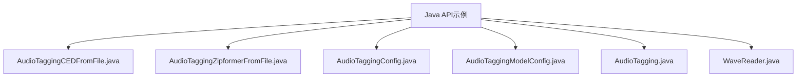
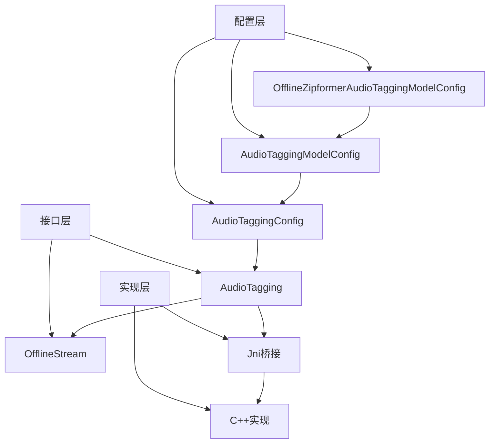
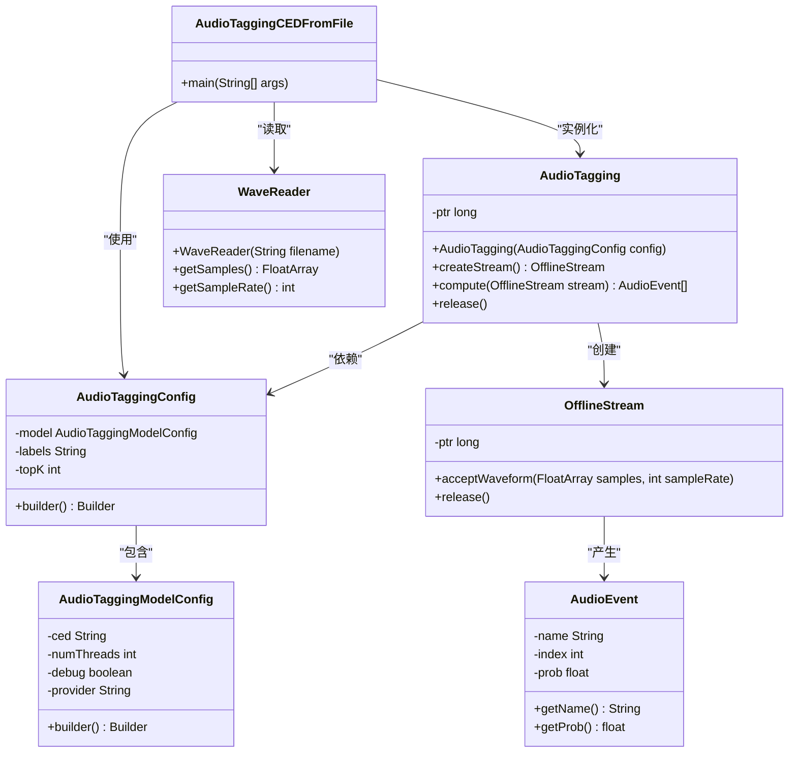
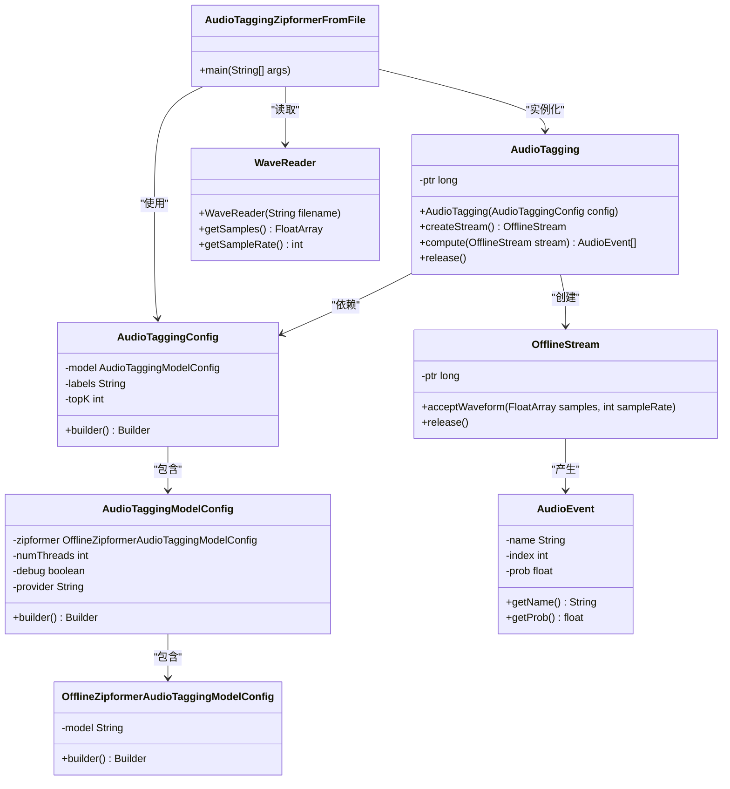
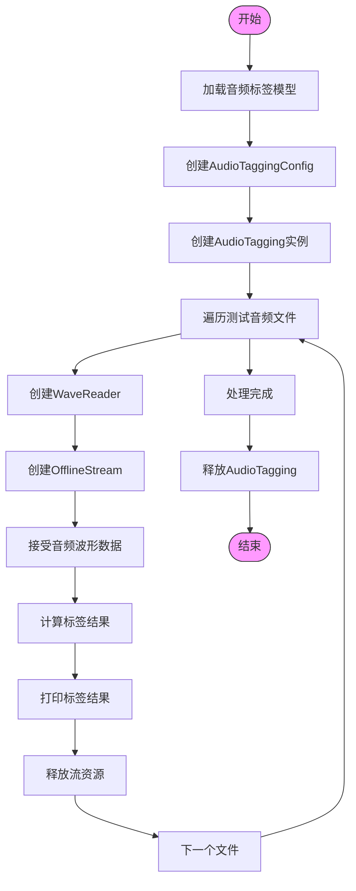

# 音频标签示例

<cite>
**本文档中引用的文件**   
- [AudioTaggingCEDFromFile.java](file://java-api-examples/AudioTaggingCEDFromFile.java)
- [AudioTaggingZipformerFromFile.java](file://java-api-examples/AudioTaggingZipformerFromFile.java)
- [AudioTaggingModelConfig.java](file://sherpa-onnx/java-api/src/main/java/com/k2fsa/sherpa/onnx/AudioTaggingModelConfig.java)
- [AudioTaggingConfig.java](file://sherpa-onnx/java-api/src/main/java/com/k2fsa/sherpa/onnx/AudioTaggingConfig.java)
- [AudioTagging.java](file://sherpa-onnx/java-api/src/main/java/com/k2fsa/sherpa/onnx/AudioTagging.java)
- [OfflineZipformerAudioTaggingModelConfig.java](file://sherpa-onnx/java-api/src/main/java/com/k2fsa/sherpa/onnx/OfflineZipformerAudioTaggingModelConfig.java)
- [audio-tagging-model-config.h](file://sherpa-onnx/csrc/audio-tagging-model-config.h)
- [audio-tagging-model-config.cc](file://sherpa-onnx/csrc/audio-tagging-model-config.cc)
- [audio-tagging-impl.cc](file://sherpa-onnx/csrc/audio-tagging-impl.cc)
- [WaveReader.java](file://java-api-examples/WaveReader.java)
</cite>

## 目录
1. [简介](#简介)
2. [项目结构](#项目结构)
3. [核心组件](#核心组件)
4. [架构概述](#架构概述)
5. [详细组件分析](#详细组件分析)
6. [依赖分析](#依赖分析)
7. [性能考虑](#性能考虑)
8. [故障排除指南](#故障排除指南)
9. [结论](#结论)

## 简介
本文档详细介绍了sherpa-onnx Java API中的音频标签示例，系统性地组织和解释了音频标签功能的示例代码。文档重点分析了CED和Zipformer两种模型的使用方法，深入解析了AudioTaggingCEDFromFile和AudioTaggingZipformerFromFile类的实现。通过本示例，开发者可以学习如何对音频文件进行分类和打标签，识别音频中的特定声音事件。文档展示了如何加载音频标签模型、配置参数以及解析标签结果，并提供了完整的代码示例和运行说明，解释了音频标签技术的工作原理和在实际应用中的价值。

## 项目结构
sherpa-onnx项目是一个多语言支持的语音处理框架，其Java API示例位于`java-api-examples`目录中。音频标签示例是其中的重要组成部分，提供了两种不同的模型实现方式：基于CED（Convolutional Encoder-Decoder）模型和基于Zipformer模型的音频标签功能。



**图示来源**
- [AudioTaggingCEDFromFile.java](file://java-api-examples/AudioTaggingCEDFromFile.java)
- [AudioTaggingZipformerFromFile.java](file://java-api-examples/AudioTaggingZipformerFromFile.java)

**本节来源**
- [AudioTaggingCEDFromFile.java](file://java-api-examples/AudioTaggingCEDFromFile.java#L1-L61)
- [AudioTaggingZipformerFromFile.java](file://java-api-examples/AudioTaggingZipformerFromFile.java#L1-L69)

## 核心组件
音频标签示例的核心组件包括两个主要的Java类：AudioTaggingCEDFromFile和AudioTaggingZipformerFromFile。这两个类分别展示了如何使用CED模型和Zipformer模型进行音频标签处理。它们共享相同的API结构和处理流程，但使用不同的模型配置。

核心组件还包括AudioTaggingConfig、AudioTaggingModelConfig和AudioTagging等类，这些类构成了音频标签功能的基础架构。AudioTagging类是主要的接口类，负责创建流、接受音频数据和计算标签结果。WaveReader类用于读取WAV格式的音频文件，提供标准化的音频样本数据。

**本节来源**
- [AudioTaggingCEDFromFile.java](file://java-api-examples/AudioTaggingCEDFromFile.java#L1-L61)
- [AudioTaggingZipformerFromFile.java](file://java-api-examples/AudioTaggingZipformerFromFile.java#L1-L69)
- [AudioTagging.java](file://sherpa-onnx/java-api/src/main/java/com/k2fsa/sherpa/onnx/AudioTagging.java#L1-L60)

## 架构概述
音频标签功能的架构基于分层设计模式，将模型配置、参数设置和实际处理分离。整体架构可以分为三个主要层次：配置层、接口层和实现层。



**图示来源**
- [AudioTaggingConfig.java](file://sherpa-onnx/java-api/src/main/java/com/k2fsa/sherpa/onnx/AudioTaggingConfig.java#L1-L45)
- [AudioTaggingModelConfig.java](file://sherpa-onnx/java-api/src/main/java/com/k2fsa/sherpa/onnx/AudioTaggingModelConfig.java#L1-L48)
- [AudioTagging.java](file://sherpa-onnx/java-api/src/main/java/com/k2fsa/sherpa/onnx/AudioTagging.java#L1-L60)

## 详细组件分析
### AudioTaggingCEDFromFile类分析
AudioTaggingCEDFromFile类展示了如何使用CED（Convolutional Encoder-Decoder）模型进行音频标签处理。该类通过配置CED模型路径、标签文件和topK参数，实现了对音频文件的分类和打标签功能。



**图示来源**
- [AudioTaggingCEDFromFile.java](file://java-api-examples/AudioTaggingCEDFromFile.java#L1-L61)
- [AudioTaggingConfig.java](file://sherpa-onnx/java-api/src/main/java/com/k2fsa/sherpa/onnx/AudioTaggingConfig.java#L1-L45)
- [AudioTaggingModelConfig.java](file://sherpa-onnx/java-api/src/main/java/com/k2fsa/sherpa/onnx/AudioTaggingModelConfig.java#L1-L48)

### AudioTaggingZipformerFromFile类分析
AudioTaggingZipformerFromFile类展示了如何使用Zipformer模型进行音频标签处理。与CED模型不同，Zipformer模型使用更复杂的配置结构，通过OfflineZipformerAudioTaggingModelConfig类来设置模型参数。



**图示来源**
- [AudioTaggingZipformerFromFile.java](file://java-api-examples/AudioTaggingZipformerFromFile.java#L1-L69)
- [AudioTaggingConfig.java](file://sherpa-onnx/java-api/src/main/java/com/k2fsa/sherpa/onnx/AudioTaggingConfig.java#L1-L45)
- [AudioTaggingModelConfig.java](file://sherpa-onnx/java-api/src/main/java/com/k2fsa/sherpa/onnx/AudioTaggingModelConfig.java#L1-L48)
- [OfflineZipformerAudioTaggingModelConfig.java](file://sherpa-onnx/java-api/src/main/java/com/k2fsa/sherpa/onnx/OfflineZipformerAudioTaggingModelConfig.java#L1-L32)

### 音频标签处理流程分析
音频标签处理流程遵循标准的非流式处理模式，包括模型加载、流创建、数据输入、计算和结果解析等步骤。该流程在两种模型实现中保持一致，体现了API设计的一致性。



**图示来源**
- [AudioTaggingCEDFromFile.java](file://java-api-examples/AudioTaggingCEDFromFile.java#L40-L56)
- [AudioTaggingZipformerFromFile.java](file://java-api-examples/AudioTaggingZipformerFromFile.java#L48-L64)

**本节来源**
- [AudioTaggingCEDFromFile.java](file://java-api-examples/AudioTaggingCEDFromFile.java#L1-L61)
- [AudioTaggingZipformerFromFile.java](file://java-api-examples/AudioTaggingZipformerFromFile.java#L1-L69)

## 依赖分析
音频标签示例的依赖关系体现了清晰的分层架构。Java API层通过JNI（Java Native Interface）与底层C++实现进行交互，实现了跨语言调用。这种设计模式使得高性能的C++代码能够被Java应用程序高效地使用。

```mermaid
graph TD
JavaLayer[Java层]
JNILayer[Jni层]
CppLayer[C++层]
JavaLayer --> AudioTagging[AudioTagging]
JavaLayer --> AudioTaggingConfig[AudioTaggingConfig]
JavaLayer --> AudioTaggingModelConfig[AudioTaggingModelConfig]
JavaLayer --> OfflineZipformerAudioTaggingModelConfig[OfflineZipformerAudioTaggingModelConfig]
JNILayer --> audio_tagging_jni[音频标签Jni]
JNILayer --> offline_stream_jni[离线流Jni]
CppLayer --> audio_tagging_cpp[音频标签C++实现]
CppLayer --> offline_stream_cpp[离线流C++实现]
CppLayer --> audio_tagging_model_config[模型配置]
CppLayer --> wave_reader[波形读取器]
AudioTagging --> audio_tagging_jni : "JNI调用"
AudioTaggingConfig --> audio_tagging_jni : "JNI调用"
AudioTaggingModelConfig --> audio_tagging_jni : "JNI调用"
OfflineZipformerAudioTaggingModelConfig --> audio_tagging_jni : "JNI调用"
audio_tagging_jni --> audio_tagging_cpp : "C++调用"
audio_tagging_jni --> offline_stream_jni : "调用"
offline_stream_jni --> offline_stream_cpp : "C++调用"
audio_tagging_cpp --> audio_tagging_model_config : "使用"
audio_tagging_cpp --> wave_reader : "使用"
```

**图示来源**
- [AudioTagging.java](file://sherpa-onnx/java-api/src/main/java/com/k2fsa/sherpa/onnx/AudioTagging.java#L54-L58)
- [audio-tagging-impl.cc](file://sherpa-onnx/csrc/audio-tagging-impl.cc#L20-L31)
- [audio-tagging-model-config.h](file://sherpa-onnx/csrc/audio-tagging-model-config.h#L14-L38)

## 性能考虑
音频标签功能在设计时考虑了多个性能因素。首先，通过配置num_threads参数，可以控制模型推理时使用的线程数，从而在多核处理器上实现并行计算。其次，debug参数的设置会影响模型加载时的日志输出，生产环境中应将其设置为false以减少不必要的开销。

模型选择对性能有显著影响。CED模型通常更轻量，适合资源受限的环境，而Zipformer模型虽然更复杂，但可能提供更高的准确率。provider参数允许选择不同的计算后端（如cpu、cuda、coreml），可以根据硬件环境优化性能。

内存管理方面，AudioTagging和OfflineStream类都实现了资源释放机制，通过release()方法显式释放底层资源，避免内存泄漏。建议在使用完实例后及时调用release()方法，特别是在处理大量音频文件时。

**本节来源**
- [AudioTaggingModelConfig.java](file://sherpa-onnx/java-api/src/main/java/com/k2fsa/sherpa/onnx/AudioTaggingModelConfig.java#L8-L10)
- [audio-tagging-model-config.h](file://sherpa-onnx/csrc/audio-tagging-model-config.h#L18-L20)
- [AudioTagging.java](file://sherpa-onnx/java-api/src/main/java/com/k2fsa/sherpa/onnx/AudioTagging.java#L43-L50)

## 故障排除指南
在使用音频标签示例时，可能会遇到一些常见问题。首先，确保模型文件路径正确，CED模型和Zipformer模型的路径配置不同，错误的路径会导致模型加载失败。其次，检查标签文件（class_labels_indices.csv）是否存在且格式正确。

音频文件格式也是一个常见问题点。系统主要支持标准的WAV格式文件，其他格式可能需要转换。音频文件的采样率、位深度和声道数应符合模型要求，否则可能导致处理失败或结果不准确。

如果遇到JNI加载问题，确保sherpa-onnx的本地库已正确安装并且可以在系统路径中找到。在Android环境中，需要确保AAssetManager正确配置，以便从应用资源中加载模型。

调试时，可以启用debug模式，查看模型加载过程中的详细信息，这有助于定位配置错误或兼容性问题。同时，检查系统日志输出，获取更详细的错误信息。

**本节来源**
- [audio-tagging-model-config.cc](file://sherpa-onnx/csrc/audio-tagging-model-config.cc#L36-L44)
- [wave-reader.cc](file://sherpa-onnx/csrc/wave-reader.cc#L87-L90)
- [AudioTagging.java](file://sherpa-onnx/java-api/src/main/java/com/k2fsa/sherpa/onnx/AudioTagging.java#L39-L41)

## 结论
sherpa-onnx的Java API音频标签示例提供了一个完整且易于使用的框架，用于实现音频文件的分类和打标签功能。通过分析AudioTaggingCEDFromFile和AudioTaggingZipformerFromFile两个示例，我们可以看到框架设计的一致性和灵活性。

该框架支持两种不同的模型架构（CED和Zipformer），为开发者提供了根据具体需求选择合适模型的自由。统一的API设计使得在不同模型之间切换变得简单，降低了学习和使用成本。通过Builder模式的配置类，参数设置变得直观且类型安全。

音频标签技术在实际应用中具有广泛的价值，可以用于声音事件检测、环境声音分类、音频内容分析等场景。sherpa-onnx提供的Java API使得这些功能可以轻松集成到Android应用和其他Java生态系统中，为开发者提供了强大的工具来构建智能音频应用。