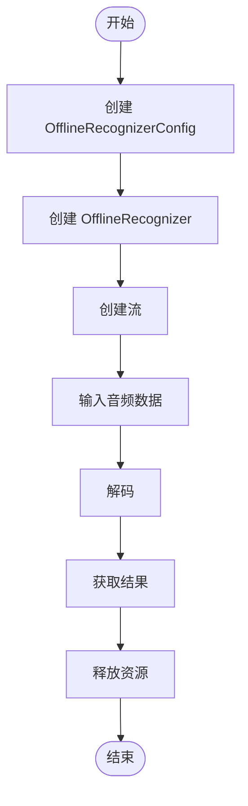
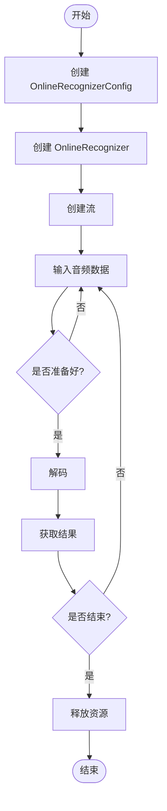
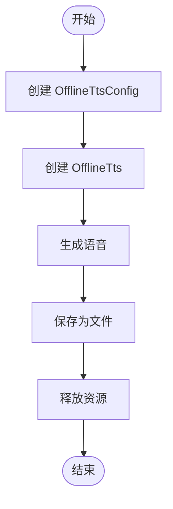
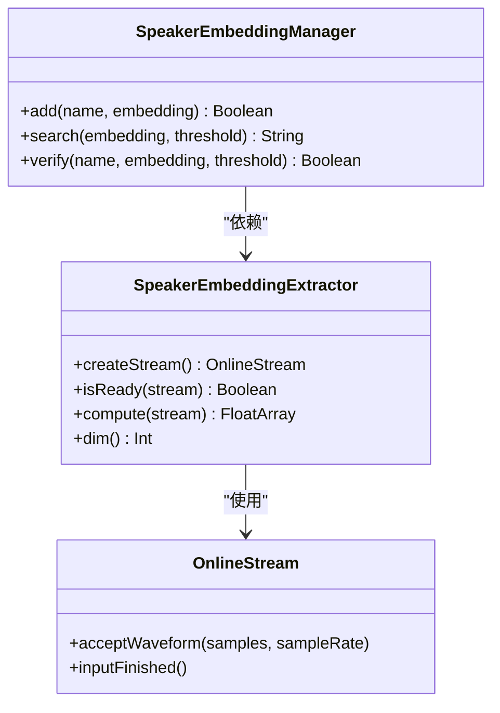
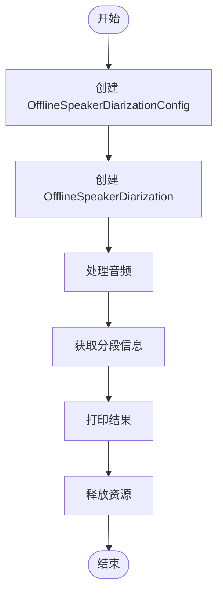
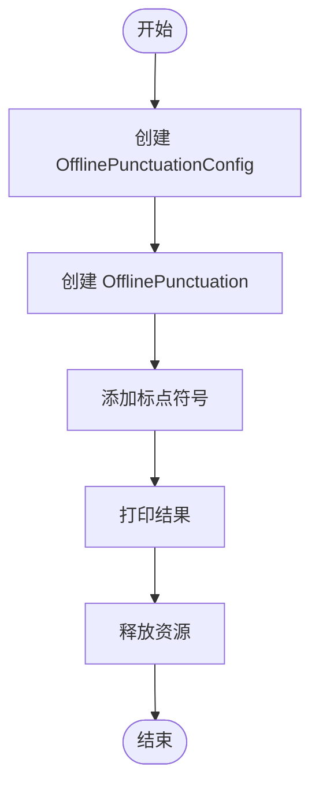
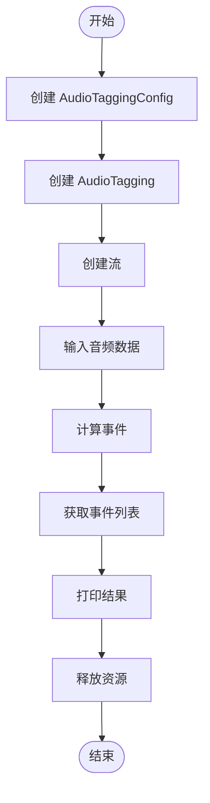
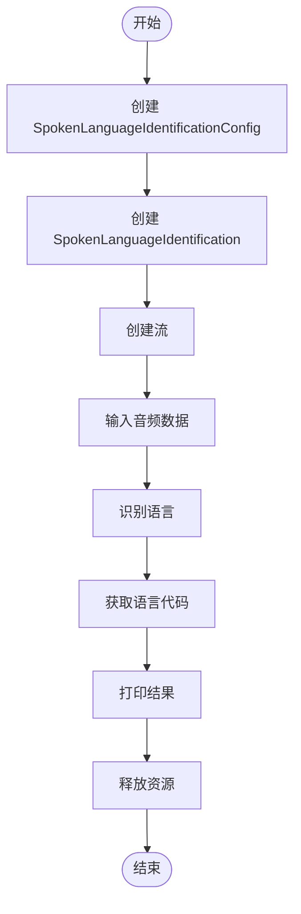

# Kotlin API 示例

<cite>
**本文档中引用的文件**   
- [test_offline_asr.kt](file://kotlin-api-examples/test_offline_asr.kt)
- [test_online_asr.kt](file://kotlin-api-examples/test_online_asr.kt)
- [test_tts.kt](file://kotlin-api-examples/test_tts.kt)
- [test_speaker_id.kt](file://kotlin-api-examples/test_speaker_id.kt)
- [test_offline_speaker_diarization.kt](file://kotlin-api-examples/test_offline_speaker_diarization.kt)
- [test_offline_punctuation.kt](file://kotlin-api-examples/test_offline_punctuation.kt)
- [test_language_id.kt](file://kotlin-api-examples/test_language_id.kt)
- [test_audio_tagging.kt](file://kotlin-api-examples/test_audio_tagging.kt)
- [OfflineRecognizer.kt](file://sherpa-onnx/kotlin-api/OfflineRecognizer.kt)
- [OnlineRecognizer.kt](file://sherpa-onnx/kotlin-api/OnlineRecognizer.kt)
- [Tts.kt](file://sherpa-onnx/kotlin-api/Tts.kt)
- [Speaker.kt](file://sherpa-onnx/kotlin-api/Speaker.kt)
- [AudioTagging.kt](file://sherpa-onnx/kotlin-api/AudioTagging.kt)
- [SpokenLanguageIdentification.kt](file://sherpa-onnx/kotlin-api/SpokenLanguageIdentification.kt)
- [faked-asset-manager.kt](file://kotlin-api-examples/faked-asset-manager.kt)
- [faked-log.kt](file://kotlin-api-examples/faked-log.kt)
</cite>

## 目录
1. [简介](#简介)
2. [项目结构](#项目结构)
3. [核心功能与使用场景](#核心功能与使用场景)
4. [离线语音识别](#离线语音识别)
5. [在线语音识别](#在线语音识别)
6. [语音合成](#语音合成)
7. [说话人识别](#说话人识别)
8. [说话人分离](#说话人分离)
9. [标点符号添加](#标点符号添加)
10. [语音标签识别](#语音标签识别)
11. [语言识别](#语言识别)
12. [Kotlin语言特性优势](#kotlin语言特性优势)
13. [Kotlin与Java API互操作性](#kotlin与java-api互操作性)
14. [运行示例步骤](#运行示例步骤)
15. [常见问题解决方案](#常见问题解决方案)

## 简介
sherpa-onnx 提供了完整的 Kotlin API，用于在 Android 和其他 JVM 平台上实现语音处理功能。该 API 封装了底层的 C++ 实现，通过 JNI 提供了简洁的 Kotlin 接口。Kotlin API 支持多种语音处理功能，包括离线和在线语音识别、语音合成、说话人识别、说话人分离、标点符号添加、语音标签识别和语言识别等。本文档详细介绍了 Kotlin API 示例代码的功能、使用场景、集成方法以及与 Java API 的关系。

## 项目结构
sherpa-onnx 项目包含多个子目录，其中与 Kotlin API 相关的主要目录包括 `kotlin-api-examples` 和 `sherpa-onnx/kotlin-api`。`kotlin-api-examples` 目录包含了各种功能的示例代码，如离线语音识别、在线语音识别、语音合成等。`sherpa-onnx/kotlin-api` 目录包含了 Kotlin API 的核心实现，定义了各种数据类和类，如 `OfflineRecognizer`、`OnlineRecognizer`、`OfflineTts` 等。此外，`android` 目录包含了多个 Android 项目，如 `SherpaOnnx`、`SherpaOnnx2Pass` 等，这些项目展示了如何在 Android 应用中使用 Kotlin API。

**Section sources**
- [test_offline_asr.kt](file://kotlin-api-examples/test_offline_asr.kt)
- [test_online_asr.kt](file://kotlin-api-examples/test_online_asr.kt)
- [test_tts.kt](file://kotlin-api-examples/test_tts.kt)
- [test_speaker_id.kt](file://kotlin-api-examples/test_speaker_id.kt)
- [test_offline_speaker_diarization.kt](file://kotlin-api-examples/test_offline_speaker_diarization.kt)
- [test_offline_punctuation.kt](file://kotlin-api-examples/test_offline_punctuation.kt)
- [test_language_id.kt](file://kotlin-api-examples/test_language_id.kt)
- [test_audio_tagging.kt](file://kotlin-api-examples/test_audio_tagging.kt)

## 核心功能与使用场景
sherpa-onnx Kotlin API 提供了多种语音处理功能，适用于不同的使用场景。离线语音识别适用于不需要实时反馈的场景，如批量处理音频文件。在线语音识别适用于需要实时反馈的场景，如语音助手。语音合成可用于生成自然语音，如语音导航。说话人识别可用于身份验证，如语音解锁。说话人分离可用于会议记录，区分不同发言者。标点符号添加可用于改善文本可读性。语音标签识别可用于音频内容分析，如识别背景音乐或环境声音。语言识别可用于多语言环境下的语音处理。

**Section sources**
- [test_offline_asr.kt](file://kotlin-api-examples/test_offline_asr.kt)
- [test_online_asr.kt](file://kotlin-api-examples/test_online_asr.kt)
- [test_tts.kt](file://kotlin-api-examples/test_tts.kt)
- [test_speaker_id.kt](file://kotlin-api-examples/test_speaker_id.kt)
- [test_offline_speaker_diarization.kt](file://kotlin-api-examples/test_offline_speaker_diarization.kt)
- [test_offline_punctuation.kt](file://kotlin-api-examples/test_offline_punctuation.kt)
- [test_language_id.kt](file://kotlin-api-examples/test_language_id.kt)
- [test_audio_tagging.kt](file://kotlin-api-examples/test_audio_tagging.kt)

## 离线语音识别
离线语音识别功能通过 `OfflineRecognizer` 类实现。用户需要创建 `OfflineRecognizerConfig` 对象，配置特征提取参数和模型参数，然后创建 `OfflineRecognizer` 实例。通过 `createStream` 方法创建流，使用 `acceptWaveform` 方法输入音频数据，调用 `decode` 方法进行解码，最后通过 `getResult` 方法获取识别结果。示例代码展示了如何使用不同类型的模型进行离线语音识别，包括 Paraformer、Whisper、Nemo 等。

**Diagram sources**
- [test_offline_asr.kt](file://kotlin-api-examples/test_offline_asr.kt)
- [OfflineRecognizer.kt](file://sherpa-onnx/kotlin-api/OfflineRecognizer.kt)

**Section sources**
- [test_offline_asr.kt](file://kotlin-api-examples/test_offline_asr.kt)
- [OfflineRecognizer.kt](file://sherpa-onnx/kotlin-api/OfflineRecognizer.kt)

## 在线语音识别
在线语音识别功能通过 `OnlineRecognizer` 类实现。与离线识别不同，在线识别支持流式处理，可以实时返回部分结果。用户需要创建 `OnlineRecognizerConfig` 对象，配置特征提取、模型、语言模型等参数，然后创建 `OnlineRecognizer` 实例。通过 `createStream` 方法创建流，使用 `acceptWaveform` 方法输入音频数据，调用 `isReady` 方法检查是否准备好解码，调用 `decode` 方法进行解码，最后通过 `getResult` 方法获取识别结果。示例代码展示了如何使用不同类型的模型进行在线语音识别，包括 Transducer、Zipformer2-CTC、NeMo-CTC 等。

**Diagram sources**
- [test_online_asr.kt](file://kotlin-api-examples/test_online_asr.kt)
- [OnlineRecognizer.kt](file://sherpa-onnx/kotlin-api/OnlineRecognizer.kt)

**Section sources**
- [test_online_asr.kt](file://kotlin-api-examples/test_online_asr.kt)
- [OnlineRecognizer.kt](file://sherpa-onnx/kotlin-api/OnlineRecognizer.kt)

## 语音合成
语音合成功能通过 `OfflineTts` 类实现。用户需要创建 `OfflineTtsConfig` 对象，配置模型参数，然后创建 `OfflineTts` 实例。通过 `generate` 或 `generateWithCallback` 方法生成语音，返回 `GeneratedAudio` 对象，可以保存为 WAV 文件。示例代码展示了如何使用不同类型的 TTS 模型，包括 VITS、Matcha、Kokoro、Kitten 等。`generateWithCallback` 方法允许在生成过程中通过回调函数处理音频数据，适用于实时播放等场景。

**Diagram sources**
- [test_tts.kt](file://kotlin-api-examples/test_tts.kt)
- [Tts.kt](file://sherpa-onnx/kotlin-api/Tts.kt)

**Section sources**
- [test_tts.kt](file://kotlin-api-examples/test_tts.kt)
- [Tts.kt](file://sherpa-onnx/kotlin-api/Tts.kt)

## 说话人识别
说话人识别功能通过 `SpeakerEmbeddingExtractor` 和 `SpeakerEmbeddingManager` 类实现。`SpeakerEmbeddingExtractor` 用于从音频中提取说话人嵌入向量，`SpeakerEmbeddingManager` 用于管理已知说话人的嵌入向量并进行识别。用户首先创建 `SpeakerEmbeddingExtractor` 实例，从音频中提取嵌入向量，然后使用 `SpeakerEmbeddingManager` 的 `add` 方法添加已知说话人，使用 `search` 方法识别未知音频的说话人。示例代码展示了如何计算嵌入向量并进行说话人识别。

**Diagram sources**
- [test_speaker_id.kt](file://kotlin-api-examples/test_speaker_id.kt)
- [Speaker.kt](file://sherpa-onnx/kotlin-api/Speaker.kt)

**Section sources**
- [test_speaker_id.kt](file://kotlin-api-examples/test_speaker_id.kt)
- [Speaker.kt](file://sherpa-onnx/kotlin-api/Speaker.kt)

## 说话人分离
说话人分离功能通过 `OfflineSpeakerDiarization` 类实现。用户需要创建 `OfflineSpeakerDiarizationConfig` 对象，配置分割模型、嵌入提取模型和聚类参数，然后创建 `OfflineSpeakerDiarization` 实例。通过 `process` 或 `processWithCallback` 方法处理音频，返回说话人分段信息。示例代码展示了如何使用 Pyannote 分割模型和 3D Speaker 嵌入提取模型进行说话人分离，并通过回调函数显示处理进度。

**Diagram sources**
- [test_offline_speaker_diarization.kt](file://kotlin-api-examples/test_offline_speaker_diarization.kt)
- [OfflineSpeakerDiarization.kt](file://sherpa-onnx/kotlin-api/OfflineSpeakerDiarization.kt)

**Section sources**
- [test_offline_speaker_diarization.kt](file://kotlin-api-examples/test_offline_speaker_diarization.kt)
- [OfflineSpeakerDiarization.kt](file://sherpa-onnx/kotlin-api/OfflineSpeakerDiarization.kt)

## 标点符号添加
标点符号添加功能通过 `OfflinePunctuation` 类实现。用户需要创建 `OfflinePunctuationConfig` 对象，配置模型参数，然后创建 `OfflinePunctuation` 实例。通过 `addPunctuation` 方法为文本添加标点符号。示例代码展示了如何使用 CT-Transformer 模型为中英文混合文本添加标点符号。

**Diagram sources**
- [test_offline_punctuation.kt](file://kotlin-api-examples/test_offline_punctuation.kt)
- [OfflinePunctuation.kt](file://sherpa-onnx/kotlin-api/OfflinePunctuation.kt)

**Section sources**
- [test_offline_punctuation.kt](file://kotlin-api-examples/test_offline_punctuation.kt)
- [OfflinePunctuation.kt](file://sherpa-onnx/kotlin-api/OfflinePunctuation.kt)

## 语音标签识别
语音标签识别功能通过 `AudioTagging` 类实现。用户需要创建 `AudioTaggingConfig` 对象，配置模型参数，然后创建 `AudioTagging` 实例。通过 `createStream` 方法创建流，使用 `acceptWaveform` 方法输入音频数据，调用 `compute` 方法计算音频事件，返回 `AudioEvent` 列表。示例代码展示了如何使用 Zipformer 模型识别音频中的事件，如音乐、语音、环境声音等。

**Diagram sources**
- [test_audio_tagging.kt](file://kotlin-api-examples/test_audio_tagging.kt)
- [AudioTagging.kt](file://sherpa-onnx/kotlin-api/AudioTagging.kt)

**Section sources**
- [test_audio_tagging.kt](file://kotlin-api-examples/test_audio_tagging.kt)
- [AudioTagging.kt](file://sherpa-onnx/kotlin-api/AudioTagging.kt)

## 语言识别
语言识别功能通过 `SpokenLanguageIdentification` 类实现。用户需要创建 `SpokenLanguageIdentificationConfig` 对象，配置模型参数，然后创建 `SpokenLanguageIdentification` 实例。通过 `createStream` 方法创建流，使用 `acceptWaveform` 方法输入音频数据，调用 `compute` 方法识别语言，返回语言代码。示例代码展示了如何使用 Whisper 模型识别音频中的语言，支持多种语言。

**Diagram sources**
- [test_language_id.kt](file://kotlin-api-examples/test_language_id.kt)
- [SpokenLanguageIdentification.kt](file://sherpa-onnx/kotlin-api/SpokenLanguageIdentification.kt)

**Section sources**
- [test_language_id.kt](file://kotlin-api-examples/test_language_id.kt)
- [SpokenLanguageIdentification.kt](file://sherpa-onnx/kotlin-api/SpokenLanguageIdentification.kt)

## Kotlin语言特性优势
Kotlin API 充分利用了 Kotlin 语言的特性，提供了更简洁、安全的 API。数据类（data class）用于定义配置和结果，自动生成 `equals`、`hashCode` 和 `toString` 方法。空安全（null safety）确保了类型安全，避免了空指针异常。默认参数和命名参数使 API 调用更加灵活。扩展函数和属性可以为现有类添加功能。协程（coroutine）支持异步操作，避免阻塞主线程。示例代码中的 `callback` 函数展示了 Kotlin 的函数式编程特性，可以作为参数传递。

**Section sources**
- [test_offline_asr.kt](file://kotlin-api-examples/test_offline_asr.kt)
- [test_online_asr.kt](file://kotlin-api-examples/test_online_asr.kt)
- [test_tts.kt](file://kotlin-api-examples/test_tts.kt)
- [test_speaker_id.kt](file://kotlin-api-examples/test_speaker_id.kt)

## Kotlin与Java API互操作性
Kotlin 与 Java 具有良好的互操作性，Kotlin API 可以无缝集成到 Java 项目中。由于 Kotlin 编译为 JVM 字节码，Java 代码可以直接调用 Kotlin 类和方法。Kotlin 的空安全特性在 Java 中表现为注解，如 `@Nullable` 和 `@NonNull`。Kotlin 的默认参数在 Java 中需要显式指定所有参数。Kotlin 的扩展函数在 Java 中作为静态方法调用。`faked-asset-manager.kt` 和 `faked-log.kt` 文件展示了如何在非 Android 环境中模拟 Android API，使 Kotlin API 可以在普通 JVM 环境中运行。

**Section sources**
- [faked-asset-manager.kt](file://kotlin-api-examples/faked-asset-manager.kt)
- [faked-log.kt](file://kotlin-api-examples/faked-log.kt)
- [OfflineRecognizer.kt](file://sherpa-onnx/kotlin-api/OfflineRecognizer.kt)
- [OnlineRecognizer.kt](file://sherpa-onnx/kotlin-api/OnlineRecognizer.kt)

## 运行示例步骤
要运行 Kotlin API 示例，首先需要克隆 sherpa-onnx 仓库。然后，确保已安装 Kotlin 编译器和相关依赖。对于每个示例，需要下载相应的模型文件并放置在指定目录。例如，离线语音识别示例需要将模型文件放在 `sherpa-onnx-paraformer-zh-2023-09-14` 等目录中。然后，使用 Kotlin 编译器编译示例代码，并运行生成的 JAR 文件。示例代码通常包含 `main` 函数，可以直接执行。对于 Android 项目，可以使用 Android Studio 打开并运行。

**Section sources**
- [test_offline_asr.kt](file://kotlin-api-examples/test_offline_asr.kt)
- [test_online_asr.kt](file://kotlin-api-examples/test_online_asr.kt)
- [test_tts.kt](file://kotlin-api-examples/test_tts.kt)

## 常见问题解决方案
常见问题包括模型文件路径错误、JNI 库加载失败、音频格式不支持等。模型文件路径错误通常是因为模型文件未下载或路径配置不正确，需要检查 `waveFilename` 和模型路径。JNI 库加载失败可能是因为 `sherpa-onnx-jni` 库未正确安装或架构不匹配，需要确保库文件在 `java.library.path` 中。音频格式不支持时，需要确保音频文件为 16kHz 采样率的单声道 WAV 文件。对于 Android 项目，需要在 `AndroidManifest.xml` 中添加录音权限。如果遇到性能问题，可以调整 `numThreads` 参数以优化性能。

**Section sources**
- [test_offline_asr.kt](file://kotlin-api-examples/test_offline_asr.kt)
- [test_online_asr.kt](file://kotlin-api-examples/test_online_asr.kt)
- [test_tts.kt](file://kotlin-api-examples/test_tts.kt)
- [faked-log.kt](file://kotlin-api-examples/faked-log.kt)