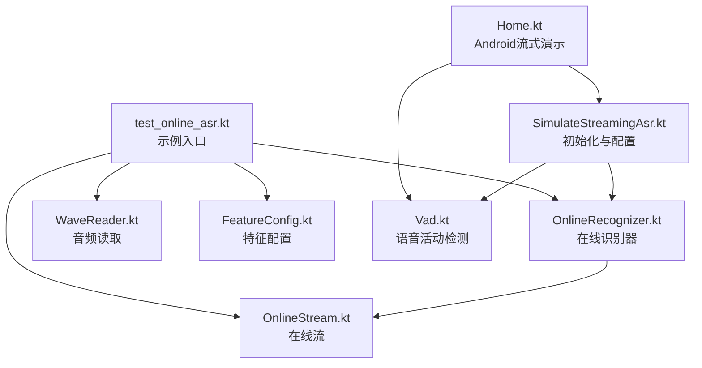
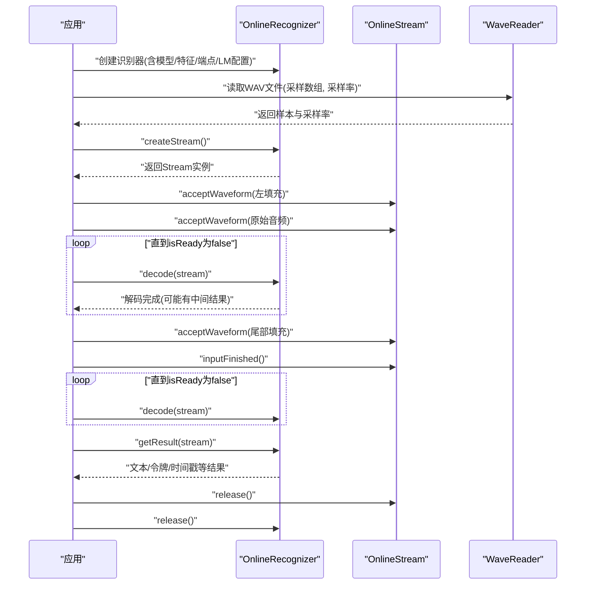
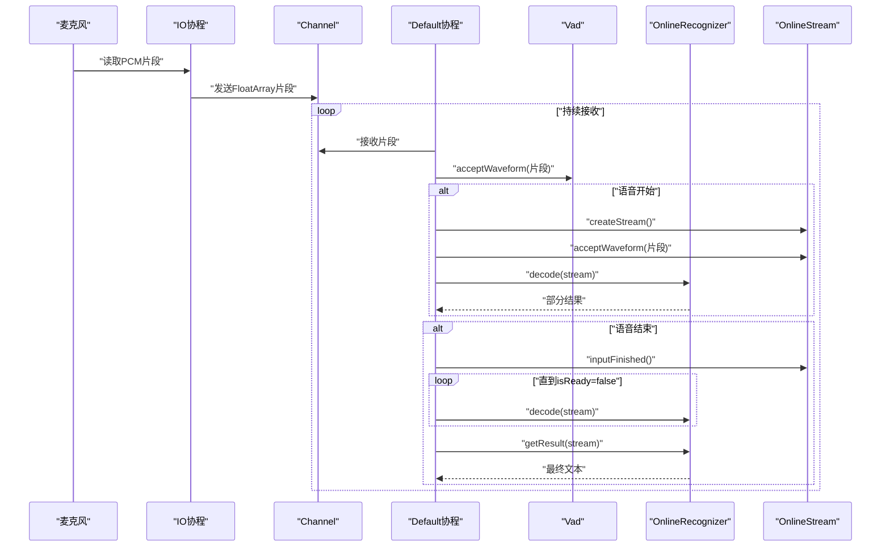
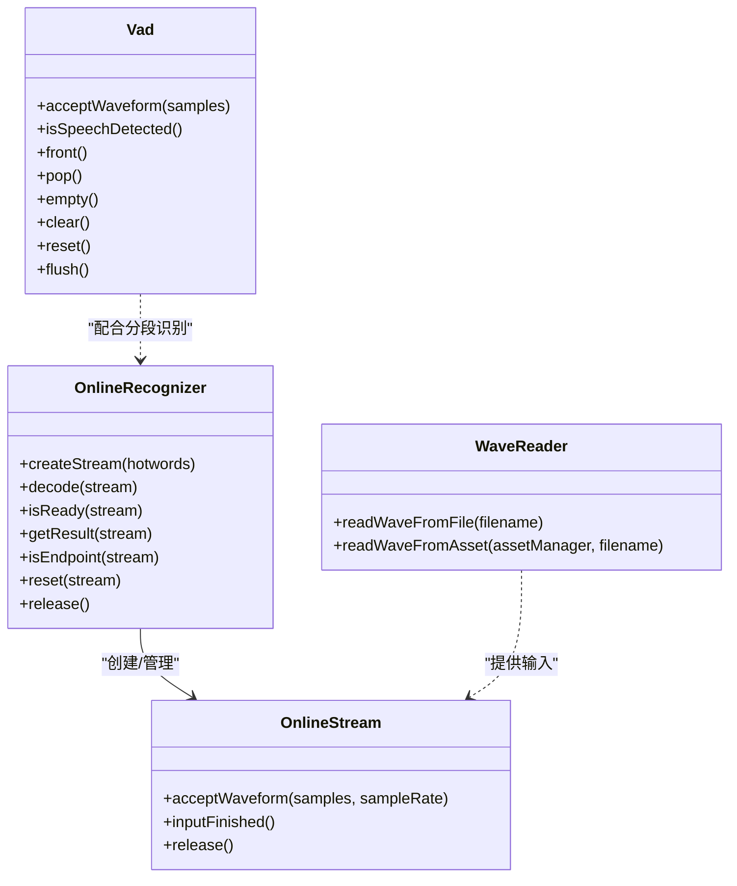

# 在线语音识别示例

<cite>
**本文引用的文件**
- [test_online_asr.kt](file://kotlin-api-examples/test_online_asr.kt)
- [OnlineRecognizer.kt](file://kotlin-api-examples/OnlineRecognizer.kt)
- [OnlineStream.kt](file://kotlin-api-examples/OnlineStream.kt)
- [WaveReader.kt](file://kotlin-api-examples/WaveReader.kt)
- [FeatureConfig.kt](file://kotlin-api-examples/FeatureConfig.kt)
- [Home.kt](file://android/SherpaOnnxSimulateStreamingAsr/app/src/main/java/com/k2fsa/sherpa/onnx/simulate/streaming/asr/screens/Home.kt)
- [SimulateStreamingAsr.kt](file://android/SherpaOnnxSimulateStreamingAsr/app/src/main/java/com/k2fsa/sherpa/onnx/simulate/streaming/asr/SimulateStreamingAsr.kt)
- [Vad.kt](file://kotlin-api-examples/Vad.kt)
</cite>

## 目录
1. [简介](#简介)
2. [项目结构](#项目结构)
3. [核心组件](#核心组件)
4. [架构总览](#架构总览)
5. [详细组件分析](#详细组件分析)
6. [依赖关系分析](#依赖关系分析)
7. [性能考量](#性能考量)
8. [故障排查指南](#故障排查指南)
9. [结论](#结论)
10. [附录](#附录)

## 简介
本文件围绕 Kotlin API 在线语音识别示例进行深入解析，重点聚焦于 test_online_asr.kt 中的流式识别实现。文档将系统阐述：
- 如何创建在线识别器、处理实时音频流、管理识别会话与部分结果
- Kotlin 协程在连续音频流中的优势，以及如何通过 Channel 模拟 Flow 的异步数据流
- 低延迟语音识别的工程化实现思路
- 在线识别与离线识别的差异
- 不同网络条件下的性能调优策略
- 错误恢复机制与连接管理最佳实践

## 项目结构
本次分析涉及的关键文件与模块如下：
- Kotlin 示例入口：test_online_asr.kt
- 在线识别器与流：OnlineRecognizer.kt、OnlineStream.kt
- 音频读取：WaveReader.kt
- 特征配置：FeatureConfig.kt
- Android 流式演示（协程+Channel）：Home.kt、SimulateStreamingAsr.kt
- 语音活动检测（VAD）：Vad.kt

图表来源
- [test_online_asr.kt](file://kotlin-api-examples/test_online_asr.kt#L1-L131)
- [OnlineRecognizer.kt](file://kotlin-api-examples/OnlineRecognizer.kt#L90-L156)
- [OnlineStream.kt](file://kotlin-api-examples/OnlineStream.kt#L1-L37)
- [WaveReader.kt](file://kotlin-api-examples/WaveReader.kt#L1-L71)
- [FeatureConfig.kt](file://kotlin-api-examples/FeatureConfig.kt#L1-L12)
- [Home.kt](file://android/SherpaOnnxSimulateStreamingAsr/app/src/main/java/com/k2fsa/sherpa/onnx/simulate/streaming/asr/screens/Home.kt#L1-L358)
- [SimulateStreamingAsr.kt](file://android/SherpaOnnxSimulateStreamingAsr/app/src/main/java/com/k2fsa/sherpa/onnx/simulate/streaming/asr/SimulateStreamingAsr.kt#L1-L197)
- [Vad.kt](file://kotlin-api-examples/Vad.kt#L1-L151)

章节来源
- [test_online_asr.kt](file://kotlin-api-examples/test_online_asr.kt#L1-L131)
- [OnlineRecognizer.kt](file://kotlin-api-examples/OnlineRecognizer.kt#L90-L156)
- [OnlineStream.kt](file://kotlin-api-examples/OnlineStream.kt#L1-L37)
- [WaveReader.kt](file://kotlin-api-examples/WaveReader.kt#L1-L71)
- [FeatureConfig.kt](file://kotlin-api-examples/FeatureConfig.kt#L1-L12)
- [Home.kt](file://android/SherpaOnnxSimulateStreamingAsr/app/src/main/java/com/k2fsa/sherpa/onnx/simulate/streaming/asr/screens/Home.kt#L1-L358)
- [SimulateStreamingAsr.kt](file://android/SherpaOnnxSimulateStreamingAsr/app/src/main/java/com/k2fsa/sherpa/onnx/simulate/streaming/asr/SimulateStreamingAsr.kt#L1-L197)
- [Vad.kt](file://kotlin-api-examples/Vad.kt#L1-L151)

## 核心组件
- 在线识别器 OnlineRecognizer
  - 负责模型加载、配置管理、创建识别流、解码调度、端点检测、结果提取等
  - 关键方法：createStream、decode、isReady、getResult、isEndpoint、reset
- 在线流 OnlineStream
  - 封装单次识别会话，负责接受音频片段、标记输入结束、释放资源
  - 关键方法：acceptWaveform、inputFinished、release
- 音频读取 WaveReader
  - 提供从文件或资产中读取单声道 WAV 的能力，返回采样数组与采样率
- 特征配置 FeatureConfig
  - 定义采样率、特征维度、抖动参数等
- Android 流式演示 Home.kt
  - 使用协程与 Channel 模拟实时音频流，结合 VAD 进行分段识别
- VAD（语音活动检测）Vad
  - 提供语音段队列管理、是否检测到语音、重置、清空等能力

章节来源
- [OnlineRecognizer.kt](file://kotlin-api-examples/OnlineRecognizer.kt#L90-L156)
- [OnlineStream.kt](file://kotlin-api-examples/OnlineStream.kt#L1-L37)
- [WaveReader.kt](file://kotlin-api-examples/WaveReader.kt#L1-L71)
- [FeatureConfig.kt](file://kotlin-api-examples/FeatureConfig.kt#L1-L12)
- [Home.kt](file://android/SherpaOnnxSimulateStreamingAsr/app/src/main/java/com/k2fsa/sherpa/onnx/simulate/streaming/asr/screens/Home.kt#L1-L358)
- [Vad.kt](file://kotlin-api-examples/Vad.kt#L1-L151)

## 架构总览
下面的序列图展示了 test_online_asr.kt 中一次典型的在线识别流程：创建识别器与配置 → 读取音频 → 创建流 → 接受音频片段 → 解码循环 → 输入结束 → 再次解码 → 输出结果。

图表来源
- [test_online_asr.kt](file://kotlin-api-examples/test_online_asr.kt#L99-L130)
- [OnlineRecognizer.kt](file://kotlin-api-examples/OnlineRecognizer.kt#L113-L132)
- [OnlineStream.kt](file://kotlin-api-examples/OnlineStream.kt#L3-L16)
- [WaveReader.kt](file://kotlin-api-examples/WaveReader.kt#L32-L68)

章节来源
- [test_online_asr.kt](file://kotlin-api-examples/test_online_asr.kt#L99-L130)
- [OnlineRecognizer.kt](file://kotlin-api-examples/OnlineRecognizer.kt#L113-L132)
- [OnlineStream.kt](file://kotlin-api-examples/OnlineStream.kt#L3-L16)
- [WaveReader.kt](file://kotlin-api-examples/WaveReader.kt#L32-L68)

## 详细组件分析

### 在线识别器 OnlineRecognizer
- 角色定位
  - 负责模型加载（文件/资产）、配置合并、识别流生命周期管理、解码调度与结果输出
- 关键数据结构
  - OnlineRecognizerConfig：包含 FeatureConfig、OnlineModelConfig、OnlineLMConfig、OnlineCtcFstDecoderConfig、端点规则、解码方法、最大并行路径等
  - OnlineRecognizerResult：文本、令牌、时间戳、概率等
- 关键方法
  - createStream：创建识别会话
  - decode：对指定流执行一次解码
  - isReady/isEndpoint：判断是否可继续解码/是否达到端点
  - getResult：获取当前流的最终或部分结果
  - release：释放JNI句柄
- 设计要点
  - 外部接口通过JNI暴露，内部使用指针管理底层资源
  - 支持多种在线模型（Transducer、Zipformer2 CTC、NeMo CTC、T-One CTC、CTC-HLG）
  - 可选语言模型与FST图解码器，支持热词、规则FST、空白惩罚等高级特性

章节来源
- [OnlineRecognizer.kt](file://kotlin-api-examples/OnlineRecognizer.kt#L60-L156)
- [OnlineRecognizer.kt](file://kotlin-api-examples/OnlineRecognizer.kt#L113-L132)

### 在线流 OnlineStream
- 角色定位
  - 表示一次识别会话，承载音频输入、状态控制与资源释放
- 关键方法
  - acceptWaveform：向流注入音频片段（浮点数组，采样率）
  - inputFinished：标记输入结束，触发收尾解码
  - release/use：释放资源与安全作用域释放模式
- 设计要点
  - 通过JNI指针与识别器交互
  - 支持多次注入与多次解码，直至 isReady 为 false

章节来源
- [OnlineStream.kt](file://kotlin-api-examples/OnlineStream.kt#L1-L37)

### 音频读取 WaveReader
- 功能
  - 从文件或资产读取单声道WAV，返回采样数组与采样率
- 使用场景
  - 在线示例中用于加载测试音频，作为 acceptWaveform 的输入源
- 注意
  - 返回值包含两个元素：FloatArray（样本）与Int（采样率）

章节来源
- [WaveReader.kt](file://kotlin-api-examples/WaveReader.kt#L32-L68)

### 特征配置 FeatureConfig
- 参数
  - sampleRate：采样率
  - featureDim：特征维度
  - dither：抖动系数
- 用途
  - 与在线模型配置组合，确保特征提取与模型输入一致

章节来源
- [FeatureConfig.kt](file://kotlin-api-examples/FeatureConfig.kt#L1-L12)

### Android 流式演示（协程+Channel）
- 流程概览
  - 启动录音，按固定窗口大小（如100ms）读取PCM，转换为浮点数组并通过 Channel 发送
  - 主解码协程接收样本，按VAD检测语音开始/结束，定时（如200ms）创建流、注入片段、解码、更新UI
  - 使用 UNLIMITED Channel 缓冲，避免阻塞IO线程
- 协程与调度器
  - IO调度器：负责音频采集与Channel发送
  - Default调度器：负责解码与结果处理
- 与在线识别的关系
  - 该示例展示了如何用协程与Channel优雅地模拟“实时音频流”，与 test_online_asr.kt 的“批量+流式”思路互补

图表来源
- [Home.kt](file://android/SherpaOnnxSimulateStreamingAsr/app/src/main/java/com/k2fsa/sherpa/onnx/simulate/streaming/asr/screens/Home.kt#L117-L238)
- [Vad.kt](file://kotlin-api-examples/Vad.kt#L60-L78)
- [OnlineRecognizer.kt](file://kotlin-api-examples/OnlineRecognizer.kt#L113-L132)
- [OnlineStream.kt](file://kotlin-api-examples/OnlineStream.kt#L3-L16)

章节来源
- [Home.kt](file://android/SherpaOnnxSimulateStreamingAsr/app/src/main/java/com/k2fsa/sherpa/onnx/simulate/streaming/asr/screens/Home.kt#L117-L238)
- [Vad.kt](file://kotlin-api-examples/Vad.kt#L60-L78)
- [OnlineRecognizer.kt](file://kotlin-api-examples/OnlineRecognizer.kt#L113-L132)
- [OnlineStream.kt](file://kotlin-api-examples/OnlineStream.kt#L3-L16)

### 在线识别与离线识别的差异
- 在线识别
  - 面向实时/近实时场景，强调低延迟与连续解码
  - 通过 isReady/decode 循环与端点检测控制解码节奏
  - 支持多模型（Transducer、CTC、CTC-HLG、NeMo CTC、T-One CTC）
- 离线识别
  - 面向非实时场景，一次性提交完整音频，通常更快但不支持流式
  - 通过 createStream/decode/getResult 一次性完成
- 工程差异
  - 在线识别需要更精细的端点检测、热词、LM与FST配置
  - 离线识别更关注吞吐量与批处理

章节来源
- [OnlineRecognizer.kt](file://kotlin-api-examples/OnlineRecognizer.kt#L60-L156)
- [OfflineRecognizer.kt](file://kotlin-api-examples/OfflineRecognizer.kt#L120-L191)

## 依赖关系分析
- 组件耦合
  - OnlineRecognizer 与 OnlineStream 为强耦合：前者持有后者指针并驱动其生命周期
  - WaveReader 仅作为外部输入源，与识别器解耦
  - Android 流式演示通过 Channel 与识别器解耦，协程负责编排
- 外部依赖
  - JNI 库 sherpa-onnx-jni：所有识别器与流均通过JNI桥接到底层推理引擎
  - 资产/文件路径：模型文件、tokens、VAD模型等需正确放置

图表来源
- [OnlineRecognizer.kt](file://kotlin-api-examples/OnlineRecognizer.kt#L113-L132)
- [OnlineStream.kt](file://kotlin-api-examples/OnlineStream.kt#L3-L16)
- [WaveReader.kt](file://kotlin-api-examples/WaveReader.kt#L32-L68)
- [Vad.kt](file://kotlin-api-examples/Vad.kt#L60-L100)

章节来源
- [OnlineRecognizer.kt](file://kotlin-api-examples/OnlineRecognizer.kt#L113-L132)
- [OnlineStream.kt](file://kotlin-api-examples/OnlineStream.kt#L3-L16)
- [WaveReader.kt](file://kotlin-api-examples/WaveReader.kt#L32-L68)
- [Vad.kt](file://kotlin-api-examples/Vad.kt#L60-L100)

## 性能考量
- 低延迟策略
  - 使用端点检测（enableEndpoint）与合理的解码间隔（如200ms），减少不必要的解码轮次
  - 采用较小的窗口（如100ms）进行音频分片，降低首包延迟
  - 合理设置 maxActivePaths 与 decodingMethod，平衡速度与准确率
- 并发与调度
  - IO协程负责音频采集，Default协程负责解码，避免主线程阻塞
  - Channel 使用 UNLIMITED 缓冲，防止丢帧；同时注意内存占用与背压
- 模型与硬件
  - 选择合适模型（如CTC-HLG、NeMo CTC、T-One CTC）以满足延迟与精度需求
  - 在移动设备上考虑provider（CPU/NNAPI/RKNN/QNN等）与numThreads
- 网络条件下的优化
  - 对于远程服务（WebSocket/HTTP）场景，建议：
    - 增加缓冲窗口，平滑网络抖动
    - 设置合理的超时与重试策略
    - 使用压缩或降采样（在可接受范围内）
    - 分段发送与端点检测结合，减少长距离传输

[本节为通用指导，无需特定文件引用]

## 故障排查指南
- 常见问题与定位
  - 无法创建识别器：检查模型路径、tokens文件是否存在，provider是否匹配
  - decode无输出：确认 isReady 为 true 才能继续解码；检查端点规则是否过严
  - 音频无声或失真：核对采样率与特征配置一致；检查输入片段长度与格式
  - VAD未检测到语音：调整阈值、最小静音/语音时长、窗口大小
- 资源释放
  - 确保每次使用完 OnlineStream 与 OnlineRecognizer 后调用 release，避免JNI句柄泄漏
- 协程与Channel
  - 若出现阻塞，检查 Channel 容量与消费速率；必要时引入背压或限速
  - 记得在停止录制后发送空数组以触发结束逻辑

章节来源
- [OnlineRecognizer.kt](file://kotlin-api-examples/OnlineRecognizer.kt#L113-L132)
- [OnlineStream.kt](file://kotlin-api-examples/OnlineStream.kt#L3-L16)
- [Home.kt](file://android/SherpaOnnxSimulateStreamingAsr/app/src/main/java/com/k2fsa/sherpa/onnx/simulate/streaming/asr/screens/Home.kt#L117-L238)
- [Vad.kt](file://kotlin-api-examples/Vad.kt#L60-L100)

## 结论
- test_online_asr.kt 展示了在线语音识别的标准流程：配置识别器、创建流、分段注入音频、循环解码、输入结束与最终结果输出
- Kotlin 协程与 Channel 在 Android 流式演示中提供了优雅的异步数据流抽象，适合构建低延迟、高并发的实时识别应用
- 在线识别强调端点检测、解码节奏控制与资源管理；离线识别则追求吞吐与一次性完成
- 针对不同网络条件，应结合端点检测、缓冲策略与模型选择进行综合优化

[本节为总结性内容，无需特定文件引用]

## 附录
- 快速上手步骤（基于示例）
  - 准备模型与tokens文件，确保路径正确
  - 在 FeatureConfig 中设置采样率与特征维度
  - 通过 WaveReader 读取测试音频
  - 创建 OnlineRecognizer 与 OnlineStream
  - 注入左填充、原始音频、尾部填充，并在 inputFinished 后继续解码
  - 获取结果并释放资源
- 参考路径
  - 在线识别入口：[test_online_asr.kt](file://kotlin-api-examples/test_online_asr.kt#L1-L131)
  - 在线识别器与流：[OnlineRecognizer.kt](file://kotlin-api-examples/OnlineRecognizer.kt#L90-L156)、[OnlineStream.kt](file://kotlin-api-examples/OnlineStream.kt#L1-L37)
  - 音频读取：[WaveReader.kt](file://kotlin-api-examples/WaveReader.kt#L32-L68)
  - 特征配置：[FeatureConfig.kt](file://kotlin-api-examples/FeatureConfig.kt#L1-L12)
  - 协程流式演示：[Home.kt](file://android/SherpaOnnxSimulateStreamingAsr/app/src/main/java/com/k2fsa/sherpa/onnx/simulate/streaming/asr/screens/Home.kt#L117-L238)
  - VAD：[Vad.kt](file://kotlin-api-examples/Vad.kt#L1-L151)