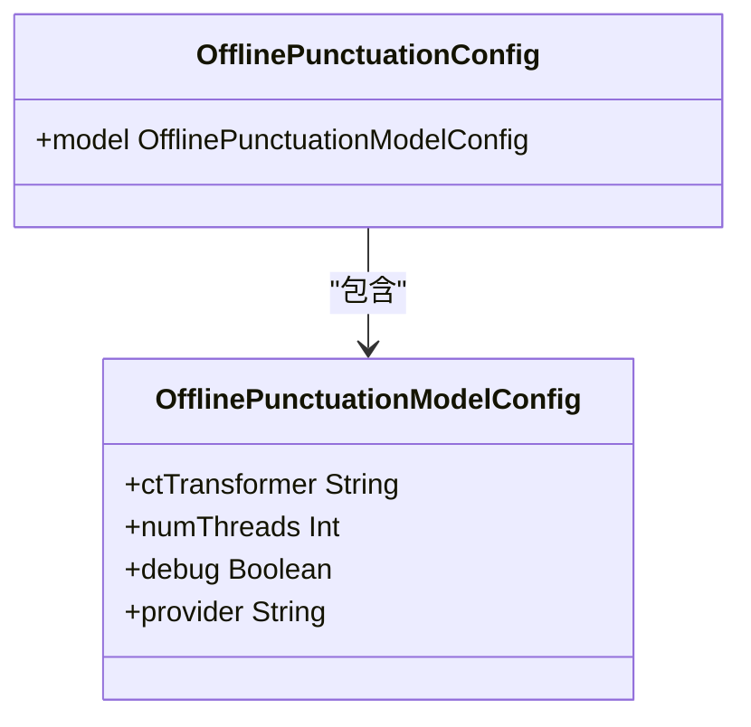
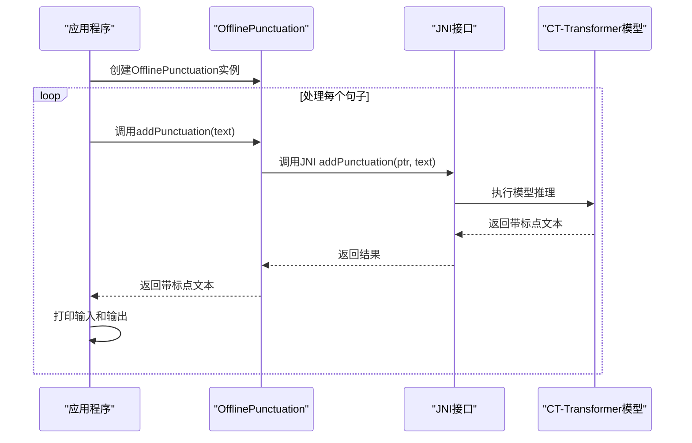
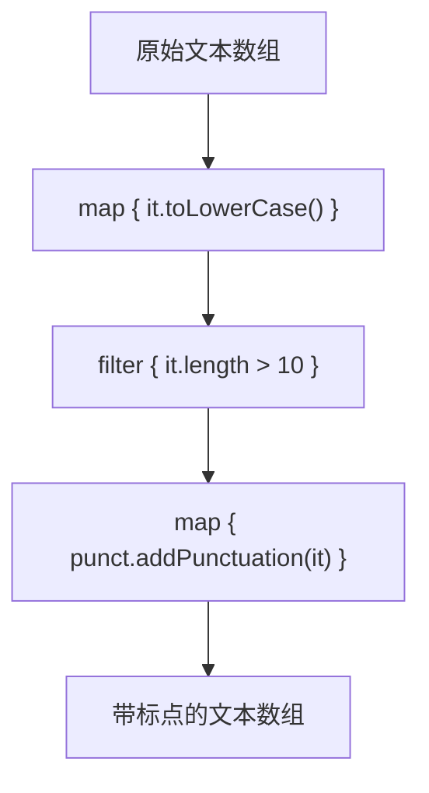
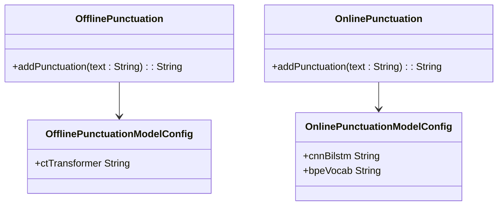

# 离线标点添加示例

<cite>
**本文档引用文件**  
- [test_offline_punctuation.kt](file://kotlin-api-examples/test_offline_punctuation.kt)
- [OfflinePunctuation.kt](file://kotlin-api-examples/OfflinePunctuation.kt)
- [OnlinePunctuation.kt](file://kotlin-api-examples/OnlinePunctuation.kt)
- [README.md](file://README.md)
</cite>

## 目录
1. [简介](#简介)
2. [离线标点添加模型配置](#离线标点添加模型配置)
3. [文本处理与标点添加流程](#文本处理与标点添加流程)
4. [Kotlin函数式编程在文本处理中的应用](#kotlin函数式编程在文本处理中的应用)
5. [实际应用案例：语音识别后处理](#实际应用案例语音识别后处理)
6. [模型局限性与多语言表现](#模型局限性与多语言表现)
7. [离线与在线标点添加对比](#离线与在线标点添加对比)
8. [总结](#总结)

## 简介

本示例文档详细介绍了如何使用Kotlin API实现离线标点添加功能。该功能主要用于语音识别后处理，通过在识别出的无标点文本中自动添加适当的标点符号，显著提高文本的可读性和语义清晰度。示例代码展示了如何配置标点添加模型、处理文本输入以及生成带标点的输出。该功能特别适用于需要在本地设备上进行实时或批量处理的场景，无需依赖网络连接。

**Section sources**
- [test_offline_punctuation.kt](file://kotlin-api-examples/test_offline_punctuation.kt#L1-L32)

## 离线标点添加模型配置

离线标点添加功能的核心是`OfflinePunctuationConfig`配置类，它定义了模型的运行参数和路径。在示例代码中，主要配置了`OfflinePunctuationModelConfig`，其中指定了模型文件的路径`ctTransformer`、线程数`numThreads`、调试模式`debug`和运行提供者`provider`。

模型文件`ctTransformer`指向一个名为`sherpa-onnx-punct-ct-transformer-zh-en-vocab272727-2024-04-12/model.onnx`的ONNX格式模型文件，该模型专为中英文混合文本设计，能够识别并正确添加中英文标点符号。`numThreads`设置为1，表示使用单线程进行推理，适合资源受限的移动设备。`debug`设置为true，便于开发和调试时输出详细日志。`provider`设置为"cpu"，表明模型将在CPU上运行，确保在没有专用NPU或GPU的设备上也能正常工作。

**Diagram sources**
- [OfflinePunctuation.kt](file://kotlin-api-examples/OfflinePunctuation.kt#L5-L15)

**Section sources**
- [test_offline_punctuation.kt](file://kotlin-api-examples/test_offline_punctuation.kt#L8-L14)
- [OfflinePunctuation.kt](file://kotlin-api-examples/OfflinePunctuation.kt#L5-L15)

## 文本处理与标点添加流程

标点添加的处理流程非常简洁。首先，使用配置创建`OfflinePunctuation`实例。然后，将待处理的文本数组传递给`addPunctuation`方法。该方法内部调用JNI接口，将文本传递给底层的C++模型进行推理，并返回添加了标点的文本。

在示例中，`sentences`数组包含了三个测试用例：一个中英文混合的句子、一个纯中文句子和一个纯英文句子。通过循环遍历这些句子，调用`punct.addPunctuation(text)`方法，并将输入和输出打印出来，可以直观地看到模型的处理效果。整个流程体现了Kotlin语言的简洁性，将复杂的机器学习推理过程封装在简单的API调用中。

**Diagram sources**
- [test_offline_punctuation.kt](file://kotlin-api-examples/test_offline_punctuation.kt#L23-L27)
- [OfflinePunctuation.kt](file://kotlin-api-examples/OfflinePunctuation.kt#L40)

**Section sources**
- [test_offline_punctuation.kt](file://kotlin-api-examples/test_offline_punctuation.kt#L17-L28)

## Kotlin函数式编程在文本处理中的应用

虽然示例代码本身较为简单，但Kotlin的函数式编程特性为构建更复杂的文本处理管道提供了强大支持。例如，可以使用`map`函数对文本数组进行批量处理，使用`filter`函数筛选特定条件的文本，或使用`let`、`apply`等作用域函数进行链式调用。

在实际应用中，可以轻松构建一个文本预处理管道：首先使用`map`将原始文本转换为小写（对于英文），然后使用`filter`去除过短的句子，最后再调用标点添加功能。这种函数式风格的代码不仅简洁，而且易于阅读和维护，体现了Kotlin语言在处理数据流方面的优势。

**Diagram sources**
- [test_offline_punctuation.kt](file://kotlin-api-examples/test_offline_punctuation.kt#L17-L28)

## 实际应用案例：语音识别后处理

离线标点添加功能最常见的应用场景是语音识别（ASR）的后处理。语音识别引擎通常输出的是连续的、无标点的文本流。例如，用户说"今天天气很好我们去公园吧"，ASR系统可能输出"今天天气很好我们去公园吧"。通过集成离线标点添加功能，可以将其转换为"今天天气很好，我们去公园吧。"，极大地提升了文本的可读性和自然度。

在移动应用中，这种集成非常直接。在ASR模块完成语音到文本的转换后，将输出的文本传递给`OfflinePunctuation`实例，即可获得带标点的结果。这对于语音笔记、语音输入法、语音助手等应用至关重要，使生成的文本更接近人类书写的习惯。

**Section sources**
- [test_offline_punctuation.kt](file://kotlin-api-examples/test_offline_punctuation.kt#L17-L28)

## 模型局限性与多语言表现

尽管该模型支持中英文混合文本，但仍存在一些局限性。首先，模型的性能高度依赖于训练数据。对于训练数据中不常见的句式或专业术语，模型可能无法正确添加标点。其次，模型可能无法处理非常长的句子，因为其上下文窗口是有限的。

在多语言环境下，模型的表现会因语言而异。对于中英文混合文本，模型表现良好，能够正确区分中英文标点的使用场景。然而，对于其他语言（如日语、韩语或法语），该特定模型可能无法提供准确的结果，因为其词汇表和训练数据主要针对中英文。要支持更多语言，需要使用针对特定语言或语系训练的专用模型。

**Section sources**
- [test_offline_punctuation.kt](file://kotlin-api-examples/test_offline_punctuation.kt#L18-L21)

## 离线与在线标点添加对比

项目中同时提供了离线和在线两种标点添加模式。离线模式（`OfflinePunctuation`）适用于处理完整的文本段落，一次性输入并获得完整输出，适合后处理场景。在线模式（`OnlinePunctuation`）则设计用于流式处理，可以逐步接收文本并实时添加标点，更适合实时字幕或即时通讯等需要低延迟的应用。

从配置上看，两者使用的模型架构不同。离线模式使用`ctTransformer`模型，而在线模式使用`cnnBilstm`模型，并且需要额外的`bpeVocab`文件。这表明在线模型可能采用了不同的分词和编码策略，以适应流式输入的特点。开发者应根据具体的应用需求选择合适的模式。

**Diagram sources**
- [OfflinePunctuation.kt](file://kotlin-api-examples/OfflinePunctuation.kt)
- [OnlinePunctuation.kt](file://kotlin-api-examples/OnlinePunctuation.kt)

**Section sources**
- [test_offline_punctuation.kt](file://kotlin-api-examples/test_offline_punctuation.kt)
- [test_online_punctuation.kt](file://kotlin-api-examples/test_online_punctuation.kt)

## 总结

本文档深入解析了Kotlin API离线标点添加示例的实现细节。通过分析`test_offline_punctuation.kt`文件，我们了解了如何配置标点添加模型、处理文本输入和生成带标点的输出。示例展示了Kotlin语言在封装复杂机器学习功能方面的简洁性，以及其函数式编程特性在构建文本处理管道中的潜力。该功能在语音识别后处理中具有重要应用价值，能显著提升文本的可读性。开发者在使用时需注意模型的局限性和语言支持范围，并根据应用场景选择离线或在线模式。