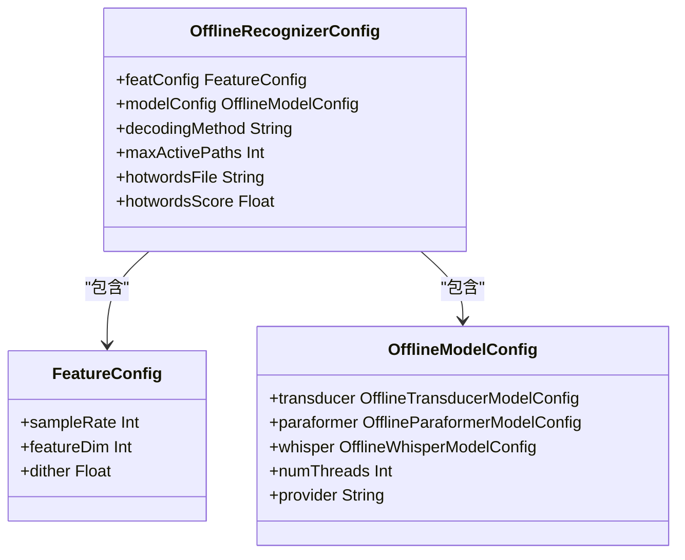
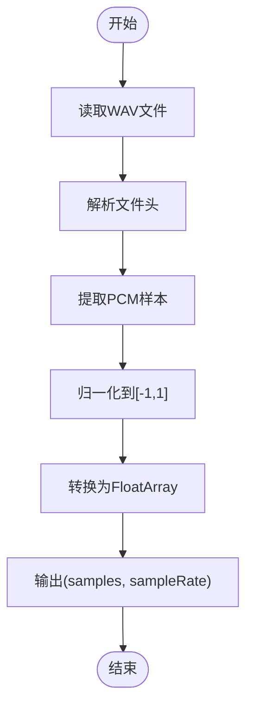
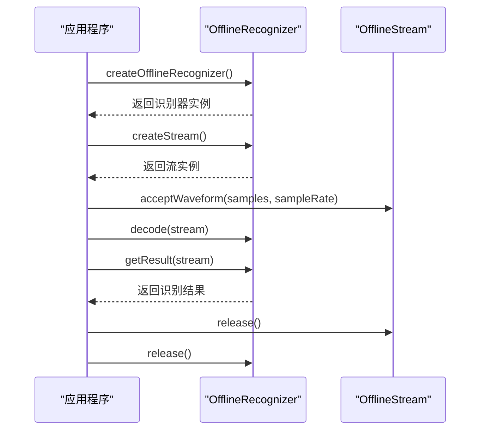
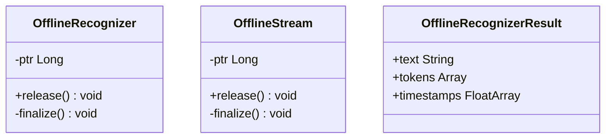

# 离线语音识别示例

<cite>
**本文档引用的文件**   
- [test_offline_asr.kt](file://kotlin-api-examples/test_offline_asr.kt)
- [OfflineRecognizer.kt](file://sherpa-onnx/kotlin-api/OfflineRecognizer.kt)
- [OfflineStream.kt](file://sherpa-onnx/kotlin-api/OfflineStream.kt)
- [FeatureConfig.kt](file://sherpa-onnx/kotlin-api/FeatureConfig.kt)
- [WaveReader.kt](file://sherpa-onnx/kotlin-api/WaveReader.kt)
</cite>

## 目录
1. [简介](#简介)
2. [项目结构](#项目结构)
3. [核心组件](#核心组件)
4. [离线识别器配置](#离线识别器配置)
5. [音频处理流程](#音频处理流程)
6. [Kotlin扩展与协程应用](#kotlin扩展与协程应用)
7. [Android集成实践](#android集成实践)
8. [Java互操作性与空安全](#java互操作性与空安全)
9. [性能优化与错误处理](#性能优化与错误处理)

## 简介
本文档深入解析Kotlin API离线语音识别示例的实现细节，重点分析`test_offline_asr.kt`文件中的核心功能。文档涵盖离线识别器的配置、模型加载、音频处理和结果获取等关键环节，同时探讨Kotlin语言特性在实际应用中的优势。

## 项目结构
项目采用模块化设计，Kotlin API示例位于`kotlin-api-examples`目录，Android应用示例分布在`android`子目录中。核心API实现位于`sherpa-onnx/kotlin-api`目录，通过JNI与底层C++代码交互。

**图示来源**
- [test_offline_asr.kt](file://kotlin-api-examples/test_offline_asr.kt)
- [OfflineRecognizer.kt](file://sherpa-onnx/kotlin-api/OfflineRecognizer.kt)

## 核心组件

### 离线识别器(OfflineRecognizer)
离线识别器是语音识别的核心组件，负责管理模型配置、创建识别流和执行解码操作。通过`OfflineRecognizerConfig`进行配置，支持多种模型类型。

**组件来源**
- [OfflineRecognizer.kt](file://sherpa-onnx/kotlin-api/OfflineRecognizer.kt#L120-L200)

### 识别流(OfflineStream)
识别流用于处理音频数据流，通过`acceptWaveform`方法接收音频样本，是连接音频输入和识别引擎的桥梁。

**组件来源**
- [OfflineStream.kt](file://sherpa-onnx/kotlin-api/OfflineStream.kt#L3-L33)

## 离线识别器配置

### 配置结构
离线识别器配置包含特征提取配置和模型配置两大部分。特征配置指定采样率和特征维度，模型配置则根据具体模型类型进行设置。



**图示来源**
- [OfflineRecognizer.kt](file://sherpa-onnx/kotlin-api/OfflineRecognizer.kt#L106-L118)
- [FeatureConfig.kt](file://sherpa-onnx/kotlin-api/FeatureConfig.kt#L3-L7)

### 模型类型支持
系统支持多种语音识别模型，包括Paraformer、Whisper、SenseVoice等。每种模型都有对应的配置类，通过`getOfflineModelConfig`函数根据类型编号创建相应配置。

**组件来源**
- [OfflineRecognizer.kt](file://sherpa-onnx/kotlin-api/OfflineRecognizer.kt#L234-L800)

## 音频处理流程

### 音频读取
音频文件通过`WaveReader`工具类读取，返回归一化的浮点数组和采样率信息。音频样本需要转换为[-1,1]范围内的浮点数。



**图示来源**
- [WaveReader.kt](file://sherpa-onnx/kotlin-api/WaveReader.kt)
- [test_offline_asr.kt](file://kotlin-api-examples/test_offline_asr.kt#L26-L31)

### 识别流程
离线语音识别流程包括创建识别器、创建流、输入音频、解码和获取结果等步骤。



**图示来源**
- [test_offline_asr.kt](file://kotlin-api-examples/test_offline_asr.kt#L11-L40)

## Kotlin扩展与协程应用

### 扩展函数简化API
Kotlin扩展函数用于简化API调用，如`getFeatureConfig`函数封装了特征配置的创建过程，提高了代码可读性和复用性。

**组件来源**
- [FeatureConfig.kt](file://sherpa-onnx/kotlin-api/FeatureConfig.kt#L9-L11)

### 资源管理
通过`finalize()`和`release()`方法实现资源的自动管理和手动释放，确保JNI资源得到正确清理。



**图示来源**
- [OfflineRecognizer.kt](file://sherpa-onnx/kotlin-api/OfflineRecognizer.kt#L134-L141)
- [OfflineStream.kt](file://sherpa-onnx/kotlin-api/OfflineStream.kt#L7-L14)

## Android集成实践

### 模型加载
在Android应用中，模型可以从assets目录加载，通过`AssetManager`传递给识别器构造函数。

```kotlin
val config = OfflineRecognizerConfig(
    featConfig = getFeatureConfig(sampleRate = 16000, featureDim = 80),
    modelConfig = getOfflineModelConfig(type = 0)!!
)

val recognizer = OfflineRecognizer(
    assetManager = application.assets,
    config = config
)
```

**组件来源**
- [MainActivity.kt](file://android/SherpaOnnxVadAsr/app/src/main/java/com/k2fsa/sherpa/onnx/MainActivity.kt#L220-L231)

### 异步处理
使用Kotlin协程处理音频流和识别任务，避免阻塞主线程，确保UI流畅。

**组件来源**
- [Home.kt](file://android/SherpaOnnxSimulateStreamingAsr/app/src/main/java/com/k2fsa/sherpa/onnx/simulate/streaming/asr/screens/Home.kt#L117-L139)

## Java互操作性与空安全

### JNI交互
通过JNI实现Kotlin与C++代码的交互，`System.loadLibrary("sherpa-onnx-jni")`加载本地库，外部函数声明实现跨语言调用。

**组件来源**
- [OfflineRecognizer.kt](file://sherpa-onnx/kotlin-api/OfflineRecognizer.kt#L193-L195)
- [OfflineStream.kt](file://sherpa-onnx/kotlin-api/OfflineStream.kt#L29-L30)

### 空安全设计
Kotlin的空安全特性通过可空类型和非空断言确保代码可靠性，减少空指针异常风险。

```kotlin
val waveFilename = when (type) {
    0 -> "./sherpa-onnx-paraformer-zh-2023-09-14/test_wavs/0.wav"
    // ... 其他类型
    else -> null
}

// 非空断言确保后续操作安全
val objArray = WaveReader.readWaveFromFile(filename = waveFilename!!)
```

**组件来源**
- [test_offline_asr.kt](file://kotlin-api-examples/test_offline_asr.kt#L13-L24)

## 性能优化与错误处理

### 性能优化建议
1. 复用识别器实例，避免频繁创建和销毁
2. 合理设置线程数，平衡性能和资源消耗
3. 使用合适的模型精度（如int8）减少内存占用

### 常见错误处理
1. 文件路径错误：确保模型文件路径正确
2. 音频格式不支持：仅支持单声道16位PCM WAV文件
3. 资源释放：确保调用`release()`方法释放JNI资源

**组件来源**
- [test_offline_asr.kt](file://kotlin-api-examples/test_offline_asr.kt)
- [OfflineRecognizer.kt](file://sherpa-onnx/kotlin-api/OfflineRecognizer.kt)