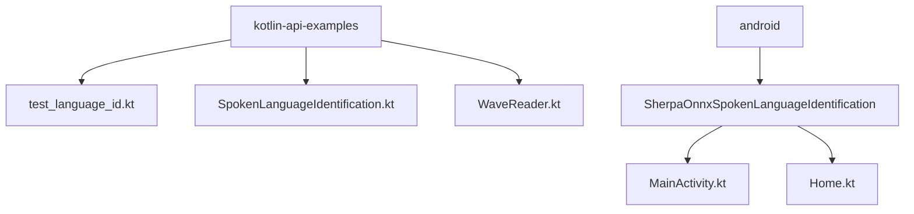
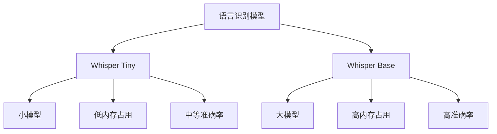

# 语言识别示例

<cite>
**本文档引用的文件**
- [test_language_id.kt](file://kotlin-api-examples/test_language_id.kt)
- [SpokenLanguageIdentification.kt](file://kotlin-api-examples/SpokenLanguageIdentification.kt)
- [WaveReader.kt](file://kotlin-api-examples/WaveReader.kt)
- [Home.kt](file://android/SherpaOnnxSpokenLanguageIdentification/app/src/main/java/com/k2fsa/sherpa/onnx/slid/Home.kt)
</cite>

## 目录
1. [项目结构](#项目结构)
2. [核心组件](#核心组件)
3. [语言识别配置](#语言识别配置)
4. [多语言音频处理](#多语言音频处理)
5. [Kotlin when表达式的应用](#kotlin-when表达式的应用)
6. [类型安全特性](#类型安全特性)
7. [语言识别模型分析](#语言识别模型分析)
8. [混合语言环境处理策略](#混合语言环境处理策略)

## 项目结构



**图示来源**
- [test_language_id.kt](file://kotlin-api-examples/test_language_id.kt)
- [SpokenLanguageIdentification.kt](file://kotlin-api-examples/SpokenLanguageIdentification.kt)
- [Home.kt](file://android/SherpaOnnxSpokenLanguageIdentification/app/src/main/java/com/k2fsa/sherpa/onnx/slid/Home.kt)

**本节来源**
- [test_language_id.kt](file://kotlin-api-examples/test_language_id.kt)
- [SpokenLanguageIdentification.kt](file://kotlin-api-examples/SpokenLanguageIdentification.kt)

## 核心组件

本文档的核心组件包括语言识别器、音频读取器和配置管理器。`SpokenLanguageIdentification`类是主要的语言识别组件，负责加载模型和执行语言识别任务。`WaveReader`类负责读取音频文件并将其转换为适合处理的格式。`SpokenLanguageIdentificationConfig`类用于配置语言识别器的各种参数。

**本节来源**
- [SpokenLanguageIdentification.kt](file://kotlin-api-examples/SpokenLanguageIdentification.kt)
- [WaveReader.kt](file://kotlin-api-examples/WaveReader.kt)

## 语言识别配置

语言识别器的配置通过`SpokenLanguageIdentificationConfig`数据类实现，该类包含Whisper模型的配置、线程数、调试模式和提供者等参数。Whisper模型配置包括编码器和解码器的路径以及尾部填充数。配置过程展示了Kotlin数据类在创建不可变配置对象方面的优势。

```kotlin
val config = SpokenLanguageIdentificationConfig(
    whisper = SpokenLanguageIdentificationWhisperConfig(
        encoder = "./sherpa-onnx-whisper-tiny/tiny-encoder.int8.onnx",
        decoder = "./sherpa-onnx-whisper-tiny/tiny-decoder.int8.onnx",
        tailPaddings = 33,
    ),
    numThreads = 1,
    debug = true,
    provider = "cpu",
)
```

**本节来源**
- [SpokenLanguageIdentification.kt](file://kotlin-api-examples/SpokenLanguageIdentification.kt#L5-L17)

## 多语言音频处理

系统通过`WaveReader`类处理多语言音频输入，该类能够读取不同语言的音频文件并将其转换为浮点数组格式。处理流程包括读取音频文件、创建识别流、接受波形数据、计算语言识别结果和释放资源。系统支持多种语言的音频文件，包括阿拉伯语、保加利亚语和德语等。

```kotlin
val testFiles = arrayOf(
    "./spoken-language-identification-test-wavs/ar-arabic.wav",
    "./spoken-language-identification-test-wavs/bg-bulgarian.wav",
    "./spoken-language-identification-test-wavs/de-german.wav",
)
```

**本节来源**
- [test_language_id.kt](file://kotlin-api-examples/test_language_id.kt#L20-L24)
- [WaveReader.kt](file://kotlin-api-examples/WaveReader.kt)

## Kotlin when表达式的应用

Kotlin的`when`表达式在处理多种语言结果时展现了其简洁性和表达力。在`getSpokenLanguageIdentificationConfig`函数中，`when`表达式用于根据类型参数选择不同的模型配置。这种模式匹配语法比传统的`if-else`链更清晰，可读性更强，且具有编译时检查的优势。

```kotlin
fun getSpokenLanguageIdentificationConfig(
    type: Int,
    numThreads: Int = 1
): SpokenLanguageIdentificationConfig? {
    when (type) {
        0 -> {
            val modelDir = "sherpa-onnx-whisper-tiny"
            return SpokenLanguageIdentificationConfig(
                whisper = SpokenLanguageIdentificationWhisperConfig(
                    encoder = "$modelDir/tiny-encoder.int8.onnx",
                    decoder = "$modelDir/tiny-decoder.int8.onnx",
                ),
                numThreads = numThreads,
                debug = true,
            )
        }
        1 -> {
            val modelDir = "sherpa-onnx-whisper-base"
            return SpokenLanguageIdentificationConfig(
                whisper = SpokenLanguageIdentificationWhisperConfig(
                    encoder = "$modelDir/tiny-encoder.int8.onnx",
                    decoder = "$modelDir/tiny-decoder.int8.onnx",
                ),
                numThreads = 1,
                debug = true,
            )
        }
    }
    return null
}
```

**本节来源**
- [SpokenLanguageIdentification.kt](file://kotlin-api-examples/SpokenLanguageIdentification.kt#L73-L103)

## 类型安全特性

系统充分利用了Kotlin的类型安全特性来确保结果处理的正确性。通过使用数据类和不可变属性，系统确保了配置对象的一致性和完整性。`WaveData`数据类封装了音频样本和采样率，提供了类型安全的访问接口。外部函数的返回类型也被严格定义，避免了运行时类型转换错误。

```kotlin
data class WaveData(
    val samples: FloatArray,
    val sampleRate: Int,
) {
    override fun equals(other: Any?): Boolean {
        if (this === other) return true
        if (javaClass != other?.javaClass) return false

        other as WaveData

        if (!samples.contentEquals(other.samples)) return false
        if (sampleRate != other.sampleRate) return false

        return true
    }

    override fun hashCode(): Int {
        var result = samples.contentHashCode()
        result = 31 * result + sampleRate
        return result
    }
}
```

**本节来源**
- [WaveReader.kt](file://kotlin-api-examples/WaveReader.kt#L6-L27)

## 语言识别模型分析

系统支持多种语言识别模型，每种模型都有不同的覆盖范围和准确率特性。Whisper模型系列提供了从tiny到base的不同规模模型，适用于不同的性能和精度需求。tiny模型适合资源受限的环境，而base模型提供更高的识别准确率。模型的int8量化版本在保持较高准确率的同时显著减少了内存占用。



**图示来源**
- [SpokenLanguageIdentification.kt](file://kotlin-api-examples/SpokenLanguageIdentification.kt)
- [test_language_id.kt](file://kotlin-api-examples/test_language_id.kt)

**本节来源**
- [SpokenLanguageIdentification.kt](file://kotlin-api-examples/SpokenLanguageIdentification.kt#L73-L103)

## 混合语言环境处理策略

在混合语言环境中，系统采用了一系列策略来确保准确的语言识别。首先，系统通过预处理音频数据来标准化输入格式。其次，使用专门训练的多语言模型来识别不同语言的语音特征。最后，通过后处理步骤来验证和确认识别结果。在Android应用中，系统还实现了用户界面来显示识别结果和处理状态。

```kotlin
val samples = flatten(sampleList)
val stream = Slid.slid.createStream()
stream.acceptWaveform(samples, sampleRateInHz)
val lang = Slid.slid.compute(stream)
result = Slid.localeMap[lang] ?: lang
```

**本节来源**
- [Home.kt](file://android/SherpaOnnxSpokenLanguageIdentification/app/src/main/java/com/k2fsa/sherpa/onnx/slid/Home.kt#L116-L121)
- [test_language_id.kt](file://kotlin-api-examples/test_language_id.kt)