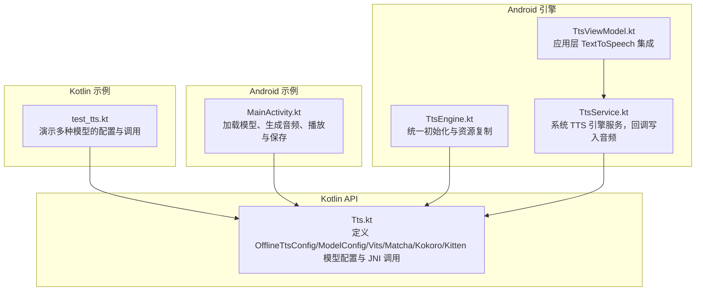
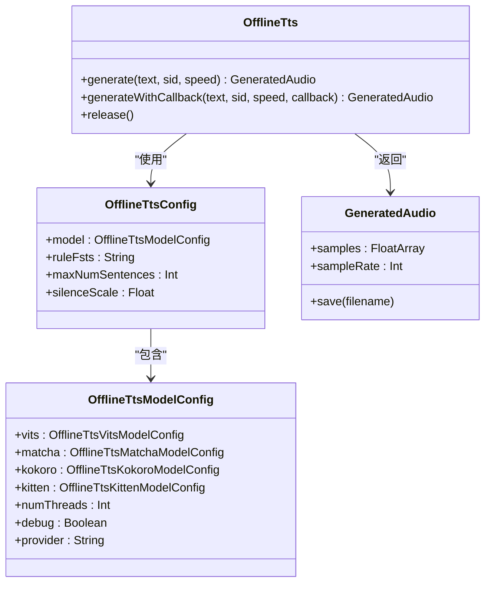
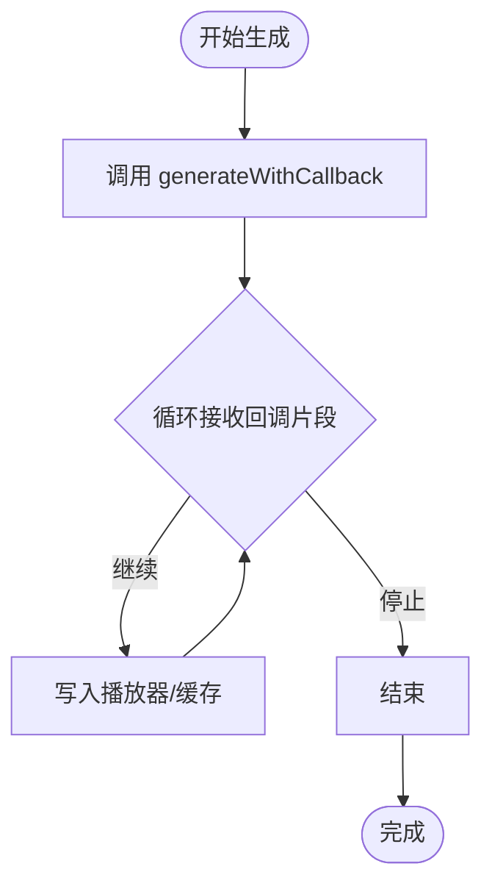
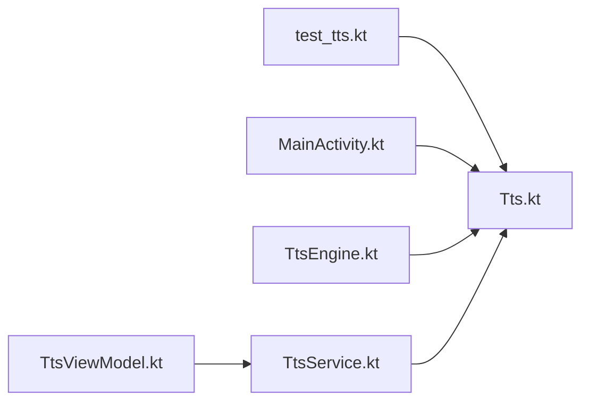
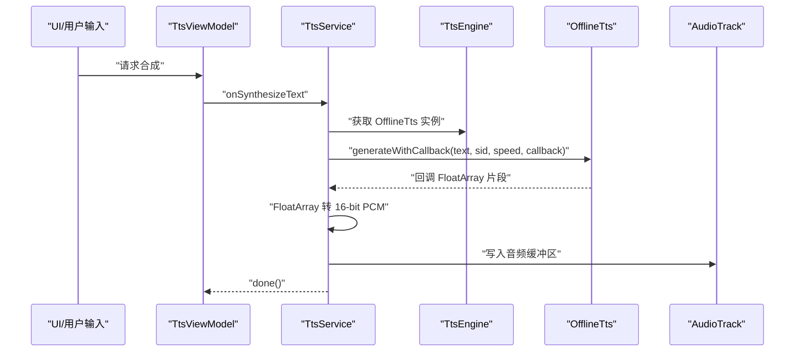

# 语音合成示例

<cite>
**本文引用的文件列表**
- [test_tts.kt](file://kotlin-api-examples/test_tts.kt)
- [Tts.kt](file://sherpa-onnx/kotlin-api/Tts.kt)
- [MainActivity.kt（Android 示例）](file://android/SherpaOnnxTts/app/src/main/java/com/k2fsa/sherpa/onnx/MainActivity.kt)
- [TtsEngine.kt（Android 引擎）](file://android/SherpaOnnxTtsEngine/app/src/main/java/com/k2fsa/sherpa/onnx/tts/engine/TtsEngine.kt)
- [TtsService.kt（Android 引擎服务）](file://android/SherpaOnnxTtsEngine/app/src/main/java/com/k2fsa/sherpa/onnx/tts/engine/TtsService.kt)
- [TtsViewModel.kt（Android 引擎视图模型）](file://android/SherpaOnnxTtsEngine/app/src/main/java/com/k2fsa/sherpa/onnx/tts/engine/TtsViewModel.kt)
</cite>

## 目录
1. [简介](#简介)
2. [项目结构](#项目结构)
3. [核心组件](#核心组件)
4. [架构总览](#架构总览)
5. [详细组件分析](#详细组件分析)
6. [依赖关系分析](#依赖关系分析)
7. [性能与模型选择](#性能与模型选择)
8. [音频播放与集成](#音频播放与集成)
9. [故障排查指南](#故障排查指南)
10. [结论](#结论)

## 简介
本文件围绕 Kotlin API 的语音合成（Text-to-Speech, TTS）示例进行系统化文档化，重点分析 test_tts.kt 中的 TTS 实现，涵盖：
- 如何配置文本到语音转换器（OfflineTtsConfig、OfflineTtsModelConfig）
- 设置语音参数（音色、语速、线程数、调试开关等）
- 生成音频输出（同步与回调两种方式）
- 处理合成结果（保存为 WAV 文件、流式播放）
- Kotlin DSL 在构建复杂配置时的简洁性
- 作用域函数与回调机制对可读性的提升
- 在移动应用中集成自然语音合成功能的实际路径
- 不同 TTS 模型的特点与适用场景
- 根据设备性能选择合适模型的策略
- 音频播放集成与用户体验优化建议

## 项目结构
该仓库提供了多语言与多平台的 TTS 示例与 API 封装。与 Kotlin TTS 示例直接相关的核心位置如下：
- Kotlin API 层：定义数据结构与 JNI 接口，负责模型配置与音频生成
- Kotlin 示例：test_tts.kt 展示多种模型的使用方式
- Android 示例：演示如何在 Android 应用中加载模型、生成音频并播放
- Android 引擎：封装 TTS 引擎服务，支持系统级 TTS 引擎对接



图表来源
- [Tts.kt](file://sherpa-onnx/kotlin-api/Tts.kt#L1-L191)
- [test_tts.kt](file://kotlin-api-examples/test_tts.kt#L1-L162)
- [MainActivity.kt（Android 示例）](file://android/SherpaOnnxTts/app/src/main/java/com/k2fsa/sherpa/onnx/MainActivity.kt#L1-L180)
- [TtsEngine.kt（Android 引擎）](file://android/SherpaOnnxTtsEngine/app/src/main/java/com/k2fsa/sherpa/onnx/tts/engine/TtsEngine.kt#L1-L120)
- [TtsService.kt（Android 引擎服务）](file://android/SherpaOnnxTtsEngine/app/src/main/java/com/k2fsa/sherpa/onnx/tts/engine/TtsService.kt#L105-L157)
- [TtsViewModel.kt（Android 引擎视图模型）](file://android/SherpaOnnxTtsEngine/app/src/main/java/com/k2fsa/sherpa/onnx/tts/engine/TtsViewModel.kt#L62-L73)

章节来源
- [Tts.kt](file://sherpa-onnx/kotlin-api/Tts.kt#L1-L191)
- [test_tts.kt](file://kotlin-api-examples/test_tts.kt#L1-L162)

## 核心组件
- 数据模型与配置
  - OfflineTtsConfig：顶层配置，包含模型配置、规则 FST/FAR、最大句子数、静音比例等
  - OfflineTtsModelConfig：包含 VITS、Matcha、Kokoro、Kitten 四种模型配置，以及线程数、调试开关、provider
  - 各模型子配置类：VitsModelConfig、MatchaModelConfig、KokoroModelConfig、KittenModelConfig
- 运行时类
  - OfflineTts：JNI 包装类，负责初始化、生成音频、释放资源
  - GeneratedAudio：封装采样数组与采样率，并提供保存方法
- 工具函数
  - getOfflineTtsConfig：便捷函数，根据传入参数自动组装配置，简化 DSL 使用

章节来源
- [Tts.kt](file://sherpa-onnx/kotlin-api/Tts.kt#L1-L191)
- [Tts.kt](file://sherpa-onnx/kotlin-api/Tts.kt#L196-L307)

## 架构总览
下图展示了从 Kotlin 示例到 JNI 再到 Android 播放的整体流程。

```mermaid
sequenceDiagram
participant K as "Kotlin 示例<br/>test_tts.kt"
participant API as "Kotlin API<br/>OfflineTts/Tts.kt"
participant JNI as "JNI 层<br/>sherpa-onnx-jni"
participant AND as "Android 播放<br/>MainActivity.kt"
participant SYS as "系统 TTS 引擎<br/>TtsService.kt"
K->>API : "构造 OfflineTtsConfig/ModelConfig 并创建 OfflineTts"
K->>API : "调用 generateWithCallback(text, sid, speed, callback)"
API->>JNI : "JNI 生成音频片段FloatArray"
JNI-->>API : "返回音频片段数组"
API-->>K : "回调返回，继续或停止"
K->>AND : "示例中保存为 WAV 或通过 AudioTrack 播放"
AND->>AND : "AudioTrack 写入 PCM 流"
SYS->>API : "系统 TTS 引擎通过回调写入音频"
```

图表来源
- [test_tts.kt](file://kotlin-api-examples/test_tts.kt#L1-L162)
- [Tts.kt](file://sherpa-onnx/kotlin-api/Tts.kt#L97-L185)
- [MainActivity.kt（Android 示例）](file://android/SherpaOnnxTts/app/src/main/java/com/k2fsa/sherpa/onnx/MainActivity.kt#L97-L161)
- [TtsService.kt（Android 引擎服务）](file://android/SherpaOnnxTtsEngine/app/src/main/java/com/k2fsa/sherpa/onnx/tts/engine/TtsService.kt#L132-L157)

## 详细组件分析

### Kotlin DSL 与配置构建
- 使用 Kotlin 数据类与默认值，配合工具函数 getOfflineTtsConfig，可以以极简方式组合不同模型配置
- 通过命名参数与默认字段，避免样板代码，提升可读性与可维护性
- 作用域函数（如 with、apply、run）在 Android 引擎中用于组织初始化逻辑，使链式配置更清晰

章节来源
- [Tts.kt](file://sherpa-onnx/kotlin-api/Tts.kt#L1-L191)
- [Tts.kt](file://sherpa-onnx/kotlin-api/Tts.kt#L196-L307)
- [TtsEngine.kt（Android 引擎）](file://android/SherpaOnnxTtsEngine/app/src/main/java/com/k2fsa/sherpa/onnx/tts/engine/TtsEngine.kt#L83-L179)

### OfflineTts 类与生成流程
- 初始化：支持从资产目录或本地文件加载模型
- 生成接口：
  - generate：一次性返回完整音频
  - generateWithCallback：分块回调，适合流式播放或实时渲染
- 资源管理：allocate/free/release，确保生命周期可控



图表来源
- [Tts.kt](file://sherpa-onnx/kotlin-api/Tts.kt#L1-L191)

章节来源
- [Tts.kt](file://sherpa-onnx/kotlin-api/Tts.kt#L79-L185)

### 回调机制与流式播放
- 回调签名：接收 FloatArray（PCM 样本），返回 Int 控制继续或停止
- Android 示例中，回调将 FloatArray 写入 AudioTrack，实现边生成边播放
- 系统 TTS 引擎服务中，回调将 FloatArray 转换为 16-bit PCM 并写入 SynthesisCallback



图表来源
- [test_tts.kt](file://kotlin-api-examples/test_tts.kt#L155-L161)
- [MainActivity.kt（Android 示例）](file://android/SherpaOnnxTts/app/src/main/java/com/k2fsa/sherpa/onnx/MainActivity.kt#L97-L106)
- [TtsService.kt（Android 引擎服务）](file://android/SherpaOnnxTtsEngine/app/src/main/java/com/k2fsa/sherpa/onnx/tts/engine/TtsService.kt#L132-L157)

章节来源
- [test_tts.kt](file://kotlin-api-examples/test_tts.kt#L155-L161)
- [MainActivity.kt（Android 示例）](file://android/SherpaOnnxTts/app/src/main/java/com/k2fsa/sherpa/onnx/MainActivity.kt#L97-L106)
- [TtsService.kt（Android 引擎服务）](file://android/SherpaOnnxTtsEngine/app/src/main/java/com/k2fsa/sherpa/onnx/tts/engine/TtsService.kt#L132-L157)

### 多模型配置与参数
- VITS：适用于多语言与高质量语音；支持噪声缩放、长度缩放等参数
- Matcha：需要声码器（vocoder）；适合中文/英文等语言的高保真合成
- Kokoro：支持多语言与词典；可通过 voices 与 lexicon 定制
- Kitten：轻量模型，适合移动端资源受限场景

章节来源
- [Tts.kt](file://sherpa-onnx/kotlin-api/Tts.kt#L1-L191)
- [test_tts.kt](file://kotlin-api-examples/test_tts.kt#L11-L117)

## 依赖关系分析
- Kotlin 示例依赖 Kotlin API 层（Tts.kt）提供的数据结构与 JNI 接口
- Android 示例与引擎分别通过 OfflineTts 与系统 TTS 服务消费音频
- 资源复制与加载由 TtsEngine 完成，确保模型文件可用



图表来源
- [test_tts.kt](file://kotlin-api-examples/test_tts.kt#L1-L162)
- [Tts.kt](file://sherpa-onnx/kotlin-api/Tts.kt#L1-L191)
- [MainActivity.kt（Android 示例）](file://android/SherpaOnnxTts/app/src/main/java/com/k2fsa/sherpa/onnx/MainActivity.kt#L1-L180)
- [TtsEngine.kt（Android 引擎）](file://android/SherpaOnnxTtsEngine/app/src/main/java/com/k2fsa/sherpa/onnx/tts/engine/TtsEngine.kt#L1-L120)
- [TtsService.kt（Android 引擎服务）](file://android/SherpaOnnxTtsEngine/app/src/main/java/com/k2fsa/sherpa/onnx/tts/engine/TtsService.kt#L105-L157)
- [TtsViewModel.kt（Android 引擎视图模型）](file://android/SherpaOnnxTtsEngine/app/src/main/java/com/k2fsa/sherpa/onnx/tts/engine/TtsViewModel.kt#L62-L73)

章节来源
- [TtsEngine.kt（Android 引擎）](file://android/SherpaOnnxTtsEngine/app/src/main/java/com/k2fsa/sherpa/onnx/tts/engine/TtsEngine.kt#L181-L266)

## 性能与模型选择
- 线程数与模型类型
  - getOfflineTtsConfig 会根据是否使用 voices（Kokoro/Kitten）自动提高线程数，以平衡吞吐与延迟
- 设备性能与模型权衡
  - Kitten：体积小、推理快，适合低端设备
  - Kokoro：多语言支持强，但资源占用较高
  - Matcha：质量高但需要额外声码器资源
  - VITS：通用性强，适合多语言与多说话人
- 参数调优
  - speed：影响合成速度与自然度的折中
  - noiseScale/lengthScale：影响音质与韵律
  - numThreads：根据 CPU 核心数与内存情况调整

章节来源
- [Tts.kt](file://sherpa-onnx/kotlin-api/Tts.kt#L196-L307)
- [test_tts.kt](file://kotlin-api-examples/test_tts.kt#L11-L117)

## 音频播放与集成
- Android 示例播放
  - 使用 AudioTrack 以流式方式写入 FloatArray，实现边生成边播放
  - 支持暂停、停止、重新生成与保存为 WAV 文件
- 系统 TTS 引擎集成
  - TtsService 通过 SynthesisCallback 将 FloatArray 转换为 16-bit PCM 并写入
  - TtsViewModel 将引擎注册为系统 TTS 引擎，供应用层统一调度



图表来源
- [TtsService.kt（Android 引擎服务）](file://android/SherpaOnnxTtsEngine/app/src/main/java/com/k2fsa/sherpa/onnx/tts/engine/TtsService.kt#L105-L157)
- [TtsEngine.kt（Android 引擎）](file://android/SherpaOnnxTtsEngine/app/src/main/java/com/k2fsa/sherpa/onnx/tts/engine/TtsEngine.kt#L181-L266)
- [MainActivity.kt（Android 示例）](file://android/SherpaOnnxTts/app/src/main/java/com/k2fsa/sherpa/onnx/MainActivity.kt#L97-L161)

章节来源
- [MainActivity.kt（Android 示例）](file://android/SherpaOnnxTts/app/src/main/java/com/k2fsa/sherpa/onnx/MainActivity.kt#L97-L161)
- [TtsService.kt（Android 引擎服务）](file://android/SherpaOnnxTtsEngine/app/src/main/java/com/k2fsa/sherpa/onnx/tts/engine/TtsService.kt#L132-L157)
- [TtsViewModel.kt（Android 引擎视图模型）](file://android/SherpaOnnxTtsEngine/app/src/main/java/com/k2fsa/sherpa/onnx/tts/engine/TtsViewModel.kt#L62-L73)

## 故障排查指南
- 常见问题
  - 模型路径错误：确认 modelDir 与各文件路径正确，Android 引擎会复制 assets 到外部存储
  - 缺少 vocoder（Matcha）：getOfflineTtsConfig 会校验并抛出异常
  - 无效参数：sid/speed 必须满足非负整数与正数要求
  - 回调返回 0 导致提前停止：检查回调返回值与停止标志
- 建议
  - 在 Android 示例中，先初始化 AudioTrack 再生成音频，避免缓冲区不一致
  - 使用系统 TTS 引擎时，注意回调写入的 PCM 编码格式与采样率匹配

章节来源
- [Tts.kt](file://sherpa-onnx/kotlin-api/Tts.kt#L239-L241)
- [MainActivity.kt（Android 示例）](file://android/SherpaOnnxTts/app/src/main/java/com/k2fsa/sherpa/onnx/MainActivity.kt#L108-L161)
- [TtsService.kt（Android 引擎服务）](file://android/SherpaOnnxTtsEngine/app/src/main/java/com/k2fsa/sherpa/onnx/tts/engine/TtsService.kt#L132-L157)

## 结论
- Kotlin DSL 与数据类让 TTS 配置简洁直观，结合工具函数可快速适配多模型
- 回调式生成非常适合流式播放与系统 TTS 集成，兼顾性能与体验
- Android 示例与引擎提供了从模型加载、音频生成到播放的完整闭环
- 根据设备性能与业务需求选择合适模型，并通过参数微调获得最佳效果