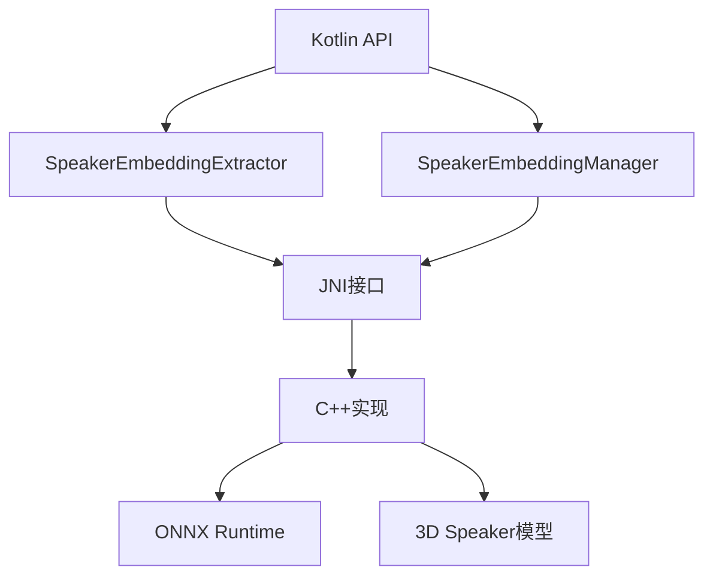

# 说话人识别示例

<cite>
**本文档引用的文件**
- [test_speaker_id.kt](file://kotlin-api-examples/test_speaker_id.kt)
- [Speaker.kt](file://sherpa-onnx/kotlin-api/Speaker.kt)
- [SpeakerEmbeddingExtractorConfig.kt](file://sherpa-onnx/kotlin-api/SpeakerEmbeddingExtractorConfig.kt)
- [WaveReader.kt](file://android/SherpaOnnx/app/src/main/java/com/k2fsa/sherpa/onnx/WaveReader.kt)
- [speaker-identification.py](file://python-api-examples/speaker-identification.py)
- [speaker-embedding-manager.h](file://sherpa-onnx/csrc/speaker-embedding-manager.h)
</cite>

## 目录
1. [项目结构](#项目结构)
2. [核心组件](#核心组件)
3. [说话人识别实现机制](#说话人识别实现机制)
4. [Kotlin集合操作在声纹数据处理中的应用](#kotlin集合操作在声纹数据处理中的应用)
5. [密封类在识别结果状态表示中的应用](#密封类在识别结果状态表示中的应用)
6. [声纹数据库构建与身份验证系统实现](#声纹数据库构建与身份验证系统实现)
7. [说话人识别算法的准确率与性能权衡](#说话人识别算法的准确率与性能权衡)
8. [隐私敏感应用中的最佳实践](#隐私敏感应用中的最佳实践)

## 项目结构

说话人识别功能主要分布在Kotlin API示例和Android应用示例中。核心实现位于`kotlin-api-examples`目录下的`test_speaker_id.kt`文件，而Android应用示例则位于`android/SherpaOnnxSpeakerIdentification`目录中。Kotlin API的实现基于JNI接口，通过`sherpa-onnx-jni`库与底层C++代码交互。



**Diagram sources**
- [test_speaker_id.kt](file://kotlin-api-examples/test_speaker_id.kt)
- [Speaker.kt](file://sherpa-onnx/kotlin-api/Speaker.kt)

**Section sources**
- [test_speaker_id.kt](file://kotlin-api-examples/test_speaker_id.kt)
- [Speaker.kt](file://sherpa-onnx/kotlin-api/Speaker.kt)

## 核心组件

说话人识别系统的核心组件包括说话人嵌入提取器（SpeakerEmbeddingExtractor）和说话人嵌入管理器（SpeakerEmbeddingManager）。前者负责从音频流中提取说话人的声纹特征，后者则用于管理注册的说话人声纹数据并进行识别和验证。

**Section sources**
- [Speaker.kt](file://sherpa-onnx/kotlin-api/Speaker.kt#L6-L114)
- [test_speaker_id.kt](file://kotlin-api-examples/test_speaker_id.kt#L8-L11)

## 说话人识别实现机制

说话人识别的实现机制主要分为三个步骤：说话人嵌入提取、声纹模型创建和说话人验证与识别。

### 说话人嵌入提取

说话人嵌入提取是通过`SpeakerEmbeddingExtractor`类实现的。该类使用预训练的3D Speaker模型（如`3dspeaker_speech_eres2net_large_sv_zh-cn_3dspeaker_16k.onnx`）从音频文件中提取固定维度的嵌入向量。提取过程包括创建流、接受音频波形、完成输入和计算嵌入。

```kotlin
fun computeEmbedding(extractor: SpeakerEmbeddingExtractor, filename: String): FloatArray {
    val objArray = WaveReader.readWaveFromFile(filename = filename)
    val samples: FloatArray = objArray[0] as FloatArray
    val sampleRate: Int = objArray[1] as Int

    val stream = extractor.createStream()
    stream.acceptWaveform(sampleRate = sampleRate, samples = samples)
    stream.inputFinished()
    check(extractor.isReady(stream))

    val embedding = extractor.compute(stream)
    stream.release()

    return embedding
}
```

### 声纹模型创建

声纹模型的创建通过`SpeakerEmbeddingManager`类实现。该类维护一个说话人声纹数据库，支持添加、删除和查询说话人。每个说话人可以关联一个或多个声纹嵌入，系统在识别时会计算输入声纹与数据库中所有声纹的相似度。

```kotlin
val manager = SpeakerEmbeddingManager(extractor.dim())
manager.add(name = "speaker1", embedding = embedding1a)
manager.add(name = "speaker2", embedding = embedding2a)
```

### 说话人验证与识别

说话人验证和识别通过`search`和`verify`方法实现。`search`方法用于识别说话人，返回与输入声纹最相似且相似度超过阈值的说话人名称；`verify`方法用于验证说话人身份，返回输入声纹是否与指定说话人的声纹匹配。

```kotlin
val name = manager.search(embedding = embedding1b, threshold = 0.5f)
check(name == "speaker1")

val isVerified = manager.verify("speaker1", embedding1b, 0.5f)
```

**Section sources**
- [test_speaker_id.kt](file://kotlin-api-examples/test_speaker_id.kt#L7-L43)
- [Speaker.kt](file://sherpa-onnx/kotlin-api/Speaker.kt#L64-L114)

## Kotlin集合操作在声纹数据处理中的应用

Kotlin的集合操作在处理声纹数据时提供了极大的便利性。例如，在注册多个声纹样本时，可以使用`mutableListOf`创建可变列表，然后使用`add`方法添加声纹嵌入。在搜索最佳匹配时，可以使用`toTypedArray`将列表转换为数组，以便传递给`add`方法。

```kotlin
val embeddingList = mutableListOf(embedding1a, embedding1b)
val ok = manager.add(name = "s1", embedding = embeddingList.toTypedArray())
```

此外，Kotlin的集合操作还支持函数式编程风格，如`map`、`filter`和`reduce`，可以方便地对声纹数据进行批量处理和分析。

**Section sources**
- [test_speaker_id.kt](file://kotlin-api-examples/test_speaker_id.kt#L30-L32)
- [Register.kt](file://android/SherpaOnnxSpeakerIdentification/app/src/main/java/com/k2fsa/sherpa/onnx/speaker/identification/screens/Register.kt#L45-L48)

## 密封类在识别结果状态表示中的应用

虽然当前代码中未直接使用密封类（sealed class）来表示识别结果状态，但这是一个值得推荐的最佳实践。密封类可以安全地表示有限的类层次结构，确保所有可能的状态都被显式处理。例如，可以定义一个`RecognitionResult`密封类来表示识别成功、识别失败和未知说话人等状态。

```kotlin
sealed class RecognitionResult {
    data class Success(val speakerName: String, val confidence: Float) : RecognitionResult()
    object Failure : RecognitionResult()
    object Unknown : RecognitionResult()
}
```

这种设计模式可以避免使用字符串或枚举来表示状态，提高代码的类型安全性和可维护性。

**Section sources**
- [Speaker.kt](file://sherpa-onnx/kotlin-api/Speaker.kt)
- [test_speaker_id.kt](file://kotlin-api-examples/test_speaker_id.kt)

## 声纹数据库构建与身份验证系统实现

声纹数据库的构建和身份验证系统的实现主要通过`SpeakerEmbeddingManager`类完成。以下是一个完整的实现示例：

```kotlin
fun buildVoiceprintDatabase() {
    val config = SpeakerEmbeddingExtractorConfig(
        model = "./3dspeaker_speech_eres2net_large_sv_zh-cn_3dspeaker_16k.onnx",
    )
    val extractor = SpeakerEmbeddingExtractor(config = config)

    // 提取声纹嵌入
    val embedding1a = computeEmbedding(extractor, "./speaker1_a_cn_16k.wav")
    val embedding2a = computeEmbedding(extractor, "./speaker2_a_cn_16k.wav")
    val embedding1b = computeEmbedding(extractor, "./speaker1_b_cn_16k.wav")

    // 创建声纹数据库
    val manager = SpeakerEmbeddingManager(extractor.dim())
    manager.add(name = "speaker1", embedding = embedding1a)
    manager.add(name = "speaker2", embedding = embedding2a)

    // 进行说话人识别
    var name = manager.search(embedding = embedding1b, threshold = 0.5f)
    check(name == "speaker1")

    // 进行说话人验证
    val isVerified = manager.verify("speaker1", embedding1b, 0.5f)
    check(isVerified)

    // 释放资源
    manager.release()
    extractor.release()
}
```

**Section sources**
- [test_speaker_id.kt](file://kotlin-api-examples/test_speaker_id.kt)
- [Speaker.kt](file://sherpa-onnx/kotlin-api/Speaker.kt)

## 说话人识别算法的准确率与性能权衡

说话人识别算法的准确率和性能受到多种因素的影响，包括模型选择、阈值设置和硬件性能。3D Speaker模型提供了较高的准确率，但计算成本也相对较高。阈值设置需要在准确率和误识率之间进行权衡：较高的阈值可以减少误识，但可能导致漏识；较低的阈值可以提高识别率，但可能增加误识。

在性能方面，说话人嵌入提取是计算密集型操作，主要消耗在模型推理上。通过调整`numThreads`参数可以优化多线程性能，而`provider`参数可以选择不同的计算后端（如CPU、GPU）来平衡性能和功耗。

**Section sources**
- [SpeakerEmbeddingExtractorConfig.kt](file://sherpa-onnx/kotlin-api/SpeakerEmbeddingExtractorConfig.kt)
- [speaker-embedding-manager.h](file://sherpa-onnx/csrc/speaker-embedding-manager.h)

## 隐私敏感应用中的最佳实践

在隐私敏感应用中，说话人识别系统的实现需要遵循以下最佳实践：

1. **数据最小化**：只收集和存储必要的声纹数据，避免存储原始音频。
2. **数据加密**：对存储的声纹数据进行加密，防止未经授权的访问。
3. **用户同意**：在收集和使用声纹数据前，必须获得用户的明确同意。
4. **数据保留策略**：制定明确的数据保留和删除策略，定期清理不再需要的声纹数据。
5. **本地处理**：尽可能在设备本地进行声纹提取和识别，避免将敏感数据传输到云端。

这些实践可以有效保护用户的隐私，符合数据保护法规的要求。

**Section sources**
- [Speaker.kt](file://sherpa-onnx/kotlin-api/Speaker.kt)
- [test_speaker_id.kt](file://kotlin-api-examples/test_speaker_id.kt)