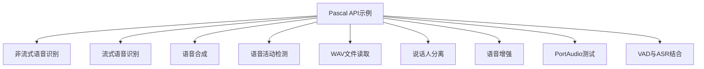
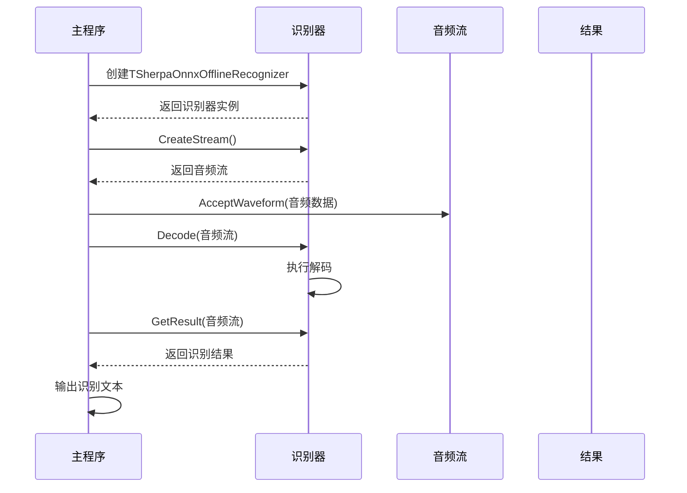
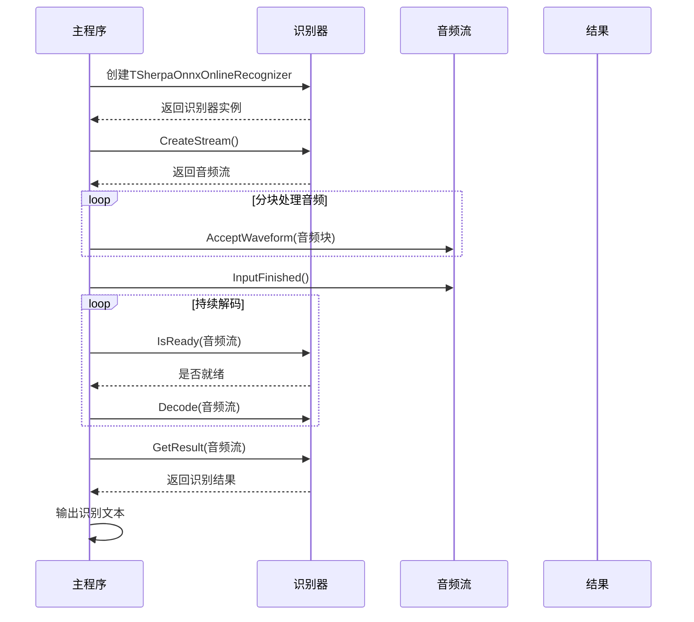
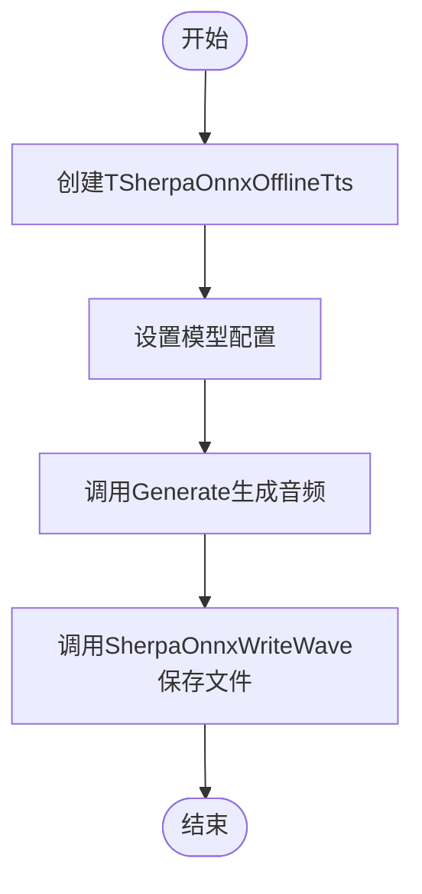
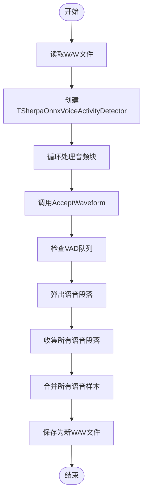
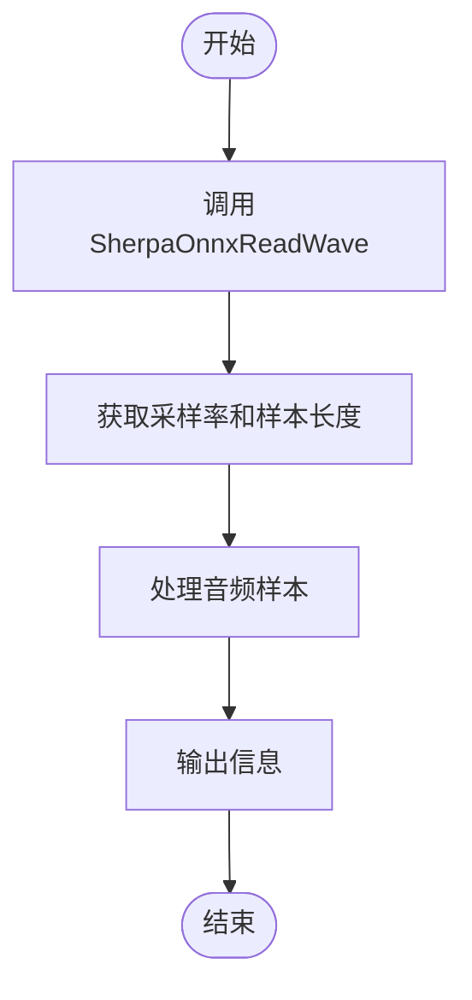

# Pascal API 示例

<cite>
**本文档中引用的文件**  
- [whisper.pas](file://pascal-api-examples/non-streaming-asr/whisper.pas)
- [zipformer_ctc.pas](file://pascal-api-examples/streaming-asr/zipformer_ctc.pas)
- [kitten-en.pas](file://pascal-api-examples/tts/kitten-en.pas)
- [remove_silence.pas](file://pascal-api-examples/vad/remove_silence.pas)
- [main.pas](file://pascal-api-examples/read-wav/main.pas)
- [sherpa_onnx.pas](file://sherpa-onnx/pascal-api/sherpa_onnx.pas)
- [portaudio.pas](file://sherpa-onnx/pascal-api/portaudio.pas)
- [README.md](file://pascal-api-examples/README.md)
- [non-streaming-asr/README.md](file://pascal-api-examples/non-streaming-asr/README.md)
- [streaming-asr/README.md](file://pascal-api-examples/streaming-asr/README.md)
- [tts/README.md](file://pascal-api-examples/tts/README.md)
- [vad/README.md](file://pascal-api-examples/vad/README.md)
</cite>

## 目录
1. [简介](#简介)
2. [项目结构](#项目结构)
3. [核心组件](#核心组件)
4. [非流式语音识别](#非流式语音识别)
5. [流式语音识别](#流式语音识别)
6. [语音合成](#语音合成)
7. [语音活动检测](#语音活动检测)
8. [读取WAV文件](#读取wav文件)
9. [Pascal API的FFI实现机制](#pascal-api的ffi实现机制)
10. [Lazarus/Free Pascal环境下的编译与运行](#lazarusfree-pascal环境下的编译与运行)
11. [跨平台开发指导](#跨平台开发指导)
12. [常见问题解决方案](#常见问题解决方案)

## 简介
sherpa-onnx项目提供了完整的Object Pascal API，使开发者能够在Free Pascal和Lazarus环境中使用先进的语音识别、语音合成和语音活动检测功能。本文档系统性地组织和解释所有Pascal API示例，涵盖非流式语音识别、流式语音识别、语音合成、语音活动检测等核心功能。

**Section sources**
- [README.md](file://pascal-api-examples/README.md#L1-L19)

## 项目结构
Pascal API示例代码组织在`pascal-api-examples`目录下，按功能模块划分。主要目录包括：
- `non-streaming-asr`: 非流式语音识别示例
- `streaming-asr`: 流式语音识别示例
- `tts`: 语音合成示例
- `vad`: 语音活动检测示例
- `read-wav`: WAV文件读取示例
- `speaker-diarization`: 说话人分离示例
- `speech-enhancement-gtcrn`: 语音增强示例
- `portaudio-test`: PortAudio测试示例
- `vad-with-non-streaming-asr`: VAD与非流式ASR结合示例

**Diagram sources**
- [README.md](file://pascal-api-examples/README.md#L9-L19)

**Section sources**
- [README.md](file://pascal-api-examples/README.md#L9-L19)

## 核心组件
Pascal API的核心组件包括语音识别器、语音合成器、语音活动检测器等，通过面向对象的Pascal语法封装了底层C API的功能。API设计遵循Pascal语言的命名规范和编程习惯，提供了类型安全的接口。

**Section sources**
- [sherpa_onnx.pas](file://sherpa-onnx/pascal-api/sherpa_onnx.pas)
- [portaudio.pas](file://sherpa-onnx/pascal-api/portaudio.pas)

## 非流式语音识别
非流式语音识别适用于已知完整音频文件的场景。示例代码展示了如何使用Whisper、Paraformer、Zipformer等多种模型进行离线语音识别。

**Diagram sources**
- [whisper.pas](file://pascal-api-examples/non-streaming-asr/whisper.pas#L11-L78)

**Section sources**
- [whisper.pas](file://pascal-api-examples/non-streaming-asr/whisper.pas#L11-L78)
- [non-streaming-asr/README.md](file://pascal-api-examples/non-streaming-asr/README.md#L1-L17)

## 流式语音识别
流式语音识别适用于实时音频处理场景，如麦克风输入。示例代码展示了如何使用Zipformer CTC等模型进行流式语音识别。

**Diagram sources**
- [zipformer_ctc.pas](file://pascal-api-examples/streaming-asr/zipformer_ctc.pas#L11-L88)

**Section sources**
- [zipformer_ctc.pas](file://pascal-api-examples/streaming-asr/zipformer_ctc.pas#L11-L88)
- [streaming-asr/README.md](file://pascal-api-examples/streaming-asr/README.md#L1-L13)

## 语音合成
语音合成示例展示了如何使用Kitten TTS等模型将文本转换为语音，并保存为WAV文件。

**Diagram sources**
- [kitten-en.pas](file://pascal-api-examples/tts/kitten-en.pas#L1-L56)

**Section sources**
- [kitten-en.pas](file://pascal-api-examples/tts/kitten-en.pas#L1-L56)
- [tts/README.md](file://pascal-api-examples/tts/README.md#L1-L10)

## 语音活动检测
语音活动检测示例展示了如何使用Silero VAD模型检测音频中的语音段落，并移除静音部分。

**Diagram sources**
- [remove_silence.pas](file://pascal-api-examples/vad/remove_silence.pas#L1-L116)

**Section sources**
- [remove_silence.pas](file://pascal-api-examples/vad/remove_silence.pas#L1-L116)
- [vad/README.md](file://pascal-api-examples/vad/README.md#L1-L12)

## 读取WAV文件
WAV文件读取示例展示了如何使用SherpaOnnxReadWave函数读取WAV文件的基本信息和音频样本。

**Diagram sources**
- [main.pas](file://pascal-api-examples/read-wav/main.pas#L1-L22)

**Section sources**
- [main.pas](file://pascal-api-examples/read-wav/main.pas#L1-L22)

## Pascal API的FFI实现机制
Pascal API通过外部函数接口（FFI）机制封装了底层C API。核心实现包括：
- 使用`external`关键字绑定C函数
- 定义Pascal记录类型对应C结构体
- 实现面向对象的类包装器
- 处理内存管理和资源释放

**Section sources**
- [sherpa_onnx.pas](file://sherpa-onnx/pascal-api/sherpa_onnx.pas)
- [portaudio.pas](file://sherpa-onnx/pascal-api/portaudio.pas)

## Lazarus/Free Pascal环境下的编译与运行
在Lazarus/Free Pascal环境中编译和运行这些示例需要：
1. 安装Free Pascal编译器和Lazarus IDE
2. 配置项目路径和库依赖
3. 设置正确的编译模式（objfpc或delphi）
4. 链接必要的动态库
5. 确保模型文件路径正确

**Section sources**
- [whisper.pas](file://pascal-api-examples/non-streaming-asr/whisper.pas#L13)
- [zipformer_ctc.pas](file://pascal-api-examples/streaming-asr/zipformer_ctc.pas#L13)
- [kitten-en.pas](file://pascal-api-examples/tts/kitten-en.pas#L13)
- [remove_silence.pas](file://pascal-api-examples/vad/remove_silence.pas#L8)

## 跨平台开发指导
Pascal API支持跨平台开发，关键要点包括：
- 使用条件编译处理平台差异
- 确保动态库在各平台的兼容性
- 处理文件路径分隔符差异
- 考虑不同平台的音频后端支持
- 测试不同操作系统的内存管理行为

**Section sources**
- [sherpa_onnx.pas](file://sherpa-onnx/pascal-api/sherpa_onnx.pas)
- [portaudio.pas](file://sherpa-onnx/pascal-api/portaudio.pas)

## 常见问题解决方案
常见问题及解决方案包括：
- 模型文件路径错误：确保相对路径正确或使用绝对路径
- 动态库缺失：检查libsherpa-onnx.so/dll/dylib是否在库路径中
- 采样率不匹配：确保音频文件采样率与模型要求一致
- 内存泄漏：在复杂项目中显式调用FreeAndNil释放资源
- 线程安全问题：避免在多线程环境中共享识别器实例

**Section sources**
- [whisper.pas](file://pascal-api-examples/non-streaming-asr/whisper.pas#L70-L77)
- [zipformer_ctc.pas](file://pascal-api-examples/streaming-asr/zipformer_ctc.pas#L80-L87)
- [remove_silence.pas](file://pascal-api-examples/vad/remove_silence.pas#L114)