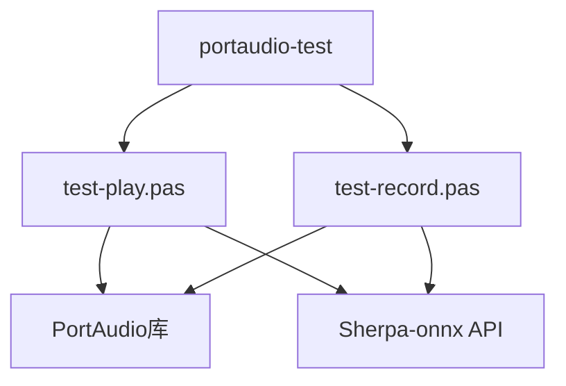
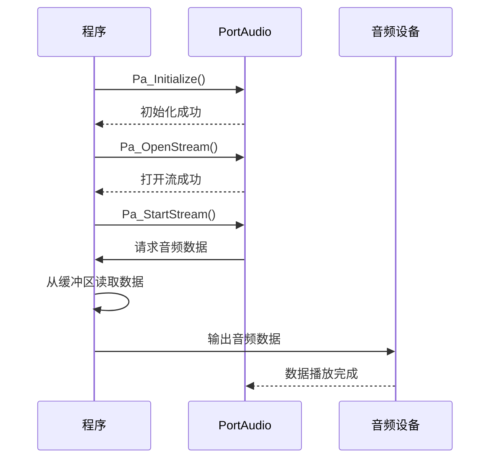
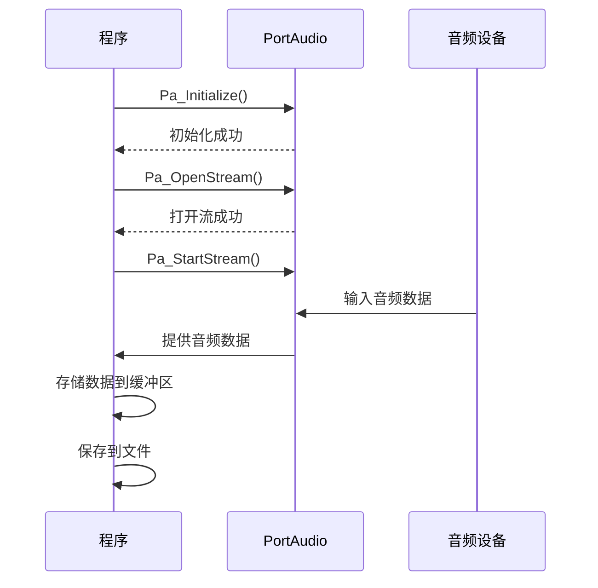
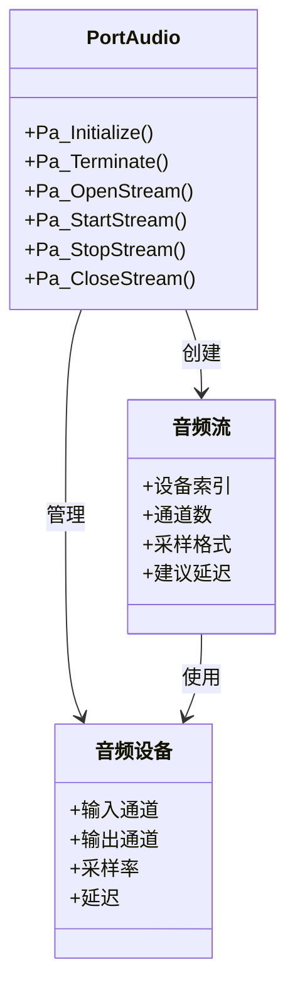
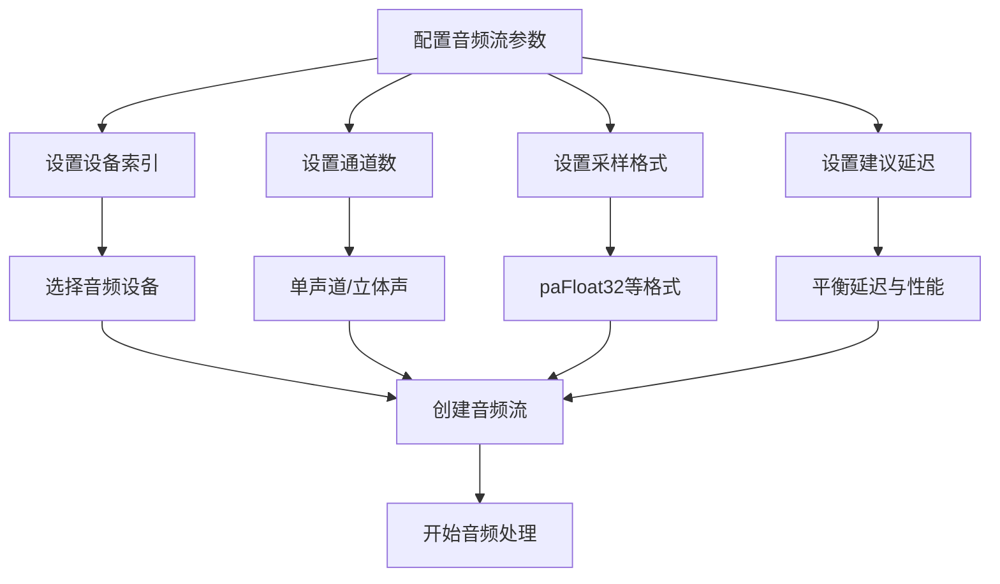
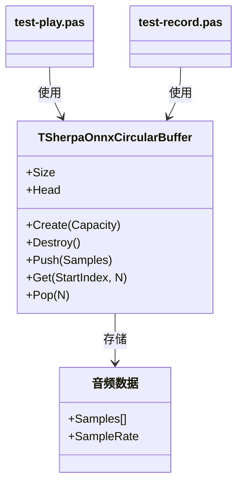

# PortAudio测试示例

<cite>
**本文档中引用的文件**  
- [test-play.pas](file://pascal-api-examples/portaudio-test/test-play.pas)
- [test-record.pas](file://pascal-api-examples/portaudio-test/test-record.pas)
- [portaudio.pas](file://sherpa-onnx/pascal-api/portaudio.pas)
- [sherpa_onnx.pas](file://sherpa-onnx/pascal-api/sherpa_onnx.pas)
</cite>

## 目录
1. [简介](#简介)
2. [项目结构](#项目结构)
3. [核心组件](#核心组件)
4. [音频播放示例分析](#音频播放示例分析)
5. [音频录音示例分析](#音频录音示例分析)
6. [PortAudio库集成](#portaudio库集成)
7. [音频流参数配置](#音频流参数配置)
8. [环形缓冲区机制](#环形缓冲区机制)
9. [开发语音应用中的作用](#开发语音应用中的作用)
10. [结论](#结论)

## 简介

PortAudio测试示例展示了如何在Pascal编程语言中使用PortAudio库实现音频播放和录音功能。这些示例为开发语音应用提供了基础支持，特别是在验证音频I/O设备兼容性和实现基本音频处理方面。通过分析test-play和test-record两个示例，我们可以深入了解如何配置音频流参数、管理音频缓冲区以及处理音频数据流。

**Section sources**
- [test-play.pas](file://pascal-api-examples/portaudio-test/test-play.pas)
- [test-record.pas](file://pascal-api-examples/portaudio-test/test-record.pas)

## 项目结构

PortAudio测试示例位于pascal-api-examples/portaudio-test目录下，包含两个主要的Pascal源文件：test-play.pas用于音频播放，test-record.pas用于音频录音。这些文件依赖于PortAudio库和Sherpa-onnx的Pascal API，通过调用底层音频接口实现音频数据的输入输出操作。

**Diagram sources**
- [test-play.pas](file://pascal-api-examples/portaudio-test/test-play.pas)
- [test-record.pas](file://pascal-api-examples/portaudio-test/test-record.pas)

**Section sources**
- [test-play.pas](file://pascal-api-examples/portaudio-test/test-play.pas)
- [test-record.pas](file://pascal-api-examples/portaudio-test/test-record.pas)

## 核心组件

PortAudio测试示例的核心组件包括音频流管理、环形缓冲区和回调函数机制。这些组件协同工作，实现了高效的音频数据处理。音频流管理负责与音频硬件的交互，环形缓冲区用于临时存储音频数据，而回调函数则在音频数据需要时被系统调用。

**Section sources**
- [portaudio.pas](file://sherpa-onnx/pascal-api/portaudio.pas)
- [sherpa_onnx.pas](file://sherpa-onnx/pascal-api/sherpa_onnx.pas)

## 音频播放示例分析

test-play.pas示例展示了如何使用PortAudio库播放音频文件。程序首先初始化PortAudio系统，然后打开默认输出设备，创建音频流并开始播放。播放过程中，程序通过回调函数从环形缓冲区读取音频数据并输出到音频设备。

**Diagram sources**
- [test-play.pas](file://pascal-api-examples/portaudio-test/test-play.pas)

**Section sources**
- [test-play.pas](file://pascal-api-examples/portaudio-test/test-play.pas)

## 音频录音示例分析

test-record.pas示例展示了如何使用PortAudio库录制音频。程序首先初始化PortAudio系统，然后打开默认输入设备，创建音频流并开始录音。录音过程中，程序通过回调函数接收来自音频设备的音频数据并存储到环形缓冲区中，最后将录制的数据保存到文件。

**Diagram sources**
- [test-record.pas](file://pascal-api-examples/portaudio-test/test-record.pas)

**Section sources**
- [test-record.pas](file://pascal-api-examples/portaudio-test/test-record.pas)

## PortAudio库集成

PortAudio库通过Pascal封装文件portaudio.pas与应用程序集成。该文件定义了PortAudio API的Pascal接口，包括设备管理、音频流操作和回调函数等。通过这些接口，Pascal程序可以跨平台地访问音频硬件，实现音频数据的输入输出。

**Diagram sources**
- [portaudio.pas](file://sherpa-onnx/pascal-api/portaudio.pas)

**Section sources**
- [portaudio.pas](file://sherpa-onnx/pascal-api/portaudio.pas)

## 音频流参数配置

音频流参数配置是实现高质量音频处理的关键。在PortAudio测试示例中，音频流参数包括设备索引、通道数、采样格式和建议延迟等。这些参数在创建音频流时指定，决定了音频数据的格式和处理方式。

**Diagram sources**
- [test-play.pas](file://pascal-api-examples/portaudio-test/test-play.pas)
- [test-record.pas](file://pascal-api-examples/portaudio-test/test-record.pas)

**Section sources**
- [test-play.pas](file://pascal-api-examples/portaudio-test/test-play.pas)
- [test-record.pas](file://pascal-api-examples/portaudio-test/test-record.pas)

## 环形缓冲区机制

环形缓冲区是PortAudio测试示例中的关键数据结构，用于高效管理音频数据。TSherpaOnnxCircularBuffer类提供了创建、读取、写入和清除缓冲区的方法。这种机制确保了音频数据的连续性和实时性，避免了数据丢失或中断。

**Diagram sources**
- [sherpa_onnx.pas](file://sherpa-onnx/pascal-api/sherpa_onnx.pas)

**Section sources**
- [sherpa_onnx.pas](file://sherpa-onnx/pascal-api/sherpa_onnx.pas)

## 开发语音应用中的作用

PortAudio测试示例在开发语音应用中具有重要作用。它们不仅验证了音频I/O设备的兼容性，还为更复杂的语音处理功能提供了基础支持。通过这些示例，开发者可以快速实现音频输入输出功能，为语音识别、语音合成等高级应用奠定基础。

**Section sources**
- [test-play.pas](file://pascal-api-examples/portaudio-test/test-play.pas)
- [test-record.pas](file://pascal-api-examples/portaudio-test/test-record.pas)

## 结论

PortAudio测试示例为Pascal开发者提供了实现音频播放和录音功能的完整解决方案。通过深入分析这些示例，我们可以掌握如何配置音频流参数、管理音频缓冲区以及处理音频数据流。这些知识对于开发高质量的语音应用至关重要，为实现更复杂的语音处理功能提供了坚实的基础。