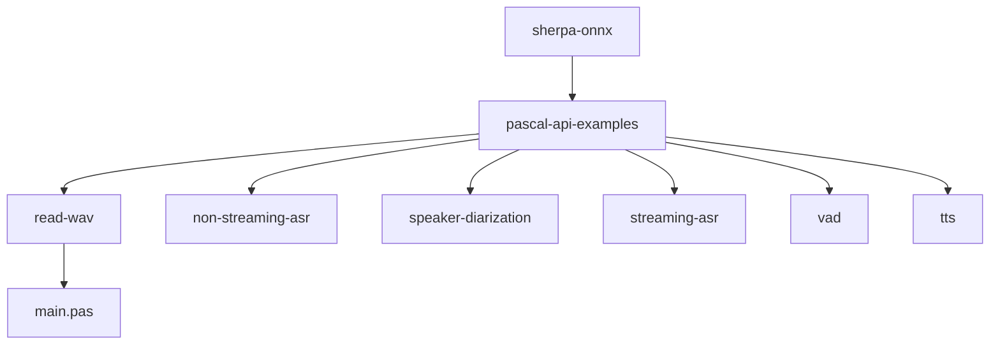
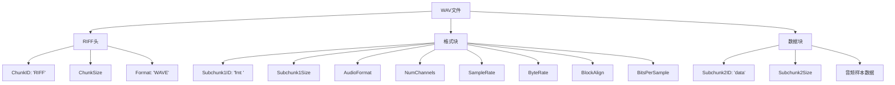
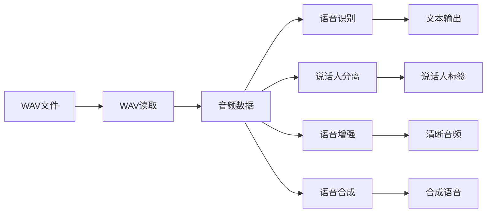

# WAV文件读取示例

<cite>
**本文档引用的文件**   
- [main.pas](file://pascal-api-examples/read-wav/main.pas)
- [sherpa_onnx.pas](file://sherpa-onnx/pascal-api/sherpa_onnx.pas)
- [wave-reader.cc](file://sherpa-onnx/csrc/wave-reader.cc)
- [wave-reader.h](file://sherpa-onnx/csrc/wave-reader.h)
- [c-api.cc](file://sherpa-onnx/c-api/c-api.cc)
</cite>

## 目录
1. [简介](#简介)
2. [项目结构](#项目结构)
3. [核心组件](#核心组件)
4. [WAV文件格式解析](#wav文件格式解析)
5. [Pascal API实现细节](#pascal-api实现细节)
6. [代码示例分析](#代码示例分析)
7. [离线语音处理中的作用](#离线语音处理中的作用)
8. [结论](#结论)

## 简介
本文档详细解析了sherpa-onnx Pascal API中WAV文件读取示例的实现方式。通过分析`main.pas`示例代码，深入探讨了如何使用Pascal语言读取标准WAV音频文件的头部信息和音频数据。文档将解释WAV文件格式的结构（包括RIFF头、格式块和数据块），说明如何解析采样率、位深度等元数据，以及如何将音频数据转换为适合语音处理模型输入的格式。该功能在离线语音处理任务中扮演着基础性角色。

**Section sources**
- [main.pas](file://pascal-api-examples/read-wav/main.pas)

## 项目结构
sherpa-onnx项目中的Pascal API示例位于`pascal-api-examples`目录下，其中`read-wav`子目录专门用于演示WAV文件读取功能。该目录结构清晰地组织了不同功能的示例代码，便于开发者快速找到相关实现。



**Diagram sources **
- [main.pas](file://pascal-api-examples/read-wav/main.pas)

**Section sources**
- [main.pas](file://pascal-api-examples/read-wav/main.pas)

## 核心组件
WAV文件读取功能的核心组件包括Pascal API接口、C API实现以及底层的WAV文件解析逻辑。这些组件协同工作，实现了从文件读取到数据准备的完整流程。

**Section sources**
- [sherpa_onnx.pas](file://sherpa-onnx/pascal-api/sherpa_onnx.pas)
- [c-api.cc](file://sherpa-onnx/c-api/c-api.cc)
- [wave-reader.cc](file://sherpa-onnx/csrc/wave-reader.cc)

## WAV文件格式解析
WAV文件是一种基于RIFF（Resource Interchange File Format）标准的音频文件格式。其结构由多个块（chunk）组成，主要包括RIFF头、格式块（fmt chunk）和数据块（data chunk）。



**Diagram sources **
- [wave-reader.cc](file://sherpa-onnx/csrc/wave-reader.cc)
- [wave-reader.h](file://sherpa-onnx/csrc/wave-reader.h)

**Section sources**
- [wave-reader.cc](file://sherpa-onnx/csrc/wave-reader.cc)
- [wave-reader.h](file://sherpa-onnx/csrc/wave-reader.h)

## Pascal API实现细节
Pascal API通过`TSherpaOnnxWave`记录类型和`SherpaOnnxReadWave`函数提供了WAV文件读取功能。该实现封装了底层C API的复杂性，为Pascal开发者提供了简洁的接口。

### 数据结构定义
```pascal
TSherpaOnnxWave = record
  Samples: array of Single; { 归一化到[-1, 1]范围 }
  SampleRate: Integer;
end;
```

### WAV读取函数
`SherpaOnnxReadWave`函数负责读取WAV文件并返回包含音频数据和采样率的`TSherpaOnnxWave`记录。该函数内部调用C API的`SherpaOnnxReadWaveWrapper`，并处理内存管理和数据转换。

**Section sources**
- [sherpa_onnx.pas](file://sherpa-onnx/pascal-api/sherpa_onnx.pas)

## 代码示例分析
`main.pas`示例展示了如何使用Pascal API读取WAV文件并处理音频数据。

```pascal
program main;

{$mode objfpc}

uses
  sherpa_onnx;

var
  Wave: TSherpaOnnxWave;
  S: Single;
  I: Integer;
begin
  Wave := SherpaOnnxReadWave('./lei-jun-test.wav');
  WriteLn('info ', Wave.SampleRate, ' ', Length(Wave.Samples));
  S := 0;
  for i := Low(Wave.Samples) to High(Wave.Samples) do
    S += Wave.Samples[i];

  WriteLn('sum is ', S);
end.
```

该示例首先调用`SherpaOnnxReadWave`读取指定的WAV文件，然后输出采样率和样本数量信息。接着，它计算所有音频样本的总和，演示了如何访问和处理音频数据。

**Section sources**
- [main.pas](file://pascal-api-examples/read-wav/main.pas)

## 离线语音处理中的作用
WAV文件读取功能在离线语音处理任务中扮演着基础性角色。它为语音识别、说话人分离、语音增强等高级功能提供了必要的输入数据准备。



**Diagram sources **
- [main.pas](file://pascal-api-examples/read-wav/main.pas)
- [sherpa_onnx.pas](file://sherpa-onnx/pascal-api/sherpa_onnx.pas)

**Section sources**
- [main.pas](file://pascal-api-examples/read-wav/main.pas)

## 结论
sherpa-onnx Pascal API的WAV文件读取示例提供了一个简洁而强大的接口，用于处理标准WAV音频文件。通过深入理解WAV文件格式的结构和Pascal API的实现细节，开发者可以有效地将音频数据集成到各种语音处理应用中。该功能作为离线语音处理的基础组件，为更复杂的语音分析任务提供了可靠的数据输入支持。