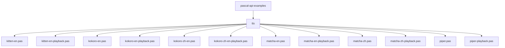
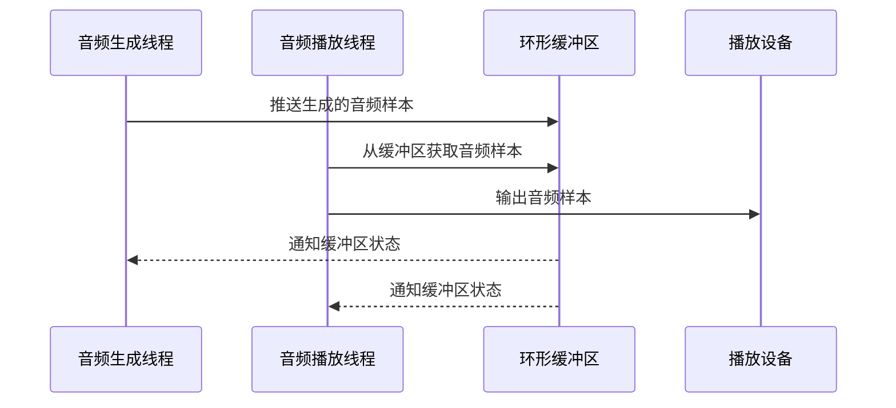

# 语音合成示例

<cite>
**本文档中引用的文件**  
- [kitten-en.pas](file://pascal-api-examples/tts/kitten-en.pas)
- [kitten-en-playback.pas](file://pascal-api-examples/tts/kitten-en-playback.pas)
- [kokoro-en.pas](file://pascal-api-examples/tts/kokoro-en.pas)
- [kokoro-en-playback.pas](file://pascal-api-examples/tts/kokoro-en-playback.pas)
- [kokoro-zh-en.pas](file://pascal-api-examples/tts/kokoro-zh-en.pas)
- [kokoro-zh-en-playback.pas](file://pascal-api-examples/tts/kokoro-zh-en-playback.pas)
- [matcha-en.pas](file://pascal-api-examples/tts/matcha-en.pas)
- [matcha-en-playback.pas](file://pascal-api-examples/tts/matcha-en-playback.pas)
- [matcha-zh.pas](file://pascal-api-examples/tts/matcha-zh.pas)
- [matcha-zh-playback.pas](file://pascal-api-examples/tts/matcha-zh-playback.pas)
- [piper.pas](file://pascal-api-examples/tts/piper.pas)
- [piper-playback.pas](file://pascal-api-examples/tts/piper-playback.pas)
- [README.md](file://pascal-api-examples/tts/README.md)
</cite>

## 目录
1. [简介](#简介)
2. [项目结构](#项目结构)
3. [核心组件](#核心组件)
4. [TTS引擎配置](#tts引擎配置)
5. [纯合成示例](#纯合成示例)
6. [带播放功能的示例](#带播放功能的示例)
7. [多语言合成](#多语言合成)
8. [语音参数控制](#语音参数控制)
9. [音频数据处理](#音频数据处理)
10. [依赖与集成](#依赖与集成)

## 简介

本文档详细介绍了sherpa-onnx项目中Pascal API语音合成示例的使用方法。文档系统性地介绍了kitten、kokoro、matcha、piper等TTS引擎在Pascal中的使用方法，包括如何配置TTS模型、输入文本、生成音频波形以及处理合成后的音频数据。文档还区分了纯合成示例和带播放功能的示例，解释了如何集成音频播放库，并展示了不同语言（英语、中文）和多语言混合合成的实现方式，以及语音风格和语速的控制参数。

**Section sources**
- [README.md](file://pascal-api-examples/README.md#L1-L19)

## 项目结构

Pascal API示例位于`pascal-api-examples`目录下，其中TTS相关的示例位于`pascal-api-examples/tts`子目录中。每个TTS引擎都有对应的纯合成示例和带播放功能的示例。



**Diagram sources**
- [README.md](file://pascal-api-examples/README.md#L1-L19)

**Section sources**
- [README.md](file://pascal-api-examples/README.md#L1-L19)

## 核心组件

Pascal API语音合成示例的核心组件包括TTS引擎配置、文本输入、音频生成和音频播放。这些组件通过Pascal语言的面向对象特性进行封装和组织。

**Section sources**
- [kitten-en.pas](file://pascal-api-examples/tts/kitten-en.pas#L1-L56)
- [kokoro-en.pas](file://pascal-api-examples/tts/kokoro-en.pas#L1-L56)
- [matcha-en.pas](file://pascal-api-examples/tts/matcha-en.pas#L1-L56)
- [piper.pas](file://pascal-api-examples/tts/piper.pas#L1-L55)

## TTS引擎配置

TTS引擎的配置通过`TSherpaOnnxOfflineTtsConfig`结构体完成，不同引擎的配置参数有所不同。

### Kitten引擎配置

Kitten引擎的配置需要指定模型文件、语音文件、标记文件和espeak-ng数据目录。

```pascal
Config.Model.Kitten.Model := './kitten-nano-en-v0_1-fp16/model.fp16.onnx';
Config.Model.Kitten.Voices := './kitten-nano-en-v0_1-fp16/voices.bin';
Config.Model.Kitten.Tokens := './kitten-nano-en-v0_1-fp16/tokens.txt';
Config.Model.Kitten.DataDir := './kitten-nano-en-v0_1-fp16/espeak-ng-data';
```

**Section sources**
- [kitten-en.pas](file://pascal-api-examples/tts/kitten-en.pas#L23-L27)

### Kokoro引擎配置

Kokoro引擎的配置需要指定模型文件、语音文件、标记文件、espeak-ng数据目录、字典目录和词典文件。

```pascal
Config.Model.Kokoro.Model := './kokoro-multi-lang-v1_0/model.onnx';
Config.Model.Kokoro.Voices := './kokoro-multi-lang-v1_0/voices.bin';
Config.Model.Kokoro.Tokens := './kokoro-multi-lang-v1_0/tokens.txt';
Config.Model.Kokoro.DataDir := './kokoro-multi-lang-v1_0/espeak-ng-data';
Config.Model.Kokoro.DictDir := './kokoro-multi-lang-v1_0/dict';
Config.Model.Kokoro.Lexicon := './kokoro-multi-lang-v1_0/lexicon-us-en.txt,./kokoro-multi-lang-v1_0/lexicon-zh.txt';
```

**Section sources**
- [kokoro-zh-en.pas](file://pascal-api-examples/tts/kokoro-zh-en.pas#L23-L29)

### Matcha引擎配置

Matcha引擎的配置需要指定声学模型文件、声码器文件、标记文件、espeak-ng数据目录和规则FST文件。

```pascal
Config.Model.Matcha.AcousticModel := './matcha-icefall-zh-baker/model-steps-3.onnx';
Config.Model.Matcha.Vocoder := './vocos-22khz-univ.onnx';
Config.Model.Matcha.Lexicon := './matcha-icefall-zh-baker/lexicon.txt';
Config.Model.Matcha.Tokens := './matcha-icefall-zh-baker/tokens.txt';
Config.Model.Matcha.DictDir := './matcha-icefall-zh-baker/dict';
Config.RuleFsts := './matcha-icefall-zh-baker/phone.fst,./matcha-icefall-zh-baker/date.fst,./matcha-icefall-zh-baker/number.fst';
```

**Section sources**
- [matcha-zh.pas](file://pascal-api-examples/tts/matcha-zh.pas#L23-L30)

### Piper引擎配置

Piper引擎的配置需要指定VITS模型文件、标记文件和espeak-ng数据目录。

```pascal
Config.Model.Vits.Model := './vits-piper-en_US-libritts_r-medium/en_US-libritts_r-medium.onnx';
Config.Model.Vits.Tokens := './vits-piper-en_US-libritts_r-medium/tokens.txt';
Config.Model.Vits.DataDir := './vits-piper-en_US-libritts_r-medium/espeak-ng-data';
```

**Section sources**
- [piper.pas](file://pascal-api-examples/tts/piper.pas#L23-L26)

## 纯合成示例

纯合成示例仅生成音频文件并保存到磁盘，不进行实时播放。

### Kitten纯合成示例

Kitten纯合成示例通过`Tts.Generate`方法生成音频，并使用`SherpaOnnxWriteWave`函数将音频保存为WAV文件。

```pascal
Audio := Tts.Generate(Text, SpeakerId, Speed);
SherpaOnnxWriteWave('./kitten-en-0.wav', Audio.Samples, Audio.SampleRate);
```

**Section sources**
- [kitten-en.pas](file://pascal-api-examples/tts/kitten-en.pas#L49-L51)

### Kokoro纯合成示例

Kokoro纯合成示例的实现方式与Kitten类似，通过`Tts.Generate`方法生成音频并保存。

```pascal
Audio := Tts.Generate(Text, SpeakerId, Speed);
SherpaOnnxWriteWave('./kokoro-en-8.wav', Audio.Samples, Audio.SampleRate);
```

**Section sources**
- [kokoro-en.pas](file://pascal-api-examples/tts/kokoro-en.pas#L49-L51)

### Matcha纯合成示例

Matcha纯合成示例同样使用`Tts.Generate`方法生成音频并保存。

```pascal
Audio := Tts.Generate(Text, SpeakerId, Speed);
SherpaOnnxWriteWave('./matcha-en.wav', Audio.Samples, Audio.SampleRate);
```

**Section sources**
- [matcha-en.pas](file://pascal-api-examples/tts/matcha-en.pas#L49-L51)

### Piper纯合成示例

Piper纯合成示例的实现方式与其他引擎一致。

```pascal
Audio := Tts.Generate(Text, SpeakerId, Speed);
SherpaOnnxWriteWave('./libritts_r-generated.wav', Audio.Samples, Audio.SampleRate);
```

**Section sources**
- [piper.pas](file://pascal-api-examples/tts/piper.pas#L48-L50)

## 带播放功能的示例

带播放功能的示例在生成音频的同时进行实时播放，使用PortAudio库处理音频播放。

### 音频播放架构

带播放功能的示例使用双线程架构：一个线程生成音频，另一个线程播放音频。两个线程通过环形缓冲区进行通信。



**Diagram sources**
- [kitten-en-playback.pas](file://pascal-api-examples/tts/kitten-en-playback.pas#L54-L71)
- [kitten-en-playback.pas](file://pascal-api-examples/tts/kitten-en-playback.pas#L72-L111)

**Section sources**
- [kitten-en-playback.pas](file://pascal-api-examples/tts/kitten-en-playback.pas#L24-L238)

### 生成回调函数

生成回调函数在音频生成过程中被调用，将生成的音频样本推送到环形缓冲区。

```pascal
function GenerateCallback(Samples: pcfloat; N: cint32; Arg: Pointer): cint; cdecl;
begin
  EnterCriticalSection(CriticalSection);
  try
    if Resampler <> nil then
      Buffer.Push(Resampler.Resample(Samples, N, False))
    else
      Buffer.Push(Samples, N);
  finally
    LeaveCriticalSection(CriticalSection);
  end;
  Result := 1;
end;
```

**Section sources**
- [kitten-en-playback.pas](file://pascal-api-examples/tts/kitten-en-playback.pas#L54-L71)

### 播放回调函数

播放回调函数由PortAudio在需要更多音频数据时调用，从环形缓冲区获取音频样本并输出。

```pascal
function PlayCallback(input: Pointer; output: Pointer; frameCount: culong; 
                    timeInfo: PPaStreamCallbackTimeInfo; statusFlags: TPaStreamCallbackFlags; 
                    userData: Pointer): cint; cdecl;
begin
  EnterCriticalSection(CriticalSection);
  try
    if Buffer.Size >= frameCount then
    begin
      Samples := Buffer.Get(Buffer.Head, FrameCount);
      Buffer.Pop(FrameCount);
    end
    else if Buffer.Size > 0 then
    begin
      Samples := Buffer.Get(Buffer.Head, Buffer.Size);
      Buffer.Pop(Buffer.Size);
      SetLength(Samples, frameCount);
    end
    else
      SetLength(Samples, frameCount);
    
    for I := 0 to frameCount - 1 do
      pcfloat(output)[I] := Samples[I];
    
    if (Buffer.Size > 0) or (not FinishedGeneration) then
      Result := paContinue
    else
    begin
      Result := paComplete;
      FinishedPlaying := True;
    end;
  finally
    LeaveCriticalSection(CriticalSection);
  end;
end;
```

**Section sources**
- [kitten-en-playback.pas](file://pascal-api-examples/tts/kitten-en-playback.pas#L72-L111)

### PortAudio初始化

PortAudio的初始化包括初始化库、打开音频流和启动流。

```pascal
Status := Pa_Initialize;
if Status <> paNoError then
begin
  WriteLn('Failed to initialize portaudio, ', Pa_GetErrorText(Status));
  Exit;
end;

Status := Pa_OpenStream(stream, nil, @Param, DeviceSampleRate, paFramesPerBufferUnspecified, paNoFlag,
  PPaStreamCallback(@PlayCallback), nil);

Status := Pa_StartStream(stream);
```

**Section sources**
- [kitten-en-playback.pas](file://pascal-api-examples/tts/kitten-en-playback.pas#L135-L205)

## 多语言合成

sherpa-onnx支持多种语言的语音合成，包括英语、中文以及中英文混合合成。

### 英语合成

英语合成使用专门的英语模型，如Kitten和Kokoro的英语模型。

```pascal
Text := 'Friends fell out often because life was changing so fast. The easiest thing in the world was to lose touch with someone.';
```

**Section sources**
- [kitten-en.pas](file://pascal-api-examples/tts/kitten-en.pas#L47)
- [kokoro-en.pas](file://pascal-api-examples/tts/kokoro-en.pas#L47)

### 中文合成

中文合成使用专门的中文模型，如Matcha的中文模型。

```pascal
Text := '某某银行的副行长和一些行政领导表示，他们去过长江和长白山; 经济不断增长。2024年12月31号，拨打110或者18920240511。123456块钱。';
```

**Section sources**
- [matcha-zh.pas](file://pascal-api-examples/tts/matcha-zh.pas#L49)

### 中英文混合合成

中英文混合合成使用支持多语言的模型，如Kokoro的多语言模型。

```pascal
Text := '中英文语音合成测试。This is generated by next generation Kaldi using Kokoro without Misaki. 你觉得中英文说的如何呢？';
```

**Section sources**
- [kokoro-zh-en.pas](file://pascal-api-examples/tts/kokoro-zh-en.pas#L49)

## 语音参数控制

语音合成过程中可以控制多种参数，包括语速、说话人ID等。

### 语速控制

语速通过Speed参数控制，值越大语速越快。

```pascal
Speed: Single = 1.0;  {使用更大的值来加快语速}
```

**Section sources**
- [kitten-en.pas](file://pascal-api-examples/tts/kitten-en.pas#L39)

### 说话人ID控制

不同的说话人ID对应不同的语音风格和音色。

```pascal
SpeakerId: Integer = 8;  {Kokoro引擎使用说话人ID 8}
```

**Section sources**
- [kokoro-en.pas](file://pascal-api-examples/tts/kokoro-en.pas#L40)

### 获取说话人数量

可以通过`GetNumSpeakers`方法获取当前模型支持的说话人数量。

```pascal
WriteLn('There are ', Tts.GetNumSpeakers, ' speakers');
```

**Section sources**
- [kitten-en.pas](file://pascal-api-examples/tts/kitten-en.pas#L45)
- [kokoro-en.pas](file://pascal-api-examples/tts/kokoro-en.pas#L45)

## 音频数据处理

音频数据处理包括音频样本的生成、重采样和缓冲。

### 环形缓冲区

环形缓冲区用于在音频生成和播放线程之间传递音频数据。

```pascal
Buffer := TSherpaOnnxCircularBuffer.Create(30 * DeviceSampleRate);
```

**Section sources**
- [kitten-en-playback.pas](file://pascal-api-examples/tts/kitten-en-playback.pas#L182)

### 重采样器

当TTS模型的采样率与播放设备的采样率不匹配时，需要使用重采样器。

```pascal
if Tts.GetSampleRate <> DeviceSampleRate then
  Resampler := TSherpaOnnxLinearResampler.Create(Tts.GetSampleRate, DeviceSampleRate);
```

**Section sources**
- [kitten-en-playback.pas](file://pascal-api-examples/tts/kitten-en-playback.pas#L130-L131)

### 音频写入

生成的音频可以使用`SherpaOnnxWriteWave`函数写入WAV文件。

```pascal
SherpaOnnxWriteWave('./kitten-en-0.wav', Audio.Samples, Audio.SampleRate);
```

**Section sources**
- [kitten-en.pas](file://pascal-api-examples/tts/kitten-en.pas#L50)

## 依赖与集成

Pascal API语音合成示例依赖于多个库和组件。

### 主要依赖

- `sherpa_onnx`: sherpa-onnx的Pascal API
- `portaudio`: 音频播放库
- `SysUtils`: 系统工具库

```pascal
uses
  {$ifdef unix}
  cthreads,
  {$endif}
  SysUtils,
  dos,
  ctypes,
  portaudio,
  sherpa_onnx;
```

**Section sources**
- [kitten-en-playback.pas](file://pascal-api-examples/tts/kitten-en-playback.pas#L14-L22)

### 线程安全

由于音频生成和播放在不同线程中进行，需要使用临界区来保证线程安全。

```pascal
var
  CriticalSection: TRTLCriticalSection;

InitCriticalSection(CriticalSection);
EnterCriticalSection(CriticalSection);
LeaveCriticalSection(CriticalSection);
DoneCriticalSection(CriticalSection);
```

**Section sources**
- [kitten-en-playback.pas](file://pascal-api-examples/tts/kitten-en-playback.pas#L25)
- [kitten-en-playback.pas](file://pascal-api-examples/tts/kitten-en-playback.pas#L196)
- [kitten-en-playback.pas](file://pascal-api-examples/tts/kitten-en-playback.pas#L58-L65)
- [kitten-en-playback.pas](file://pascal-api-examples/tts/kitten-en-playback.pas#L82-L109)
- [kitten-en-playback.pas](file://pascal-api-examples/tts/kitten-en-playback.pas#L220)