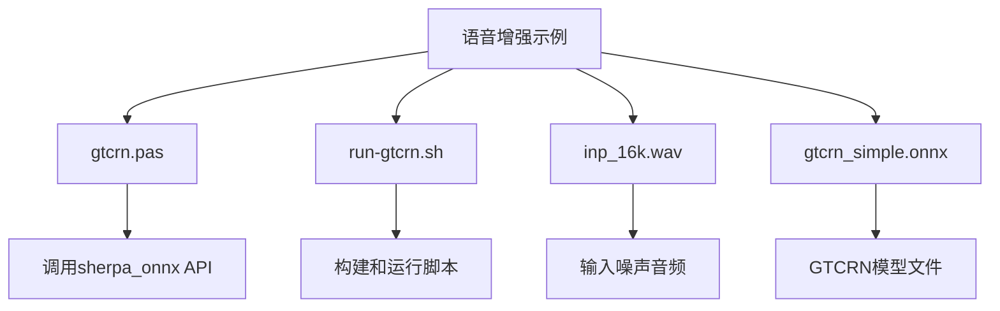
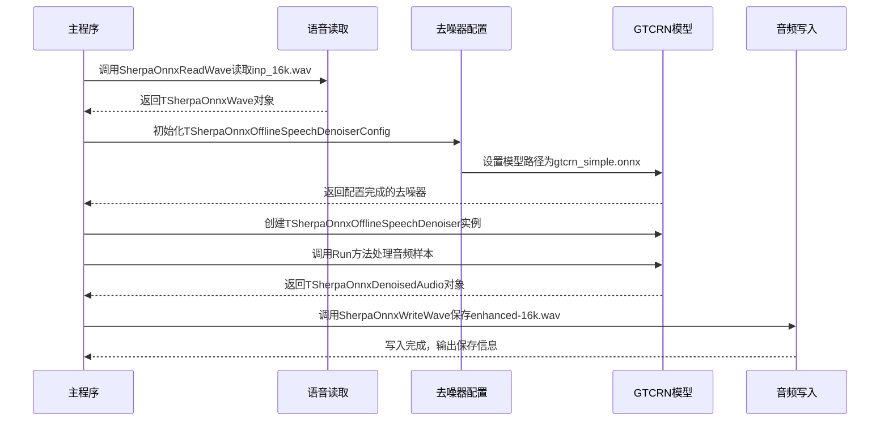
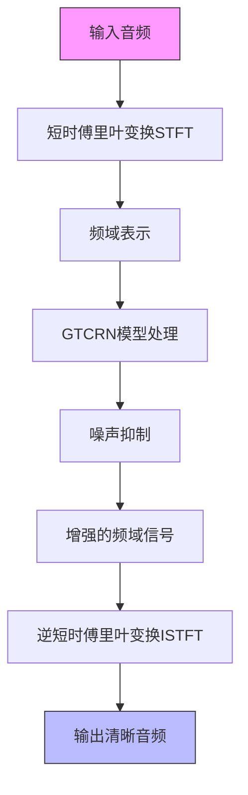
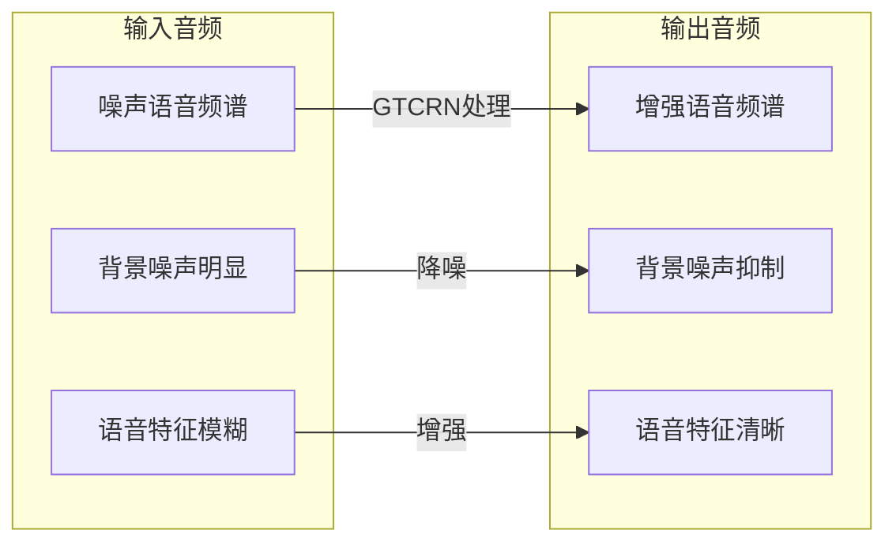

# 语音增强示例

<cite>
**本文档引用的文件**   
- [gtcrn.pas](file://pascal-api-examples/speech-enhancement-gtcrn/gtcrn.pas)
- [run-gtcrn.sh](file://pascal-api-examples/speech-enhancement-gtcrn/run-gtcrn.sh)
- [sherpa_onnx.pas](file://sherpa-onnx/pascal-api/sherpa_onnx.pas)
- [offline-speech-denoiser-gtcrn-impl.h](file://sherpa-onnx/csrc/offline-speech-denoiser-gtcrn-impl.h)
- [offline-speech-denoiser.h](file://sherpa-onnx/csrc/offline-speech-denoiser.h)
- [offline-speech-denoiser-gtcrn-model.h](file://sherpa-onnx/csrc/offline-speech-denoiser-gtcrn-model.h)
- [offline-speech-denoiser-gtcrn-model-meta-data.h](file://sherpa-onnx/csrc/offline-speech-denoiser-gtcrn-model-meta-data.h)
</cite>

## 目录
1. [简介](#简介)
2. [项目结构](#项目结构)
3. [核心组件](#核心组件)
4. [语音增强实现机制](#语音增强实现机制)
5. [GTCRN模型处理流程](#gtcrn模型处理流程)
6. [输入输出音频对比分析](#输入输出音频对比分析)
7. [实际应用价值](#实际应用价值)

## 简介
本示例展示了如何使用sherpa-onnx的Pascal API实现语音增强功能，特别是利用GTCRN（Gated Temporal Convolutional Recurrent Network）模型对带噪声的语音信号进行降噪处理。该示例通过加载预训练的GTCRN模型，对输入的噪声语音进行处理，生成清晰的输出语音，从而提升语音质量。

## 项目结构
语音增强示例位于`pascal-api-examples/speech-enhancement-gtcrn/`目录下，包含Pascal源代码文件和运行脚本。该示例展示了如何使用离线语音去噪器对音频文件进行处理。

**图示来源**
- [gtcrn.pas](file://pascal-api-examples/speech-enhancement-gtcrn/gtcrn.pas)
- [run-gtcrn.sh](file://pascal-api-examples/speech-enhancement-gtcrn/run-gtcrn.sh)

**本节来源**
- [gtcrn.pas](file://pascal-api-examples/speech-enhancement-gtcrn/gtcrn.pas)
- [run-gtcrn.sh](file://pascal-api-examples/speech-enhancement-gtcrn/run-gtcrn.sh)

## 核心组件
本示例的核心组件包括语音增强配置、离线语音去噪器和去噪后的音频数据结构。通过Pascal API提供的接口，实现了从噪声语音到清晰语音的转换过程。

**本节来源**
- [sherpa_onnx.pas](file://sherpa-onnx/pascal-api/sherpa_onnx.pas)
- [gtcrn.pas](file://pascal-api-examples/speech-enhancement-gtcrn/gtcrn.pas)

## 语音增强实现机制
GTCRN语音增强示例通过一系列步骤实现噪声语音的增强和降噪。首先，程序读取输入的噪声音频文件，然后加载GTCRN模型配置，创建离线语音去噪器实例，最后对音频进行处理并保存增强后的结果。

**图示来源**
- [gtcrn.pas](file://pascal-api-examples/speech-enhancement-gtcrn/gtcrn.pas)
- [offline-speech-denoiser.h](file://sherpa-onnx/csrc/offline-speech-denoiser.h)

**本节来源**
- [gtcrn.pas](file://pascal-api-examples/speech-enhancement-gtcrn/gtcrn.pas)
- [sherpa_onnx.pas](file://sherpa-onnx/pascal-api/sherpa_onnx.pas)

## GTCRN模型处理流程
GTCRN模型的处理流程基于短时傅里叶变换（STFT）和逆短时傅里叶变换（ISTFT）技术。模型首先将输入的时域音频信号转换为频域表示，然后通过GTCRN网络进行噪声抑制，最后将处理后的频域信号转换回时域，生成清晰的语音输出。

**图示来源**
- [offline-speech-denoiser-gtcrn-impl.h](file://sherpa-onnx/csrc/offline-speech-denoiser-gtcrn-impl.h)
- [offline-speech-denoiser-gtcrn-model-meta-data.h](file://sherpa-onnx/csrc/offline-speech-denoiser-gtcrn-model-meta-data.h)

**本节来源**
- [offline-speech-denoiser-gtcrn-impl.h](file://sherpa-onnx/csrc/offline-speech-denoiser-gtcrn-impl.h)
- [offline-speech-denoiser-gtcrn-model.h](file://sherpa-onnx/csrc/offline-speech-denoiser-gtcrn-model.h)

## 输入输出音频对比分析
为了评估语音增强效果，可以通过对比输入噪声音频和输出增强音频的频谱特征来进行分析。通常，增强后的音频在频谱上会显示出更清晰的语音特征，噪声成分被有效抑制，语音的可懂度和质量得到显著提升。

**图示来源**
- [offline-speech-denoiser-gtcrn-impl.h](file://sherpa-onnx/csrc/offline-speech-denoiser-gtcrn-impl.h)
- [offline-speech-denoiser.h](file://sherpa-onnx/csrc/offline-speech-denoiser.h)

**本节来源**
- [gtcrn.pas](file://pascal-api-examples/speech-enhancement-gtcrn/gtcrn.pas)
- [offline-speech-denoiser-gtcrn-impl.h](file://sherpa-onnx/csrc/offline-speech-denoiser-gtcrn-impl.h)

## 实际应用价值
语音增强技术在实际应用中具有重要价值，特别是在提升自动语音识别（ASR）系统的前端处理质量方面。通过使用GTCRN等先进模型对输入语音进行预处理，可以显著提高ASR系统在噪声环境下的识别准确率，从而改善用户体验。

**本节来源**
- [gtcrn.pas](file://pascal-api-examples/speech-enhancement-gtcrn/gtcrn.pas)
- [offline-speech-denoiser-gtcrn-impl.h](file://sherpa-onnx/csrc/offline-speech-denoiser-gtcrn-impl.h)