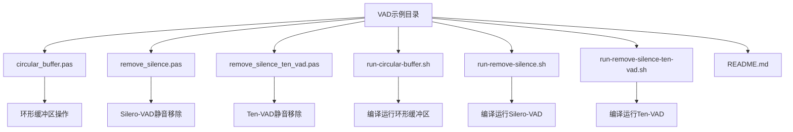
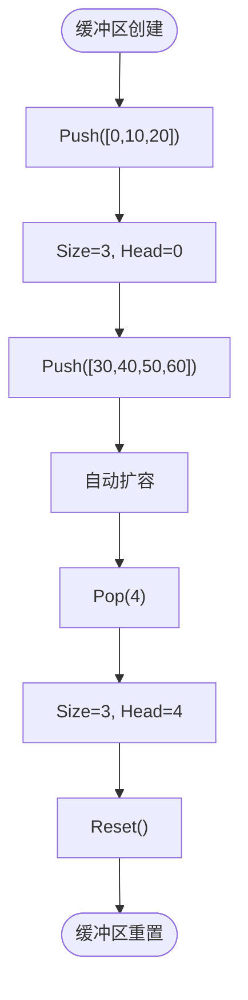
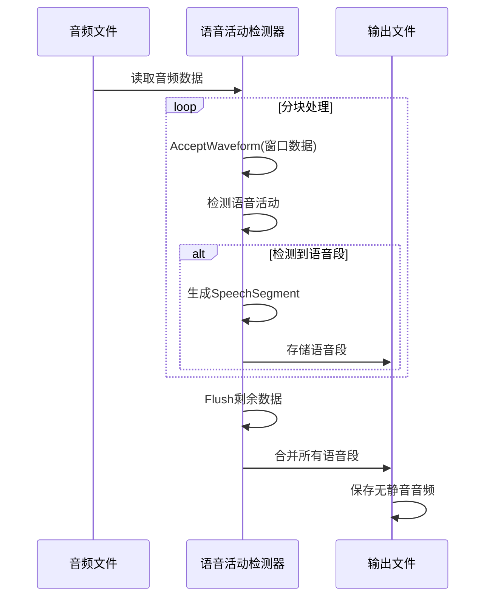
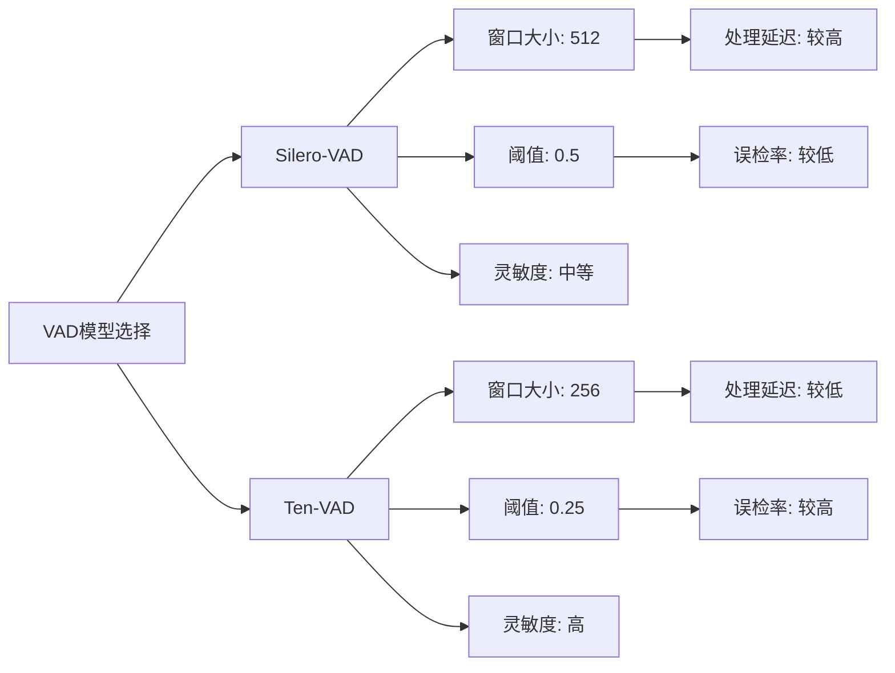
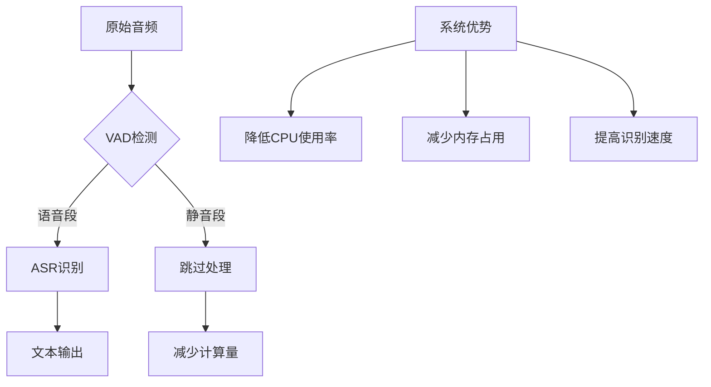
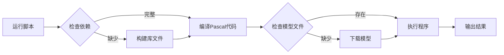

# 语音活动检测示例

<cite>
**本文档引用的文件**
- [circular_buffer.pas](file://pascal-api-examples/vad/circular_buffer.pas)
- [remove_silence.pas](file://pascal-api-examples/vad/remove_silence.pas)
- [remove_silence_ten_vad.pas](file://pascal-api-examples/vad/remove_silence_ten_vad.pas)
- [sherpa_onnx.pas](file://sherpa-onnx/pascal-api/sherpa_onnx.pas)
- [run-circular-buffer.sh](file://pascal-api-examples/vad/run-circular-buffer.sh)
- [run-remove-silence.sh](file://pascal-api-examples/vad/run-remove-silence.sh)
- [run-remove-silence-ten-vad.sh](file://pascal-api-examples/vad/run-remove-silence-ten-vad.sh)
</cite>

## 目录
1. [项目结构](#项目结构)
2. [环形缓冲区实现原理](#环形缓冲区实现原理)
3. [语音活动检测核心功能](#语音活动检测核心功能)
4. [Silero-VAD与Ten-VAD对比分析](#silero-vad与ten-vad对比分析)
5. [VAD与ASR集成应用](#vad与asr集成应用)
6. [性能优化与参数调优](#性能优化与参数调优)

## 项目结构

**图示来源**
- [circular_buffer.pas](file://pascal-api-examples/vad/circular_buffer.pas)
- [remove_silence.pas](file://pascal-api-examples/vad/remove_silence.pas)
- [remove_silence_ten_vad.pas](file://pascal-api-examples/vad/remove_silence_ten_vad.pas)
- [run-circular-buffer.sh](file://pascal-api-examples/vad/run-circular-buffer.sh)
- [run-remove-silence.sh](file://pascal-api-examples/vad/run-remove-silence.sh)
- [run-remove-silence-ten-vad.sh](file://pascal-api-examples/vad/run-remove-silence-ten-vad.sh)

**本节来源**
- [README.md](file://pascal-api-examples/vad/README.md)

## 环形缓冲区实现原理

`circular_buffer.pas`示例展示了Sherpa-ONNX中环形缓冲区的使用方法。该数据结构在实时音频处理中至关重要，能够高效管理音频数据流。

环形缓冲区的核心特性包括：
- **自动扩容**：初始容量为5，当数据量超过容量时会自动调整大小
- **头部指针**：`Head`属性指向缓冲区起始位置，即使超过容量也不会重置
- **高效操作**：`Push`、`Pop`和`Get`操作的时间复杂度均为O(1)

在实时音频处理场景中，环形缓冲区的优势体现在：
1. **内存效率**：避免频繁的内存分配和释放
2. **低延迟**：支持连续的数据流处理
3. **线程安全**：适合多线程环境下的音频数据交换

**图示来源**
- [circular_buffer.pas](file://pascal-api-examples/vad/circular_buffer.pas)

**本节来源**
- [circular_buffer.pas](file://pascal-api-examples/vad/circular_buffer.pas)

## 语音活动检测核心功能

`remove_silence.pas`和`remove_silence_ten_vad.pas`示例展示了如何使用VAD（语音活动检测）功能从音频文件中移除静音部分。

### VAD工作流程

**图示来源**
- [remove_silence.pas](file://pascal-api-examples/vad/remove_silence.pas)
- [remove_silence_ten_vad.pas](file://pascal-api-examples/vad/remove_silence_ten_vad.pas)

### 核心组件分析

**TSherpaOnnxVoiceActivityDetector类**提供以下关键方法：
- `AcceptWaveform`：接受音频波形数据进行处理
- `IsEmpty`：检查是否有待处理的语音段
- `Front`：获取最前面的语音段
- `Pop`：移除已处理的语音段
- `Flush`：强制处理剩余数据

**TSherpaOnnxSpeechSegment结构体**包含：
- `Start`：语音段起始位置（采样点）
- `Samples`：语音段音频数据

**本节来源**
- [remove_silence.pas](file://pascal-api-examples/vad/remove_silence.pas)
- [remove_silence_ten_vad.pas](file://pascal-api-examples/vad/remove_silence_ten_vad.pas)
- [sherpa_onnx.pas](file://sherpa-onnx/pascal-api/sherpa_onnx.pas)

## Silero-VAD与Ten-VAD对比分析

两种VAD模型在配置参数上存在显著差异：

| 参数 | Silero-VAD | Ten-VAD |
|------|----------|--------|
| **模型文件** | silero_vad.onnx | ten-vad.onnx |
| **窗口大小** | 512 | 256 |
| **阈值** | 0.5 | 0.25 |
| **最小语音时长** | 0.25秒 | 0.25秒 |
| **最小静音时长** | 0.5秒 | 0.5秒 |

**图示来源**
- [remove_silence.pas](file://pascal-api-examples/vad/remove_silence.pas)
- [remove_silence_ten_vad.pas](file://pascal-api-examples/vad/remove_silence_ten_vad.pas)

**本节来源**
- [remove_silence.pas](file://pascal-api-examples/vad/remove_silence.pas)
- [remove_silence_ten_vad.pas](file://pascal-api-examples/vad/remove_silence_ten_vad.pas)

## VAD与ASR集成应用

语音活动检测可以与自动语音识别（ASR）系统结合使用，提高整体处理效率：

**图示来源**
- [remove_silence.pas](file://pascal-api-examples/vad/remove_silence.pas)

**本节来源**
- [remove_silence.pas](file://pascal-api-examples/vad/remove_silence.pas)

## 性能优化与参数调优

### 关键参数调整

**阈值设置**：
- 高阈值（>0.7）：减少误检，但可能漏检弱语音
- 低阈值（<0.3）：提高灵敏度，但增加误检风险

**窗口大小选择**：
- 大窗口（512+）：处理延迟高，但稳定性好
- 小窗口（256）：响应速度快，适合实时应用

### 运行脚本分析

**图示来源**
- [run-remove-silence.sh](file://pascal-api-examples/vad/run-remove-silence.sh)
- [run-remove-silence-ten-vad.sh](file://pascal-api-examples/vad/run-remove-silence-ten-vad.sh)

**本节来源**
- [run-circular-buffer.sh](file://pascal-api-examples/vad/run-circular-buffer.sh)
- [run-remove-silence.sh](file://pascal-api-examples/vad/run-remove-silence.sh)
- [run-remove-silence-ten-vad.sh](file://pascal-api-examples/vad/run-remove-silence-ten-vad.sh)