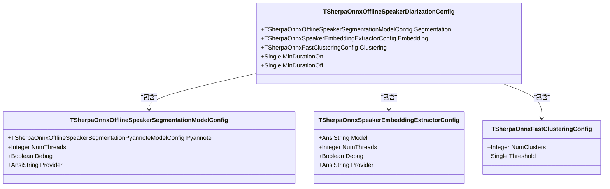

# 说话人分离示例

<cite>
**本文档引用的文件**   
- [main.pas](file://pascal-api-examples/speaker-diarization/main.pas)
- [sherpa_onnx.pas](file://sherpa-onnx/pascal-api/sherpa_onnx.pas)
- [offline-speaker-diarization.py](file://python-api-examples/offline-speaker-diarization.py)
</cite>

## 目录
1. [简介](#简介)
2. [项目结构](#项目结构)
3. [核心组件](#核心组件)
4. [架构概述](#架构概述)
5. [详细组件分析](#详细组件分析)
6. [依赖分析](#依赖分析)
7. [性能考虑](#性能考虑)
8. [故障排除指南](#故障排除指南)
9. [结论](#结论)

## 简介
本文档详细解析了sherpa-onnx项目中Pascal API的说话人分离示例。该示例展示了如何使用Pascal语言调用sherpa-onnx的说话人分离功能，分析包含多个说话人的音频文件，区分不同说话人的语音段，并获取每个说话人的时间戳和标签。文档将深入解析main.pas示例的实现逻辑，说明如何配置分离模型、处理多说话人音频，以及如何将说话人分离结果与其他语音处理任务（如ASR）结合使用，实现按说话人转录的功能。

## 项目结构
Pascal API的说话人分离示例位于`pascal-api-examples/speaker-diarization`目录下，主要包含一个`main.pas`文件。该示例依赖于`sherpa-onnx/pascal-api`目录下的`sherpa_onnx.pas`头文件，该文件定义了所有Pascal API的接口和数据结构。

**Diagram sources**
- [main.pas](file://pascal-api-examples/speaker-diarization/main.pas)
- [sherpa_onnx.pas](file://sherpa-onnx/pascal-api/sherpa_onnx.pas)

**Section sources**
- [main.pas](file://pascal-api-examples/speaker-diarization/main.pas)
- [sherpa_onnx.pas](file://sherpa-onnx/pascal-api/sherpa_onnx.pas)

## 核心组件
说话人分离的核心组件包括说话人分割模型和说话人嵌入提取器模型。在示例中，使用了pyannote-segmentation-3-0模型进行说话人分割，以及3dspeaker_speech_eres2net_base_sv_zh-cn_3dspeaker_16k.onnx模型进行说话人嵌入提取。这些模型通过`TSherpaOnnxOfflineSpeakerDiarizationConfig`配置结构体进行配置，并通过`TSherpaOnnxOfflineSpeakerDiarization`类进行调用。

**Section sources**
- [main.pas](file://pascal-api-examples/speaker-diarization/main.pas)
- [sherpa_onnx.pas](file://sherpa-onnx/pascal-api/sherpa_onnx.pas)

## 架构概述
说话人分离的整体架构包括音频读取、模型配置、说话人分离处理和结果输出四个主要部分。首先，使用`SherpaOnnxReadWave`函数读取音频文件；然后，配置说话人分离模型的参数；接着，创建`TSherpaOnnxOfflineSpeakerDiarization`实例并调用`Process`方法进行处理；最后，遍历处理结果并输出每个说话人的语音段。

**Diagram sources**
- [main.pas](file://pascal-api-examples/speaker-diarization/main.pas)

## 详细组件分析
### main.pas 分析
`main.pas`文件是说话人分离示例的主程序，包含了从音频读取到结果输出的完整流程。程序首先读取音频文件，然后配置说话人分离模型的参数，包括分割模型和嵌入提取器模型的路径。接着，创建`TSherpaOnnxOfflineSpeakerDiarization`实例，并调用`Process`方法进行处理。处理过程中可以使用进度回调函数来监控处理进度。最后，遍历处理结果并输出每个说话人的语音段。

**Diagram sources**
- [main.pas](file://pascal-api-examples/speaker-diarization/main.pas)

**Section sources**
- [main.pas](file://pascal-api-examples/speaker-diarization/main.pas)

### 说话人分离配置分析
`TSherpaOnnxOfflineSpeakerDiarizationConfig`结构体用于配置说话人分离模型的参数。它包含三个主要部分：`Segmentation`、`Embedding`和`Clustering`。`Segmentation`部分配置说话人分割模型，`Embedding`部分配置说话人嵌入提取器模型，`Clustering`部分配置聚类算法的参数。

**Diagram sources**
- [sherpa_onnx.pas](file://sherpa-onnx/pascal-api/sherpa_onnx.pas)

**Section sources**
- [sherpa_onnx.pas](file://sherpa-onnx/pascal-api/sherpa_onnx.pas)

### 说话人分离处理流程分析
`TSherpaOnnxOfflineSpeakerDiarization`类的`Process`方法是说话人分离的核心处理流程。该方法接收音频样本数组，并返回一个`TSherpaOnnxOfflineSpeakerDiarizationSegmentArray`，其中包含每个说话人的语音段信息。

**Diagram sources**
- [main.pas](file://pascal-api-examples/speaker-diarization/main.pas)
- [sherpa_onnx.pas](file://sherpa-onnx/pascal-api/sherpa_onnx.pas)

**Section sources**
- [main.pas](file://pascal-api-examples/speaker-diarization/main.pas)
- [sherpa_onnx.pas](file://sherpa-onnx/pascal-api/sherpa_onnx.pas)

## 依赖分析
说话人分离示例依赖于sherpa-onnx的C-API库，通过Pascal的外部函数调用机制进行调用。主要依赖的C-API函数包括`SherpaOnnxCreateOfflineSpeakerDiarization`、`SherpaOnnxOfflineSpeakerDiarizationProcess`和`SherpaOnnxDestroyOfflineSpeakerDiarization`等。

**Diagram sources**
- [main.pas](file://pascal-api-examples/speaker-diarization/main.pas)

**Section sources**
- [main.pas](file://pascal-api-examples/speaker-diarization/main.pas)

## 性能考虑
在使用说话人分离功能时，需要注意以下性能考虑：
1. 模型加载时间：首次加载模型时会有一定的延迟，建议在程序启动时预先加载模型。
2. 处理时间：处理长音频文件时，处理时间会相应增加，建议对长音频进行分段处理。
3. 内存占用：模型和音频数据会占用一定的内存，建议在处理完成后及时释放资源。

## 故障排除指南
在使用说话人分离示例时，可能会遇到以下常见问题：
1. 模型文件路径错误：确保模型文件路径正确，并且文件存在。
2. 采样率不匹配：确保音频文件的采样率与模型期望的采样率一致。
3. 内存不足：处理大音频文件时可能会出现内存不足的情况，建议分段处理。

**Section sources**
- [main.pas](file://pascal-api-examples/speaker-diarization/main.pas)

## 结论
本文档详细解析了sherpa-onnx项目中Pascal API的说话人分离示例。通过分析`main.pas`文件的实现逻辑，我们了解了如何配置说话人分离模型、处理多说话人音频、获取每个说话人的时间戳和标签。此外，还展示了如何将说话人分离结果与其他语音处理任务（如ASR）结合使用，实现按说话人转录的功能。希望本文档能帮助开发者更好地理解和使用sherpa-onnx的说话人分离功能。