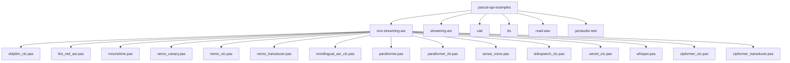
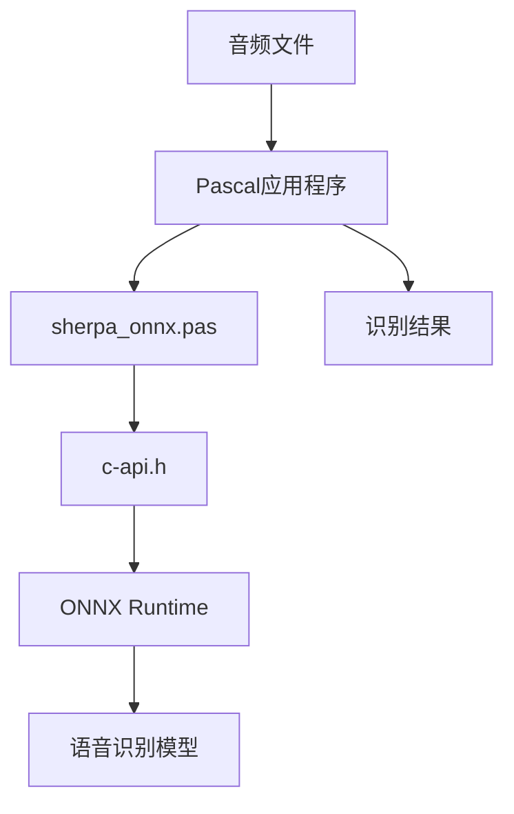
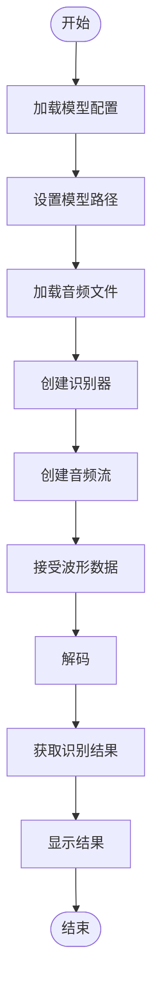
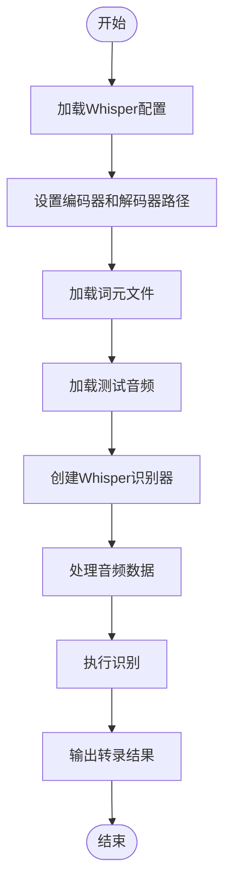
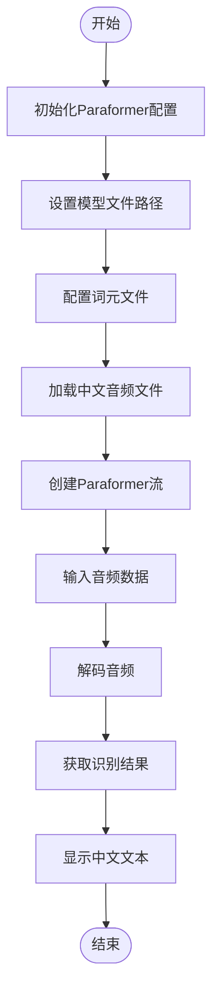
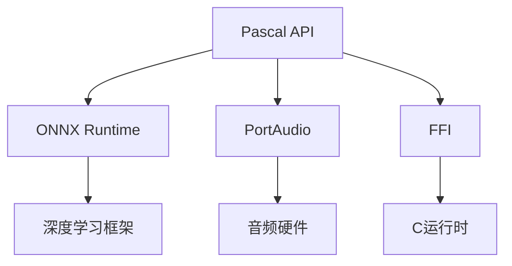

# 非流式语音识别示例

<cite>
**本文档中引用的文件**   
- [dolphin_ctc.pas](file://pascal-api-examples/non-streaming-asr/dolphin_ctc.pas)
- [fire_red_asr.pas](file://pascal-api-examples/non-streaming-asr/fire_red_asr.pas)
- [moonshine.pas](file://pascal-api-examples/non-streaming-asr/moonshine.pas)
- [nemo_canary.pas](file://pascal-api-examples/non-streaming-asr/nemo_canary.pas)
- [nemo_ctc.pas](file://pascal-api-examples/non-streaming-asr/nemo_ctc.pas)
- [nemo_transducer.pas](file://pascal-api-examples/non-streaming-asr/nemo_transducer.pas)
- [omnilingual_asr_ctc.pas](file://pascal-api-examples/non-streaming-asr/omnilingual_asr_ctc.pas)
- [paraformer.pas](file://pascal-api-examples/non-streaming-asr/paraformer.pas)
- [paraformer_itn.pas](file://pascal-api-examples/non-streaming-asr/paraformer_itn.pas)
- [sense_voice.pas](file://pascal-api-examples/non-streaming-asr/sense_voice.pas)
- [telespeech_ctc.pas](file://pascal-api-examples/non-streaming-asr/telespeech_ctc.pas)
- [wenet_ctc.pas](file://pascal-api-examples/non-streaming-asr/wenet_ctc.pas)
- [whisper.pas](file://pascal-api-examples/non-streaming-asr/whisper.pas)
- [zipformer_ctc.pas](file://pascal-api-examples/non-streaming-asr/zipformer_ctc.pas)
- [zipformer_transducer.pas](file://pascal-api-examples/non-streaming-asr/zipformer_transducer.pas)
- [sherpa_onnx.pas](file://sherpa-onnx/pascal-api/sherpa_onnx.pas)
- [c-api.h](file://sherpa-onnx/c-api/c-api.h)
</cite>

## 目录
1. [简介](#简介)
2. [项目结构](#项目结构)
3. [核心组件](#核心组件)
4. [架构概述](#架构概述)
5. [详细组件分析](#详细组件分析)
6. [依赖分析](#依赖分析)
7. [性能考虑](#性能考虑)
8. [故障排除指南](#故障排除指南)
9. [结论](#结论)

## 简介
本文档详细介绍了sherpa-onnx项目中Pascal API的非流式语音识别示例。文档系统性地解释了dolphin_ctc、fire_red_asr、moonshine、nemo系列、paraformer、sense_voice、whisper等不同模型在Pascal语言中的使用方法。通过分析示例代码，详细说明了如何加载模型、配置参数、处理音频文件和获取识别结果。文档还展示了Pascal语言中FFI调用C接口的具体实现方式，包括数据类型映射和内存管理，并提供了编译和运行这些示例的完整步骤，以及常见错误的排查方法。

## 项目结构
Pascal API示例位于`pascal-api-examples`目录下，其中`non-streaming-asr`子目录包含了各种非流式语音识别模型的示例实现。每个模型都有对应的Pascal源文件和运行脚本，结构清晰，便于学习和使用。

**图示来源**
- [README.md](file://pascal-api-examples/README.md)
- [非流式ASR目录](file://pascal-api-examples/non-streaming-asr/)

**节来源**
- [README.md](file://pascal-api-examples/README.md)
- [非流式ASR目录](file://pascal-api-examples/non-streaming-asr/)

## 核心组件
非流式语音识别示例的核心组件包括模型配置、识别器、音频流和识别结果。这些组件通过Pascal API封装了底层的C接口，提供了简洁易用的面向对象编程接口。

**节来源**
- [dolphin_ctc.pas](file://pascal-api-examples/non-streaming-asr/dolphin_ctc.pas)
- [whisper.pas](file://pascal-api-examples/non-streaming-asr/whisper.pas)
- [paraformer.pas](file://pascal-api-examples/non-streaming-asr/paraformer.pas)

## 架构概述
Pascal API的非流式语音识别架构基于C API构建，通过FFI（外部函数接口）调用底层的C函数。Pascal代码通过`sherpa_onnx.pas`单元封装了C API，提供了面向对象的接口，简化了模型加载、音频处理和结果获取的过程。

**图示来源**
- [sherpa_onnx.pas](file://sherpa-onnx/pascal-api/sherpa_onnx.pas)
- [c-api.h](file://sherpa-onnx/c-api/c-api.h)

## 详细组件分析
本节详细分析各个非流式语音识别模型的实现细节，包括模型加载、参数配置、音频处理和结果获取。

### Dolphin CTC 模型分析
Dolphin CTC模型示例展示了如何使用多语言CTC模型进行语音识别。该模型支持多种语言的语音识别，适用于需要多语言支持的场景。

**图示来源**
- [dolphin_ctc.pas](file://pascal-api-examples/non-streaming-asr/dolphin_ctc.pas)

**节来源**
- [dolphin_ctc.pas](file://pascal-api-examples/non-streaming-asr/dolphin_ctc.pas)

### Whisper 模型分析
Whisper模型示例展示了如何使用OpenAI的Whisper模型进行语音识别。该模型以其高准确率和多语言支持而闻名，适用于高质量语音识别需求。

**图示来源**
- [whisper.pas](file://pascal-api-examples/non-streaming-asr/whisper.pas)

**节来源**
- [whisper.pas](file://pascal-api-examples/non-streaming-asr/whisper.pas)

### Paraformer 模型分析
Paraformer模型示例展示了如何使用Paraformer模型进行中文语音识别。该模型专为中文语音识别优化，具有较高的识别准确率。

**图示来源**
- [paraformer.pas](file://pascal-api-examples/non-streaming-asr/paraformer.pas)

**节来源**
- [paraformer.pas](file://pascal-api-examples/non-streaming-asr/paraformer.pas)

### 其他模型分析
除了上述三种主要模型外，Pascal API还支持多种其他语音识别模型，包括fire_red_asr、moonshine、nemo系列等。这些模型各有特点，适用于不同的应用场景。

**节来源**
- [fire_red_asr.pas](file://pascal-api-examples/non-streaming-asr/fire_red_asr.pas)
- [moonshine.pas](file://pascal-api-examples/non-streaming-asr/moonshine.pas)
- [nemo_canary.pas](file://pascal-api-examples/non-streaming-asr/nemo_canary.pas)
- [nemo_ctc.pas](file://pascal-api-examples/non-streaming-asr/nemo_ctc.pas)
- [nemo_transducer.pas](file://pascal-api-examples/non-streaming-asr/nemo_transducer.pas)

## 依赖分析
Pascal API的非流式语音识别示例依赖于多个组件，包括ONNX Runtime、音频处理库和Pascal的FFI机制。这些依赖关系确保了模型能够正确加载和执行。

**图示来源**
- [sherpa_onnx.pas](file://sherpa-onnx/pascal-api/sherpa_onnx.pas)
- [portaudio.pas](file://sherpa-onnx/pascal-api/portaudio.pas)

**节来源**
- [sherpa_onnx.pas](file://sherpa-onnx/pascal-api/sherpa_onnx.pas)
- [portaudio.pas](file://sherpa-onnx/pascal-api/portaudio.pas)

## 性能考虑
在使用非流式语音识别模型时，需要考虑多个性能因素，包括模型加载时间、识别速度和内存使用。通过合理配置线程数和选择合适的模型，可以优化性能表现。

**节来源**
- [dolphin_ctc.pas](file://pascal-api-examples/non-streaming-asr/dolphin_ctc.pas)
- [whisper.pas](file://pascal-api-examples/non-streaming-asr/whisper.pas)
- [paraformer.pas](file://pascal-api-examples/non-streaming-asr/paraformer.pas)

## 故障排除指南
在使用Pascal API进行非流式语音识别时，可能会遇到各种问题。本节提供常见错误的排查方法。

**节来源**
- [dolphin_ctc.pas](file://pascal-api-examples/non-streaming-asr/dolphin_ctc.pas)
- [whisper.pas](file://pascal-api-examples/non-streaming-asr/whisper.pas)
- [paraformer.pas](file://pascal-api-examples/non-streaming-asr/paraformer.pas)

## 结论
本文档详细介绍了sherpa-onnx项目中Pascal API的非流式语音识别示例。通过系统性的分析，展示了dolphin_ctc、fire_red_asr、moonshine、nemo系列、paraformer、sense_voice、whisper等不同模型在Pascal中的使用方法。文档提供了每个示例代码的详细解析，说明了如何加载模型、配置参数、处理音频文件和获取识别结果。同时，文档展示了Pascal语言中FFI调用C接口的具体实现方式，包括数据类型映射和内存管理，并提供了编译和运行这些示例的完整步骤，以及常见错误的排查方法。