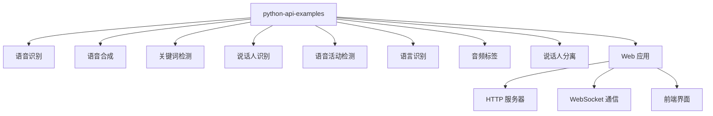
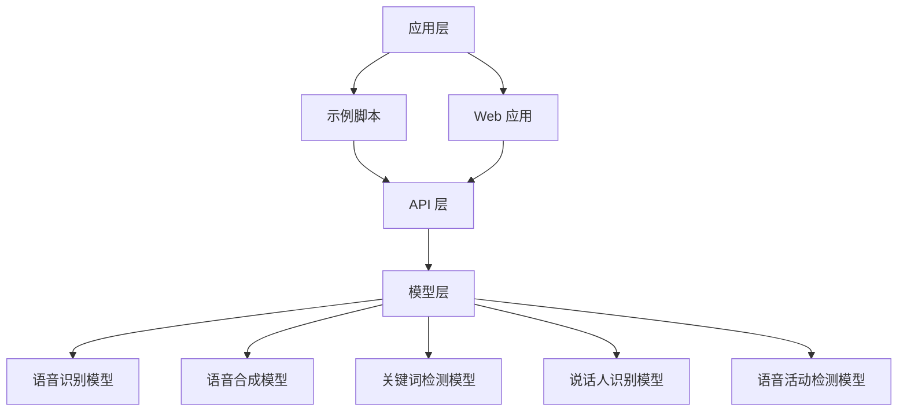
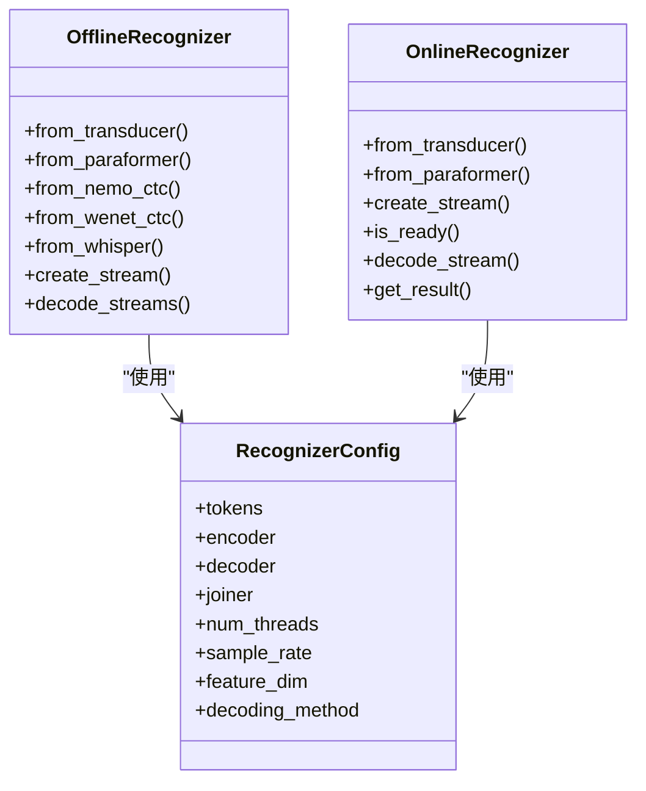
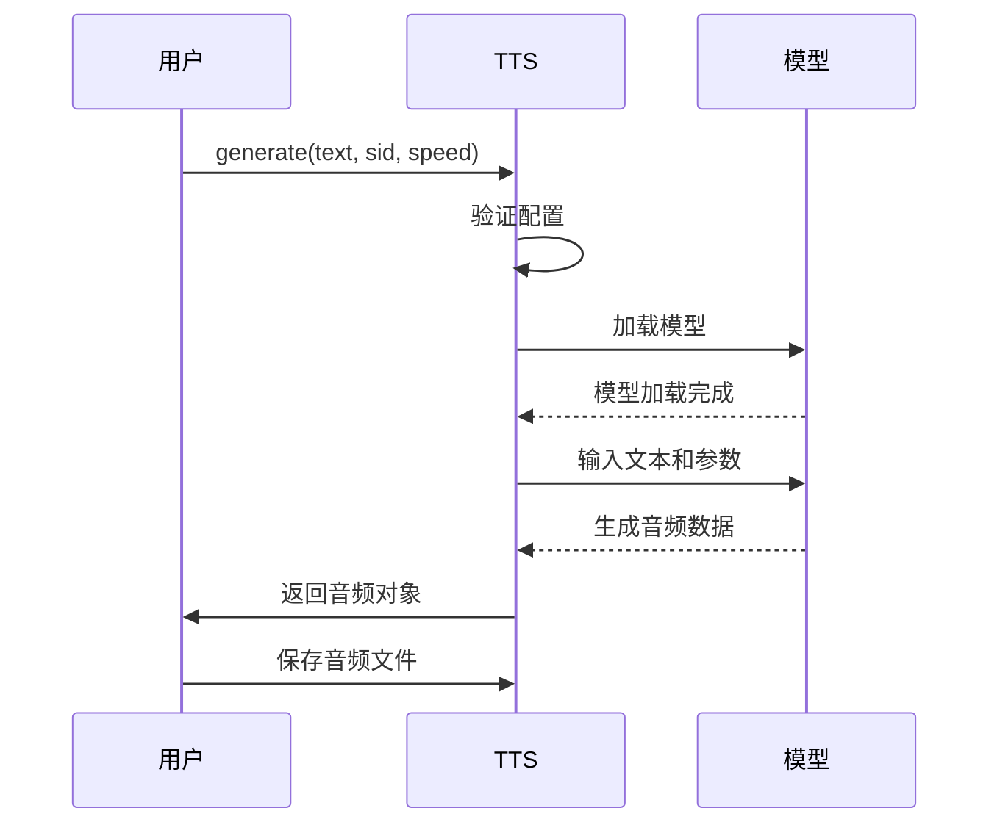
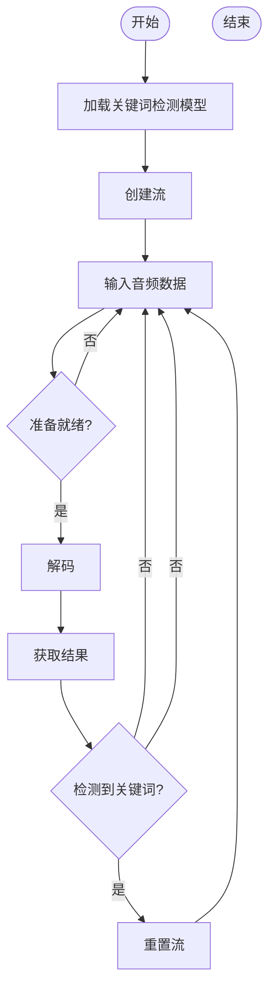
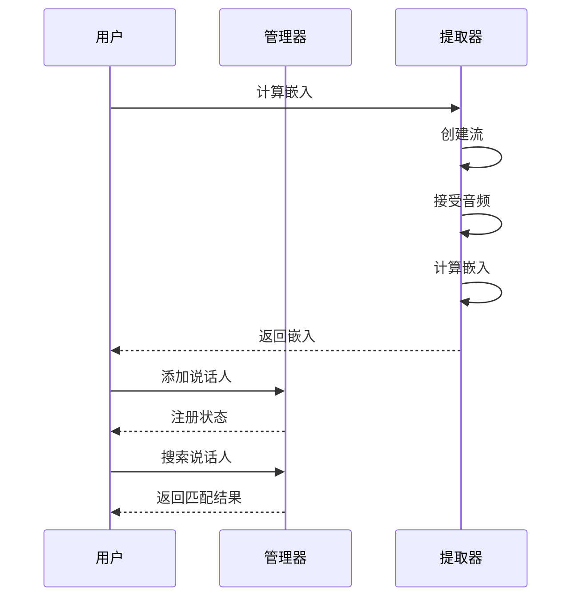
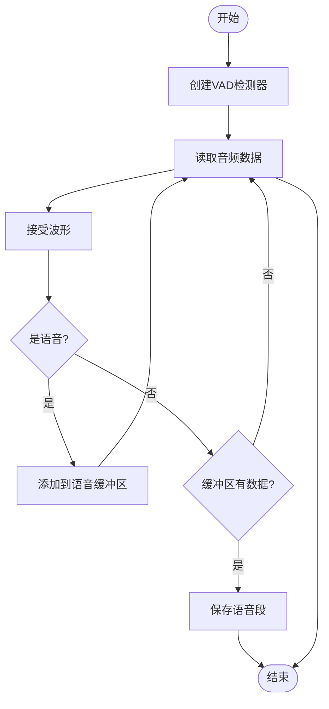
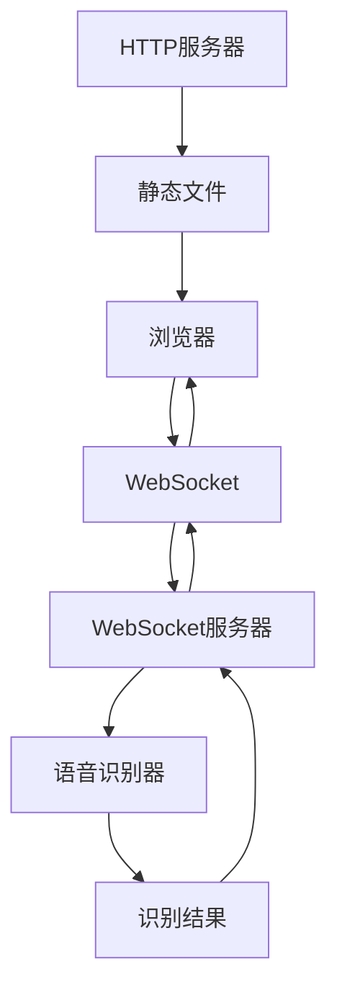
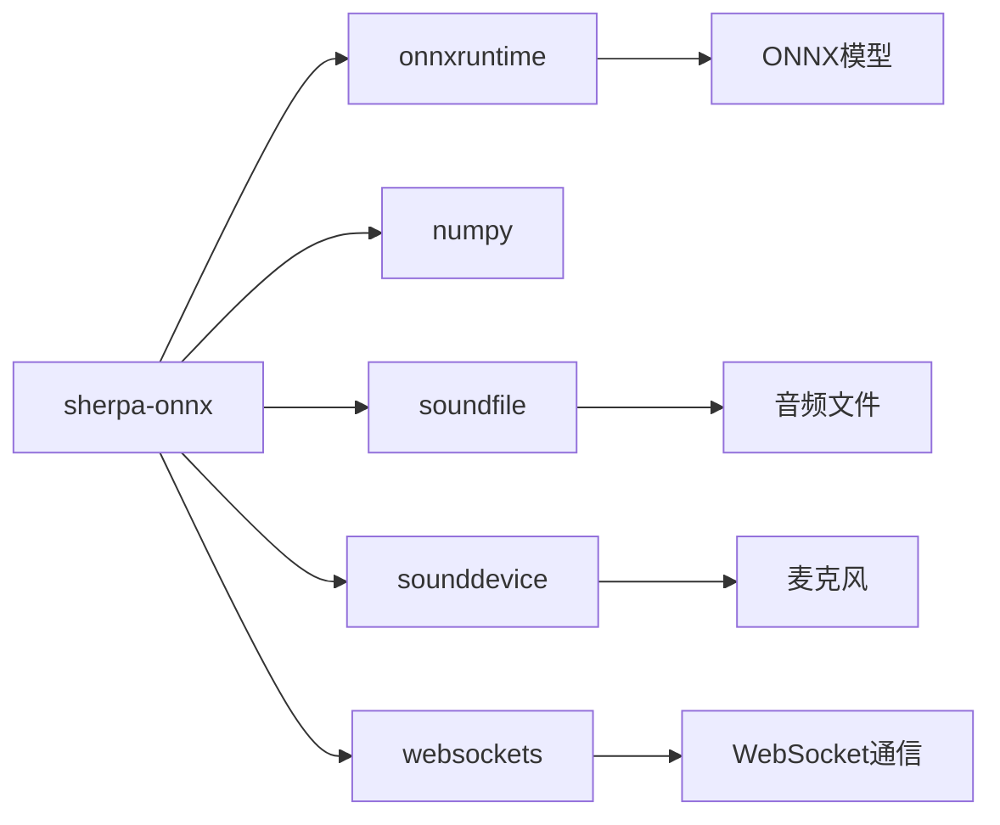

# Python API 示例

<cite>
**本文档中引用的文件**   
- [offline-decode-files.py](file://python-api-examples/offline-decode-files.py)
- [speech-recognition-from-microphone.py](file://python-api-examples/speech-recognition-from-microphone.py)
- [keyword-spotter.py](file://python-api-examples/keyword-spotter.py)
- [speaker-identification.py](file://python-api-examples/speaker-identification.py)
- [vad-remove-non-speech-segments.py](file://python-api-examples/vad-remove-non-speech-segments.py)
- [offline-tts.py](file://python-api-examples/offline-tts.py)
- [spoken-language-identification.py](file://python-api-examples/spoken-language-identification.py)
- [audio-tagging-from-a-file.py](file://python-api-examples/audio-tagging-from-a-file.py)
- [offline-speaker-diarization.py](file://python-api-examples/offline-speaker-diarization.py)
- [http_server.py](file://python-api-examples/http_server.py)
- [non_streaming_server.py](file://python-api-examples/non_streaming_server.py)
- [streaming_server.py](file://python-api-examples/streaming_server.py)
- [web/index.html](file://python-api-examples/web/index.html)
- [web/streaming_record.html](file://python-api-examples/web/streaming_record.html)
- [web/offline_record.html](file://python-api-examples/web/offline_record.html)
- [web/js/streaming_record.js](file://python-api-examples/web/js/streaming_record.js)
- [web/js/offline_record.js](file://python-api-examples/web/js/offline_record.js)
</cite>

## 目录
1. [简介](#简介)
2. [项目结构](#项目结构)
3. [核心组件](#核心组件)
4. [架构概述](#架构概述)
5. [详细组件分析](#详细组件分析)
6. [依赖分析](#依赖分析)
7. [性能考虑](#性能考虑)
8. [故障排除指南](#故障排除指南)
9. [结论](#结论)

## 简介

sherpa-onnx 是一个功能强大的语音处理工具包，提供了丰富的 Python API 示例，涵盖了语音识别、语音合成、关键词检测、说话人识别、语音活动检测等多种语音处理功能。本文档将全面解析这些 Python API 示例，帮助用户快速上手并深入理解其工作原理。

这些示例代码展示了如何使用 sherpa-onnx 进行各种语音处理任务，从基础的离线语音识别到复杂的实时语音处理系统。特别地，web 示例展示了如何通过 HTTP 服务器和 WebSocket 通信实现基于 Web 的语音处理应用，为开发者提供了构建语音交互系统的完整参考。

**Section sources**
- [python-api-examples/README.md](file://python-api-examples/README.md)

## 项目结构

sherpa-onnx 的 Python API 示例位于 `python-api-examples` 目录下，该目录包含了各种语音处理任务的示例脚本和 Web 应用。示例脚本按照功能分类，涵盖了语音识别、语音合成、关键词检测、说话人识别、语音活动检测等主要功能。

Web 示例位于 `python-api-examples/web` 目录下，包含了一个完整的 Web 应用，提供了离线和流式语音识别的用户界面。这些示例展示了如何将 sherpa-onnx 集成到 Web 应用中，通过 WebSocket 与后端服务器通信，实现实时语音处理功能。

**Diagram sources **
- [python-api-examples/README.md](file://python-api-examples/README.md)
- [python-api-examples/web/index.html](file://python-api-examples/web/index.html)

**Section sources**
- [python-api-examples/README.md](file://python-api-examples/README.md)
- [python-api-examples/web/index.html](file://python-api-examples/web/index.html)

## 核心组件

sherpa-onnx Python API 的核心组件包括语音识别器、语音合成器、关键词检测器、说话人识别器、语音活动检测器等。这些组件通过统一的 API 接口提供服务，使得开发者可以方便地集成各种语音处理功能。

每个组件都提供了离线和流式两种处理模式，满足不同应用场景的需求。离线模式适用于处理已有的音频文件，而流式模式则适用于实时语音处理。API 设计遵循一致的模式，包括配置、流创建、数据输入、结果获取等步骤，降低了学习和使用成本。

**Section sources**
- [python-api-examples/offline-decode-files.py](file://python-api-examples/offline-decode-files.py)
- [python-api-examples/speech-recognition-from-microphone.py](file://python-api-examples/speech-recognition-from-microphone.py)

## 架构概述

sherpa-onnx 的架构基于 ONNX 运行时，利用预训练的深度学习模型进行语音处理。Python API 作为上层接口，封装了底层的复杂性，为开发者提供了简洁易用的接口。系统架构分为三层：应用层、API 层和模型层。

应用层包含各种示例脚本和 Web 应用，展示了如何使用 API 实现具体功能。API 层提供了统一的接口，处理模型加载、流管理、数据预处理和后处理等任务。模型层包含各种预训练的 ONNX 模型，如语音识别模型、语音合成模型、关键词检测模型等。

**Diagram sources **
- [python-api-examples/offline-decode-files.py](file://python-api-examples/offline-decode-files.py)
- [python-api-examples/speech-recognition-from-microphone.py](file://python-api-examples/speech-recognition-from-microphone.py)

## 详细组件分析

### 语音识别分析

语音识别是 sherpa-onnx 的核心功能之一，提供了离线和流式两种模式。离线模式通过 `OfflineRecognizer` 类实现，适用于处理已有的音频文件。流式模式通过 `OnlineRecognizer` 类实现，适用于实时语音识别。

离线语音识别示例展示了如何加载模型、创建识别器、处理音频文件并获取识别结果。流式语音识别示例展示了如何从麦克风实时获取音频数据，进行实时识别，并动态更新识别结果。

#### 语音识别类图

**Diagram sources **
- [python-api-examples/offline-decode-files.py](file://python-api-examples/offline-decode-files.py)
- [python-api-examples/speech-recognition-from-microphone.py](file://python-api-examples/speech-recognition-from-microphone.py)

**Section sources**
- [python-api-examples/offline-decode-files.py](file://python-api-examples/offline-decode-files.py)
- [python-api-examples/speech-recognition-from-microphone.py](file://python-api-examples/speech-recognition-from-microphone.py)

### 语音合成分析

语音合成功能通过 `OfflineTts` 类实现，将文本转换为语音。该功能支持多种语音合成模型，如 VITS、Matcha、Kokoro 和 Kitten。用户可以通过命令行参数选择不同的模型，并指定说话人 ID、语速等参数。

语音合成示例展示了如何配置 TTS 模型、生成语音并保存为音频文件。API 设计简洁，只需几行代码即可完成文本到语音的转换，同时提供了丰富的参数选项以满足不同需求。

#### 语音合成序列图

**Diagram sources **
- [python-api-examples/offline-tts.py](file://python-api-examples/offline-tts.py)

**Section sources**
- [python-api-examples/offline-tts.py](file://python-api-examples/offline-tts.py)

### 关键词检测分析

关键词检测功能通过 `KeywordSpotter` 类实现，用于在音频流中检测预定义的关键词。该功能支持在运行时动态添加新的关键词，提高了灵活性。示例代码展示了如何使用预定义的关键词文件，以及如何在运行时添加新的关键词。

关键词检测器采用流式处理模式，可以实时检测音频流中的关键词。当检测到关键词时，会返回关键词的文本内容，开发者可以根据返回结果执行相应的操作。

#### 关键词检测流程图

**Diagram sources **
- [python-api-examples/keyword-spotter.py](file://python-api-examples/keyword-spotter.py)

**Section sources**
- [python-api-examples/keyword-spotter.py](file://python-api-examples/keyword-spotter.py)

### 说话人识别分析

说话人识别功能通过 `SpeakerEmbeddingExtractor` 和 `SpeakerEmbeddingManager` 类实现。首先使用 `SpeakerEmbeddingExtractor` 从音频中提取说话人嵌入特征，然后使用 `SpeakerEmbeddingManager` 进行说话人比对和识别。

该功能支持注册多个说话人的语音样本，并计算平均嵌入特征。在识别阶段，系统会计算输入语音的嵌入特征，并与已注册的说话人嵌入进行比对，返回最匹配的说话人。

#### 说话人识别序列图

**Diagram sources **
- [python-api-examples/speaker-identification.py](file://python-api-examples/speaker-identification.py)

**Section sources**
- [python-api-examples/speaker-identification.py](file://python-api-examples/speaker-identification.py)

### 语音活动检测分析

语音活动检测（VAD）功能通过 `VoiceActivityDetector` 类实现，用于检测音频流中的语音活动。该功能基于 Silero VAD 模型，可以准确地识别语音段和非语音段。

示例代码展示了如何使用 VAD 移除音频中的非语音段，并将语音段合并为一个连续的音频。这对于后续的语音识别等处理任务非常有用，可以提高处理效率和准确性。

#### 语音活动检测流程图

**Diagram sources **
- [python-api-examples/vad-remove-non-speech-segments.py](file://python-api-examples/vad-remove-non-speech-segments.py)

**Section sources**
- [python-api-examples/vad-remove-non-speech-segments.py](file://python-api-examples/vad-remove-non-speech-segments.py)

### Web 示例分析

Web 示例展示了如何将 sherpa-onnx 集成到 Web 应用中，通过 HTTP 服务器和 WebSocket 通信实现基于 Web 的语音处理功能。系统由前端界面、HTTP 服务器和 WebSocket 服务器组成。

HTTP 服务器提供静态文件服务，WebSocket 服务器处理实时语音数据的传输和处理。前端界面通过 JavaScript 与 WebSocket 服务器通信，实现语音录制、传输和结果显示功能。

#### Web 架构图

**Diagram sources **
- [python-api-examples/http_server.py](file://python-api-examples/http_server.py)
- [python-api-examples/non_streaming_server.py](file://python-api-examples/non_streaming_server.py)
- [python-api-examples/streaming_server.py](file://python-api-examples/streaming_server.py)
- [python-api-examples/web/index.html](file://python-api-examples/web/index.html)

**Section sources**
- [python-api-examples/http_server.py](file://python-api-examples/http_server.py)
- [python-api-examples/non_streaming_server.py](file://python-api-examples/non_streaming_server.py)
- [python-api-examples/streaming_server.py](file://python-api-examples/streaming_server.py)
- [python-api-examples/web/index.html](file://python-api-examples/web/index.html)

## 依赖分析

sherpa-onnx Python API 依赖于多个第三方库，包括 onnxruntime、numpy、soundfile、sounddevice 等。这些依赖库提供了模型推理、数值计算、音频文件读写和音频设备访问等功能。

Web 示例还依赖于 websockets 库，用于实现 WebSocket 通信。这些依赖关系通过 Python 的包管理机制进行管理，用户可以通过 pip 安装所需的依赖。

**Diagram sources **
- [python-api-examples/offline-decode-files.py](file://python-api-examples/offline-decode-files.py)
- [python-api-examples/speech-recognition-from-microphone.py](file://python-api-examples/speech-recognition-from-microphone.py)

**Section sources**
- [python-api-examples/offline-decode-files.py](file://python-api-examples/offline-decode-files.py)
- [python-api-examples/speech-recognition-from-microphone.py](file://python-api-examples/speech-recognition-from-microphone.py)

## 性能考虑

sherpa-onnx 在设计时充分考虑了性能因素，提供了多种优化选项。用户可以通过设置线程数来控制并行计算的强度，平衡性能和资源消耗。对于实时应用，建议使用流式处理模式，以减少延迟。

模型推理性能受硬件平台影响较大，在 GPU 上通常比 CPU 有显著的性能提升。用户可以根据部署环境选择合适的模型和运行时配置，以达到最佳的性能表现。

对于 Web 应用，WebSocket 通信的延迟和带宽是影响用户体验的关键因素。建议在服务器端进行适当的缓冲和批处理，以提高处理效率。

## 故障排除指南

在使用 sherpa-onnx Python API 时，可能会遇到模型文件缺失、依赖库未安装、音频设备访问失败等问题。常见的解决方案包括：

1. 确保所有必需的模型文件都已下载并放置在正确的位置
2. 使用 pip 安装所有必需的依赖库
3. 检查音频设备是否正常工作，权限是否正确
4. 确认音频文件格式符合要求（单声道，16位整数）
5. 检查模型配置参数是否正确

对于 Web 应用，还需要确保 HTTP 服务器和 WebSocket 服务器正常运行，端口没有被占用。

**Section sources**
- [python-api-examples/README.md](file://python-api-examples/README.md)
- [python-api-examples/offline-decode-files.py](file://python-api-examples/offline-decode-files.py)

## 结论

sherpa-onnx 提供了一套完整且易用的 Python API，涵盖了语音处理的各个方面。通过丰富的示例代码，开发者可以快速上手并集成各种语音功能到自己的应用中。

Web 示例展示了如何构建基于 Web 的语音处理系统，为开发者提供了完整的参考实现。通过 HTTP 服务器和 WebSocket 通信，可以实现高效的实时语音处理应用。

总的来说，sherpa-onnx 是一个功能强大、易于使用的语音处理工具包，适合各种语音应用的开发需求。