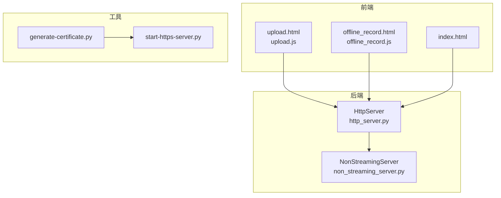
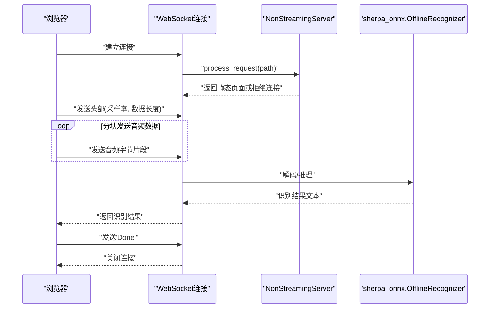
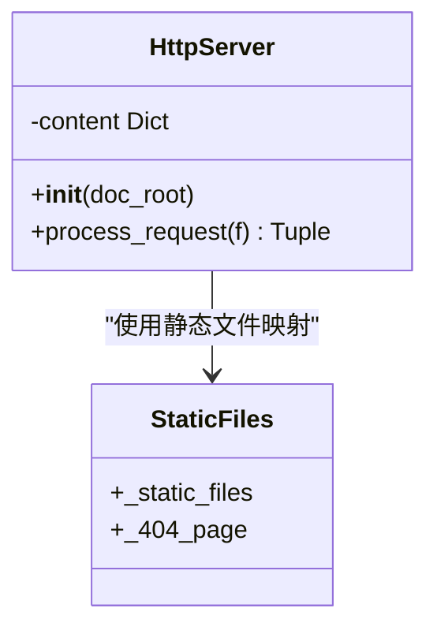
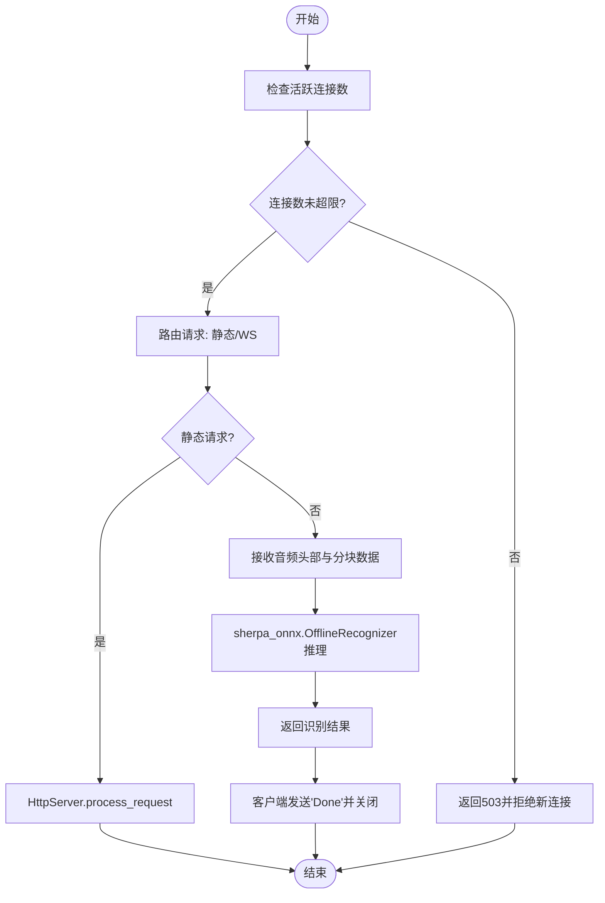
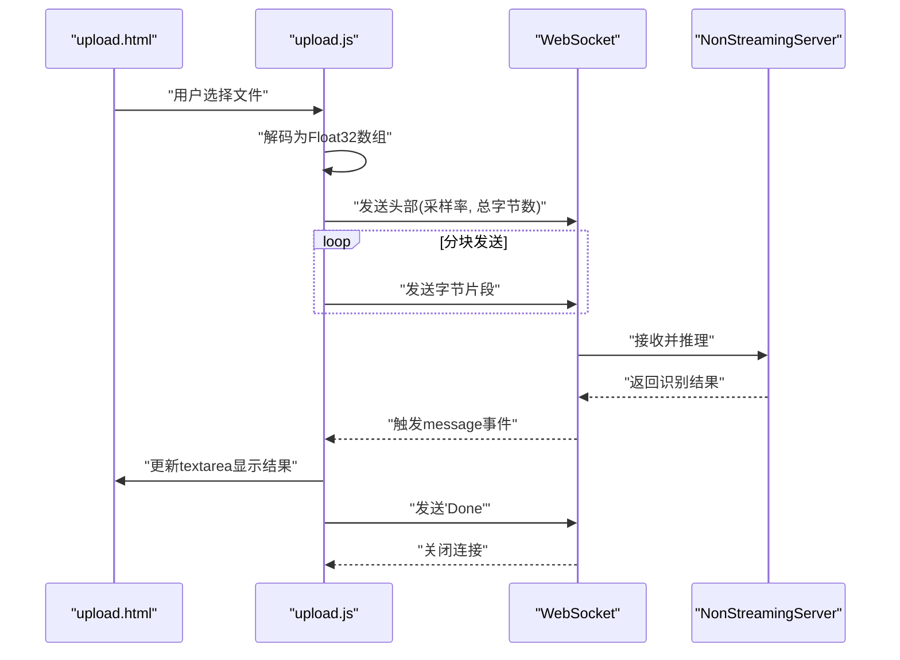
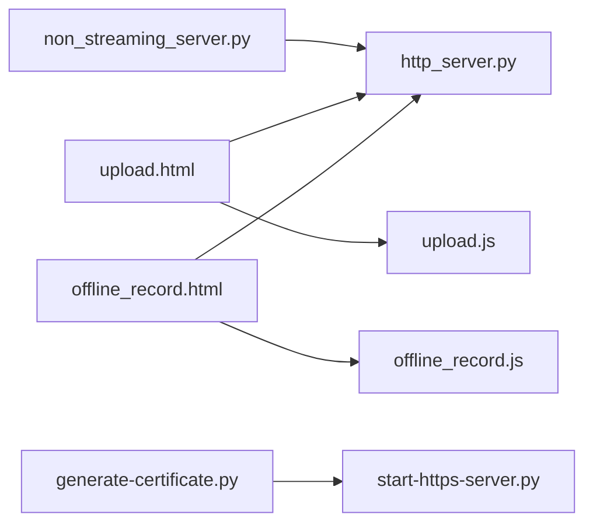

# HTTP服务示例

<cite>
**本文引用的文件列表**
- [http_server.py](file://python-api-examples/http_server.py)
- [non_streaming_server.py](file://python-api-examples/non_streaming_server.py)
- [upload.html](file://python-api-examples/web/upload.html)
- [offline_record.html](file://python-api-examples/web/offline_record.html)
- [index.html](file://python-api-examples/web/index.html)
- [upload.js](file://python-api-examples/web/js/upload.js)
- [offline_record.js](file://python-api-examples/web/js/offline_record.js)
- [generate-certificate.py](file://python-api-examples/web/generate-certificate.py)
- [start-https-server.py](file://python-api-examples/web/start-https-server.py)
- [README.md](file://python-api-examples/README.md)
</cite>

## 目录
1. [简介](#简介)
2. [项目结构](#项目结构)
3. [核心组件](#核心组件)
4. [架构总览](#架构总览)
5. [详细组件分析](#详细组件分析)
6. [依赖关系分析](#依赖关系分析)
7. [性能考虑](#性能考虑)
8. [故障排查指南](#故障排查指南)
9. [结论](#结论)
10. [附录](#附录)

## 简介
本文件面向sherpa-onnx Python API的HTTP服务示例，重点解析http_server.py的实现与非流式ASR服务的请求处理流程，涵盖：
- 使用Flask风格的静态HTTP服务器（由自定义HttpServer类提供）托管前端页面与资源
- 非流式ASR服务的请求处理流程：从音频文件上传到模型推理的完整过程
- 前端HTML/JavaScript与后端Python的集成方式，特别是文件上传与结果返回的交互机制
- 服务器配置、错误处理与性能优化建议

## 项目结构
该示例采用“前端静态资源 + WebSocket非流式ASR服务”的组合模式：
- 前端静态资源位于python-api-examples/web目录，包含HTML页面、JS脚本与样式资源
- 后端服务由python-api-examples/http_server.py提供静态文件服务，并在non_streaming_server.py中通过WebSocket提供非流式ASR能力
- 证书生成与HTTPS静态服务器用于演示安全连接场景

图表来源
- [http_server.py](file://python-api-examples/http_server.py#L56-L83)
- [non_streaming_server.py](file://python-api-examples/non_streaming_server.py#L598-L755)
- [upload.html](file://python-api-examples/web/upload.html#L1-L69)
- [offline_record.html](file://python-api-examples/web/offline_record.html#L1-L82)
- [index.html](file://python-api-examples/web/index.html#L1-L72)
- [upload.js](file://python-api-examples/web/js/upload.js#L1-L136)
- [offline_record.js](file://python-api-examples/web/js/offline_record.js#L1-L398)
- [generate-certificate.py](file://python-api-examples/web/generate-certificate.py#L1-L86)
- [start-https-server.py](file://python-api-examples/web/start-https-server.py#L1-L76)

章节来源
- [README.md](file://python-api-examples/README.md#L1-L13)

## 核心组件
- HttpServer（静态HTTP服务器）
  - 负责托管静态文件（HTML、CSS、JS、图片等），并根据路径返回对应内容与MIME类型
  - 提供process_request方法，返回是否存在、内容与MIME类型三元组
- NonStreamingServer（非流式ASR服务）
  - 基于WebSocket提供非流式语音识别能力，支持多客户端并发
  - 内部持有sherpa_onnx.OfflineRecognizer实例，负责模型推理
  - 支持批量推理、线程池解码、最大消息大小与队列长度限制等配置
- 前端页面与脚本
  - upload.html与upload.js：从本地文件上传音频，通过WebSocket发送音频数据，接收识别结果
  - offline_record.html与offline_record.js：从麦克风录制音频，实时发送音频片段，接收识别结果
  - index.html：导航入口，加载导航片段

章节来源
- [http_server.py](file://python-api-examples/http_server.py#L56-L83)
- [non_streaming_server.py](file://python-api-examples/non_streaming_server.py#L598-L755)
- [upload.html](file://python-api-examples/web/upload.html#L1-L69)
- [offline_record.html](file://python-api-examples/web/offline_record.html#L1-L82)
- [index.html](file://python-api-examples/web/index.html#L1-L72)
- [upload.js](file://python-api-examples/web/js/upload.js#L1-L136)
- [offline_record.js](file://python-api-examples/web/js/offline_record.js#L1-L398)

## 架构总览
下图展示了非流式ASR服务的整体架构：浏览器通过WebSocket连接到后端，后端使用sherpa_onnx.OfflineRecognizer执行推理，最终将识别结果回传给浏览器。

图表来源
- [non_streaming_server.py](file://python-api-examples/non_streaming_server.py#L660-L755)
- [upload.js](file://python-api-examples/web/js/upload.js#L76-L129)
- [offline_record.js](file://python-api-examples/web/js/offline_record.js#L98-L103)

## 详细组件分析

### HttpServer（静态HTTP服务器）
- 功能概述
  - 维护一个静态文件映射表，初始化时读取指定目录下的文件并缓存其内容与MIME类型
  - process_request根据请求路径返回文件内容与MIME类型；若未找到则返回404页面
- 关键点
  - 文件读取支持文本与二进制两种模式，确保图片、JS、CSS等资源正确返回
  - 404页面统一格式，便于前端调试
- 复杂度
  - 初始化阶段对静态文件集合进行一次IO读取，时间复杂度O(N)，N为静态文件数量
  - 请求处理为字典查找，平均O(1)

图表来源
- [http_server.py](file://python-api-examples/http_server.py#L56-L83)

章节来源
- [http_server.py](file://python-api-examples/http_server.py#L56-L83)

### 非流式ASR服务（NonStreamingServer）
- 功能概述
  - 作为WebSocket服务器，处理两类请求：
    - 静态HTTP请求：通过HttpServer返回前端页面与资源
    - WebSocket请求：接收音频数据，调用sherpa_onnx.OfflineRecognizer进行一次性推理，返回识别结果
- 关键流程
  - 连接建立：检查当前活跃连接数是否超过上限，否则允许接入
  - 静态请求：将路径映射到静态文件，返回内容与MIME类型
  - 音频接收：首条消息包含采样率与数据长度，后续分块发送音频字节
  - 推理与返回：将音频数据喂入识别器，得到文本结果并通过WebSocket返回
  - 结束：客户端发送“Done”，服务端关闭连接
- 并发与性能
  - 使用线程池执行NN计算与解码，避免阻塞事件循环
  - 支持批量推理参数（最大等待时间、最大批大小），提升吞吐量
  - 限制单消息大小与队列长度，防止内存溢出
- 安全性
  - 可选SSL证书，支持wss://安全连接
  - HTTPS静态服务器可配合前端使用

图表来源
- [non_streaming_server.py](file://python-api-examples/non_streaming_server.py#L660-L755)
- [http_server.py](file://python-api-examples/http_server.py#L56-L83)

章节来源
- [non_streaming_server.py](file://python-api-examples/non_streaming_server.py#L598-L755)

### 前端与后端集成（文件上传与结果返回）
- upload.html与upload.js
  - 用户选择.wav文件后，前端通过AudioContext解码为浮点数组，按固定字节数分块发送
  - 首条消息发送8字节头部（前4字节为采样率，后4字节为数据总字节数）
  - 接收后端返回的识别结果，显示在textarea中，并发送“Done”关闭连接
- offline_record.html与offline_record.js
  - 通过getUserMedia获取麦克风输入，实时录制并分块发送
  - 录制结束后同样发送头部与分块数据，接收识别结果
- 交互要点
  - 协议自动选择：http/https对应ws/wss
  - 服务器地址与端口默认取自当前页面协议与端口
  - 识别完成后主动关闭连接，释放资源

图表来源
- [upload.html](file://python-api-examples/web/upload.html#L1-L69)
- [upload.js](file://python-api-examples/web/js/upload.js#L76-L129)
- [non_streaming_server.py](file://python-api-examples/non_streaming_server.py#L755-L830)

章节来源
- [upload.html](file://python-api-examples/web/upload.html#L1-L69)
- [upload.js](file://python-api-examples/web/js/upload.js#L1-L136)
- [offline_record.html](file://python-api-examples/web/offline_record.html#L1-L82)
- [offline_record.js](file://python-api-examples/web/js/offline_record.js#L1-L398)

### 证书与HTTPS
- generate-certificate.py
  - 生成私钥、自签名证书与合并后的cert.pem，用于启用HTTPS或wss://
- start-https-server.py
  - 提供简单的HTTPS静态服务器，绑定IP与端口，使用证书文件启动
- 使用建议
  - 在生产环境建议使用受信CA签发的证书
  - 前端页面若通过HTTPS访问，WebSocket应使用wss://

章节来源
- [generate-certificate.py](file://python-api-examples/web/generate-certificate.py#L1-L86)
- [start-https-server.py](file://python-api-examples/web/start-https-server.py#L1-L76)

## 依赖关系分析
- 模块间依赖
  - non_streaming_server.py依赖http_server.py提供的静态文件服务
  - 前端页面与脚本依赖静态资源（HTML、JS、CSS、图片）
  - 证书工具与HTTPS服务器独立存在，用于演示安全连接
- 外部依赖
  - sherpa_onnx.OfflineRecognizer：非流式ASR推理核心
  - websockets：WebSocket服务器与客户端通信
  - numpy：音频数据处理
  - OpenSSL（生成证书时）：证书生成工具

图表来源
- [non_streaming_server.py](file://python-api-examples/non_streaming_server.py#L160-L170)
- [http_server.py](file://python-api-examples/http_server.py#L56-L83)
- [upload.html](file://python-api-examples/web/upload.html#L1-L69)
- [offline_record.html](file://python-api-examples/web/offline_record.html#L1-L82)
- [upload.js](file://python-api-examples/web/js/upload.js#L1-L136)
- [offline_record.js](file://python-api-examples/web/js/offline_record.js#L1-L398)
- [generate-certificate.py](file://python-api-examples/web/generate-certificate.py#L1-L86)
- [start-https-server.py](file://python-api-examples/web/start-https-server.py#L1-L76)

章节来源
- [non_streaming_server.py](file://python-api-examples/non_streaming_server.py#L160-L170)
- [http_server.py](file://python-api-examples/http_server.py#L56-L83)

## 性能考虑
- 批量推理
  - 通过max_batch_size与max_wait_ms控制批大小与等待时间，平衡延迟与吞吐
- 线程池
  - nn_pool_size设置神经网络计算与解码的线程数，避免主线程阻塞
- 消息与队列
  - max_message_size限制单次消息大小，max_queue_size限制每连接队列长度，防止内存压力
- 前端分块策略
  - 将音频按固定字节数分块发送，既模拟流式也规避WS消息大小限制
- 采样率与数据格式
  - 前端统一转换为期望采样率与浮点格式，减少后端预处理开销

章节来源
- [non_streaming_server.py](file://python-api-examples/non_streaming_server.py#L598-L755)
- [upload.js](file://python-api-examples/web/js/upload.js#L113-L129)
- [offline_record.js](file://python-api-examples/web/js/offline_record.js#L239-L248)

## 故障排查指南
- 无法访问静态页面
  - 检查doc_root路径与静态文件映射，确认文件存在且可读
  - 若返回404，请核对路径与MIME类型映射
- WebSocket连接失败
  - 确认服务器监听地址与端口正确，浏览器与服务器在同一网络
  - 若使用HTTPS，请确保前端页面与WebSocket协议匹配（wss://）
- 识别结果为空或异常
  - 检查音频采样率与模型要求是否一致
  - 确认分块发送顺序与头部格式正确（采样率与总字节数）
- 服务器过载
  - 观察活跃连接数与max_active_connections阈值，适当降低并发或扩容
  - 调整max_batch_size与nn_pool_size以提升吞吐

章节来源
- [http_server.py](file://python-api-examples/http_server.py#L56-L83)
- [non_streaming_server.py](file://python-api-examples/non_streaming_server.py#L660-L755)
- [upload.js](file://python-api-examples/web/js/upload.js#L76-L129)
- [offline_record.js](file://python-api-examples/web/js/offline_record.js#L98-L103)

## 结论
该示例通过轻量级的静态HTTP服务器与非流式ASR的WebSocket服务，实现了从本地文件或麦克风采集音频到识别结果返回的完整链路。HttpServer负责前端资源托管，NonStreamingServer负责推理与并发控制，前端脚本负责音频采集与分块传输。通过合理的批处理、线程池与消息大小限制，系统在易用性与性能之间取得良好平衡。结合证书工具与HTTPS服务器，可进一步满足安全场景需求。

## 附录
- 快速开始
  - 启动非流式ASR服务：参考non_streaming_server.py的命令行参数与模型配置
  - 访问前端页面：打开upload.html或offline_record.html，按提示连接服务器并上传/录制音频
  - 生成证书：运行generate-certificate.py生成cert.pem，再使用start-https-server.py启动HTTPS静态服务器
- 常见问题
  - 浏览器阻止麦克风权限：请在页面设置中授权媒体设备访问
  - 文件格式不支持：仅支持.wav格式的音频文件
  - 网络不稳定导致分块丢失：前端会重试，建议在网络较好的环境下使用