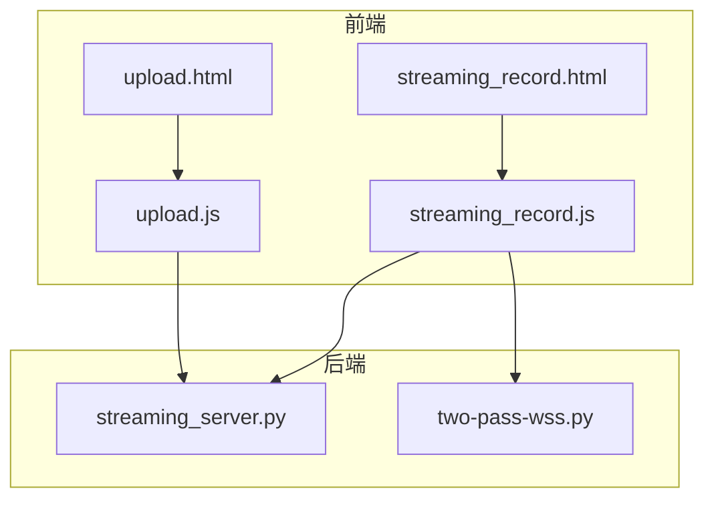
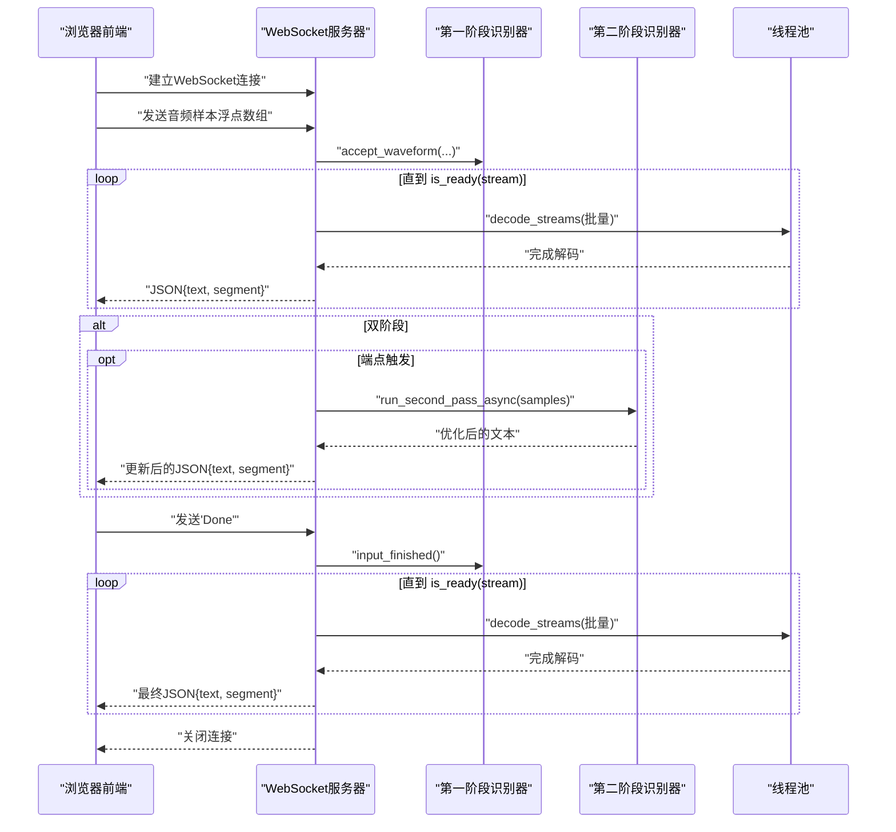
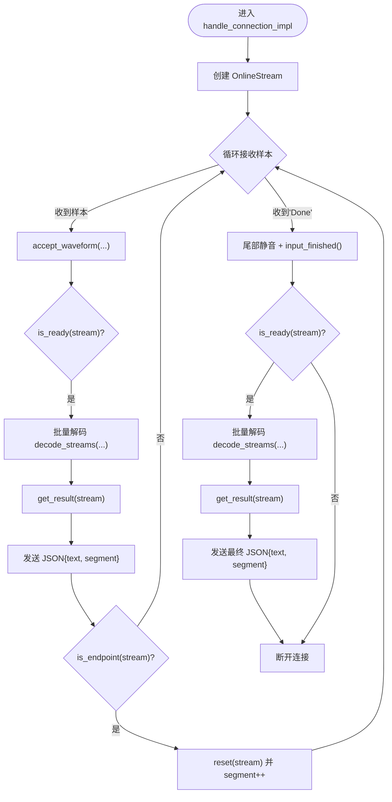
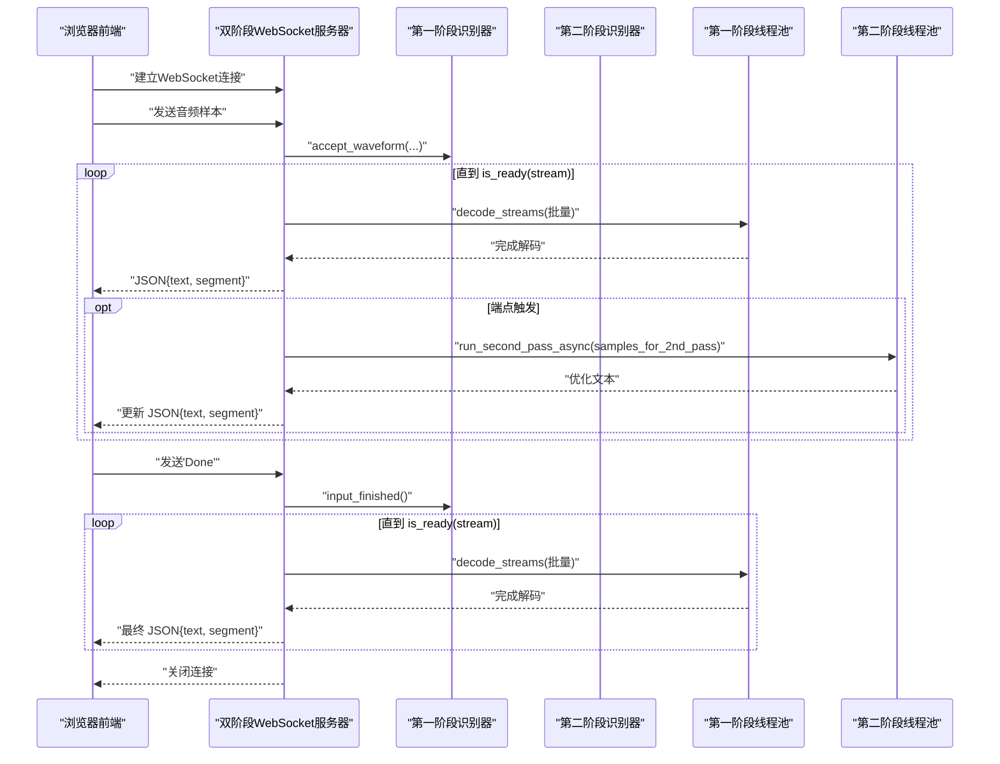
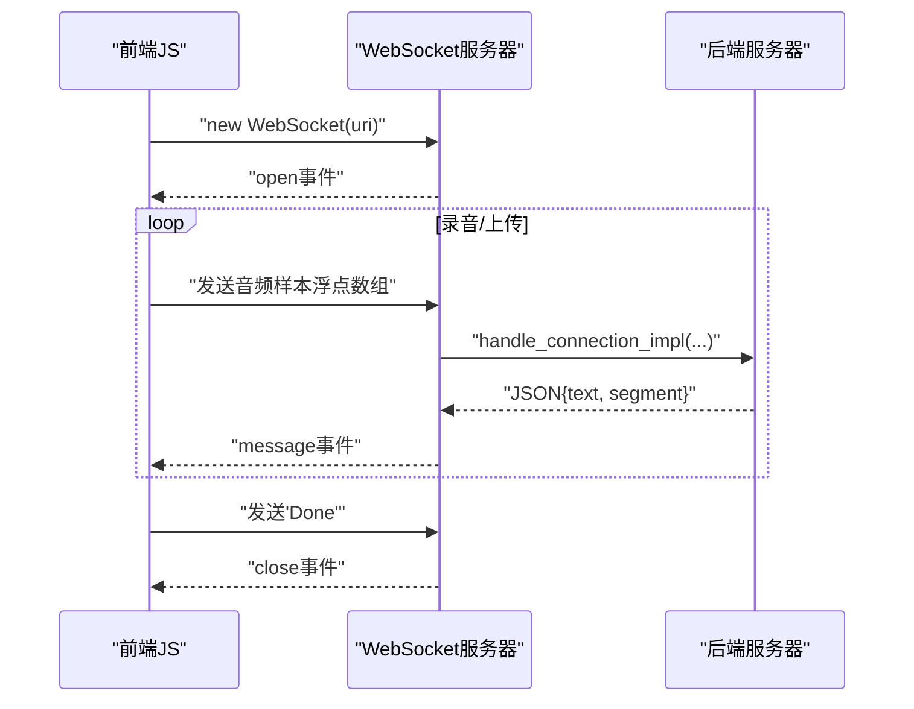
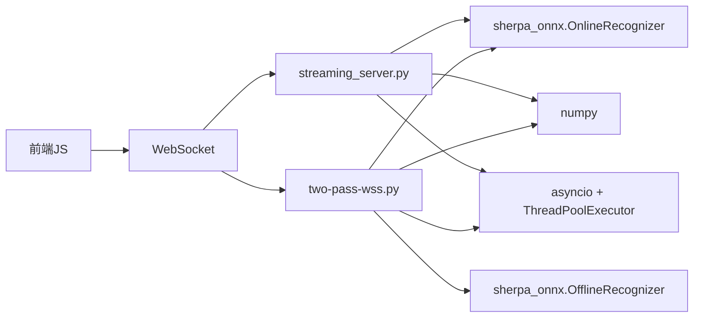

# WebSocket服务示例

<cite>
**本文引用的文件列表**
- [streaming_server.py](file://python-api-examples/streaming_server.py)
- [two-pass-wss.py](file://python-api-examples/two-pass-wss.py)
- [streaming_record.html](file://python-api-examples/web/streaming_record.html)
- [streaming_record.js](file://python-api-examples/web/js/streaming_record.js)
- [upload.html](file://python-api-examples/web/upload.html)
- [upload.js](file://python-api-examples/web/js/upload.js)
</cite>

## 目录
1. [简介](#简介)
2. [项目结构](#项目结构)
3. [核心组件](#核心组件)
4. [架构总览](#架构总览)
5. [详细组件分析](#详细组件分析)
6. [依赖关系分析](#依赖关系分析)
7. [性能考量](#性能考量)
8. [故障排查指南](#故障排查指南)
9. [结论](#结论)
10. [附录](#附录)

## 简介
本文件围绕 sherpa-onnx 的 Python API WebSocket 服务示例，系统性解析两个关键脚本：
- streaming_server.py：单阶段流式 ASR 的 WebSocket 服务器，支持多客户端并发、批量推理与端点检测。
- two-pass-wss.py：双阶段语音识别的 WebSocket 服务器，结合快速流式模型与高精度离线模型，先实时输出、再以第二阶段优化结果。

同时，文档覆盖前端 JavaScript 与后端 Python 的实时交互模式，包括连接管理、消息格式、错误恢复与性能调优建议。

## 项目结构
与 WebSocket 示例直接相关的目录与文件：
- 后端 Python 脚本
  - streaming_server.py（单阶段流式）
  - two-pass-wss.py（双阶段）
- 前端静态资源与脚本
  - python-api-examples/web/streaming_record.html（流式录音页面）
  - python-api-examples/web/js/streaming_record.js（流式录音前端逻辑）
  - python-api-examples/web/upload.html（上传文件页面）
  - python-api-examples/web/js/upload.js（上传文件前端逻辑）

图表来源
- [streaming_server.py](file://python-api-examples/streaming_server.py#L656-L779)
- [two-pass-wss.py](file://python-api-examples/two-pass-wss.py#L615-L738)
- [streaming_record.html](file://python-api-examples/web/streaming_record.html#L1-L82)
- [streaming_record.js](file://python-api-examples/web/js/streaming_record.js#L1-L200)
- [upload.html](file://python-api-examples/web/upload.html#L1-L69)
- [upload.js](file://python-api-examples/web/js/upload.js#L1-L135)

章节来源
- [streaming_server.py](file://python-api-examples/streaming_server.py#L656-L779)
- [two-pass-wss.py](file://python-api-examples/two-pass-wss.py#L615-L738)
- [streaming_record.html](file://python-api-examples/web/streaming_record.html#L1-L82)
- [streaming_record.js](file://python-api-examples/web/js/streaming_record.js#L1-L200)
- [upload.html](file://python-api-examples/web/upload.html#L1-L69)
- [upload.js](file://python-api-examples/web/js/upload.js#L1-L135)

## 核心组件
- 单阶段流式服务器（streaming_server.py）
  - 使用 sherpa_onnx.OnlineRecognizer 进行在线流式识别
  - 基于 asyncio 队列与线程池进行批处理与解码
  - 支持端点检测、批量等待时间与最大队列长度等参数
  - 提供 HTTP 文件服务与 WebSocket 处理入口
- 双阶段服务器（two-pass-wss.py）
  - 第一阶段：快速在线模型（如 Paraformer）提供实时中间结果
  - 第二阶段：高精度离线模型（如 SenseVoice）对完整片段进行精细化重识别
  - 异步线程池分别处理第一阶段与第二阶段，避免阻塞
  - 在端点触发时启动第二阶段并回写优化后的文本

章节来源
- [streaming_server.py](file://python-api-examples/streaming_server.py#L414-L483)
- [streaming_server.py](file://python-api-examples/streaming_server.py#L557-L605)
- [streaming_server.py](file://python-api-examples/streaming_server.py#L656-L779)
- [two-pass-wss.py](file://python-api-examples/two-pass-wss.py#L415-L443)
- [two-pass-wss.py](file://python-api-examples/two-pass-wss.py#L518-L598)
- [two-pass-wss.py](file://python-api-examples/two-pass-wss.py#L615-L738)

## 架构总览
WebSocket 交互流程（单阶段与双阶段均适用）：
- 前端通过 WebSocket 连接后，开始发送音频样本（每条消息为浮点数组或“Done”结束标记）
- 后端将样本注入 OnlineStream，按 ready 状态批量解码，周期性返回 JSON 文本结果
- 双阶段服务器在端点触发时，截取已发送片段，使用第二阶段模型进行重识别，并将优化结果回写到当前段落

图表来源
- [streaming_server.py](file://python-api-examples/streaming_server.py#L723-L779)
- [two-pass-wss.py](file://python-api-examples/two-pass-wss.py#L672-L738)

## 详细组件分析

### 单阶段流式服务器（streaming_server.py）
- 关键职责
  - 创建并配置 OnlineRecognizer（支持 Transducer、Paraformer、Zipformer2 CTC、WeNet CTC 等）
  - 维护连接数上限、消息大小限制、队列长度与批大小
  - 异步消费者任务从队列取出流，批量解码，完成后通知发送方
  - 处理 WebSocket 连接生命周期（接受/拒绝新连接、异常捕获、断开清理）
  - 实现端点检测与分段推送
- 数据流与处理逻辑
  - 接收音频样本 → 注入 OnlineStream → 检查 is_ready → 批量解码 → 获取结果 → 推送 JSON → 端点触发 reset 并递增 segment → 结束时发送尾部静音并 input_finished
- 参数与配置
  - 解码方法、热词、空白惩罚、端点规则、线程数、批大小、等待时间、消息大小、队列长度、最大连接数、Provider 等

图表来源
- [streaming_server.py](file://python-api-examples/streaming_server.py#L723-L779)

章节来源
- [streaming_server.py](file://python-api-examples/streaming_server.py#L414-L483)
- [streaming_server.py](file://python-api-examples/streaming_server.py#L557-L605)
- [streaming_server.py](file://python-api-examples/streaming_server.py#L656-L779)

### 双阶段 WebSocket 服务器（two-pass-wss.py）
- 双阶段协作
  - 第一阶段（OnlineRecognizer，如 Paraformer）：快速流式识别，提供实时中间文本
  - 第二阶段（OfflineRecognizer，如 SenseVoice）：对完整片段进行精细化重识别，提升准确性
- 关键实现要点
  - 维护两套线程池：第一阶段批处理与第二阶段异步执行
  - 在端点触发时，截取已发送片段，丢弃末尾冗余，调用第二阶段异步执行，得到优化文本后回写到当前段
  - 保持与单阶段相同的 WebSocket 交互协议（JSON 文本与段号）
- 性能与稳定性
  - 通过独立线程池隔离第二阶段计算，避免阻塞第一阶段流
  - 记录第二阶段耗时日志，便于性能评估

图表来源
- [two-pass-wss.py](file://python-api-examples/two-pass-wss.py#L567-L738)

章节来源
- [two-pass-wss.py](file://python-api-examples/two-pass-wss.py#L415-L443)
- [two-pass-wss.py](file://python-api-examples/two-pass-wss.py#L518-L598)
- [two-pass-wss.py](file://python-api-examples/two-pass-wss.py#L615-L738)

### 前端 JavaScript 与后端交互模式
- 流式录音页面（streaming_record.html + streaming_record.js）
  - 连接建立：根据当前页面协议自动选择 ws:// 或 wss://，构造 URI 并创建 WebSocket
  - 录音采集：使用 MediaRecorder 与 ScriptProcessor（或兼容接口）采集音频，按期望采样率下采样，转换为 Int16 缓冲，逐块发送给后端
  - 实时显示：接收后端 JSON 消息，按段号拼接显示；停止录音时发送“Done”，随后关闭连接
- 上传文件页面（upload.html + upload.js）
  - 选择文件后，使用 AudioContext 解码为 Float32 数组，按固定字节数分片发送，最后发送“Done”
  - 与流式录音一致的消息格式与结束标记

图表来源
- [streaming_record.js](file://python-api-examples/web/js/streaming_record.js#L20-L120)
- [streaming_record.js](file://python-api-examples/web/js/streaming_record.js#L160-L200)
- [upload.js](file://python-api-examples/web/js/upload.js#L50-L135)
- [streaming_server.py](file://python-api-examples/streaming_server.py#L723-L779)
- [two-pass-wss.py](file://python-api-examples/two-pass-wss.py#L672-L738)

章节来源
- [streaming_record.html](file://python-api-examples/web/streaming_record.html#L1-L82)
- [streaming_record.js](file://python-api-examples/web/js/streaming_record.js#L1-L200)
- [upload.html](file://python-api-examples/web/upload.html#L1-L69)
- [upload.js](file://python-api-examples/web/js/upload.js#L1-L135)

## 依赖关系分析
- 后端依赖
  - sherpa_onnx.OnlineRecognizer / OfflineRecognizer：模型识别能力
  - websockets：WebSocket 服务器框架
  - numpy：音频样本处理
  - asyncio + ThreadPoolExecutor：异步与批处理
- 前端依赖
  - HTML 页面与 Bootstrap 样式
  - JavaScript Web Audio API 与 WebSocket API

图表来源
- [streaming_server.py](file://python-api-examples/streaming_server.py#L656-L779)
- [two-pass-wss.py](file://python-api-examples/two-pass-wss.py#L615-L738)

章节来源
- [streaming_server.py](file://python-api-examples/streaming_server.py#L656-L779)
- [two-pass-wss.py](file://python-api-examples/two-pass-wss.py#L615-L738)

## 性能考量
- 批处理与等待策略
  - max_wait_ms：在队列不足时等待，减少频繁唤醒
  - max_batch_size：控制批大小，平衡延迟与吞吐
- 线程池规模
  - nn_pool_size：第一阶段批处理线程数
  - second_pass_threads：第二阶段独立线程池，避免阻塞
- 连接与消息限制
  - max_active_connections：防止过载
  - max_message_size / max_queue_size：保护内存与网络
- 端点检测
  - 合理设置端点规则，减少无效片段与重复第二阶段调用
- 采样率与数据类型
  - 前端统一转为 16kHz 浮点数组，后端按配置采样率注入，避免重采样开销

章节来源
- [streaming_server.py](file://python-api-examples/streaming_server.py#L312-L411)
- [two-pass-wss.py](file://python-api-examples/two-pass-wss.py#L302-L401)

## 故障排查指南
- 连接被拒绝（503）
  - 当前活动连接达到 max_active_connections 时，服务器会拒绝新连接
  - 建议：降低并发或提高上限
- WebSocket 断开
  - ConnectionClosed/ConnectionClosedError：检查前端是否正确发送“Done”并关闭连接
  - 建议：确保前端在停止录音/上传后发送“Done”，并等待服务器返回最终结果后再关闭
- 结果为空或不连续
  - 确认端点检测启用且触发条件合理
  - 检查批大小与等待时间，避免过小导致频繁解码
- 第二阶段未生效
  - 确认端点触发后有样本进入第二阶段
  - 检查第二阶段线程池是否正常运行
- 安全连接问题
  - 使用 wss:// 时需提供证书路径，否则浏览器可能阻止麦克风访问
  - 建议：在本地开发使用自签证书并允许浏览器信任

章节来源
- [streaming_server.py](file://python-api-examples/streaming_server.py#L645-L654)
- [streaming_server.py](file://python-api-examples/streaming_server.py#L710-L722)
- [two-pass-wss.py](file://python-api-examples/two-pass-wss.py#L600-L613)
- [two-pass-wss.py](file://python-api-examples/two-pass-wss.py#L648-L671)

## 结论
- streaming_server.py 提供了稳定、可扩展的单阶段流式 ASR WebSocket 服务，适合低延迟实时场景
- two-pass-wss.py 在保证实时性的前提下，通过第二阶段精细化识别显著提升准确性，适用于对准确度要求更高的应用
- 前后端采用统一的 WebSocket 协议与 JSON 消息格式，便于集成与扩展
- 通过合理的批处理、线程池与端点检测配置，可在延迟与吞吐之间取得良好平衡

## 附录
- 启动与参数
  - 单阶段：指定模型路径与采样率、特征维度、Provider 等
  - 双阶段：除第一阶段模型外，还需提供第二阶段离线模型与 tokens
- 前端页面
  - streaming_record.html：用于麦克风实时录音
  - upload.html：用于上传音频文件进行识别

章节来源
- [streaming_server.py](file://python-api-examples/streaming_server.py#L312-L411)
- [two-pass-wss.py](file://python-api-examples/two-pass-wss.py#L302-L401)
- [streaming_record.html](file://python-api-examples/web/streaming_record.html#L1-L82)
- [upload.html](file://python-api-examples/web/upload.html#L1-L69)