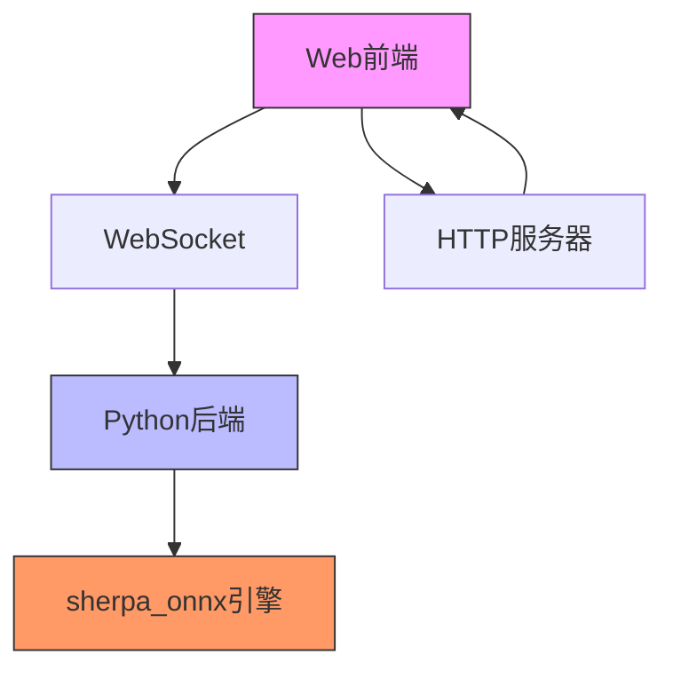
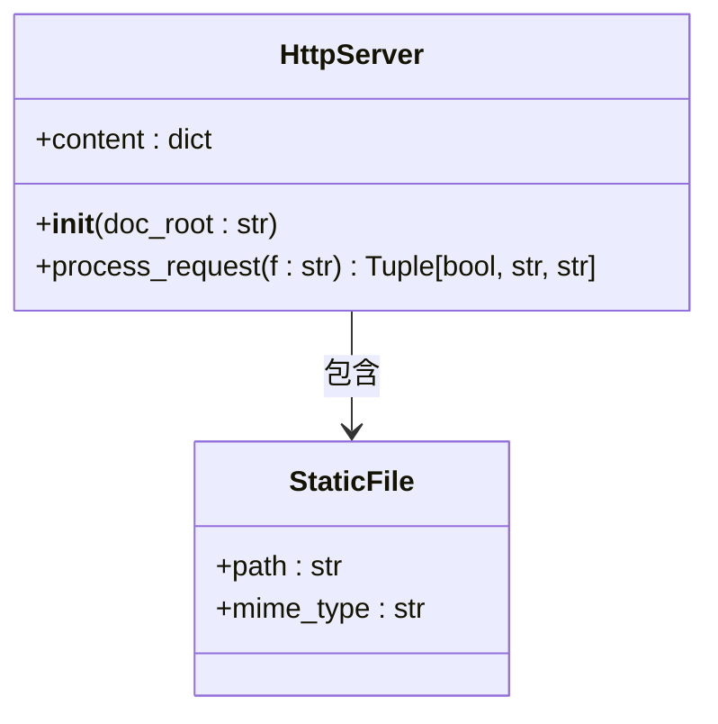
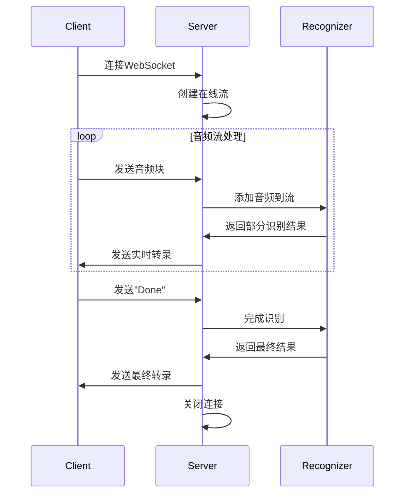
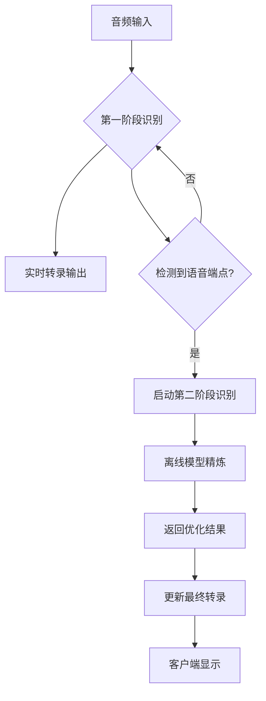
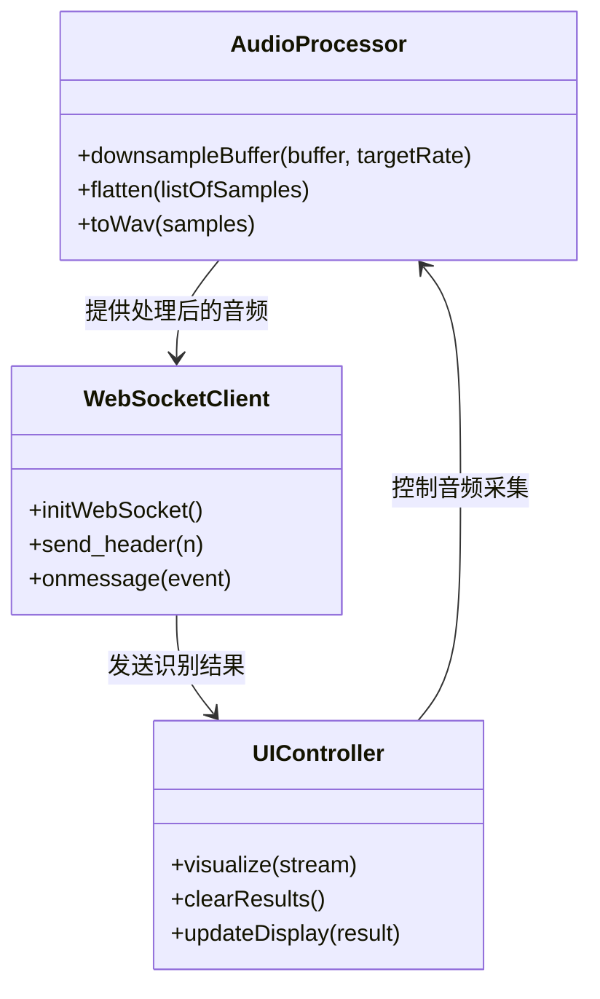
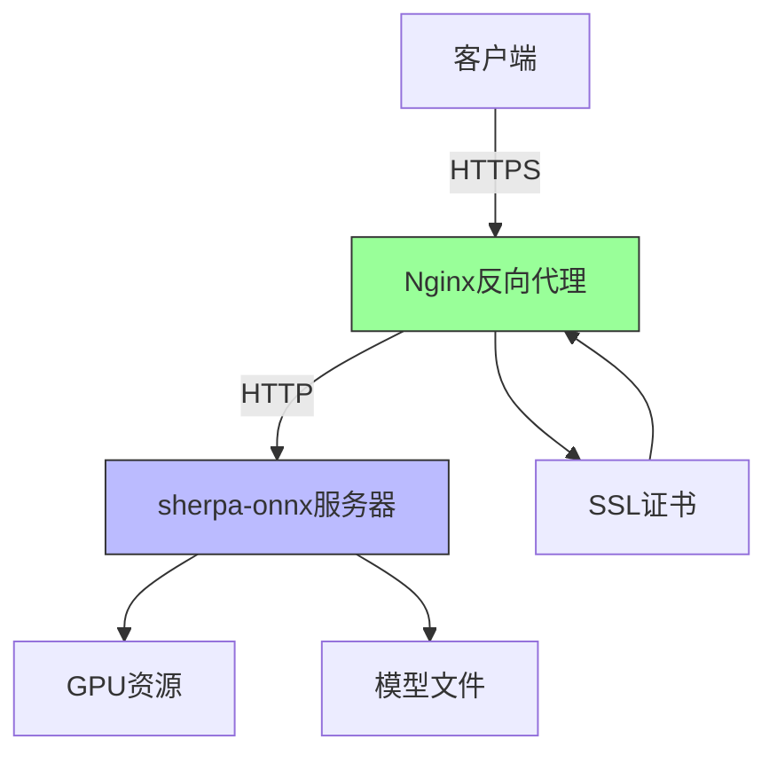

# Web服务示例

<cite>
**本文档引用的文件**   
- [two-pass-wss.py](file://python-api-examples/two-pass-wss.py)
- [http_server.py](file://python-api-examples/http_server.py)
- [streaming_server.py](file://python-api-examples/streaming_server.py)
- [non_streaming_server.py](file://python-api-examples/non_streaming_server.py)
- [web/index.html](file://python-api-examples/web/index.html)
- [web/streaming_record.html](file://python-api-examples/web/streaming_record.html)
- [web/offline_record.html](file://python-api-examples/web/offline_record.html)
- [web/upload.html](file://python-api-examples/web/upload.html)
- [web/js/streaming_record.js](file://python-api-examples/web/js/streaming_record.js)
- [web/js/offline_record.js](file://python-api-examples/web/js/offline_record.js)
- [web/js/upload.js](file://python-api-examples/web/js/upload.js)
- [web/generate-certificate.py](file://python-api-examples/web/generate-certificate.py)
- [web/start-https-server.py](file://python-api-examples/web/start-https-server.py)
</cite>

## 目录
1. [简介](#简介)
2. [项目结构](#项目结构)
3. [HTTP服务器实现](#http服务器实现)
4. [WebSocket服务器实现](#websocket服务器实现)
5. [双阶段语音识别架构](#双阶段语音识别架构)
6. [前端JavaScript集成](#前端javascript集成)
7. [HTTPS配置与生产部署](#https配置与生产部署)
8. [总结](#总结)

## 简介
sherpa-onnx项目提供了一套完整的Python API Web服务示例，实现了基于Flask和WebSocket的语音识别服务。这些示例展示了如何构建非流式和流式的自动语音识别（ASR）服务，支持实时音频流处理和批量音频文件识别。系统采用模块化设计，结合了Python后端和JavaScript前端，实现了高效的语音识别功能。

本文档将深入分析这些Web服务示例的实现细节，重点关注HTTP和WebSocket服务器的构建方式、双阶段语音识别架构的实现原理，以及前后端的集成方法。同时，文档还将提供HTTPS配置和生产环境部署的建议，帮助开发者快速搭建和部署自己的语音识别服务。

## 项目结构
sherpa-onnx的Web服务示例主要位于`python-api-examples`目录下，包含多个服务器实现和前端文件。核心结构如下：

```
python-api-examples/
├── web/
│   ├── js/
│   │   ├── offline_record.js
│   │   ├── streaming_record.js
│   │   └── upload.js
│   ├── index.html
│   ├── nav-partial.html
│   ├── offline_record.html
│   ├── streaming_record.html
│   └── upload.html
├── http_server.py
├── streaming_server.py
├── non_streaming_server.py
└── two-pass-wss.py
```

该结构清晰地分离了前端和后端组件。`web`目录包含所有前端HTML、CSS和JavaScript文件，而Python脚本则实现了不同类型的服务器。这种分离设计使得前后端可以独立开发和维护，同时通过WebSocket协议实现高效通信。



**文件来源**
- [web/index.html](file://python-api-examples/web/index.html)
- [web/streaming_record.html](file://python-api-examples/web/streaming_record.html)
- [web/offline_record.html](file://python-api-examples/web/offline_record.html)
- [web/upload.html](file://python-api-examples/web/upload.html)

## HTTP服务器实现
sherpa-onnx的HTTP服务器实现主要通过`http_server.py`文件完成，它提供了一个简单的静态文件服务器，用于托管前端网页和相关资源。该服务器基于Python标准库的websockets模块构建，能够处理HTTP请求并返回相应的静态文件。

`HttpServer`类是核心组件，它在初始化时加载所有预定义的静态文件及其MIME类型。服务器支持常见的Web资源类型，包括HTML、CSS、JavaScript和图像文件。当收到HTTP请求时，服务器会检查请求的路径是否在预定义的文件列表中，如果找到则返回文件内容，否则返回404错误页面。



服务器的`process_request`方法是处理HTTP请求的核心，它接收请求路径并返回一个包含三个元素的元组：布尔值表示文件是否找到、文件内容或错误信息、以及MIME类型。这种设计使得服务器能够灵活地处理各种静态资源请求，为前端应用提供稳定的服务支持。

**文件来源**
- [http_server.py](file://python-api-examples/http_server.py)

## WebSocket服务器实现
sherpa-onnx的WebSocket服务器实现提供了流式和非流式两种语音识别服务。`streaming_server.py`实现了流式ASR服务，允许客户端实时发送音频数据并接收部分识别结果；`non_streaming_server.py`则实现了非流式服务，客户端一次性发送完整音频文件进行识别。

流式服务器采用异步架构，利用`asyncio`和`ThreadPoolExecutor`实现高效的并发处理。服务器维护一个流队列，将来自多个客户端的音频流批量处理，以提高神经网络计算的效率。每个连接都有独立的在线识别器实例，确保识别过程的隔离性和准确性。



非流式服务器采用不同的数据传输协议，客户端首先发送包含采样率和数据长度的头部信息，然后分块发送音频数据。服务器在收到所有数据后进行一次性识别，并将结果返回给客户端。这种设计适用于处理预先录制的音频文件，确保了识别的完整性和准确性。

**文件来源**
- [streaming_server.py](file://python-api-examples/streaming_server.py)
- [non_streaming_server.py](file://python-api-examples/non_streaming_server.py)

## 双阶段语音识别架构
`two-pass-wss.py`文件实现了sherpa-onnx中最具特色的双阶段语音识别架构。这种架构结合了流式和非流式识别的优势，既提供实时反馈又保证最终结果的高准确性。第一阶段使用快速的流式模型进行实时识别，第二阶段使用更精确的离线模型对完整语句进行重新处理。

双阶段架构的核心是`StreamingServer`类，它同时管理两个识别器实例：一个用于第一阶段的在线识别器和一个用于第二阶段的离线识别器。当检测到语音端点时，服务器会将累积的音频数据发送到第二阶段识别器进行精炼处理，并将更准确的结果推送给客户端。



这种架构的关键优势在于平衡了实时性和准确性。第一阶段的流式识别确保了低延迟的用户体验，用户可以立即看到部分识别结果；第二阶段的离线识别则利用更强大的模型和完整的上下文信息，显著提高了最终结果的准确率。两个阶段的识别器可以使用不同的模型架构，如Paraformer用于第一阶段，SenseVoice用于第二阶段，充分发挥各自模型的优势。

**文件来源**
- [two-pass-wss.py](file://python-api-examples/two-pass-wss.py)

## 前端JavaScript集成
前端JavaScript代码位于`web/js/`目录下，实现了与后端WebSocket服务器的完整集成。`streaming_record.js`、`offline_record.js`和`upload.js`分别对应三种不同的语音识别场景，展示了如何通过浏览器API获取音频数据并传输到后端服务。

前端实现的关键技术包括：
1. 使用`navigator.mediaDevices.getUserMedia` API访问用户的麦克风设备
2. 通过`AudioContext`和`ScriptProcessorNode`实时处理音频流
3. 实现音频重采样功能，将麦克风采集的音频转换为模型所需的16kHz采样率
4. 通过WebSocket连接与后端服务器通信，实时发送音频数据和接收识别结果



前端代码还实现了音频可视化功能，使用Canvas API绘制实时的波形图，增强了用户体验。当用户停止录音时，前端会将累积的音频数据保存为WAV文件，允许用户回放和管理录音。这种完整的前后端集成方案为开发者提供了可直接使用的模板，大大降低了开发门槛。

**文件来源**
- [web/js/streaming_record.js](file://python-api-examples/web/js/streaming_record.js)
- [web/js/offline_record.js](file://python-api-examples/web/js/offline_record.js)
- [web/js/upload.js](file://python-api-examples/web/js/upload.js)

## HTTPS配置与生产部署
为了在生产环境中安全地部署sherpa-onnx Web服务，项目提供了完整的HTTPS配置方案。`web/generate-certificate.py`脚本可以生成自签名SSL证书，而`start-https-server.py`则演示了如何使用证书启动安全的WebSocket服务器。

生产环境部署的关键建议包括：
1. **使用HTTPS**：始终使用SSL/TLS加密WebSocket连接（wss://），特别是在公共网络中
2. **配置反向代理**：使用Nginx等反向代理服务器处理SSL终止和负载均衡
3. **资源优化**：根据服务器硬件配置调整`nn_pool_size`和`max_batch_size`参数
4. **连接管理**：合理设置`max_active_connections`以防止资源耗尽
5. **日志监控**：启用详细的日志记录以便于故障排查和性能分析



对于大规模部署，建议使用容器化技术（如Docker）打包应用，并结合Kubernetes进行集群管理。这样可以实现服务的弹性伸缩和高可用性。同时，应定期更新模型文件和依赖库，确保系统的安全性和性能处于最佳状态。

**文件来源**
- [web/generate-certificate.py](file://python-api-examples/web/generate-certificate.py)
- [web/start-https-server.py](file://python-api-examples/web/start-https-server.py)

## 总结
sherpa-onnx的Web服务示例如何通过Python和JavaScript的紧密结合，实现了功能完整、性能优越的语音识别系统。从HTTP服务器的静态文件托管，到WebSocket服务器的实时音频处理，再到双阶段识别架构的创新设计，整个系统展示了现代Web应用开发的最佳实践。

这些示例不仅提供了可直接运行的代码，更重要的是展示了如何构建可扩展、高性能的语音识别服务。开发者可以根据具体需求选择合适的服务器类型，或基于现有代码进行定制开发。通过理解这些示例的架构和实现细节，开发者可以快速构建自己的语音识别应用，加速产品开发进程。