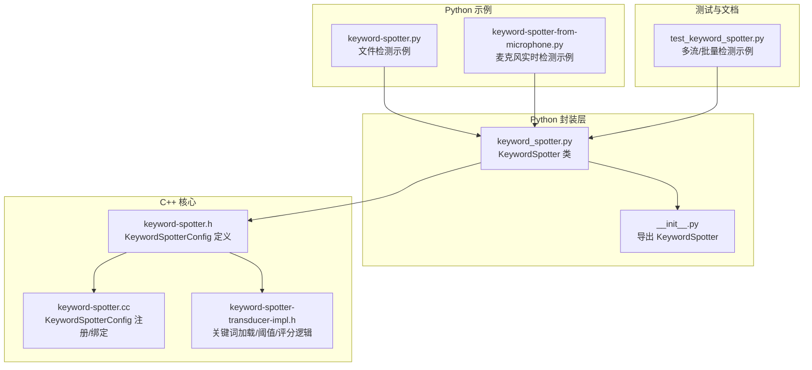
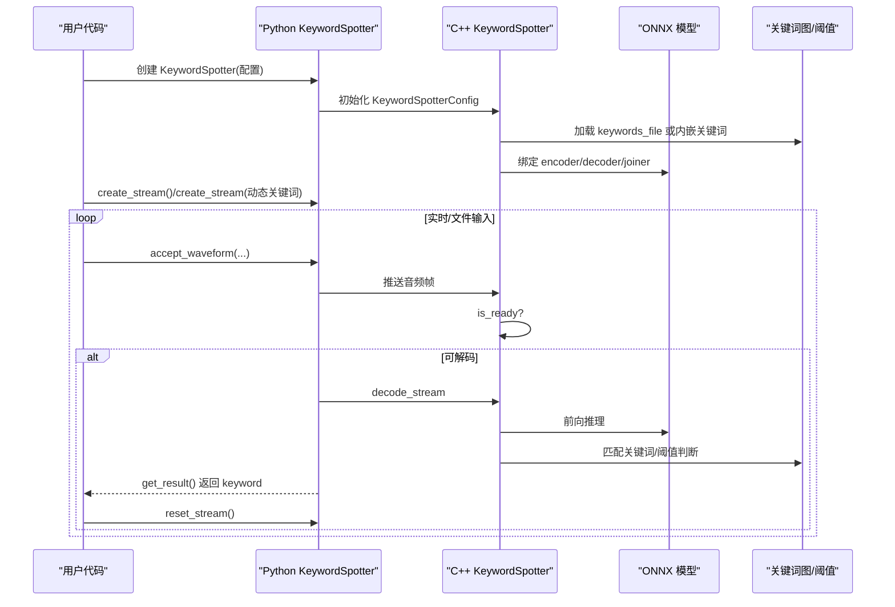
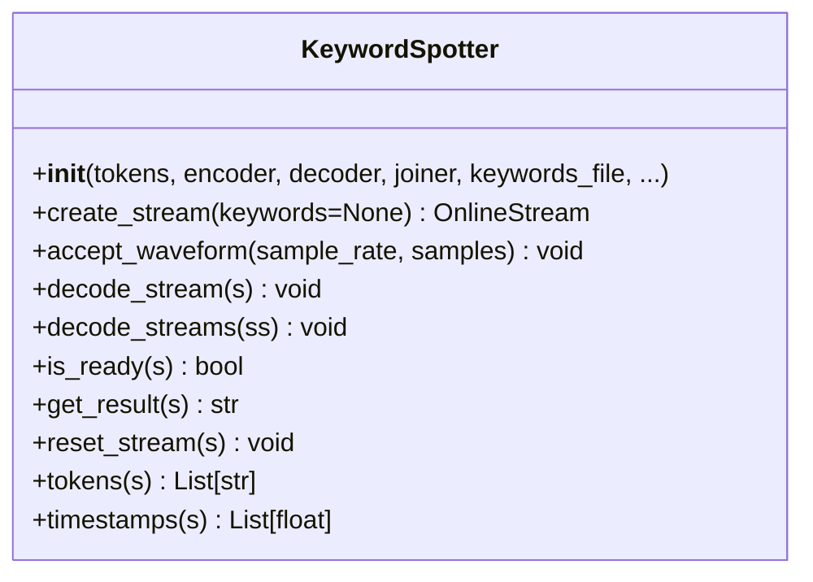
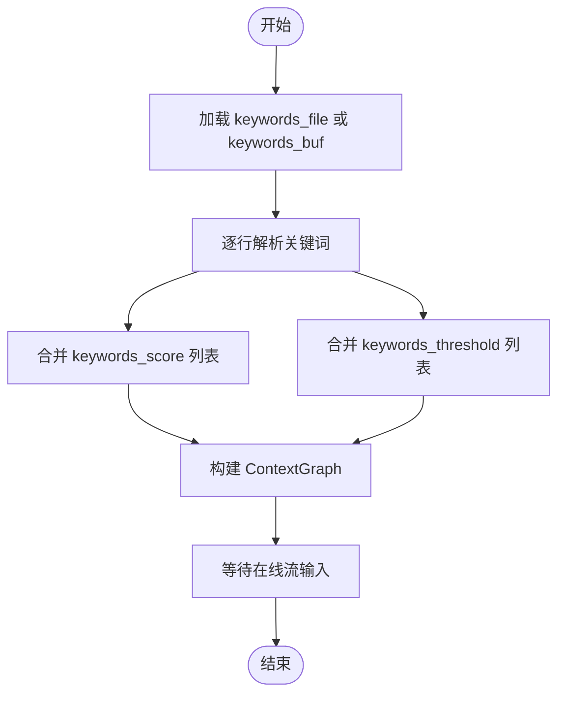
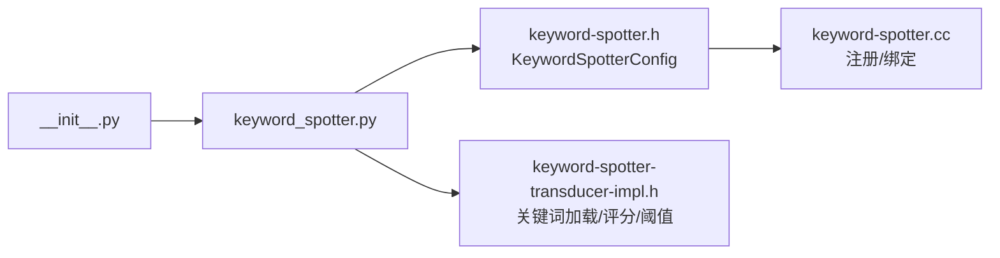

# 关键词检测示例

<cite>
**本文引用的文件**
- [python-api-examples/keyword-spotter.py](file://python-api-examples/keyword-spotter.py)
- [python-api-examples/keyword-spotter-from-microphone.py](file://python-api-examples/keyword-spotter-from-microphone.py)
- [sherpa-onnx/python/sherpa_onnx/keyword_spotter.py](file://sherpa-onnx/python/sherpa_onnx/keyword_spotter.py)
- [sherpa-onnx/python/sherpa_onnx/__init__.py](file://sherpa-onnx/python/sherpa_onnx/__init__.py)
- [sherpa-onnx/python/tests/test_keyword_spotter.py](file://sherpa-onnx/python/tests/test_keyword_spotter.py)
- [sherpa-onnx/csrc/keyword-spotter.h](file://sherpa-onnx/csrc/keyword-spotter.h)
- [sherpa-onnx/csrc/keyword-spotter.cc](file://sherpa-onnx/csrc/keyword-spotter.cc)
- [sherpa-onnx/csrc/keyword-spotter-transducer-impl.h](file://sherpa-onnx/csrc/keyword-spotter-transducer-impl.h)
</cite>

## 目录
1. [简介](#简介)
2. [项目结构](#项目结构)
3. [核心组件](#核心组件)
4. [架构总览](#架构总览)
5. [详细组件分析](#详细组件分析)
6. [依赖关系分析](#依赖关系分析)
7. [性能与优化](#性能与优化)
8. [故障排查指南](#故障排查指南)
9. [结论](#结论)
10. [附录](#附录)

## 简介
本文件面向使用 sherpa-onnx Python API 进行关键词检测（Keyword Spotting，简称 KWS）的开发者，系统性讲解 KeywordSpotter 类的实现原理、配置方法、运行流程与最佳实践。内容涵盖：
- 如何配置关键词列表与检测灵敏度参数
- 如何处理检测结果并理解置信度与阈值
- 从音频文件与麦克风流中进行关键词检测的完整示例
- 多关键词检测与动态关键词更新的高级用法
- 误报率控制与性能优化建议

## 项目结构
与关键词检测相关的文件主要分布在以下位置：
- Python 示例：python-api-examples 下的两个脚本，分别演示“从文件”和“从麦克风”的实时检测
- Python 封装层：sherpa-onnx/python/sherpa_onnx/keyword_spotter.py 提供 KeywordSpotter 的 Python 接口
- Python 导出入口：sherpa-onnx/python/sherpa_onnx/__init__.py 将 KeywordSpotter 暴露给用户
- 测试用例：sherpa-onnx/python/tests/test_keyword_spotter.py 展示批量/并发流的使用方式
- C++ 核心：sherpa-onnx/csrc 下的头文件与实现定义了 KeywordSpotterConfig、解码器与上下文图等关键结构

图表来源
- [python-api-examples/keyword-spotter.py](file://python-api-examples/keyword-spotter.py#L1-L118)
- [python-api-examples/keyword-spotter-from-microphone.py](file://python-api-examples/keyword-spotter-from-microphone.py#L1-L197)
- [sherpa-onnx/python/sherpa_onnx/keyword_spotter.py](file://sherpa-onnx/python/sherpa_onnx/keyword_spotter.py#L1-L160)
- [sherpa-onnx/python/sherpa_onnx/__init__.py](file://sherpa-onnx/python/sherpa_onnx/__init__.py#L1-L84)
- [sherpa-onnx/python/tests/test_keyword_spotter.py](file://sherpa-onnx/python/tests/test_keyword_spotter.py#L1-L177)
- [sherpa-onnx/csrc/keyword-spotter.h](file://sherpa-onnx/csrc/keyword-spotter.h#L53-L102)
- [sherpa-onnx/csrc/keyword-spotter.cc](file://sherpa-onnx/csrc/keyword-spotter.cc#L31-L52)
- [sherpa-onnx/csrc/keyword-spotter-transducer-impl.h](file://sherpa-onnx/csrc/keyword-spotter-transducer-impl.h#L294-L343)

章节来源
- [python-api-examples/keyword-spotter.py](file://python-api-examples/keyword-spotter.py#L1-L118)
- [python-api-examples/keyword-spotter-from-microphone.py](file://python-api-examples/keyword-spotter-from-microphone.py#L1-L197)
- [sherpa-onnx/python/sherpa_onnx/keyword_spotter.py](file://sherpa-onnx/python/sherpa_onnx/keyword_spotter.py#L1-L160)
- [sherpa-onnx/python/sherpa_onnx/__init__.py](file://sherpa-onnx/python/sherpa_onnx/__init__.py#L1-L84)
- [sherpa-onnx/python/tests/test_keyword_spotter.py](file://sherpa-onnx/python/tests/test_keyword_spotter.py#L1-L177)
- [sherpa-onnx/csrc/keyword-spotter.h](file://sherpa-onnx/csrc/keyword-spotter.h#L53-L102)
- [sherpa-onnx/csrc/keyword-spotter.cc](file://sherpa-onnx/csrc/keyword-spotter.cc#L31-L52)
- [sherpa-onnx/csrc/keyword-spotter-transducer-impl.h](file://sherpa-onnx/csrc/keyword-spotter-transducer-impl.h#L294-L343)

## 核心组件
- KeywordSpotter（Python 封装）
  - 负责加载模型、初始化特征提取器、构建 KeywordSpotterConfig 并对外暴露 create_stream、accept_waveform、decode_stream、is_ready、get_result、reset_stream 等方法
  - 支持通过 keywords_file 预置关键词，或在 create_stream 时传入动态关键词字符串
- KeywordSpotterConfig（C++）
  - 包含 max_active_paths、num_trailing_blanks、keywords_score、keywords_threshold、keywords_file 等关键参数
  - 用于注册命令行参数与字符串化输出
- 关键词加载与评分/阈值合并
  - 从 keywords_file 或内嵌缓冲区解析关键词，按配置为每个关键词注入额外评分与阈值
  - 构建 ContextGraph 以支持关键词匹配与触发

章节来源
- [sherpa-onnx/python/sherpa_onnx/keyword_spotter.py](file://sherpa-onnx/python/sherpa_onnx/keyword_spotter.py#L22-L160)
- [sherpa-onnx/csrc/keyword-spotter.h](file://sherpa-onnx/csrc/keyword-spotter.h#L53-L102)
- [sherpa-onnx/csrc/keyword-spotter.cc](file://sherpa-onnx/csrc/keyword-spotter.cc#L31-L52)
- [sherpa-onnx/csrc/keyword-spotter-transducer-impl.h](file://sherpa-onnx/csrc/keyword-spotter-transducer-impl.h#L150-L178)

## 架构总览
下图展示了从 Python 调用到 C++ 核心的关键交互路径，以及关键词配置与检测流程。

图表来源
- [sherpa-onnx/python/sherpa_onnx/keyword_spotter.py](file://sherpa-onnx/python/sherpa_onnx/keyword_spotter.py#L134-L160)
- [sherpa-onnx/csrc/keyword-spotter.h](file://sherpa-onnx/csrc/keyword-spotter.h#L53-L102)
- [sherpa-onnx/csrc/keyword-spotter-transducer-impl.h](file://sherpa-onnx/csrc/keyword-spotter-transducer-impl.h#L294-L343)

## 详细组件分析

### KeywordSpotter 类与方法
- 构造函数参数要点
  - tokens/encoder/decoder/joiner：模型文件路径
  - keywords_file：关键词文件路径（每行一个关键词，词元间以空格分隔）
  - num_threads、sample_rate、feature_dim：模型与特征相关配置
  - max_active_paths：修改后的束搜索的活跃路径数
  - keywords_score：关键词词元的额外评分加成
  - keywords_threshold：关键词触发阈值（概率）
  - num_trailing_blanks：关键词后跟随的空白帧数量
  - provider/device：ONNX Runtime 执行提供者与设备索引
- 关键方法
  - create_stream(keywords=None)：创建在线流；可选传入动态关键词字符串
  - accept_waveform(sample_rate, samples)：向流推送音频样本
  - decode_stream(s)/decode_streams(ss)：对就绪流执行解码
  - is_ready(s)：判断流是否已准备好解码
  - get_result(s)：获取检测结果（返回 keyword 字段）
  - reset_stream(s)：重置流状态，以便继续检测下一个关键词

图表来源
- [sherpa-onnx/python/sherpa_onnx/keyword_spotter.py](file://sherpa-onnx/python/sherpa_onnx/keyword_spotter.py#L134-L160)

章节来源
- [sherpa-onnx/python/sherpa_onnx/keyword_spotter.py](file://sherpa-onnx/python/sherpa_onnx/keyword_spotter.py#L22-L160)

### 关键词列表配置与动态更新
- 预置关键词
  - 通过 keywords_file 指定，每行一个关键词，词元之间以空格分隔
  - 示例脚本展示了从文件加载关键词并进行检测
- 动态关键词
  - 在 create_stream("词1/词2/...") 时直接传入关键词字符串，实现一次性检测
  - 示例脚本展示了在同一流上叠加新关键词并检测
- 多关键词检测
  - 使用多个 OnlineStream 并行检测，或在单一流上多次 reset 后检测不同关键词
  - 测试用例展示了批量/并发流的使用模式

章节来源
- [python-api-examples/keyword-spotter.py](file://python-api-examples/keyword-spotter.py#L46-L118)
- [sherpa-onnx/python/tests/test_keyword_spotter.py](file://sherpa-onnx/python/tests/test_keyword_spotter.py#L48-L177)

### 从音频文件进行关键词检测
- 步骤概览
  - 读取 WAV 文件为浮点样本数组
  - 创建流并推送样本，随后追加尾部填充以触发结束
  - 循环调用 is_ready/decode_stream/get_result，检测到关键词后 reset_stream
- 示例参考
  - 文件路径与参数示例见脚本注释与参数定义

章节来源
- [python-api-examples/keyword-spotter.py](file://python-api-examples/keyword-spotter.py#L1-L118)

### 从麦克风流进行关键词检测
- 步骤概览
  - 读取命令行参数（tokens/encoder/decoder/joiner、num_threads、provider、max_active_paths、keywords_file、keywords_score、keywords_threshold、num_trailing_blanks）
  - 创建 KeywordSpotter 实例
  - 以固定时间片（如 0.1 秒）从麦克风读取音频，推送到流
  - 循环检查 is_ready 并解码，打印检测结果，随后 reset_stream
- 示例参考
  - 参数与默认值、设备查询与异常处理均在脚本中体现

章节来源
- [python-api-examples/keyword-spotter-from-microphone.py](file://python-api-examples/keyword-spotter-from-microphone.py#L1-L197)

### 检测结果与置信度
- 结果字段
  - get_result(s) 返回 keyword 字符串；还可通过 tokens(s)、timestamps(s) 获取词元序列与时序信息
- 置信度与阈值
  - keywords_threshold 控制触发阈值（概率），越大越难触发，越小越容易触发
  - keywords_score 对关键词词元施加额外评分加成，提升其在束搜索中的存活概率
- 建议
  - 默认阈值通常在 0.2~0.3 左右；若误报较多可提高阈值，若漏检较多可降低阈值
  - keywords_score 一般保持默认即可；当关键词重叠或词元相似时可适当增大

章节来源
- [sherpa-onnx/python/sherpa_onnx/keyword_spotter.py](file://sherpa-onnx/python/sherpa_onnx/keyword_spotter.py#L134-L160)
- [sherpa-onnx/csrc/keyword-spotter.h](file://sherpa-onnx/csrc/keyword-spotter.h#L53-L102)
- [sherpa-onnx/csrc/keyword-spotter-transducer-impl.h](file://sherpa-onnx/csrc/keyword-spotter-transducer-impl.h#L150-L178)

### 关键词加载与评分/阈值合并逻辑
- 关键词来源
  - 从 keywords_file 逐行解析；也可通过 keywords_buf 内嵌字符串解析
- 评分与阈值
  - 对默认关键词与自定义关键词分别注入 keywords_score 与 keywords_threshold
  - 合并后构建 ContextGraph，用于在线流的匹配与触发判断

图表来源
- [sherpa-onnx/csrc/keyword-spotter-transducer-impl.h](file://sherpa-onnx/csrc/keyword-spotter-transducer-impl.h#L294-L343)
- [sherpa-onnx/csrc/keyword-spotter-transducer-impl.h](file://sherpa-onnx/csrc/keyword-spotter-transducer-impl.h#L150-L178)

## 依赖关系分析
- Python 入口导出
  - __init__.py 将 KeywordSpotter 从底层库导入并暴露给用户
- Python 封装与 C++ 核心
  - keyword_spotter.py 通过 FeatureExtractorConfig、OnlineModelConfig、ProviderConfig、KeywordSpotterConfig 等配置对象桥接 Python 与 C++
- 关键词配置注册
  - keyword-spotter.cc 中对 KeywordSpotterConfig 的字段进行命令行注册，便于 CLI 工具使用

图表来源
- [sherpa-onnx/python/sherpa_onnx/__init__.py](file://sherpa-onnx/python/sherpa_onnx/__init__.py#L1-L84)
- [sherpa-onnx/python/sherpa_onnx/keyword_spotter.py](file://sherpa-onnx/python/sherpa_onnx/keyword_spotter.py#L1-L160)
- [sherpa-onnx/csrc/keyword-spotter.h](file://sherpa-onnx/csrc/keyword-spotter.h#L53-L102)
- [sherpa-onnx/csrc/keyword-spotter.cc](file://sherpa-onnx/csrc/keyword-spotter.cc#L31-L52)
- [sherpa-onnx/csrc/keyword-spotter-transducer-impl.h](file://sherpa-onnx/csrc/keyword-spotter-transducer-impl.h#L294-L343)

章节来源
- [sherpa-onnx/python/sherpa_onnx/__init__.py](file://sherpa-onnx/python/sherpa_onnx/__init__.py#L1-L84)
- [sherpa-onnx/python/sherpa_onnx/keyword_spotter.py](file://sherpa-onnx/python/sherpa_onnx/keyword_spotter.py#L1-L160)
- [sherpa-onnx/csrc/keyword-spotter.h](file://sherpa-onnx/csrc/keyword-spotter.h#L53-L102)
- [sherpa-onnx/csrc/keyword-spotter.cc](file://sherpa-onnx/csrc/keyword-spotter.cc#L31-L52)
- [sherpa-onnx/csrc/keyword-spotter-transducer-impl.h](file://sherpa-onnx/csrc/keyword-spotter-transducer-impl.h#L294-L343)

## 性能与优化
- 解码参数
  - num_threads：增加线程数可提升吞吐，但受模型与硬件限制
  - max_active_paths：增大可提升召回，但会增加计算开销
  - num_trailing_blanks：当关键词存在重叠词元时适当增大，避免提前触发
- 输入策略
  - 文件检测：在输入末尾追加尾部填充，确保模型完成最终决策
  - 实时检测：以较小的时间片（如 0.1 秒）推送，配合 is_ready/decode_stream 循环
- 设备选择
  - provider 可选 cpu/cuda/coreml；在支持 CUDA 的环境下可显著加速
- 多流并行
  - 使用 decode_streams 对多个就绪流并行解码，减少轮询开销
- 误报控制
  - 提高 keywords_threshold 与 keywords_score 可有效抑制误报
  - 合理设置 num_trailing_blanks，避免相邻关键词互相干扰

章节来源
- [python-api-examples/keyword-spotter-from-microphone.py](file://python-api-examples/keyword-spotter-from-microphone.py#L1-L197)
- [sherpa-onnx/python/tests/test_keyword_spotter.py](file://sherpa-onnx/python/tests/test_keyword_spotter.py#L48-L177)
- [sherpa-onnx/csrc/keyword-spotter.h](file://sherpa-onnx/csrc/keyword-spotter.h#L53-L102)

## 故障排查指南
- 常见问题
  - 模型文件不存在：构造函数会断言文件存在；请确认 tokens/encoder/decoder/joiner 与 keywords_file 路径正确
  - 采样率不匹配：文件读取示例将样本归一化至[-1,1]，但 sample_rate 应与模型训练一致
  - 未调用 reset_stream：检测到关键词后必须 reset，否则后续无法继续检测
  - 未追加尾部填充：可能导致模型未能完成最终决策，建议在输入末尾添加约 0.2~0.8 秒的零填充
- 调试建议
  - 逐步打印 is_ready/decode_stream/get_result 的循环状态
  - 使用更宽松的阈值先验证流程，再逐步收紧
  - 对多关键词场景，先单独验证每个关键词，再组合测试

章节来源
- [sherpa-onnx/python/sherpa_onnx/keyword_spotter.py](file://sherpa-onnx/python/sherpa_onnx/keyword_spotter.py#L93-L133)
- [python-api-examples/keyword-spotter.py](file://python-api-examples/keyword-spotter.py#L60-L118)
- [python-api-examples/keyword-spotter-from-microphone.py](file://python-api-examples/keyword-spotter-from-microphone.py#L133-L197)

## 结论
通过 Python 封装层与 C++ 核心的协同，sherpa-onnx 的 KeywordSpotter 提供了灵活、高效的关键词检测能力。开发者可通过 keywords_file 配置预置关键词，或在运行时动态注入关键词；通过 keywords_score 与 keywords_threshold 精细控制检测灵敏度；结合多流并行与合理的输入策略，可在保证低延迟的同时获得稳定的检测效果。

## 附录
- 示例脚本路径
  - 文件检测示例：[python-api-examples/keyword-spotter.py](file://python-api-examples/keyword-spotter.py#L1-L118)
  - 麦克风实时检测示例：[python-api-examples/keyword-spotter-from-microphone.py](file://python-api-examples/keyword-spotter-from-microphone.py#L1-L197)
- 关键词加载与评分/阈值合并
  - [sherpa-onnx/csrc/keyword-spotter-transducer-impl.h](file://sherpa-onnx/csrc/keyword-spotter-transducer-impl.h#L294-L343)
  - [sherpa-onnx/csrc/keyword-spotter-transducer-impl.h](file://sherpa-onnx/csrc/keyword-spotter-transducer-impl.h#L150-L178)
- 配置结构与注册
  - [sherpa-onnx/csrc/keyword-spotter.h](file://sherpa-onnx/csrc/keyword-spotter.h#L53-L102)
  - [sherpa-onnx/csrc/keyword-spotter.cc](file://sherpa-onnx/csrc/keyword-spotter.cc#L31-L52)