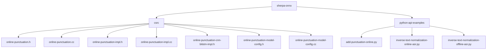
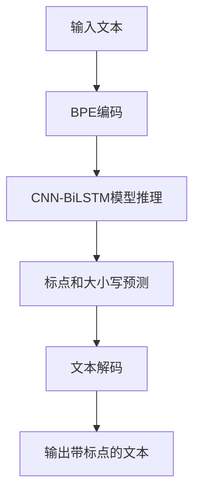
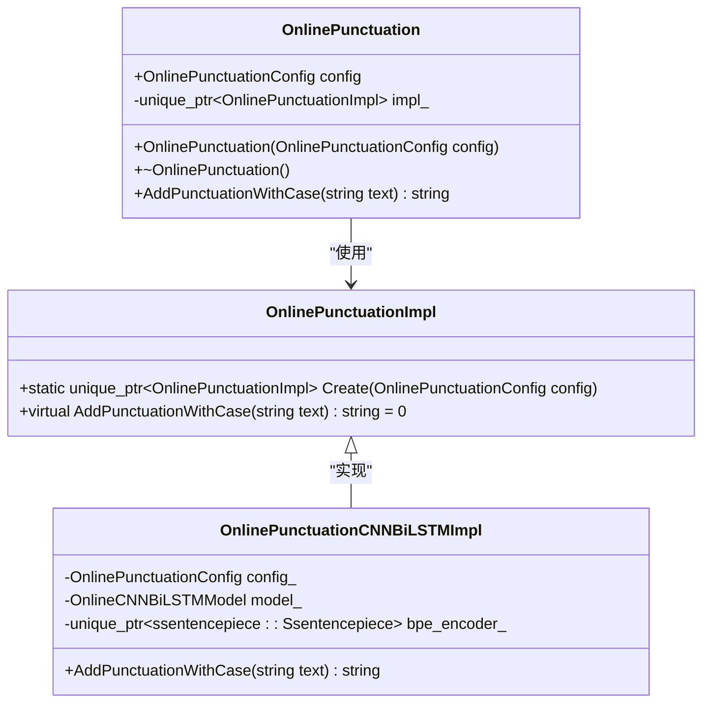
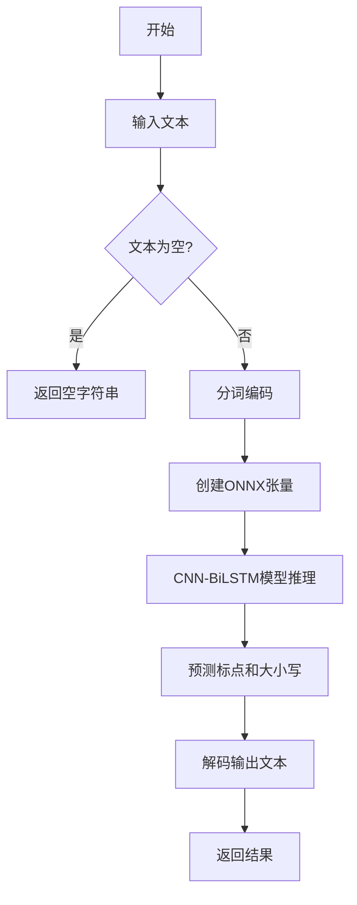
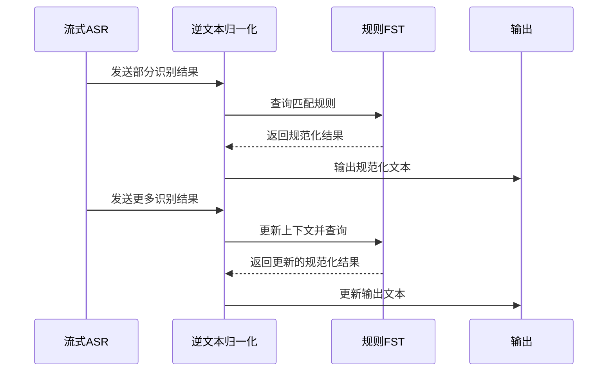
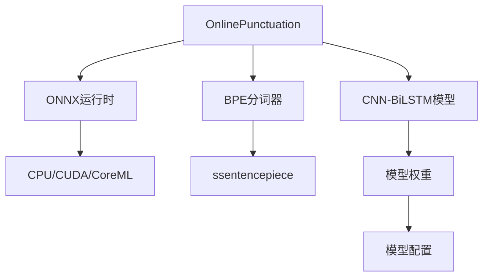
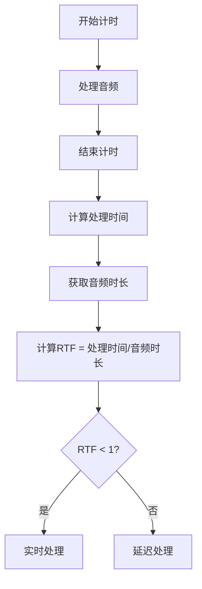

# 在线标点恢复

<cite>
**本文档引用的文件**
- [online-punctuation.h](file://sherpa-onnx/csrc/online-punctuation.h)
- [online-punctuation.cc](file://sherpa-onnx/csrc/online-punctuation.cc)
- [online-punctuation-impl.h](file://sherpa-onnx/csrc/online-punctuation-impl.h)
- [online-punctuation-impl.cc](file://sherpa-onnx/csrc/online-punctuation-impl.cc)
- [online-punctuation-cnn-bilstm-impl.h](file://sherpa-onnx/csrc/online-punctuation-cnn-bilstm-impl.h)
- [online-punctuation-model-config.h](file://sherpa-onnx/csrc/online-punctuation-model-config.h)
- [online-punctuation-model-config.cc](file://sherpa-onnx/csrc/online-punctuation-model-config.cc)
- [online-punctuation.cc](file://sherpa-onnx/python/csrc/online-punctuation.cc)
- [add-punctuation-online.py](file://python-api-examples/add-punctuation-online.py)
- [inverse-text-normalization-online-asr.py](file://python-api-examples/inverse-text-normalization-online-asr.py)
- [inverse-text-normalization-offline-asr.py](file://python-api-examples/inverse-text-normalization-offline-asr.py)
</cite>

## 目录
1. [简介](#简介)
2. [项目结构](#项目结构)
3. [核心组件](#核心组件)
4. [架构概述](#架构概述)
5. [详细组件分析](#详细组件分析)
6. [依赖分析](#依赖分析)
7. [性能考量](#性能考量)
8. [故障排除指南](#故障排除指南)
9. [结论](#结论)

## 简介
本文档全面解释了sherpa-onnx Python API中的OnlinePunctuation类的实现原理和实时处理能力。文档详细说明了流式文本处理、低延迟优化和实时标点添加机制，展示了如何在语音识别过程中实时添加标点符号以保持上下文连贯性。同时，文档还解释了逆文本归一化（ITN）在流式数据处理中的挑战和解决方案，并提供了实时性能监控方法、延迟优化技巧和资源消耗评估。

## 项目结构
sherpa-onnx项目是一个多语言支持的语音处理框架，包含多种API接口和示例代码。在线标点恢复功能主要位于`sherpa-onnx/csrc`目录下的C++实现和`python-api-examples`目录下的Python示例中。

**图示来源**
- [online-punctuation.h](file://sherpa-onnx/csrc/online-punctuation.h)
- [add-punctuation-online.py](file://python-api-examples/add-punctuation-online.py)

## 核心组件
在线标点恢复功能的核心组件包括OnlinePunctuationConfig、OnlinePunctuationModelConfig、OnlinePunctuationImpl和OnlinePunctuationCNNBiLSTMImpl。这些组件共同实现了流式文本的实时标点添加和大小写处理。

**本节来源**
- [online-punctuation.h](file://sherpa-onnx/csrc/online-punctuation.h)
- [online-punctuation-impl.h](file://sherpa-onnx/csrc/online-punctuation-impl.h)
- [online-punctuation-cnn-bilstm-impl.h](file://sherpa-onnx/csrc/online-punctuation-cnn-bilstm-impl.h)

## 架构概述
在线标点恢复系统的架构基于CNN-BiLSTM模型，通过BPE分词器对输入文本进行编码，然后使用ONNX运行时进行推理，最后解码输出带有标点和正确大小写的文本。

**图示来源**
- [online-punctuation-cnn-bilstm-impl.h](file://sherpa-onnx/csrc/online-punctuation-cnn-bilstm-impl.h)
- [online-punctuation.cc](file://sherpa-onnx/csrc/online-punctuation.cc)

## 详细组件分析

### OnlinePunctuation类分析
OnlinePunctuation类是在线标点恢复功能的主要接口，负责管理标点模型的配置和推理过程。

#### 类图

**图示来源**
- [online-punctuation.h](file://sherpa-onnx/csrc/online-punctuation.h)
- [online-punctuation-impl.h](file://sherpa-onnx/csrc/online-punctuation-impl.h)
- [online-punctuation-cnn-bilstm-impl.h](file://sherpa-onnx/csrc/online-punctuation-cnn-bilstm-impl.h)

### 流式处理机制
在线标点恢复系统通过流式处理机制实现低延迟的实时标点添加。系统将输入文本分割成适合模型处理的序列长度（默认200），并逐段进行处理。

#### 流程图

**图示来源**
- [online-punctuation-cnn-bilstm-impl.h](file://sherpa-onnx/csrc/online-punctuation-cnn-bilstm-impl.h)
- [online-punctuation.cc](file://sherpa-onnx/csrc/online-punctuation.cc)

### 逆文本归一化(ITN)分析
逆文本归一化在流式ASR中面临上下文不完整和延迟要求的挑战。sherpa-onnx通过规则FST（有限状态转换器）实现ITN，支持数字、日期等特殊格式的规范化。

#### 序列图

**图示来源**
- [inverse-text-normalization-online-asr.py](file://python-api-examples/inverse-text-normalization-online-asr.py)
- [inverse-text-normalization-offline-asr.py](file://python-api-examples/inverse-text-normalization-offline-asr.py)

**本节来源**
- [online-punctuation-cnn-bilstm-impl.h](file://sherpa-onnx/csrc/online-punctuation-cnn-bilstm-impl.h)
- [add-punctuation-online.py](file://python-api-examples/add-punctuation-online.py)
- [inverse-text-normalization-online-asr.py](file://python-api-examples/inverse-text-normalization-online-asr.py)

## 依赖分析
在线标点恢复功能依赖于多个关键组件和库，包括ONNX运行时、BPE分词器和CNN-BiLSTM模型。

**图示来源**
- [online-punctuation-model-config.h](file://sherpa-onnx/csrc/online-punctuation-model-config.h)
- [online-punctuation.h](file://sherpa-onnx/csrc/online-punctuation.h)

**本节来源**
- [online-punctuation-model-config.h](file://sherpa-onnx/csrc/online-punctuation-model-config.h)
- [online-punctuation-model-config.cc](file://sherpa-onnx/csrc/online-punctuation-model-config.cc)

## 性能考量
在线标点恢复系统的性能受到多个因素的影响，包括模型复杂度、线程数和硬件加速。

### 实时性能监控
系统通过计算实时因子（RTF）来监控性能，RTF是处理时间与音频时长的比率，RTF小于1表示系统能够实时处理。

**本节来源**
- [add-punctuation-online.py](file://python-api-examples/add-punctuation-online.py)
- [inverse-text-normalization-online-asr.py](file://python-api-examples/inverse-text-normalization-online-asr.py)

## 故障排除指南
当在线标点恢复功能出现问题时，可以按照以下步骤进行排查：

1. 检查模型文件和BPE词汇表是否存在且路径正确
2. 验证ONNX运行时是否正确安装
3. 检查输入文本格式是否符合要求
4. 确认硬件加速（如CUDA）是否可用

**本节来源**
- [online-punctuation-model-config.cc](file://sherpa-onnx/csrc/online-punctuation-model-config.cc)
- [add-punctuation-online.py](file://python-api-examples/add-punctuation-online.py)

## 结论
sherpa-onnx的在线标点恢复功能通过CNN-BiLSTM模型实现了高效的流式文本处理。系统能够实时添加标点符号和正确大小写，保持上下文连贯性。通过合理的配置和优化，可以在各种硬件平台上实现低延迟的实时处理。逆文本归一化功能进一步增强了系统的实用性，使其能够处理复杂的数字和日期格式。未来的工作可以集中在模型压缩和量化上，以进一步降低资源消耗和提高处理速度。