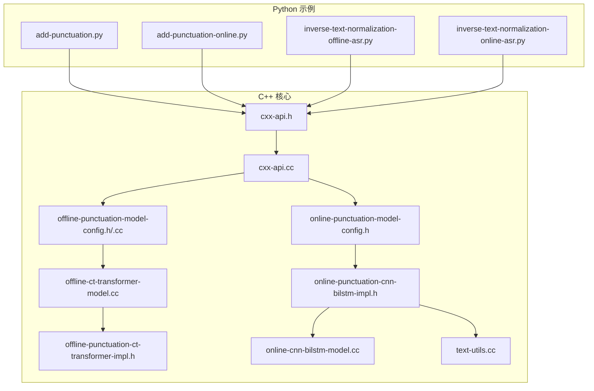
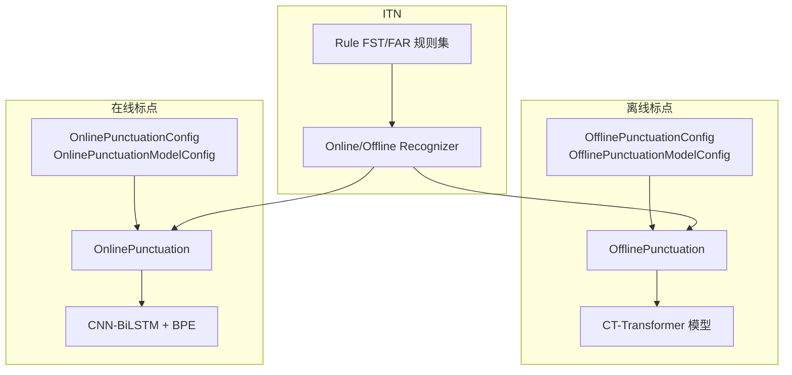
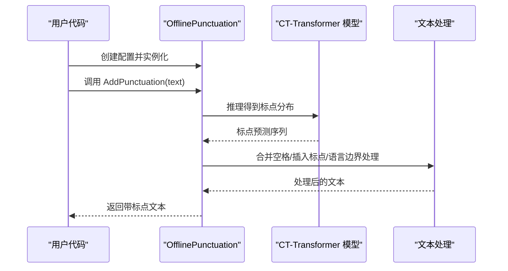
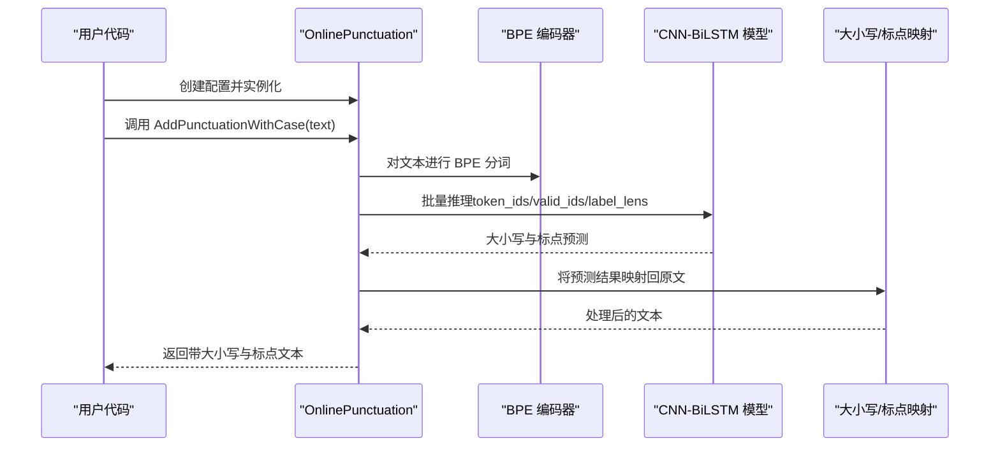
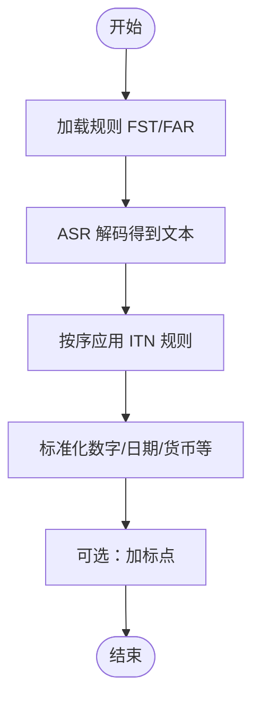
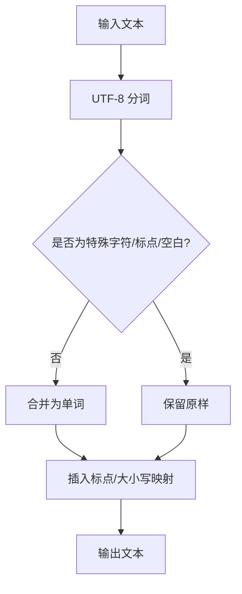
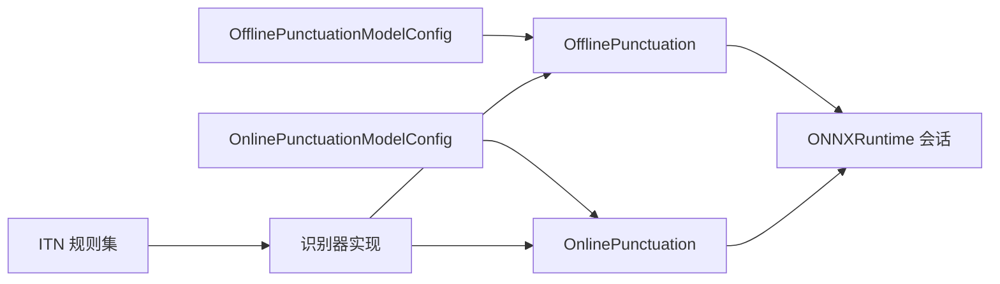

# 标点恢复示例

<cite>
**本文引用的文件**
- [add-punctuation.py](file://python-api-examples/add-punctuation.py)
- [add-punctuation-online.py](file://python-api-examples/add-punctuation-online.py)
- [inverse-text-normalization-offline-asr.py](file://python-api-examples/inverse-text-normalization-offline-asr.py)
- [inverse-text-normalization-online-asr.py](file://python-api-examples/inverse-text-normalization-online-asr.py)
- [cxx-api.h](file://sherpa-onnx/c-api/cxx-api.h)
- [cxx-api.cc](file://sherpa-onnx/c-api/cxx-api.cc)
- [offline-punctuation-model-config.h](file://sherpa-onnx/csrc/offline-punctuation-model-config.h)
- [offline-punctuation-model-config.cc](file://sherpa-onnx/csrc/offline-punctuation-model-config.cc)
- [offline-ct-transformer-model.cc](file://sherpa-onnx/csrc/offline-ct-transformer-model.cc)
- [offline-punctuation-ct-transformer-impl.h](file://sherpa-onnx/csrc/offline-punctuation-ct-transformer-impl.h)
- [online-punctuation-model-config.h](file://sherpa-onnx/csrc/online-punctuation-model-config.h)
- [online-punctuation-cnn-bilstm-impl.h](file://sherpa-onnx/csrc/online-punctuation-cnn-bilstm-impl.h)
- [online-cnn-bilstm-model.cc](file://sherpa-onnx/csrc/online-cnn-bilstm-model.cc)
- [text-utils.cc](file://sherpa-onnx/csrc/text-utils.cc)
- [online-recognizer-impl.cc](file://sherpa-onnx/csrc/online-recognizer-impl.cc)
- [offline-recognizer-impl.cc](file://sherpa-onnx/csrc/offline-recognizer-impl.cc)
- [timer.h](file://sherpa-onnx/csrc/timer.h)
- [add-punctuation-c-api.c](file://c-api-examples/add-punctuation-c-api.c)
- [punctuation.js](file://scripts/node-addon-api/lib/punctuation.js)
- [punctuation.cc](file://harmony-os/SherpaOnnxHar/sherpa_onnx/src/main/cpp/punctuation.cc)
- [test_offline_punctuation.kt](file://kotlin-api-examples/test_offline_punctuation.kt)
- [test_online_punctuation.js](file://nodejs-addon-examples/test_online_punctuation.js)
- [test_offline_punctuation.py](file://python-api-examples/test_offline_punctuation.py)
- [test_online_punctuation.py](file://python-api-examples/test_online_punctuation.py)
</cite>

## 目录
1. [简介](#简介)
2. [项目结构](#项目结构)
3. [核心组件](#核心组件)
4. [架构总览](#架构总览)
5. [详细组件分析](#详细组件分析)
6. [依赖关系分析](#依赖关系分析)
7. [性能考量](#性能考量)
8. [故障排查指南](#故障排查指南)
9. [结论](#结论)
10. [附录](#附录)

## 简介
本文件围绕 sherpa-onnx 的 Python API 标点恢复示例进行系统化说明，覆盖离线与在线两种标点恢复能力，解释 OfflinePunctuation 与 OnlinePunctuation 类的使用方式、模型配置与文本处理流程，并结合逆文本归一化（ITN）在数字、日期、货币等特殊格式转换中的应用，最后给出性能基准与准确率评估方法建议。

## 项目结构
与标点恢复直接相关的代码主要分布在以下位置：
- Python 示例：python-api-examples 下的 add-punctuation.py、add-punctuation-online.py、inverse-text-normalization-*.py
- C++ API 与绑定：sherpa-onnx/c-api 与 sherpa-onnx/csrc 中的 punctuation 配置与实现
- 其他语言示例：Node.js、Kotlin、C API 等示例脚本

图表来源
- [add-punctuation.py](file://python-api-examples/add-punctuation.py#L1-L47)
- [add-punctuation-online.py](file://python-api-examples/add-punctuation-online.py#L1-L49)
- [inverse-text-normalization-offline-asr.py](file://python-api-examples/inverse-text-normalization-offline-asr.py#L1-L82)
- [inverse-text-normalization-online-asr.py](file://python-api-examples/inverse-text-normalization-online-asr.py#L1-L92)
- [cxx-api.h](file://sherpa-onnx/c-api/cxx-api.h#L715-L756)
- [cxx-api.cc](file://sherpa-onnx/c-api/cxx-api.cc#L830-L867)
- [offline-punctuation-model-config.h](file://sherpa-onnx/csrc/offline-punctuation-model-config.h#L1-L38)
- [offline-punctuation-model-config.cc](file://sherpa-onnx/csrc/offline-punctuation-model-config.cc#L1-L55)
- [offline-ct-transformer-model.cc](file://sherpa-onnx/csrc/offline-ct-transformer-model.cc#L91-L139)
- [offline-punctuation-ct-transformer-impl.h](file://sherpa-onnx/csrc/offline-punctuation-ct-transformer-impl.h#L88-L171)
- [online-punctuation-model-config.h](file://sherpa-onnx/csrc/online-punctuation-model-config.h#L1-L42)
- [online-punctuation-cnn-bilstm-impl.h](file://sherpa-onnx/csrc/online-punctuation-cnn-bilstm-impl.h#L1-L278)
- [online-cnn-bilstm-model.cc](file://sherpa-onnx/csrc/online-cnn-bilstm-model.cc#L1-L141)
- [text-utils.cc](file://sherpa-onnx/csrc/text-utils.cc#L165-L364)

章节来源
- [add-punctuation.py](file://python-api-examples/add-punctuation.py#L1-L47)
- [add-punctuation-online.py](file://python-api-examples/add-punctuation-online.py#L1-L49)
- [cxx-api.h](file://sherpa-onnx/c-api/cxx-api.h#L715-L756)

## 核心组件
- 离线标点恢复（OfflinePunctuation）
  - 通过 CT-Transformer 模型对输入文本进行标点预测与插入，支持多语言混合文本。
  - 关键配置项：ct_transformer 模型路径、num_threads、debug、provider。
- 在线标点恢复（OnlinePunctuation）
  - 基于 CNN-BiLSTM + BPE 编码器，逐词或分段地预测大小写与标点，适合流式场景。
  - 关键配置项：cnn_bilstm 模型、bpe_vocab、num_threads、debug、provider。
- 逆文本归一化（ITN）
  - 使用规则 FST 对 ASR 输出进行数字、日期、货币等格式还原，提升可读性。
  - 支持 rule_fsts 与 rule_fars 多文件加载，按顺序应用。

章节来源
- [offline-punctuation-model-config.h](file://sherpa-onnx/csrc/offline-punctuation-model-config.h#L1-L38)
- [offline-punctuation-model-config.cc](file://sherpa-onnx/csrc/offline-punctuation-model-config.cc#L1-L55)
- [online-punctuation-model-config.h](file://sherpa-onnx/csrc/online-punctuation-model-config.h#L1-L42)
- [online-punctuation-cnn-bilstm-impl.h](file://sherpa-onnx/csrc/online-punctuation-cnn-bilstm-impl.h#L1-L278)
- [online-cnn-bilstm-model.cc](file://sherpa-onnx/csrc/online-cnn-bilstm-model.cc#L1-L141)
- [offline-ct-transformer-model.cc](file://sherpa-onnx/csrc/offline-ct-transformer-model.cc#L91-L139)
- [offline-punctuation-ct-transformer-impl.h](file://sherpa-onnx/csrc/offline-punctuation-ct-transformer-impl.h#L88-L171)
- [online-recognizer-impl.cc](file://sherpa-onnx/csrc/online-recognizer-impl.cc#L235-L283)
- [offline-recognizer-impl.cc](file://sherpa-onnx/csrc/offline-recognizer-impl.cc#L723-L757)

## 架构总览
离线与在线标点恢复均基于 ONNXRuntime 推理，分别采用不同的模型结构与编码策略；ITN 则作为 ASR 后处理阶段的可选模块，统一由识别器配置加载并应用。

图表来源
- [cxx-api.h](file://sherpa-onnx/c-api/cxx-api.h#L715-L756)
- [cxx-api.cc](file://sherpa-onnx/c-api/cxx-api.cc#L830-L867)
- [offline-punctuation-model-config.h](file://sherpa-onnx/csrc/offline-punctuation-model-config.h#L1-L38)
- [online-punctuation-model-config.h](file://sherpa-onnx/csrc/online-punctuation-model-config.h#L1-L42)
- [online-recognizer-impl.cc](file://sherpa-onnx/csrc/online-recognizer-impl.cc#L235-L283)
- [offline-recognizer-impl.cc](file://sherpa-onnx/csrc/offline-recognizer-impl.cc#L723-L757)

## 详细组件分析

### 离线标点恢复（OfflinePunctuation）
- 功能概述
  - 将无标点的混合文本（如中英混排）转换为带标点的可读文本。
  - 内部通过 CT-Transformer 模型对每个字符位置进行标点类别预测，再根据规则合并生成最终文本。
- 关键流程
  - 加载模型与配置（ct_transformer、num_threads、provider、debug）。
  - 调用 AddPunctuation(text) 返回带标点文本。
  - 文本后处理包含空格合并、标点插入与语言边界处理。
- 数据结构与复杂度
  - 输入为字符串序列，模型输出为每字符的标点概率分布；整体时间复杂度近似 O(T·C)，其中 T 为序列长度，C 为标点类别数。
- 错误处理
  - 配置校验失败会返回错误信息；模型文件不存在时抛出异常。
- 使用示例
  - 参考 Python 示例脚本，演示如何构造 OfflinePunctuationConfig 并调用 add_punctuation。

图表来源
- [add-punctuation.py](file://python-api-examples/add-punctuation.py#L1-L47)
- [offline-punctuation-model-config.h](file://sherpa-onnx/csrc/offline-punctuation-model-config.h#L1-L38)
- [offline-ct-transformer-model.cc](file://sherpa-onnx/csrc/offline-ct-transformer-model.cc#L91-L139)
- [offline-punctuation-ct-transformer-impl.h](file://sherpa-onnx/csrc/offline-punctuation-ct-transformer-impl.h#L88-L171)

章节来源
- [add-punctuation.py](file://python-api-examples/add-punctuation.py#L1-L47)
- [offline-punctuation-model-config.h](file://sherpa-onnx/csrc/offline-punctuation-model-config.h#L1-L38)
- [offline-punctuation-model-config.cc](file://sherpa-onnx/csrc/offline-punctuation-model-config.cc#L1-L55)
- [offline-ct-transformer-model.cc](file://sherpa-onnx/csrc/offline-ct-transformer-model.cc#L91-L139)
- [offline-punctuation-ct-transformer-impl.h](file://sherpa-onnx/csrc/offline-punctuation-ct-transformer-impl.h#L88-L171)

### 在线标点恢复（OnlinePunctuation）
- 功能概述
  - 面向流式场景，基于 CNN-BiLSTM 与 BPE 编码器，同时预测大小写与标点，适合实时语音转写后处理。
- 关键流程
  - 加载 cnn_bilstm 与 bpe_vocab，构建 OnlinePunctuation 实例。
  - 调用 add_punctuation_with_case(text) 返回带大小写与标点的文本。
  - 内部对文本进行 BPE 分词，按固定窗口进行推理，再将大小写与标点映射回原文。
- 数据结构与复杂度
  - 固定最大序列长度 kMaxSeqLen，批处理推理，时间复杂度近似 O(N·T·C)，N 为批大小，T 为窗口长度，C 为类别数。
- 错误处理
  - BPE 词表缺失或模型路径无效时抛出异常；空输入直接返回空串。
- 使用示例
  - 参考 Python 示例脚本，演示如何构造 OnlinePunctuationConfig 并调用 add_punctuation_with_case。

图表来源
- [add-punctuation-online.py](file://python-api-examples/add-punctuation-online.py#L1-L49)
- [online-punctuation-model-config.h](file://sherpa-onnx/csrc/online-punctuation-model-config.h#L1-L42)
- [online-punctuation-cnn-bilstm-impl.h](file://sherpa-onnx/csrc/online-punctuation-cnn-bilstm-impl.h#L1-L278)
- [online-cnn-bilstm-model.cc](file://sherpa-onnx/csrc/online-cnn-bilstm-model.cc#L1-L141)

章节来源
- [add-punctuation-online.py](file://python-api-examples/add-punctuation-online.py#L1-L49)
- [online-punctuation-model-config.h](file://sherpa-onnx/csrc/online-punctuation-model-config.h#L1-L42)
- [online-punctuation-cnn-bilstm-impl.h](file://sherpa-onnx/csrc/online-punctuation-cnn-bilstm-impl.h#L1-L278)
- [online-cnn-bilstm-model.cc](file://sherpa-onnx/csrc/online-cnn-bilstm-model.cc#L1-L141)

### 逆文本归一化（ITN）在数字、日期、货币等格式转换中的应用
- 功能概述
  - ITN 将 ASR 输出中的口语化表达（如“二零二四”、“三点五”）还原为标准格式（如“2024”、“3.5”），并支持日期、货币等多类型规则。
- 配置与加载
  - 支持 rule_fsts 与 rule_fars 两种形式，可加载单个或多个规则文件，按顺序应用。
  - 在线与离线识别器均可启用 ITN。
- 应用流程
  - 识别器在获取到文本后，依次应用各条规则，输出标准化文本。
  - 可与标点恢复配合使用，先 ITN 再加标点，提升可读性。

图表来源
- [online-recognizer-impl.cc](file://sherpa-onnx/csrc/online-recognizer-impl.cc#L235-L283)
- [offline-recognizer-impl.cc](file://sherpa-onnx/csrc/offline-recognizer-impl.cc#L723-L757)
- [inverse-text-normalization-offline-asr.py](file://python-api-examples/inverse-text-normalization-offline-asr.py#L1-L82)
- [inverse-text-normalization-online-asr.py](file://python-api-examples/inverse-text-normalization-online-asr.py#L1-L92)

章节来源
- [online-recognizer-impl.cc](file://sherpa-onnx/csrc/online-recognizer-impl.cc#L235-L283)
- [offline-recognizer-impl.cc](file://sherpa-onnx/csrc/offline-recognizer-impl.cc#L723-L757)
- [inverse-text-normalization-offline-asr.py](file://python-api-examples/inverse-text-normalization-offline-asr.py#L1-L82)
- [inverse-text-normalization-online-asr.py](file://python-api-examples/inverse-text-normalization-online-asr.py#L1-L92)

### 文本处理与语言边界
- 字符级处理与合并
  - 将英文单词按字符拆分后，再合并为单词，避免标点插入破坏词边界。
  - 支持德语、西班牙语、法语等带变音符号的字符识别与合并。
- 标点插入策略
  - 基于模型输出的标点类别，结合语言规则（如句末标点优先、逗号与句号选择）进行插入。
  - 对中英混排文本，控制空格插入以保证可读性。

图表来源
- [text-utils.cc](file://sherpa-onnx/csrc/text-utils.cc#L165-L364)
- [offline-punctuation-ct-transformer-impl.h](file://sherpa-onnx/csrc/offline-punctuation-ct-transformer-impl.h#L130-L171)

章节来源
- [text-utils.cc](file://sherpa-onnx/csrc/text-utils.cc#L165-L364)
- [offline-punctuation-ct-transformer-impl.h](file://sherpa-onnx/csrc/offline-punctuation-ct-transformer-impl.h#L130-L171)

## 依赖关系分析
- 组件耦合
  - OfflinePunctuation 与 OnlinePunctuation 均依赖各自的模型配置结构体与 ONNXRuntime 会话。
  - ITN 作为识别器的后处理模块，与识别器实现紧密耦合。
- 外部依赖
  - ONNXRuntime、SentencePiece/BPE、Kaldi FST（用于 ITN 规则）。
- 可能的循环依赖
  - 当前实现中未见循环依赖迹象；各模块职责清晰，接口稳定。

图表来源
- [cxx-api.h](file://sherpa-onnx/c-api/cxx-api.h#L715-L756)
- [cxx-api.cc](file://sherpa-onnx/c-api/cxx-api.cc#L830-L867)
- [offline-punctuation-model-config.h](file://sherpa-onnx/csrc/offline-punctuation-model-config.h#L1-L38)
- [online-punctuation-model-config.h](file://sherpa-onnx/csrc/online-punctuation-model-config.h#L1-L42)
- [online-recognizer-impl.cc](file://sherpa-onnx/csrc/online-recognizer-impl.cc#L235-L283)
- [offline-recognizer-impl.cc](file://sherpa-onnx/csrc/offline-recognizer-impl.cc#L723-L757)

章节来源
- [cxx-api.h](file://sherpa-onnx/c-api/cxx-api.h#L715-L756)
- [cxx-api.cc](file://sherpa-onnx/c-api/cxx-api.cc#L830-L867)
- [offline-punctuation-model-config.h](file://sherpa-onnx/csrc/offline-punctuation-model-config.h#L1-L38)
- [online-punctuation-model-config.h](file://sherpa-onnx/csrc/online-punctuation-model-config.h#L1-L42)
- [online-recognizer-impl.cc](file://sherpa-onnx/csrc/online-recognizer-impl.cc#L235-L283)
- [offline-recognizer-impl.cc](file://sherpa-onnx/csrc/offline-recognizer-impl.cc#L723-L757)

## 性能考量
- 实时因子（RTF）
  - RTF = 总耗时 / 音频时长，用于衡量推理速度与音频播放速度的比值。
  - 示例程序展示了如何计算 RTF 并输出统计信息。
- 线程与执行提供者
  - 通过 num_threads 与 provider（如 cpu、cuda、coreml）调整并发与硬件加速。
- 批处理与窗口
  - 在线模型采用固定窗口与批处理，合理设置窗口大小与批大小可平衡延迟与吞吐。
- 基准建议
  - 使用相同硬件与数据集，记录 RTF、吞吐量（字/秒）、内存占用与 CPU/GPU 利用率。
  - 对比不同 provider 与 num_threads 的效果，选择最优组合。

章节来源
- [timer.h](file://sherpa-onnx/csrc/timer.h#L1-L29)
- [add-punctuation-c-api.c](file://c-api-examples/add-punctuation-c-api.c#L43-L67)
- [cxx-api.h](file://sherpa-onnx/c-api/cxx-api.h#L715-L756)
- [cxx-api.cc](file://sherpa-onnx/c-api/cxx-api.cc#L830-L867)

## 故障排查指南
- 常见问题
  - 模型文件路径错误：检查 ct_transformer 或 cnn_bilstm 是否存在且可读。
  - BPE 词表缺失：在线模式需确保 bpe_vocab 文件有效。
  - 规则 FST/FAR 未加载：确认 rule_fsts 或 rule_fars 路径正确且格式合法。
  - 空输入：在线模型对空文本直接返回空串，注意前置判空。
- 定位手段
  - 开启 debug 模式查看模型元信息与加载日志。
  - 使用最小化输入复现问题，逐步缩小范围。
  - 对照示例脚本与配置，核对参数一致性。

章节来源
- [offline-punctuation-model-config.cc](file://sherpa-onnx/csrc/offline-punctuation-model-config.cc#L1-L55)
- [online-punctuation-cnn-bilstm-impl.h](file://sherpa-onnx/csrc/online-punctuation-cnn-bilstm-impl.h#L1-L278)
- [online-recognizer-impl.cc](file://sherpa-onnx/csrc/online-recognizer-impl.cc#L235-L283)
- [offline-recognizer-impl.cc](file://sherpa-onnx/csrc/offline-recognizer-impl.cc#L723-L757)

## 结论
sherpa-onnx 提供了完善的离线与在线标点恢复能力，并与 ITN 深度集成，能够有效提升 ASR 输出的可读性。通过合理的模型配置与性能优化，可在多种平台与设备上获得稳定的实时表现。建议在实际部署中结合业务需求选择合适的模型与参数，并建立完善的性能与质量评估体系。

## 附录
- 快速开始
  - 离线：参考 add-punctuation.py，准备 CT-Transformer 模型，创建 OfflinePunctuationConfig 并调用 add_punctuation。
  - 在线：参考 add-punctuation-online.py，准备 CNN-BiLSTM 与 BPE 词表，创建 OnlinePunctuationConfig 并调用 add_punctuation_with_case。
  - ITN：在识别器配置中指定 rule_fsts 或 rule_fars，即可自动应用规则进行文本标准化。
- 多语言与平台示例
  - Node.js/Kotlin/C API 等均有对应示例，可参考相应文件路径进行迁移。

章节来源
- [add-punctuation.py](file://python-api-examples/add-punctuation.py#L1-L47)
- [add-punctuation-online.py](file://python-api-examples/add-punctuation-online.py#L1-L49)
- [punctuation.js](file://scripts/node-addon-api/lib/punctuation.js#L1-L26)
- [punctuation.cc](file://harmony-os/SherpaOnnxHar/sherpa_onnx/src/main/cpp/punctuation.cc#L236-L258)
- [test_offline_punctuation.kt](file://kotlin-api-examples/test_offline_punctuation.kt#L1-L31)
- [test_online_punctuation.js](file://nodejs-addon-examples/test_online_punctuation.js#L1-L200)
- [test_offline_punctuation.py](file://python-api-examples/test_offline_punctuation.py#L1-L200)
- [test_online_punctuation.py](file://python-api-examples/test_online_punctuation.py#L1-L200)