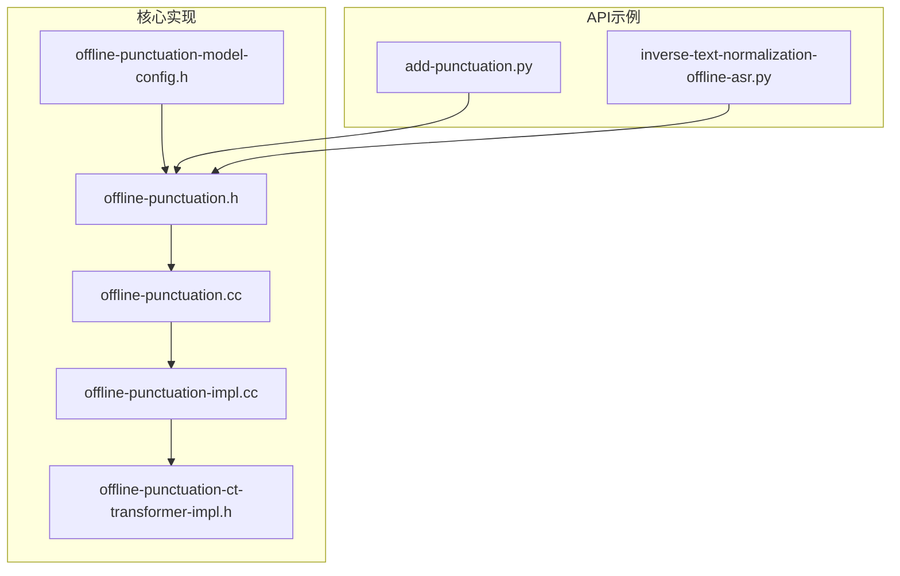
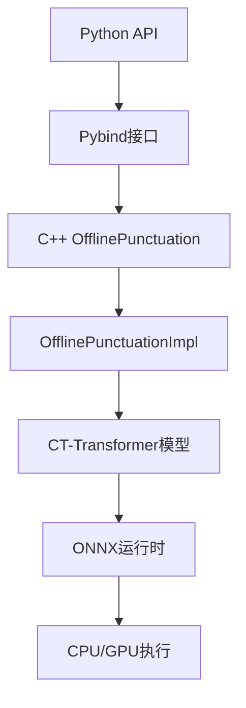
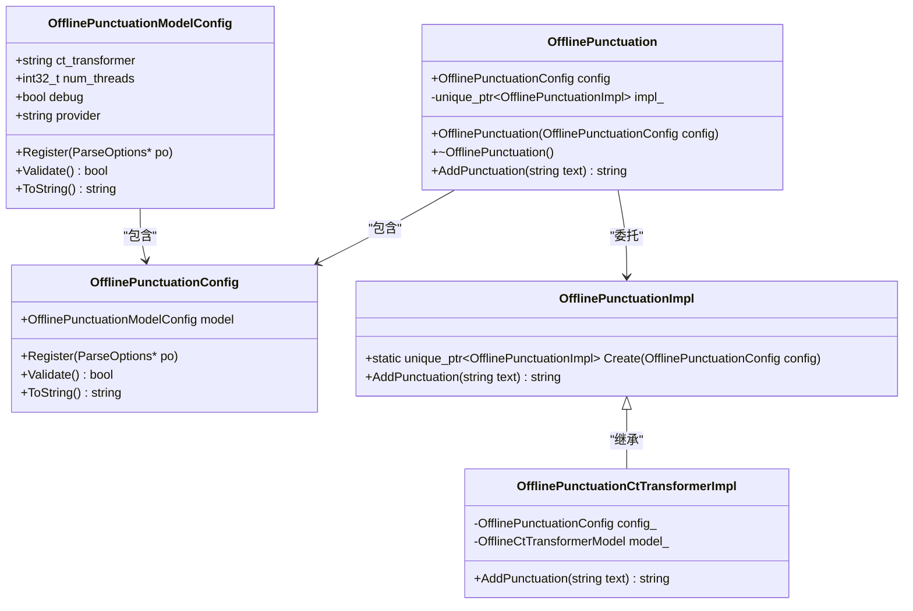
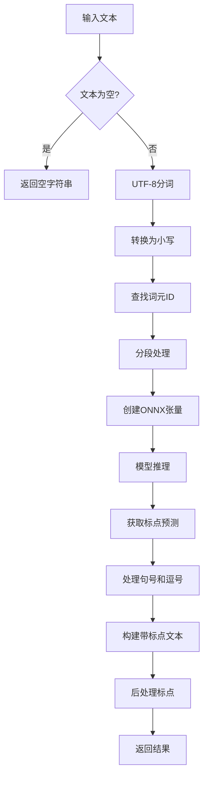
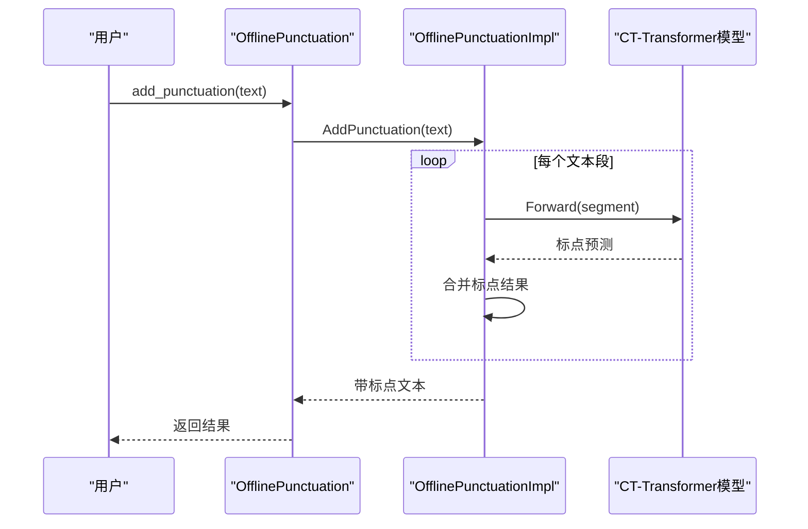
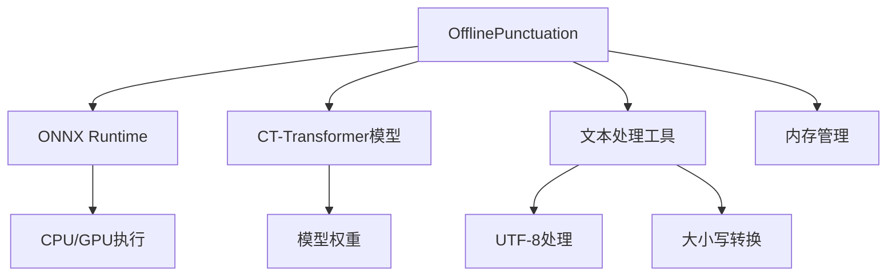
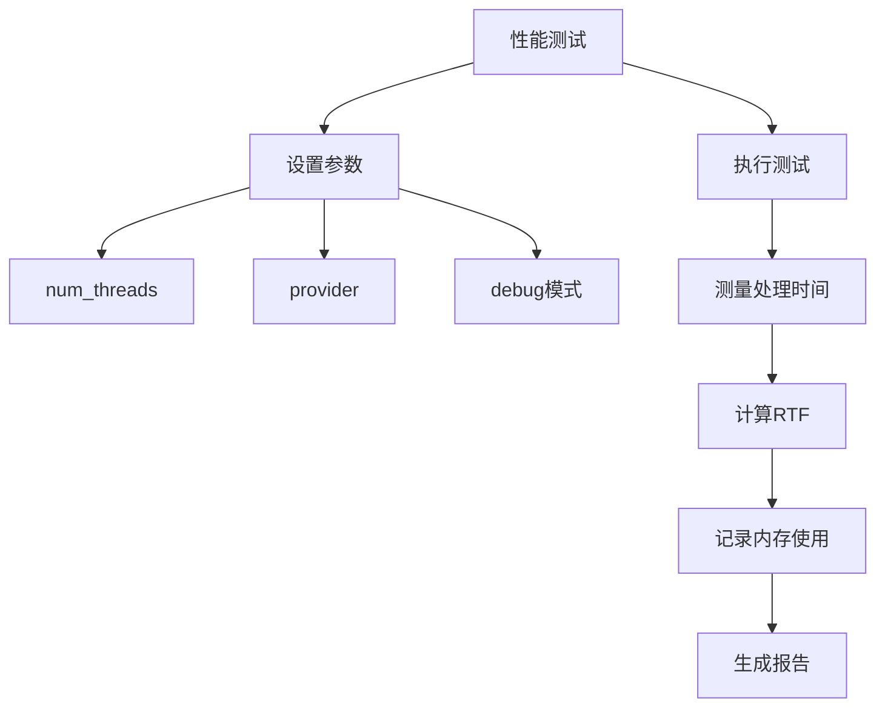

# 离线标点恢复

<cite>
**本文档引用文件**  
- [add-punctuation.py](file://python-api-examples/add-punctuation.py)
- [offline-punctuation.h](file://sherpa-onnx/csrc/offline-punctuation.h)
- [offline-punctuation.cc](file://sherpa-onnx/csrc/offline-punctuation.cc)
- [offline-punctuation-impl.cc](file://sherpa-onnx/csrc/offline-punctuation-impl.cc)
- [offline-punctuation-ct-transformer-impl.h](file://sherpa-onnx/csrc/offline-punctuation-ct-transformer-impl.h)
- [offline-punctuation-model-config.h](file://sherpa-onnx/csrc/offline-punctuation-model-config.h)
- [offline-punctuation-model-config.cc](file://sherpa-onnx/csrc/offline-punctuation-model-config.cc)
- [offline-punctuation.c](file://sherpa-onnx/c-api-examples/add-punctuation-c-api.c)
- [inverse-text-normalization-offline-asr.py](file://python-api-examples/inverse-text-normalization-offline-asr.py)
- [offline-punctuation-cxx-api.cc](file://cxx-api-examples/offline-punctuation-cxx-api.cc)
</cite>

## 目录
1. [简介](#简介)
2. [项目结构](#项目结构)
3. [核心组件](#核心组件)
4. [架构概述](#架构概述)
5. [详细组件分析](#详细组件分析)
6. [依赖分析](#依赖分析)
7. [性能考量](#性能考量)
8. [故障排除指南](#故障排除指南)
9. [结论](#结论)

## 简介
本文档全面解释了sherpa-onnx Python API中离线标点恢复功能的实现原理和使用方法。文档详细说明了OfflinePunctuation类的模型配置参数、文本处理流程和批处理模式，展示了如何将无标点的ASR输出批量转换为带标点的可读文本。同时，文档还解释了逆文本归一化（ITN）在数字、日期、货币等特殊格式转换中的具体应用，并提供了性能基准测试方法和准确率评估指标。

## 项目结构
sherpa-onnx项目的离线标点恢复功能主要分布在csrc和python-api-examples目录中。核心实现位于csrc目录下的离线标点相关文件，而Python API示例则位于python-api-examples目录中。

**图源**  
- [offline-punctuation.h](file://sherpa-onnx/csrc/offline-punctuation.h)
- [add-punctuation.py](file://python-api-examples/add-punctuation.py)

**章节源**  
- [offline-punctuation.h](file://sherpa-onnx/csrc/offline-punctuation.h)
- [add-punctuation.py](file://python-api-examples/add-punctuation.py)

## 核心组件
离线标点恢复的核心组件包括OfflinePunctuationConfig配置类、OfflinePunctuation主处理类以及CT-Transformer模型实现。这些组件共同协作，将无标点的文本转换为带有适当标点符号的可读文本。

**章节源**  
- [offline-punctuation.h](file://sherpa-onnx/csrc/offline-punctuation.h)
- [offline-punctuation-model-config.h](file://sherpa-onnx/csrc/offline-punctuation-model-config.h)

## 架构概述
离线标点恢复系统采用分层架构设计，从上层Python API到底层C++实现，通过清晰的接口进行通信。系统使用CT-Transformer模型进行标点预测，支持多语言混合文本处理。

**图源**  
- [offline-punctuation.h](file://sherpa-onnx/csrc/offline-punctuation.h)
- [offline-punctuation.cc](file://sherpa-onnx/csrc/offline-punctuation.cc)
- [offline-punctuation-impl.cc](file://sherpa-onnx/csrc/offline-punctuation-impl.cc)

## 详细组件分析

### OfflinePunctuation类分析
OfflinePunctuation类是离线标点恢复功能的核心，负责管理标点恢复的整个流程。该类封装了模型加载、文本处理和标点添加等所有操作。

**图源**  
- [offline-punctuation.h](file://sherpa-onnx/csrc/offline-punctuation.h)
- [offline-punctuation-model-config.h](file://sherpa-onnx/csrc/offline-punctuation-model-config.h)
- [offline-punctuation-impl.cc](file://sherpa-onnx/csrc/offline-punctuation-impl.cc)
- [offline-punctuation-ct-transformer-impl.h](file://sherpa-onnx/csrc/offline-punctuation-ct-transformer-impl.h)

**章节源**  
- [offline-punctuation.h](file://sherpa-onnx/csrc/offline-punctuation.h)
- [offline-punctuation.cc](file://sherpa-onnx/csrc/offline-punctuation.cc)

### 文本处理流程分析
离线标点恢复的文本处理流程包括文本分词、模型推理和标点插入三个主要阶段。该流程能够处理中英文混合文本，并根据上下文智能添加适当的标点符号。

**图源**  
- [offline-punctuation-ct-transformer-impl.h](file://sherpa-onnx/csrc/offline-punctuation-ct-transformer-impl.h)
- [offline-punctuation.cc](file://sherpa-onnx/csrc/offline-punctuation.cc)

**章节源**  
- [offline-punctuation-ct-transformer-impl.h](file://sherpa-onnx/csrc/offline-punctuation-ct-transformer-impl.h)

### 批处理模式分析
离线标点恢复支持批处理模式，可以同时处理多个文本片段。这种模式通过分段处理机制实现，能够有效处理长文本并控制内存使用。

**图源**  
- [offline-punctuation-ct-transformer-impl.h](file://sherpa-onnx/csrc/offline-punctuation-ct-transformer-impl.h)
- [offline-punctuation.cc](file://sherpa-onnx/csrc/offline-punctuation.cc)

**章节源**  
- [offline-punctuation-ct-transformer-impl.h](file://sherpa-onnx/csrc/offline-punctuation-ct-transformer-impl.h)

## 依赖分析
离线标点恢复功能依赖于多个核心组件和外部库，包括ONNX运行时、CT-Transformer模型和文本处理工具。

**图源**  
- [offline-punctuation.h](file://sherpa-onnx/csrc/offline-punctuation.h)
- [offline-punctuation-impl.cc](file://sherpa-onnx/csrc/offline-punctuation-impl.cc)

**章节源**  
- [offline-punctuation.h](file://sherpa-onnx/csrc/offline-punctuation.h)
- [offline-punctuation-impl.cc](file://sherpa-onnx/csrc/offline-punctuation-impl.cc)

## 性能考量
离线标点恢复的性能受多个因素影响，包括线程数、执行提供程序和文本长度。系统提供了性能基准测试方法来评估处理延迟和内存占用情况。

**图源**  
- [offline-punctuation-model-config.h](file://sherpa-onnx/csrc/offline-punctuation-model-config.h)
- [offline-punctuation-cxx-api.cc](file://cxx-api-examples/offline-punctuation-cxx-api.cc)

**章节源**  
- [offline-punctuation-model-config.h](file://sherpa-onnx/csrc/offline-punctuation-model-config.h)

## 故障排除指南
在使用离线标点恢复功能时，可能会遇到模型加载失败、文本处理异常等问题。以下是一些常见问题的解决方案。

**章节源**  
- [add-punctuation.py](file://python-api-examples/add-punctuation.py)
- [offline-punctuation.cc](file://sherpa-onnx/csrc/offline-punctuation.cc)

## 结论
sherpa-onnx的离线标点恢复功能提供了一个强大而灵活的解决方案，能够将无标点的ASR输出转换为可读的带标点文本。通过CT-Transformer模型和优化的处理流程，系统能够准确地识别文本中的标点位置，并支持中英文混合文本处理。该功能在语音识别后处理、字幕生成等场景中具有重要应用价值。