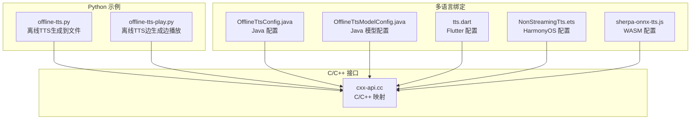
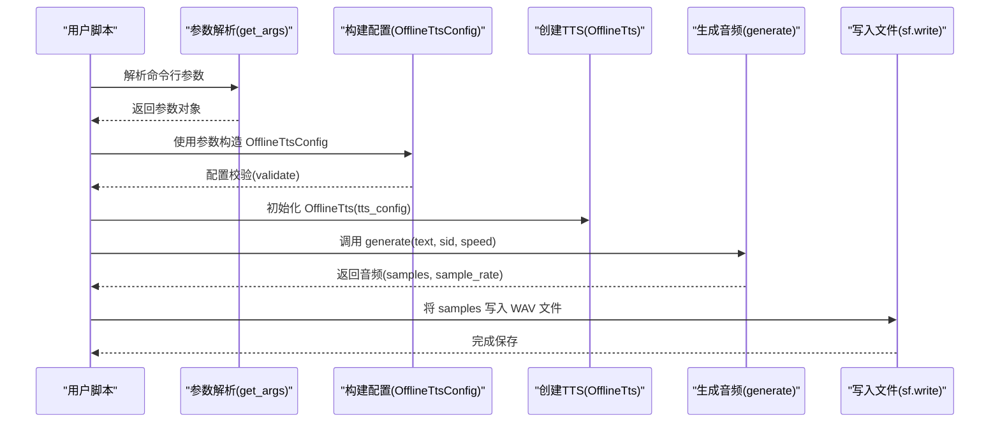
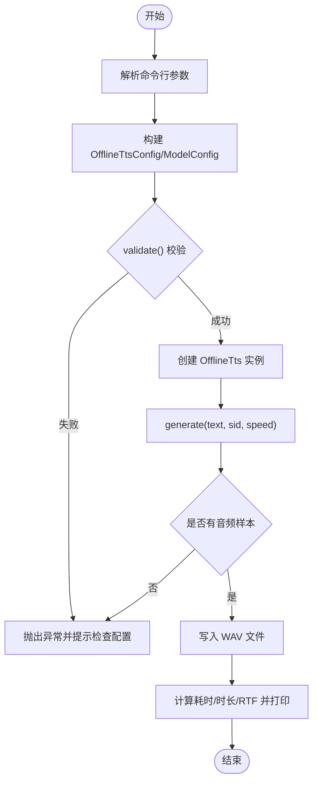
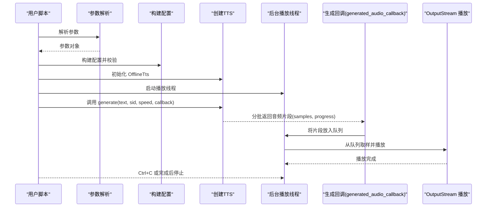
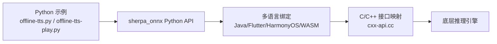

# 语音合成示例

<cite>
**本文引用的文件**
- [offline-tts.py](file://python-api-examples/offline-tts.py)
- [offline-tts-play.py](file://python-api-examples/offline-tts-play.py)
- [kitten-tts-en-cxx-api.cc](file://cxx-api-examples/kitten-tts-en-cxx-api.cc)
- [kokoro-tts-en-cxx-api.cc](file://cxx-api-examples/kokoro-tts-en-cxx-api.cc)
- [OfflineTtsConfig.java](file://sherpa-onnx/java-api/src/main/java/com/k2fsa/sherpa/onnx/OfflineTtsConfig.java)
- [OfflineTtsModelConfig.java](file://sherpa-onnx/java-api/src/main/java/com/k2fsa/sherpa/onnx/OfflineTtsModelConfig.java)
- [tts.dart](file://flutter/sherpa_onnx/lib/src/tts.dart)
- [NonStreamingTts.ets](file://harmony-os/SherpaOnnxHar/sherpa_onnx/src/main/ets/components/NonStreamingTts.ets)
- [sherpa-onnx-tts.js](file://wasm/tts/sherpa-onnx-tts.js)
- [cxx-api.cc](file://sherpa-onnx/c-api/cxx-api.cc)
</cite>

## 目录
1. [简介](#简介)
2. [项目结构](#项目结构)
3. [核心组件](#核心组件)
4. [架构总览](#架构总览)
5. [详细组件分析](#详细组件分析)
6. [依赖关系分析](#依赖关系分析)
7. [性能考虑](#性能考虑)
8. [故障排查指南](#故障排查指南)
9. [结论](#结论)
10. [附录](#附录)

## 简介
本文件面向使用 sherpa-onnx Python API 的开发者，系统性讲解离线语音合成（TTS）的使用方式，重点围绕 OfflineTts 类的使用方法，涵盖：
- 如何配置 TTS 参数（TTS 配置对象、模型配置对象）
- 文本到语音的完整流程：从文本输入到音频文件生成或实时播放
- 支持的 TTS 模型类型（如 Kitten、Kokoro、Matcha 等）及其配置差异
- 音频输出格式设置与播放控制
- 错误处理与性能调优建议

## 项目结构
与 Python API 语音合成示例直接相关的核心文件位于 python-api-examples 目录，同时仓库在多语言绑定中也提供了 OfflineTts 的配置与调用接口，便于跨平台理解。

图表来源
- [offline-tts.py](file://python-api-examples/offline-tts.py#L380-L451)
- [offline-tts-play.py](file://python-api-examples/offline-tts-play.py#L497-L608)
- [OfflineTtsConfig.java](file://sherpa-onnx/java-api/src/main/java/com/k2fsa/sherpa/onnx/OfflineTtsConfig.java#L1-L80)
- [OfflineTtsModelConfig.java](file://sherpa-onnx/java-api/src/main/java/com/k2fsa/sherpa/onnx/OfflineTtsModelConfig.java#L40-L80)
- [tts.dart](file://flutter/sherpa_onnx/lib/src/tts.dart#L266-L348)
- [NonStreamingTts.ets](file://harmony-os/SherpaOnnxHar/sherpa_onnx/src/main/ets/components/NonStreamingTts.ets#L1-L112)
- [sherpa-onnx-tts.js](file://wasm/tts/sherpa-onnx-tts.js#L344-L400)
- [cxx-api.cc](file://sherpa-onnx/c-api/cxx-api.cc#L394-L414)

章节来源
- [offline-tts.py](file://python-api-examples/offline-tts.py#L1-L150)
- [offline-tts-play.py](file://python-api-examples/offline-tts-play.py#L1-L150)

## 核心组件
- OfflineTts：离线 TTS 主类，负责加载模型并执行文本到语音的生成。
- OfflineTtsConfig：顶层配置对象，包含模型配置与规则 FSTs、最大句子数等。
- OfflineTtsModelConfig：模型配置容器，包含 VITS、Matcha、Kokoro、Kitten 等子配置项。
- 各模型子配置：
  - OfflineTtsVitsModelConfig：VITS 模型配置（模型路径、词典、令牌、数据目录等）
  - OfflineTtsMatchaModelConfig：Matcha 声学模型 + 声码器配置（声学模型、声码器、词典、令牌、数据目录等）
  - OfflineTtsKokoroModelConfig：Kokoro 模型配置（模型、声音库、令牌、数据目录、词典、语言等）
  - OfflineTtsKittenModelConfig：Kitten 模型配置（模型、声音库、令牌、数据目录等）

章节来源
- [offline-tts.py](file://python-api-examples/offline-tts.py#L380-L451)
- [offline-tts-play.py](file://python-api-examples/offline-tts-play.py#L497-L608)
- [tts.dart](file://flutter/sherpa_onnx/lib/src/tts.dart#L266-L348)
- [NonStreamingTts.ets](file://harmony-os/SherpaOnnxHar/sherpa_onnx/src/main/ets/components/NonStreamingTts.ets#L1-L112)
- [sherpa-onnx-tts.js](file://wasm/tts/sherpa-onnx-tts.js#L344-L400)
- [cxx-api.cc](file://sherpa-onnx/c-api/cxx-api.cc#L394-L414)

## 架构总览
下图展示了 Python 示例中 OfflineTts 的典型调用链路：参数解析 → 构建配置 → 创建 TTS 实例 → 生成音频 → 写入文件或播放。

图表来源
- [offline-tts.py](file://python-api-examples/offline-tts.py#L298-L451)

章节来源
- [offline-tts.py](file://python-api-examples/offline-tts.py#L298-L451)

## 详细组件分析

### OfflineTts 类与配置对象
- OfflineTtsConfig：包含模型配置、规则 FSTs、最大句子数等字段；提供 validate() 校验。
- OfflineTtsModelConfig：包含各模型子配置与 provider、num_threads、debug 等通用参数。
- 各模型子配置：
  - VITS：模型文件、词典、令牌、espeak-ng 数据目录等
  - Matcha：声学模型、声码器、词典、令牌、espeak-ng 数据目录等
  - Kokoro：模型、声音库、令牌、espeak-ng 数据目录、词典、语言等
  - Kitten：模型、声音库、令牌、espeak-ng 数据目录等

章节来源
- [offline-tts.py](file://python-api-examples/offline-tts.py#L380-L451)
- [OfflineTtsConfig.java](file://sherpa-onnx/java-api/src/main/java/com/k2fsa/sherpa/onnx/OfflineTtsConfig.java#L1-L80)
- [OfflineTtsModelConfig.java](file://sherpa-onnx/java-api/src/main/java/com/k2fsa/sherpa/onnx/OfflineTtsModelConfig.java#L40-L80)
- [tts.dart](file://flutter/sherpa_onnx/lib/src/tts.dart#L266-L348)
- [NonStreamingTts.ets](file://harmony-os/SherpaOnnxHar/sherpa_onnx/src/main/ets/components/NonStreamingTts.ets#L1-L112)
- [sherpa-onnx-tts.js](file://wasm/tts/sherpa-onnx-tts.js#L344-L400)
- [cxx-api.cc](file://sherpa-onnx/c-api/cxx-api.cc#L394-L414)

### 文本到语音完整流程（Python 示例）
- 参数解析：通过命令行参数接收模型路径、词典、令牌、规则 FSTs、最大句子数、输出文件名、说话人 ID、provider、num_threads、speed 等。
- 构建配置：根据参数构造 OfflineTtsConfig 与 OfflineTtsModelConfig，并对配置进行 validate() 校验。
- 创建实例：初始化 OfflineTts。
- 生成音频：调用 generate(text, sid, speed)，返回音频样本与采样率。
- 输出结果：使用 soundfile 写入 WAV 文件，打印耗时、音频时长、RTF 等统计信息。

图表来源
- [offline-tts.py](file://python-api-examples/offline-tts.py#L298-L451)

章节来源
- [offline-tts.py](file://python-api-examples/offline-tts.py#L298-L451)

### 文本到语音完整流程（边生成边播放）
- 与“生成到文件”类似，但额外启动一个播放线程，使用回调函数将生成的音频片段放入队列，再由 OutputStream 实时播放。
- 回调返回值用于控制是否继续生成（返回 1 继续，返回 0 停止）。
- 支持键盘中断，捕获 Ctrl+C 后安全退出。

图表来源
- [offline-tts-play.py](file://python-api-examples/offline-tts-play.py#L382-L608)

章节来源
- [offline-tts-play.py](file://python-api-examples/offline-tts-play.py#L382-L608)

### 支持的 TTS 模型类型与配置差异
- VITS：适用于单说话人或多说话人场景，需要模型文件、词典、令牌或 espeak-ng 数据目录；可选规则 FSTs 进行音素规则化。
- Matcha：需提供声学模型与声码器；同样支持词典、令牌、espeak-ng 数据目录；适合端到端声码器方案。
- Kokoro：需提供模型与声音库（voices.bin），可选令牌与词典；支持多语言版本时可指定词典列表。
- Kitten：需提供模型与声音库（voices.bin），可选令牌与 espeak-ng 数据目录；适合轻量级模型。

章节来源
- [offline-tts.py](file://python-api-examples/offline-tts.py#L162-L296)
- [offline-tts-play.py](file://python-api-examples/offline-tts-play.py#L175-L309)
- [NonStreamingTts.ets](file://harmony-os/SherpaOnnxHar/sherpa_onnx/src/main/ets/components/NonStreamingTts.ets#L1-L112)
- [sherpa-onnx-tts.js](file://wasm/tts/sherpa-onnx-tts.js#L344-L400)
- [cxx-api.cc](file://sherpa-onnx/c-api/cxx-api.cc#L394-L414)

### 音频输出格式与播放控制
- 输出格式：示例使用 soundfile 写入 WAV，采样率来自生成结果，量化格式为 PCM_16。
- 播放控制：在“边生成边播放”示例中，通过回调将音频片段送入队列，再由 OutputStream 实时播放；回调返回 0 可停止生成；支持 Ctrl+C 中断。

章节来源
- [offline-tts.py](file://python-api-examples/offline-tts.py#L436-L447)
- [offline-tts-play.py](file://python-api-examples/offline-tts-play.py#L433-L495)
- [offline-tts-play.py](file://python-api-examples/offline-tts-play.py#L560-L608)

### 多语言绑定中的配置映射
- Java：OfflineTtsConfig/OfflineTtsModelConfig 提供 Builder 方式设置各模型子配置与通用参数。
- Flutter/Dart：OfflineTtsModelConfig/OfflineTtsConfig 支持 JSON 序列化/反序列化，便于跨平台配置传递。
- HarmonyOS：NonStreamingTts.ets 定义了各模型配置字段及 generate/generateAsync 方法。
- WASM：sherpa-onnx-tts.js 对各模型配置提供默认值与初始化逻辑。
- C/C++：cxx-api.cc 将配置映射到 C 结构体字段，确保跨语言一致性。

章节来源
- [OfflineTtsConfig.java](file://sherpa-onnx/java-api/src/main/java/com/k2fsa/sherpa/onnx/OfflineTtsConfig.java#L1-L80)
- [OfflineTtsModelConfig.java](file://sherpa-onnx/java-api/src/main/java/com/k2fsa/sherpa/onnx/OfflineTtsModelConfig.java#L40-L80)
- [tts.dart](file://flutter/sherpa_onnx/lib/src/tts.dart#L266-L348)
- [NonStreamingTts.ets](file://harmony-os/SherpaOnnxHar/sherpa_onnx/src/main/ets/components/NonStreamingTts.ets#L1-L112)
- [sherpa-onnx-tts.js](file://wasm/tts/sherpa-onnx-tts.js#L344-L400)
- [cxx-api.cc](file://sherpa-onnx/c-api/cxx-api.cc#L394-L414)

## 依赖关系分析
- Python 示例依赖 sherpa_onnx 包提供的 OfflineTts 与配置类。
- 多语言绑定共享同一套配置结构，通过各自的绑定层实现调用。
- C/C++ 层负责将配置映射到底层推理引擎，保证跨语言行为一致。

图表来源
- [offline-tts.py](file://python-api-examples/offline-tts.py#L380-L451)
- [offline-tts-play.py](file://python-api-examples/offline-tts-play.py#L497-L608)
- [cxx-api.cc](file://sherpa-onnx/c-api/cxx-api.cc#L394-L414)

章节来源
- [offline-tts.py](file://python-api-examples/offline-tts.py#L380-L451)
- [offline-tts-play.py](file://python-api-examples/offline-tts-play.py#L497-L608)
- [cxx-api.cc](file://sherpa-onnx/c-api/cxx-api.cc#L394-L414)

## 性能考虑
- 线程数与 Provider：通过 num_threads 与 provider 控制推理后端与并行度，合理设置可提升吞吐。
- 最大句子数：max_num_sentences 控制批处理大小，避免长文本导致显存不足；较小值不一定更慢。
- 速度因子：speed 影响语音速率，较大值更快，较小值更慢，按需调整。
- 实时播放：边生成边播放时，回调返回 0 可提前终止生成，减少资源占用。
- RTF 计算：示例会计算实际运行时间与音频时长比值，作为性能参考指标。

章节来源
- [offline-tts.py](file://python-api-examples/offline-tts.py#L315-L376)
- [offline-tts-play.py](file://python-api-examples/offline-tts-play.py#L311-L379)
- [offline-tts-play.py](file://python-api-examples/offline-tts-play.py#L560-L608)

## 故障排查指南
- 配置校验失败：若 validate() 返回失败，请检查模型路径、词典、令牌、Provider、线程数等参数是否正确。
- 无音频样本：generate 返回空样本时，查看前序错误日志并确认模型加载与文本预处理是否正常。
- 播放异常：若安装了 sounddevice，请确认设备可用；否则按提示安装依赖。
- 中断播放：Ctrl+C 可安全中断播放与生成，确保资源释放。
- 多语言模型：Kokoro 多语言版本需提供词典列表；Kitten/Macha 需提供对应模型与声码器。

章节来源
- [offline-tts.py](file://python-api-examples/offline-tts.py#L419-L431)
- [offline-tts-play.py](file://python-api-examples/offline-tts-play.py#L164-L173)
- [offline-tts-play.py](file://python-api-examples/offline-tts-play.py#L560-L608)

## 结论
通过本示例，开发者可以快速上手 sherpa-onnx 的离线语音合成能力，覆盖多种主流模型与输出方式。建议在生产环境中结合性能参数与错误处理策略，选择合适的模型与配置，并在需要时采用边生成边播放的方式提升用户体验。

## 附录
- 示例入口与参数说明可参考以下文件：
  - [offline-tts.py](file://python-api-examples/offline-tts.py#L1-L150)
  - [offline-tts-play.py](file://python-api-examples/offline-tts-play.py#L1-L150)
- C++ 层配置映射参考：
  - [cxx-api.cc](file://sherpa-onnx/c-api/cxx-api.cc#L394-L414)
- C++ 示例（Kitten/Kokoro）：
  - [kitten-tts-en-cxx-api.cc](file://cxx-api-examples/kitten-tts-en-cxx-api.cc#L1-L76)
  - [kokoro-tts-en-cxx-api.cc](file://cxx-api-examples/kokoro-tts-en-cxx-api.cc#L1-L76)