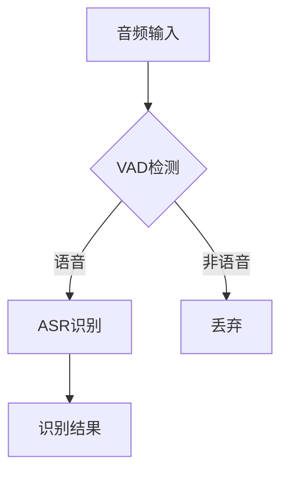
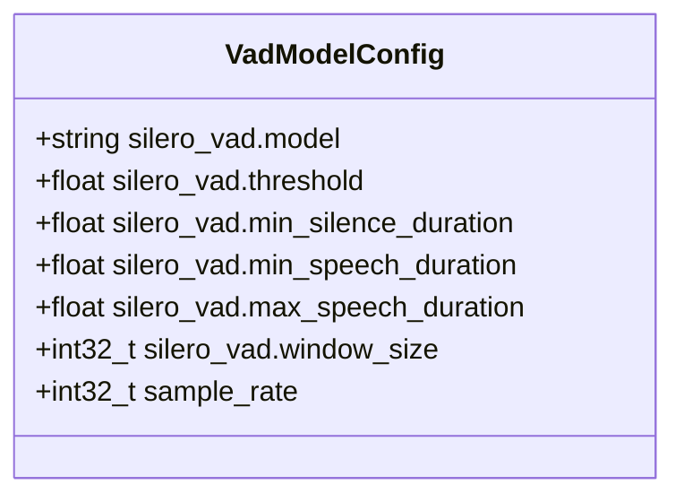
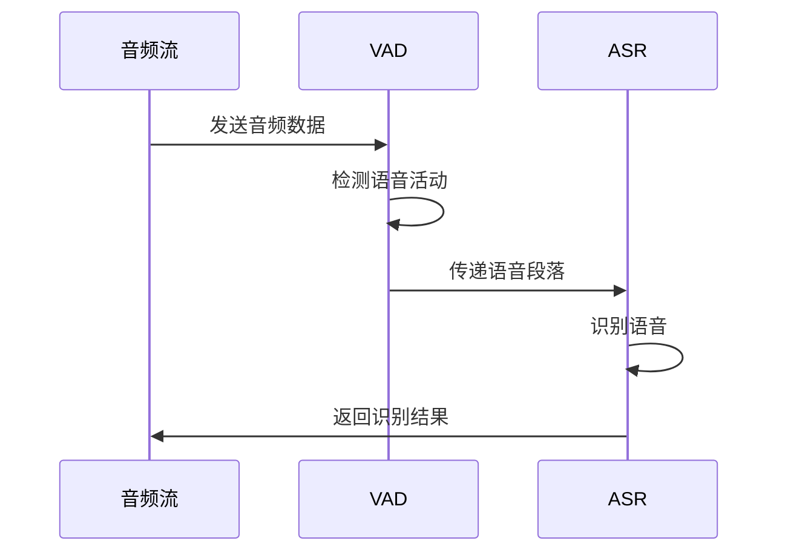
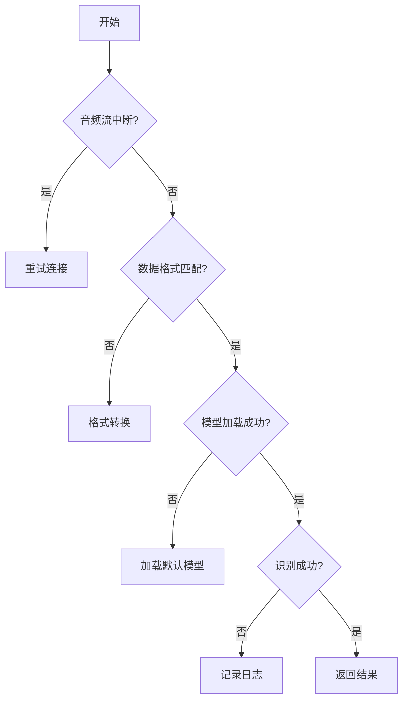

# VAD集成应用

<cite>
**本文档引用的文件**   
- [vad-with-non-streaming-asr.py](file://python-api-examples/vad-with-non-streaming-asr.py)
- [vad-microphone.py](file://python-api-examples/vad-microphone.py)
- [vad-remove-non-speech-segments.py](file://python-api-examples/vad-remove-non-speech-segments.py)
- [voice-activity-detector.cc](file://sherpa-onnx/csrc/voice-activity-detector.cc)
- [vad-model-config.h](file://sherpa-onnx/csrc/vad-model-config.h)
- [ten-vad-model-config.h](file://sherpa-onnx/csrc/ten-vad-model-config.h)
- [silero-vad-model-config.h](file://sherpa-onnx/csrc/silero-vad-model-config.h)
- [speaker-identification-with-vad.py](file://python-api-examples/speaker-identification-with-vad.py)
- [sherpa-onnx-vad-with-online-asr.cc](file://sherpa-onnx/csrc/sherpa-onnx-vad-with-online-asr.cc)
</cite>

## 目录
1. [引言](#引言)
2. [VAD与ASR系统集成](#vad与asr系统集成)
3. [VAD配置与参数](#vad配置与参数)
4. [流式处理模式](#流式处理模式)
5. [错误处理与边界情况](#错误处理与边界情况)
6. [性能优化策略](#性能优化策略)
7. [实际应用示例](#实际应用示例)
8. [结论](#结论)

## 引言
VAD（语音活动检测）在语音识别系统中扮演着至关重要的角色，它能够有效识别音频流中的语音段落，从而优化ASR（自动语音识别）系统的性能。通过将VAD作为前置处理器，系统可以减少不必要的计算开销，提高识别效率。本文档详细介绍了sherpa-onnx Python API中VAD的集成应用，重点描述了VAD与ASR系统的结合使用方式，展示了端点检测在语音识别中的关键作用。

## VAD与ASR系统集成
VAD与ASR系统的集成主要通过将VAD作为前置处理器来实现。VAD负责检测音频流中的语音活动，当检测到语音时，将语音段落传递给ASR系统进行识别。这种集成方式可以显著减少ASR系统的计算负担，因为ASR系统只需要处理包含语音的音频段落，而不需要处理静音或非语音部分。

在sherpa-onnx中，VAD的集成通过`VoiceActivityDetector`类实现。该类提供了`accept_waveform`方法来接收音频数据，并通过`is_speech_detected`方法检测语音活动。当检测到语音时，可以通过`front`属性获取语音段落，并将其传递给ASR系统进行识别。



**图源**
- [vad-with-non-streaming-asr.py](file://python-api-examples/vad-with-non-streaming-asr.py#L450-L490)
- [voice-activity-detector.cc](file://sherpa-onnx/csrc/voice-activity-detector.cc#L138-L180)

## VAD配置与参数
VAD的配置通过`VadModelConfig`类实现，该类包含了VAD模型的配置参数。主要参数包括：

- **silero_vad.model**: Silero VAD模型文件路径
- **silero_vad.threshold**: 语音检测阈值
- **silero_vad.min_silence_duration**: 最小静音持续时间
- **silero_vad.min_speech_duration**: 最小语音持续时间
- **silero_vad.max_speech_duration**: 最大语音持续时间
- **silero_vad.window_size**: 窗口大小
- **sample_rate**: 采样率

这些参数可以根据具体应用场景进行调整，以优化VAD的检测性能。



**图源**
- [vad-model-config.h](file://sherpa-onnx/csrc/vad-model-config.h#L15-L42)
- [ten-vad-model-config.h](file://sherpa-onnx/csrc/ten-vad-model-config.h#L13-L41)

## 流式处理模式
VAD驱动的流式处理模式允许系统实时处理音频流，并自动分割语音段落。这种模式特别适用于长时间的音频处理，因为它可以将长音频分割成多个短语音段落，并对每个段落进行批量识别。

在sherpa-onnx中，流式处理模式通过`accept_waveform`方法实现。该方法接收音频数据，并在检测到语音段落时触发ASR识别。通过这种方式，系统可以实时处理音频流，并生成识别结果。



**图源**
- [sherpa-onnx-vad-with-online-asr.cc](file://sherpa-onnx/csrc/sherpa-onnx-vad-with-online-asr.cc#L146-L187)
- [vad-with-non-streaming-asr.py](file://python-api-examples/vad-with-non-streaming-asr.py#L477-L488)

## 错误处理与边界情况
在实际应用中，VAD和ASR系统可能会遇到各种错误和边界情况。为了确保系统的鲁棒性，需要实现相应的错误处理机制。

常见的错误和边界情况包括：
- 音频流中断
- 音频数据格式不匹配
- VAD模型加载失败
- ASR识别失败

针对这些情况，系统应实现相应的错误处理策略，例如重试机制、异常捕获和日志记录。此外，还需要对边界情况进行处理，例如短语音段落的过滤和长语音段落的分割。



**图源**
- [vad-microphone.py](file://python-api-examples/vad-microphone.py#L100-L120)
- [speaker-identification-with-vad.py](file://python-api-examples/speaker-identification-with-vad.py#L250-L254)

## 性能优化策略
为了优化VAD和ASR系统的性能，可以采取以下策略：

1. **并行处理**: 将VAD和ASR处理任务并行化，以提高处理速度。
2. **缓存机制**: 对常用的语音段落进行缓存，以减少重复计算。
3. **模型优化**: 使用轻量级模型或模型压缩技术，以减少计算开销。
4. **资源管理**: 合理分配系统资源，确保VAD和ASR系统能够高效运行。

通过这些策略，可以显著提高系统的整体性能，减少延迟，并提高识别准确率。

## 实际应用示例
以下是一个使用VAD与非流式ASR模型进行语音识别的实际应用示例：

```python
# 创建VAD配置
config = sherpa_onnx.VadModelConfig()
config.silero_vad.model = args.silero_vad_model
config.sample_rate = args.sample_rate

# 创建VAD实例
vad = sherpa_onnx.VoiceActivityDetector(config, buffer_size_in_seconds=100)

# 处理音频流
while True:
    samples, _ = s.read(samples_per_read)
    samples = samples.reshape(-1)
    buffer = np.concatenate([buffer, samples])
    
    while len(buffer) > window_size:
        vad.accept_waveform(buffer[:window_size])
        buffer = buffer[window_size:]
    
    while not vad.empty():
        stream = recognizer.create_stream()
        stream.accept_waveform(args.sample_rate, vad.front.samples)
        vad.pop()
        recognizer.decode_stream(stream)
        text = stream.result.text.strip().lower()
        if len(text):
            print(text)
```

**代码源**
- [vad-with-non-streaming-asr.py](file://python-api-examples/vad-with-non-streaming-asr.py#L460-L488)

## 结论
VAD在语音识别系统中起着至关重要的作用，它能够有效优化ASR系统的性能，减少不必要的计算开销。通过将VAD作为前置处理器，系统可以实时检测语音活动，并自动分割语音段落。在sherpa-onnx中，VAD的集成通过`VoiceActivityDetector`类实现，提供了灵活的配置选项和高效的处理能力。通过合理的错误处理和性能优化策略，可以确保系统在复杂环境下的鲁棒性。