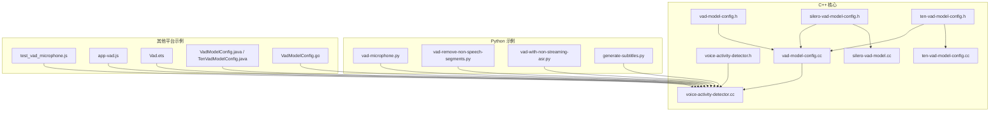
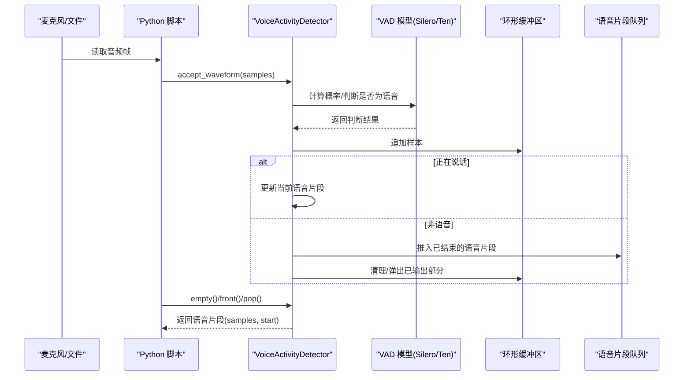
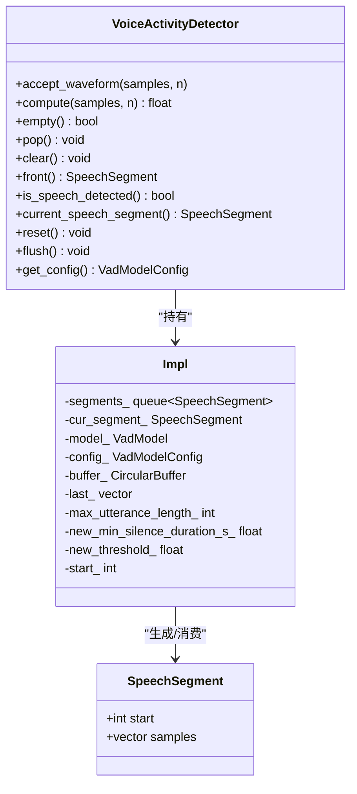
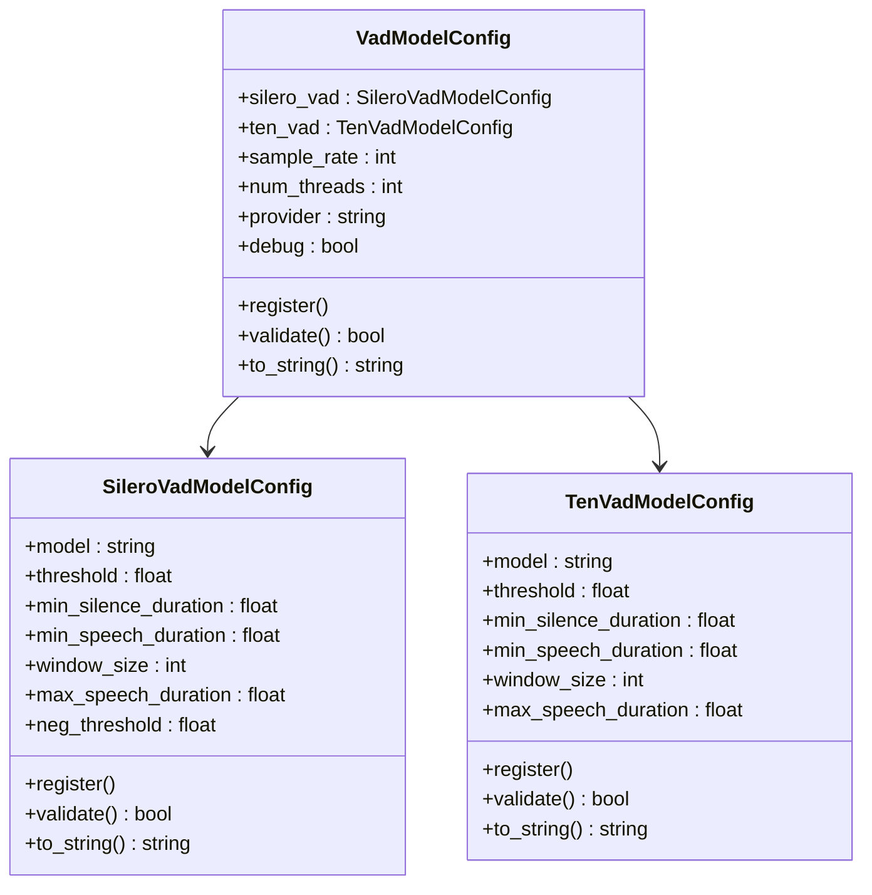
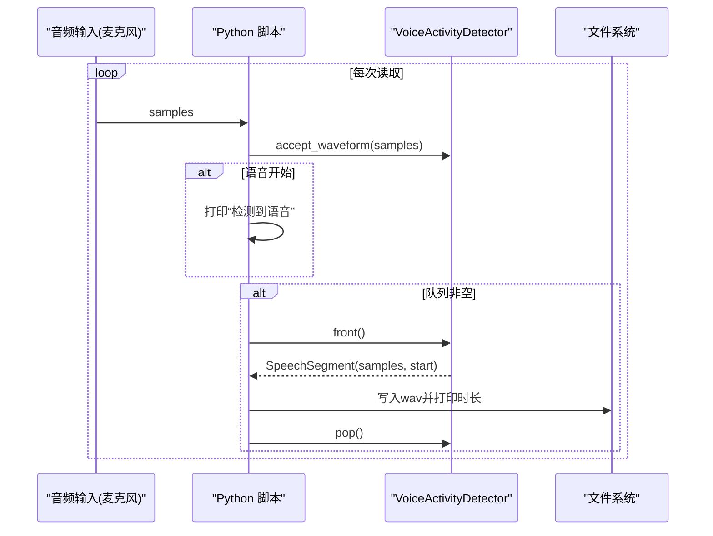
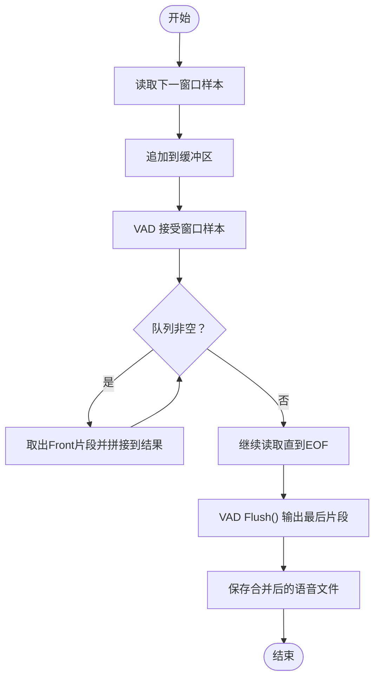
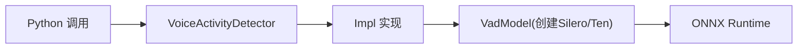

# 基础语音活动检测

<cite>
**本文引用的文件**
- [voice-activity-detector.h](file://sherpa-onnx/csrc/voice-activity-detector.h)
- [voice-activity-detector.cc](file://sherpa-onnx/csrc/voice-activity-detector.cc)
- [vad-model-config.h](file://sherpa-onnx/csrc/vad-model-config.h)
- [vad-model-config.cc](file://sherpa-onnx/csrc/vad-model-config.cc)
- [silero-vad-model-config.h](file://sherpa-onnx/csrc/silero-vad-model-config.h)
- [ten-vad-model-config.h](file://sherpa-onnx/csrc/ten-vad-model-config.h)
- [ten-vad-model-config.cc](file://sherpa-onnx/csrc/ten-vad-model-config.cc)
- [silero-vad-model.cc](file://sherpa-onnx/csrc/silero-vad-model.cc)
- [vad-cxx-api.cc](file://cxx-api-examples/vad-cxx-api.cc)
- [vad-microphone.py](file://python-api-examples/vad-microphone.py)
- [vad-remove-non-speech-segments.py](file://python-api-examples/vad-remove-non-speech-segments.py)
- [vad-with-non-streaming-asr.py](file://python-api-examples/vad-with-non-streaming-asr.py)
- [test_vad_microphone.js](file://nodejs-addon-examples/test_vad_microphone.js)
- [app-vad.js](file://wasm/vad/app-vad.js)
- [Vad.ets](file://harmony-os/SherpaOnnxHar/sherpa_onnx/src/main/ets/components/Vad.ets)
- [VadModelConfig.java](file://sherpa-onnx/java-api/src/main/java/com/k2fsa/sherpa/onnx/VadModelConfig.java)
- [TenVadModelConfig.java](file://sherpa-onnx/java-api/src/main/java/com/k2fsa/sherpa/onnx/TenVadModelConfig.java)
- [vad.js](file://scripts/node-addon-api/lib/vad.js)
- [generate-subtitles.py](file://python-api-examples/generate-subtitles.py)
- [VadModelConfig.go](file://scripts/go/sherpa_onnx.go)
</cite>

## 目录
1. [简介](#简介)
2. [项目结构](#项目结构)
3. [核心组件](#核心组件)
4. [架构总览](#架构总览)
5. [详细组件分析](#详细组件分析)
6. [依赖关系分析](#依赖关系分析)
7. [性能与资源优化](#性能与资源优化)
8. [故障排查指南](#故障排查指南)
9. [结论](#结论)
10. [附录：参数调优指南](#附录参数调优指南)

## 简介
本文件面向sherpa-onnx Python API的基础语音活动检测（Voice Activity Detection, VAD）能力，系统性讲解VoiceActivityDetector类的实现与使用，覆盖SileroVadModelConfig与TenVadModelConfig两类模型配置；并结合麦克风实时检测与文件处理两种典型场景，给出静音段落移除算法、参数调优建议以及性能优化策略。目标是帮助开发者在准确性和效率之间取得平衡，快速落地高质量的语音端点检测与预处理流水线。

## 项目结构
围绕VAD的核心代码位于C++层的“sherpa-onnx/csrc”，并通过多语言绑定暴露到Python、Node.js、Go、Flutter、HarmonyOS等平台。Python示例脚本位于“python-api-examples”，展示了从麦克风采集、静音段移除到与非流式ASR联动的完整用法。

图表来源
- [voice-activity-detector.h](file://sherpa-onnx/csrc/voice-activity-detector.h#L1-L64)
- [voice-activity-detector.cc](file://sherpa-onnx/csrc/voice-activity-detector.cc#L1-L282)
- [vad-model-config.h](file://sherpa-onnx/csrc/vad-model-config.h#L1-L46)
- [vad-model-config.cc](file://sherpa-onnx/csrc/vad-model-config.cc#L52-L79)
- [silero-vad-model-config.h](file://sherpa-onnx/csrc/silero-vad-model-config.h#L1-L52)
- [ten-vad-model-config.h](file://sherpa-onnx/csrc/ten-vad-model-config.h#L1-L46)
- [ten-vad-model-config.cc](file://sherpa-onnx/csrc/ten-vad-model-config.cc#L1-L113)
- [silero-vad-model.cc](file://sherpa-onnx/csrc/silero-vad-model.cc#L101-L157)
- [vad-microphone.py](file://python-api-examples/vad-microphone.py#L1-L126)
- [vad-remove-non-speech-segments.py](file://python-api-examples/vad-remove-non-speech-segments.py#L1-L132)
- [vad-with-non-streaming-asr.py](file://python-api-examples/vad-with-non-streaming-asr.py#L1-L496)
- [test_vad_microphone.js](file://nodejs-addon-examples/test_vad_microphone.js#L45-L80)
- [app-vad.js](file://wasm/vad/app-vad.js#L183-L224)
- [Vad.ets](file://harmony-os/SherpaOnnxHar/sherpa_onnx/src/main/ets/components/Vad.ets#L91-L153)
- [VadModelConfig.java](file://sherpa-onnx/java-api/src/main/java/com/k2fsa/sherpa/onnx/VadModelConfig.java#L42-L92)
- [TenVadModelConfig.java](file://sherpa-onnx/java-api/src/main/java/com/k2fsa/sherpa/onnx/TenVadModelConfig.java#L1-L93)
- [VadModelConfig.go](file://scripts/go/sherpa_onnx.go#L1385-L1442)

章节来源
- [voice-activity-detector.h](file://sherpa-onnx/csrc/voice-activity-detector.h#L1-L64)
- [voice-activity-detector.cc](file://sherpa-onnx/csrc/voice-activity-detector.cc#L1-L282)
- [vad-model-config.h](file://sherpa-onnx/csrc/vad-model-config.h#L1-L46)
- [vad-model-config.cc](file://sherpa-onnx/csrc/vad-model-config.cc#L52-L79)
- [silero-vad-model-config.h](file://sherpa-onnx/csrc/silero-vad-model-config.h#L1-L52)
- [ten-vad-model-config.h](file://sherpa-onnx/csrc/ten-vad-model-config.h#L1-L46)
- [ten-vad-model-config.cc](file://sherpa-onnx/csrc/ten-vad-model-config.cc#L1-L113)
- [silero-vad-model.cc](file://sherpa-onnx/csrc/silero-vad-model.cc#L101-L157)

## 核心组件
- VoiceActivityDetector：负责接收音频帧、调用VAD模型判断是否为语音、维护环形缓冲区、聚合静音段落并输出可识别的语音片段。
- VadModelConfig：统一承载SileroVadModelConfig与TenVadModelConfig，以及采样率、线程数、执行提供者、调试开关等通用配置。
- SileroVadModelConfig/TenVadModelConfig：分别定义Silero与Ten VAD模型的阈值、最小静音/语音持续时间、窗口大小、最大语音时长等关键参数。
- 模型层：SileroVadModel实现概率计算与状态管理，TenVadModelConfig提供参数注册与校验。

章节来源
- [voice-activity-detector.h](file://sherpa-onnx/csrc/voice-activity-detector.h#L1-L64)
- [voice-activity-detector.cc](file://sherpa-onnx/csrc/voice-activity-detector.cc#L1-L282)
- [vad-model-config.h](file://sherpa-onnx/csrc/vad-model-config.h#L1-L46)
- [vad-model-config.cc](file://sherpa-onnx/csrc/vad-model-config.cc#L52-L79)
- [silero-vad-model-config.h](file://sherpa-onnx/csrc/silero-vad-model-config.h#L1-L52)
- [ten-vad-model-config.h](file://sherpa-onnx/csrc/ten-vad-model-config.h#L1-L46)

## 架构总览
下图展示从麦克风或文件输入到VAD检测、静音段移除、最终输出语音片段的整体流程。

图表来源
- [voice-activity-detector.cc](file://sherpa-onnx/csrc/voice-activity-detector.cc#L50-L136)
- [vad-microphone.py](file://python-api-examples/vad-microphone.py#L90-L120)
- [vad-remove-non-speech-segments.py](file://python-api-examples/vad-remove-non-speech-segments.py#L100-L128)

## 详细组件分析

### VoiceActivityDetector 类
- 主要职责
  - 接收音频帧并按模型窗口大小进行批处理。
  - 维护内部环形缓冲区，记录从开始说话到结束说话之间的连续样本。
  - 在静默期达到最小静音持续时间后，将当前语音片段推入输出队列。
  - 支持Flush以在输入结束时输出最后一个片段。
- 关键行为
  - AcceptWaveform：根据当前累计样本长度与模型窗口大小，逐窗判断是否为语音；若进入/退出语音状态，更新当前片段与队列。
  - Front/Pop/Clear/Empty：提供队列访问接口，用于获取并消费已检测到的语音片段。
  - Reset/Flush：重置状态或在输入结束时输出最后片段。
- 内部状态
  - start_：当前语音片段起始位置（样本索引）。
  - cur_segment_：当前正在累积的片段。
  - segments_：已结束但尚未被消费的语音片段队列。
  - buffer_：环形缓冲区，保存最近一段时间的样本。
  - last_：上一次未满窗的样本缓存，避免重复拷贝。

图表来源
- [voice-activity-detector.h](file://sherpa-onnx/csrc/voice-activity-detector.h#L1-L64)
- [voice-activity-detector.cc](file://sherpa-onnx/csrc/voice-activity-detector.cc#L1-L282)

章节来源
- [voice-activity-detector.h](file://sherpa-onnx/csrc/voice-activity-detector.h#L1-L64)
- [voice-activity-detector.cc](file://sherpa-onnx/csrc/voice-activity-detector.cc#L50-L183)

### VadModelConfig 与模型配置
- VadModelConfig
  - 组合SileroVadModelConfig与TenVadModelConfig，同时支持sample_rate、num_threads、provider、debug等通用项。
  - 提供Register/Validate/ToString，便于命令行工具与日志输出。
- SileroVadModelConfig
  - threshold：判断为语音的概率阈值。
  - min_silence_duration/min_speech_duration：最小静音/语音持续时间（秒）。
  - window_size：模型输入窗口大小（样本数），Silero v4通常等于窗口步进。
  - max_speech_duration：超过该时长后临时提高阈值，降低误检。
  - neg_threshold：从语音转静默的负阈值，默认采用Silero规则。
- TenVadModelConfig
  - threshold、min_silence_duration、min_speech_duration、window_size、max_speech_duration。
  - 注册与校验逻辑确保参数范围合理。

图表来源
- [vad-model-config.h](file://sherpa-onnx/csrc/vad-model-config.h#L1-L46)
- [vad-model-config.cc](file://sherpa-onnx/csrc/vad-model-config.cc#L52-L79)
- [silero-vad-model-config.h](file://sherpa-onnx/csrc/silero-vad-model-config.h#L1-L52)
- [ten-vad-model-config.h](file://sherpa-onnx/csrc/ten-vad-model-config.h#L1-L46)
- [ten-vad-model-config.cc](file://sherpa-onnx/csrc/ten-vad-model-config.cc#L1-L113)

章节来源
- [vad-model-config.h](file://sherpa-onnx/csrc/vad-model-config.h#L1-L46)
- [vad-model-config.cc](file://sherpa-onnx/csrc/vad-model-config.cc#L52-L79)
- [silero-vad-model-config.h](file://sherpa-onnx/csrc/silero-vad-model-config.h#L1-L52)
- [ten-vad-model-config.h](file://sherpa-onnx/csrc/ten-vad-model-config.h#L1-L46)
- [ten-vad-model-config.cc](file://sherpa-onnx/csrc/ten-vad-model-config.cc#L1-L113)

### 基于麦克风的实时VAD检测流程
- 流程要点
  - 以固定时间片（如100ms）从麦克风读取样本，按需重采样至模型期望采样率。
  - 将样本送入VAD，若检测到语音且首次出现，打印提示；当不再检测到语音时，清空打印标记。
  - 不断轮询VAD队列，取出语音片段并保存为wav文件，同时输出时长信息。
- 参考实现路径
  - [vad-microphone.py](file://python-api-examples/vad-microphone.py#L80-L120)
  - [test_vad_microphone.js](file://nodejs-addon-examples/test_vad_microphone.js#L45-L80)
  - [app-vad.js](file://wasm/vad/app-vad.js#L183-L224)
  - [Vad.ets](file://harmony-os/SherpaOnnxHar/sherpa_onnx/src/main/ets/components/Vad.ets#L113-L153)
  - [VadModelConfig.go](file://scripts/go/sherpa_onnx.go#L1385-L1442)

图表来源
- [vad-microphone.py](file://python-api-examples/vad-microphone.py#L90-L120)
- [test_vad_microphone.js](file://nodejs-addon-examples/test_vad_microphone.js#L45-L80)
- [app-vad.js](file://wasm/vad/app-vad.js#L183-L224)
- [Vad.ets](file://harmony-os/SherpaOnnxHar/sherpa_onnx/src/main/ets/components/Vad.ets#L113-L153)
- [VadModelConfig.go](file://scripts/go/sherpa_onnx.go#L1385-L1442)

章节来源
- [vad-microphone.py](file://python-api-examples/vad-microphone.py#L1-L126)
- [test_vad_microphone.js](file://nodejs-addon-examples/test_vad_microphone.js#L45-L80)
- [app-vad.js](file://wasm/vad/app-vad.js#L183-L224)
- [Vad.ets](file://harmony-os/SherpaOnnxHar/sherpa_onnx/src/main/ets/components/Vad.ets#L91-L153)
- [VadModelConfig.go](file://scripts/go/sherpa_onnx.go#L1385-L1442)

### 文件处理的静音段移除算法
- 流程要点
  - 以固定窗口大小（由模型配置决定）滑动读取音频，将样本追加到缓冲区。
  - 每次窗口推进，调用VAD接受窗口样本；当队列非空时，依次取出所有语音片段并拼接。
  - 最终将所有语音片段写入一个新文件，作为去静音后的结果。
- 参考实现路径
  - [vad-remove-non-speech-segments.py](file://python-api-examples/vad-remove-non-speech-segments.py#L90-L128)
  - [vad-remove-non-speech-segments-from-file.py](file://python-api-examples/vad-remove-non-speech-segments-from-file.py)
  - [generate-subtitles.py](file://python-api-examples/generate-subtitles.py#L606-L639)

图表来源
- [vad-remove-non-speech-segments.py](file://python-api-examples/vad-remove-non-speech-segments.py#L90-L128)
- [generate-subtitles.py](file://python-api-examples/generate-subtitles.py#L606-L639)

章节来源
- [vad-remove-non-speech-segments.py](file://python-api-examples/vad-remove-non-speech-segments.py#L1-L132)
- [generate-subtitles.py](file://python-api-examples/generate-subtitles.py#L606-L639)

### 与非流式ASR联动的VAD+ASR流程
- 流程要点
  - 使用VAD对麦克风输入进行分段，每段作为独立的离线识别单元。
  - 对每个语音片段创建识别流，注入样本后解码，提取文本结果。
  - 适合对整体文本进行后处理（如大小写规范化、同音替换等）。
- 参考实现路径
  - [vad-with-non-streaming-asr.py](file://python-api-examples/vad-with-non-streaming-asr.py#L424-L496)

章节来源
- [vad-with-non-streaming-asr.py](file://python-api-examples/vad-with-non-streaming-asr.py#L1-L496)

## 依赖关系分析
- 组件耦合
  - VoiceActivityDetector依赖VadModelConfig与VadModel（Silero/Ten），通过内部Impl封装具体实现细节。
  - 模型层SileroVadModel在Compute阶段运行ONNX推理，返回概率并维护内部状态。
- 外部依赖
  - ONNX Runtime（Ort Session）用于加载与推理模型。
  - 各平台绑定（Python/Node.js/Go/Flutter/HarmonyOS）通过各自桥接层调用C++实现。

图表来源
- [voice-activity-detector.cc](file://sherpa-onnx/csrc/voice-activity-detector.cc#L28-L45)
- [silero-vad-model.cc](file://sherpa-onnx/csrc/silero-vad-model.cc#L401-L452)

章节来源
- [voice-activity-detector.cc](file://sherpa-onnx/csrc/voice-activity-detector.cc#L28-L45)
- [silero-vad-model.cc](file://sherpa-onnx/csrc/silero-vad-model.cc#L401-L452)

## 性能与资源优化
- 窗口大小与步进
  - SileroVadModelConfig.window_size通常为512/1024/1536（对应16kHz采样率），Silero v4中窗口步进等于窗口大小，减少重叠开销。
  - TenVadModelConfig.window_size推荐使用160或256，以平衡延迟与精度。
- 线程与执行提供者
  - VadModelConfig.num_threads控制神经网络计算线程数；provider可选择CPU/GPU等后端，依据硬件能力调整。
- 缓冲区大小
  - VoiceActivityDetector构造时传入buffer_size_in_seconds，建议根据预期最长语音段与时延需求设置，避免过大内存占用。
- 动态阈值与最小持续时间
  - 当累计语音长度超过max_speech_duration时，内部会临时提升阈值并缩短最小静音持续时间，有助于抑制长语音误检。
- I/O与批处理
  - Python示例中以0.1秒为批次读取，既保证交互性又降低CPU压力；文件处理时按window_size滑动，避免一次性载入整段音频。

章节来源
- [silero-vad-model-config.h](file://sherpa-onnx/csrc/silero-vad-model-config.h#L1-L52)
- [ten-vad-model-config.h](file://sherpa-onnx/csrc/ten-vad-model-config.h#L1-L46)
- [voice-activity-detector.cc](file://sherpa-onnx/csrc/voice-activity-detector.cc#L50-L136)
- [vad-microphone.py](file://python-api-examples/vad-microphone.py#L44-L60)
- [vad-remove-non-speech-segments.py](file://python-api-examples/vad-remove-non-speech-segments.py#L80-L95)

## 故障排查指南
- 常见问题
  - 无法加载模型：检查模型路径与文件存在性；TenVadModelConfig.Validate会拒绝空路径或不存在的文件。
  - 参数越界：阈值过小或过大、最小持续时间非正、窗口大小不合法等会被校验函数拒绝。
  - 无语音输出：确认采样率一致、窗口大小与模型匹配、缓冲区足够大以容纳至少一个完整片段。
  - 平台差异：不同平台（Python/Node.js/Go/Flutter/HarmonyOS）的绑定层可能对字段命名或默认值有差异，需对照各平台配置类。
- 定位方法
  - 开启debug选项查看模型加载日志。
  - 使用ToString输出当前配置，核对关键参数。
  - 在循环中打印is_speech_detected与队列状态，定位何时进入/退出语音状态。

章节来源
- [ten-vad-model-config.cc](file://sherpa-onnx/csrc/ten-vad-model-config.cc#L44-L97)
- [vad-model-config.cc](file://sherpa-onnx/csrc/vad-model-config.cc#L52-L79)
- [VadModelConfig.java](file://sherpa-onnx/java-api/src/main/java/com/k2fsa/sherpa/onnx/VadModelConfig.java#L42-L92)
- [TenVadModelConfig.java](file://sherpa-onnx/java-api/src/main/java/com/k2fsa/sherpa/onnx/TenVadModelConfig.java#L1-L93)
- [vad.js](file://scripts/node-addon-api/lib/vad.js#L66-L96)

## 结论
VoiceActivityDetector提供了简洁高效的VAD能力，配合Silero与Ten两类模型配置，可在多种平台与应用场景中稳定工作。通过合理设置阈值、最小持续时间、窗口大小与缓冲区，开发者可以在准确率与实时性之间取得良好平衡。结合静音段移除与非流式ASR联动，可构建完整的语音预处理与识别流水线。

## 附录：参数调优指南
- 检测阈值（threshold）
  - 初始值可设为0.5；若漏检较多，适度上调；若误检较多，适度下调。
  - Silero支持neg_threshold，用于从语音转静默时的负阈值，避免退出过早。
- 最小语音段长度（min_speech_duration）
  - 建议0.25~0.5秒，避免截断短词或停顿。
- 最小静音段长度（min_silence_duration）
  - 建议0.25~0.5秒，平衡端点检测的稳定性与延迟。
- 最大语音时长（max_speech_duration）
  - 超过该时长后自动提升阈值，减少长语音误检；可根据实际场景设定。
- 窗口大小（window_size）
  - Silero：512/1024/1536（16kHz）；Ten：160或256。
- 缓冲区大小（buffer_size_in_seconds）
  - 建议10~60秒，兼顾内存占用与端点检测鲁棒性。
- 线程与提供者（num_threads/provider）
  - CPU/GPU按硬件能力选择；线程数与模型复杂度匹配，避免过度竞争。

章节来源
- [silero-vad-model-config.h](file://sherpa-onnx/csrc/silero-vad-model-config.h#L1-L52)
- [ten-vad-model-config.h](file://sherpa-onnx/csrc/ten-vad-model-config.h#L1-L46)
- [voice-activity-detector.cc](file://sherpa-onnx/csrc/voice-activity-detector.cc#L191-L203)
- [vad-cxx-api.cc](file://cxx-api-examples/vad-cxx-api.cc#L49-L64)
- [vad-with-non-streaming-asr.py](file://python-api-examples/vad-with-non-streaming-asr.py#L452-L460)