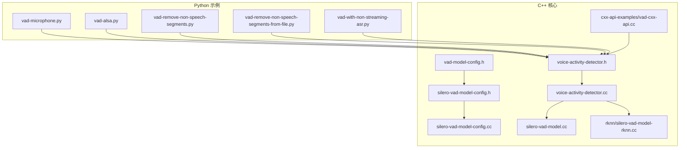
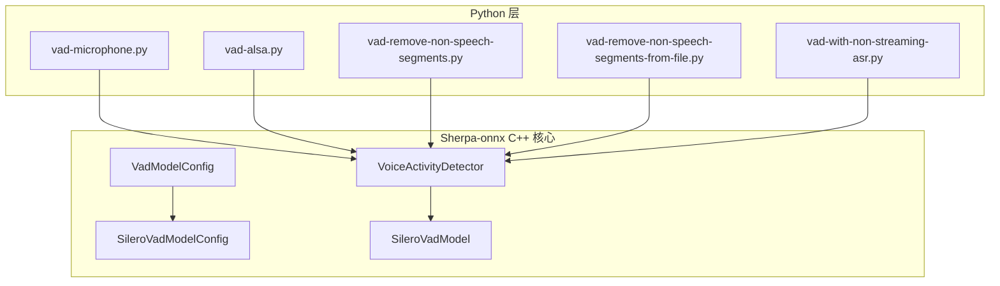
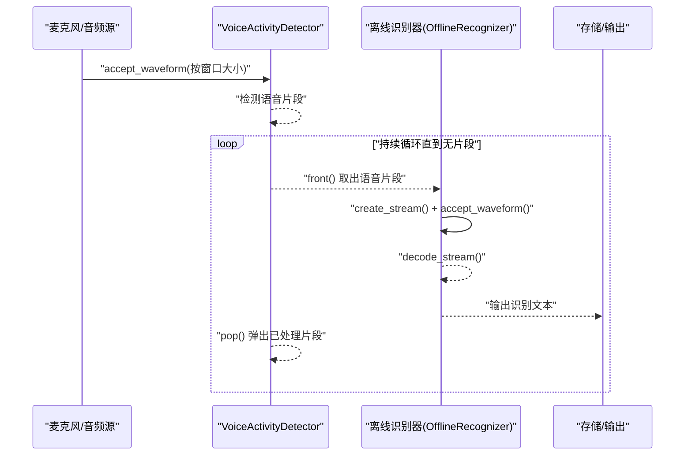
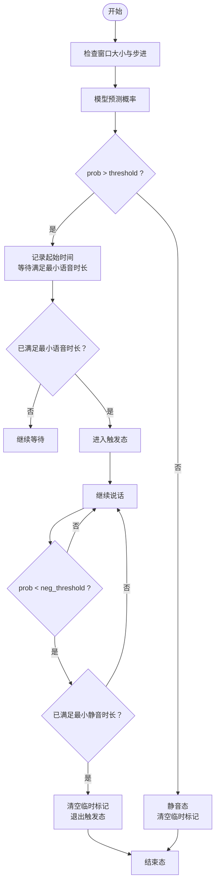
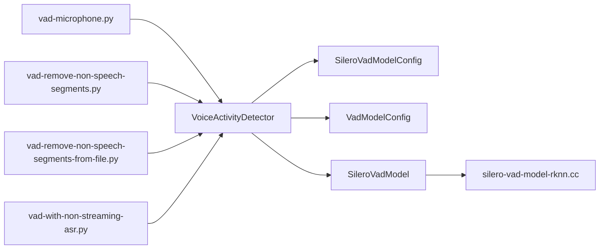

# 语音活动检测示例

<cite>
**本文引用的文件列表**
- [python-api-examples/vad-microphone.py](file://python-api-examples/vad-microphone.py)
- [python-api-examples/vad-alsa.py](file://python-api-examples/vad-alsa.py)
- [python-api-examples/vad-remove-non-speech-segments.py](file://python-api-examples/vad-remove-non-speech-segments.py)
- [python-api-examples/vad-remove-non-speech-segments-from-file.py](file://python-api-examples/vad-remove-non-speech-segments-from-file.py)
- [python-api-examples/vad-with-non-streaming-asr.py](file://python-api-examples/vad-with-non-streaming-asr.py)
- [sherpa-onnx/csrc/voice-activity-detector.h](file://sherpa-onnx/csrc/voice-activity-detector.h)
- [sherpa-onnx/csrc/voice-activity-detector.cc](file://sherpa-onnx/csrc/voice-activity-detector.cc)
- [sherpa-onnx/csrc/silero-vad-model-config.h](file://sherpa-onnx/csrc/silero-vad-model-config.h)
- [sherpa-onnx/csrc/silero-vad-model-config.cc](file://sherpa-onnx/csrc/silero-vad-model-config.cc)
- [sherpa-onnx/csrc/vad-model-config.h](file://sherpa-onnx/csrc/vad-model-config.h)
- [sherpa-onnx/csrc/silero-vad-model.cc](file://sherpa-onnx/csrc/silero-vad-model.cc)
- [sherpa-onnx/csrc/rknn/silero-vad-model-rknn.cc](file://sherpa-onnx/csrc/rknn/silero-vad-model-rknn.cc)
- [cxx-api-examples/vad-cxx-api.cc](file://cxx-api-examples/vad-cxx-api.cc)
</cite>

## 目录
1. [简介](#简介)
2. [项目结构](#项目结构)
3. [核心组件](#核心组件)
4. [架构总览](#架构总览)
5. [详细组件分析](#详细组件分析)
6. [依赖关系分析](#依赖关系分析)
7. [性能考量与优化建议](#性能考量与优化建议)
8. [故障排查指南](#故障排查指南)
9. [结论](#结论)
10. [附录](#附录)

## 简介
本文件围绕 sherpa-onnx 的 Python API 提供的语音活动检测（Voice Activity Detection, VAD）示例进行系统化说明，覆盖以下主题：
- 基于麦克风的实时检测与文件处理流程
- VoiceActivityDetector 类的配置与使用方法
- 如何设置 SileroVadModelConfig 参数
- 语音段落检测与静音移除的算法原理与参数调优
- VAD 与非流式 ASR 的集成示例及端点检测在语音识别中的应用
- 性能基准与资源消耗优化建议

## 项目结构
与 VAD 示例直接相关的核心文件分布如下：
- Python 示例脚本：位于 python-api-examples 目录，涵盖麦克风输入、ALSA 输入、静音移除、文件处理以及与非流式 ASR 集成等场景
- C++ 核心实现：位于 sherpa-onnx/csrc，包含 VoiceActivityDetector 接口、SileroVad 模型配置、VAD 模型配置、SileroVad 实现与 RKNN 版本实现等

图表来源
- [python-api-examples/vad-microphone.py](file://python-api-examples/vad-microphone.py#L1-L126)
- [python-api-examples/vad-alsa.py](file://python-api-examples/vad-alsa.py#L1-L108)
- [python-api-examples/vad-remove-non-speech-segments.py](file://python-api-examples/vad-remove-non-speech-segments.py#L1-L132)
- [python-api-examples/vad-remove-non-speech-segments-from-file.py](file://python-api-examples/vad-remove-non-speech-segments-from-file.py#L1-L131)
- [python-api-examples/vad-with-non-streaming-asr.py](file://python-api-examples/vad-with-non-streaming-asr.py#L1-L496)
- [sherpa-onnx/csrc/voice-activity-detector.h](file://sherpa-onnx/csrc/voice-activity-detector.h#L1-L64)
- [sherpa-onnx/csrc/voice-activity-detector.cc](file://sherpa-onnx/csrc/voice-activity-detector.cc#L1-L48)
- [sherpa-onnx/csrc/silero-vad-model-config.h](file://sherpa-onnx/csrc/silero-vad-model-config.h#L1-L52)
- [sherpa-onnx/csrc/silero-vad-model-config.cc](file://sherpa-onnx/csrc/silero-vad-model-config.cc#L33-L125)
- [sherpa-onnx/csrc/vad-model-config.h](file://sherpa-onnx/csrc/vad-model-config.h#L1-L47)
- [sherpa-onnx/csrc/silero-vad-model.cc](file://sherpa-onnx/csrc/silero-vad-model.cc#L401-L452)
- [sherpa-onnx/csrc/rknn/silero-vad-model-rknn.cc](file://sherpa-onnx/csrc/rknn/silero-vad-model-rknn.cc#L54-L164)
- [cxx-api-examples/vad-cxx-api.cc](file://cxx-api-examples/vad-cxx-api.cc#L49-L96)

章节来源
- [python-api-examples/vad-microphone.py](file://python-api-examples/vad-microphone.py#L1-L126)
- [python-api-examples/vad-alsa.py](file://python-api-examples/vad-alsa.py#L1-L108)
- [python-api-examples/vad-remove-non-speech-segments.py](file://python-api-examples/vad-remove-non-speech-segments.py#L1-L132)
- [python-api-examples/vad-remove-non-speech-segments-from-file.py](file://python-api-examples/vad-remove-non-speech-segments-from-file.py#L1-L131)
- [python-api-examples/vad-with-non-streaming-asr.py](file://python-api-examples/vad-with-non-streaming-asr.py#L1-L496)
- [sherpa-onnx/csrc/voice-activity-detector.h](file://sherpa-onnx/csrc/voice-activity-detector.h#L1-L64)
- [sherpa-onnx/csrc/voice-activity-detector.cc](file://sherpa-onnx/csrc/voice-activity-detector.cc#L1-L48)
- [sherpa-onnx/csrc/silero-vad-model-config.h](file://sherpa-onnx/csrc/silero-vad-model-config.h#L1-L52)
- [sherpa-onnx/csrc/silero-vad-model-config.cc](file://sherpa-onnx/csrc/silero-vad-model-config.cc#L33-L125)
- [sherpa-onnx/csrc/vad-model-config.h](file://sherpa-onnx/csrc/vad-model-config.h#L1-L47)
- [sherpa-onnx/csrc/silero-vad-model.cc](file://sherpa-onnx/csrc/silero-vad-model.cc#L401-L452)
- [sherpa-onnx/csrc/rknn/silero-vad-model-rknn.cc](file://sherpa-onnx/csrc/rknn/silero-vad-model-rknn.cc#L54-L164)
- [cxx-api-examples/vad-cxx-api.cc](file://cxx-api-examples/vad-cxx-api.cc#L49-L96)

## 核心组件
- VoiceActivityDetector：提供实时或离线的语音活动检测能力，支持从缓冲区弹出已检测到的语音片段，支持 Flush 结束检测
- SileroVadModelConfig：定义 Silero VAD 模型的路径、阈值、最小静音/语音时长、窗口大小、最大语音时长、负阈值等参数
- VadModelConfig：封装 SileroVadModelConfig 和 TenVadModelConfig，以及采样率、线程数、执行提供者、调试开关等通用配置
- SileroVadModel：内部实现 Silero VAD 模型推理与状态管理，包含触发态、起止样本计数、最小静音/语音样本数、窗口重叠等逻辑

章节来源
- [sherpa-onnx/csrc/voice-activity-detector.h](file://sherpa-onnx/csrc/voice-activity-detector.h#L1-L64)
- [sherpa-onnx/csrc/voice-activity-detector.cc](file://sherpa-onnx/csrc/voice-activity-detector.cc#L1-L48)
- [sherpa-onnx/csrc/silero-vad-model-config.h](file://sherpa-onnx/csrc/silero-vad-model-config.h#L1-L52)
- [sherpa-onnx/csrc/silero-vad-model-config.cc](file://sherpa-onnx/csrc/silero-vad-model-config.cc#L33-L125)
- [sherpa-onnx/csrc/vad-model-config.h](file://sherpa-onnx/csrc/vad-model-config.h#L1-L47)
- [sherpa-onnx/csrc/silero-vad-model.cc](file://sherpa-onnx/csrc/silero-vad-model.cc#L401-L452)
- [sherpa-onnx/csrc/rknn/silero-vad-model-rknn.cc](file://sherpa-onnx/csrc/rknn/silero-vad-model-rknn.cc#L54-L164)

## 架构总览
下图展示了 Python 示例与 C++ 核心之间的交互关系，以及 VAD 检测与 ASR 解码的集成路径。

图表来源
- [python-api-examples/vad-microphone.py](file://python-api-examples/vad-microphone.py#L1-L126)
- [python-api-examples/vad-alsa.py](file://python-api-examples/vad-alsa.py#L1-L108)
- [python-api-examples/vad-remove-non-speech-segments.py](file://python-api-examples/vad-remove-non-speech-segments.py#L1-L132)
- [python-api-examples/vad-remove-non-speech-segments-from-file.py](file://python-api-examples/vad-remove-non-speech-segments-from-file.py#L1-L131)
- [python-api-examples/vad-with-non-streaming-asr.py](file://python-api-examples/vad-with-non-streaming-asr.py#L1-L496)
- [sherpa-onnx/csrc/voice-activity-detector.h](file://sherpa-onnx/csrc/voice-activity-detector.h#L1-L64)
- [sherpa-onnx/csrc/silero-vad-model-config.h](file://sherpa-onnx/csrc/silero-vad-model-config.h#L1-L52)
- [sherpa-onnx/csrc/vad-model-config.h](file://sherpa-onnx/csrc/vad-model-config.h#L1-L47)
- [sherpa-onnx/csrc/silero-vad-model.cc](file://sherpa-onnx/csrc/silero-vad-model.cc#L401-L452)

## 详细组件分析

### VoiceActivityDetector 类与使用方法
- 创建方式：通过构造函数传入 VadModelConfig，并可指定缓冲区大小（秒）
- 关键接口：
  - AcceptWaveform：接受固定长度的音频帧（通常等于 window_size）
  - IsSpeechDetected：判断当前是否处于语音活动状态
  - Front/Pop：获取并弹出已检测到的语音片段；Empty 判断队列是否为空
  - Flush：结束输入，确保最后一个语音片段被完整检测
  - GetConfig：获取当前配置
- 缓冲策略：内部维护环形缓冲区，按 sample_rate × buffer_size_in_seconds 计算容量，避免长时间录音导致内存溢出

章节来源
- [sherpa-onnx/csrc/voice-activity-detector.h](file://sherpa-onnx/csrc/voice-activity-detector.h#L1-L64)
- [sherpa-onnx/csrc/voice-activity-detector.cc](file://sherpa-onnx/csrc/voice-activity-detector.cc#L1-L48)

### SileroVadModelConfig 配置详解
- 必填项与校验：
  - model：Silero VAD 模型路径，必须存在且可加载
  - threshold：分类阈值，范围限制为合理区间
  - min_silence_duration / min_speech_duration：最小静音/语音时长（秒），用于约束起止判定
  - window_size：窗口大小（样本数），对 16kHz 采样率应使用 512/1024/1536；对 8kHz 应使用 256/512/768
  - max_speech_duration：超过该时长后会临时提高阈值以抑制误检
  - neg_threshold：退出阈值，默认采用 Silero 规则（threshold - 0.15，下限 0.01）
- 默认值与行为：
  - 默认采样率 16000，线程数 1，provider 为 cpu，debug 可开启
  - 当 max_speech_duration 达到后，内部会提升阈值至 0.9，检测完成后恢复原阈值

章节来源
- [sherpa-onnx/csrc/silero-vad-model-config.h](file://sherpa-onnx/csrc/silero-vad-model-config.h#L1-L52)
- [sherpa-onnx/csrc/silero-vad-model-config.cc](file://sherpa-onnx/csrc/silero-vad-model-config.cc#L33-L125)
- [sherpa-onnx/csrc/vad-model-config.h](file://sherpa-onnx/csrc/vad-model-config.h#L1-L47)

### 基于麦克风的实时检测（Python）
- 设备选择与采样率：
  - 支持 sounddevice 或 ALSA（Linux）
  - 可通过环境变量调整采样率与设备索引
- 流式处理：
  - 按 0.1 秒窗口读取音频，调用 vad.accept_waveform
  - 使用 vad.is_speech_detected 判断是否开始说话
  - 不断弹出 vad.front 的语音片段并保存为 wav 文件
- 示例入口：
  - vad-microphone.py：使用 sounddevice
  - vad-alsa.py：使用 ALSA（Linux）

章节来源
- [python-api-examples/vad-microphone.py](file://python-api-examples/vad-microphone.py#L1-L126)
- [python-api-examples/vad-alsa.py](file://python-api-examples/vad-alsa.py#L1-L108)

### 文件处理与静音移除（Python）
- 静音移除（实时）：
  - 将连续读取的音频拼接为缓冲区，按 window_size 分块送入 VAD
  - 弹出所有已检测到的语音片段，合并为“仅语音”音频并保存
- 静音移除（离线文件）：
  - 读取整段音频，按 window_size 分块送入 VAD
  - 弹出并合并所有语音片段，写回输出文件
- 示例入口：
  - vad-remove-non-speech-segments.py
  - vad-remove-non-speech-segments-from-file.py

章节来源
- [python-api-examples/vad-remove-non-speech-segments.py](file://python-api-examples/vad-remove-non-speech-segments.py#L1-L132)
- [python-api-examples/vad-remove-non-speech-segments-from-file.py](file://python-api-examples/vad-remove-non-speech-segments-from-file.py#L1-L131)

### VAD 与非流式 ASR 集成（Python）
- 流程概述：
  - 从麦克风读取音频，按 window_size 送入 VAD
  - 当 vad.empty() 为假时，取出前端语音片段，创建离线识别流并喂入
  - 弹出片段并继续解码，输出文本结果
- 支持模型族：
  - Transducer（encoder/decoder/joiner）
  - Paraformer
  - SenseVoice
  - Whisper（含多语言任务）
  - Moonshine（预处理/编码器/缓存/未缓存解码器）
- 示例入口：
  - vad-with-non-streaming-asr.py

图表来源
- [python-api-examples/vad-with-non-streaming-asr.py](file://python-api-examples/vad-with-non-streaming-asr.py#L424-L496)
- [sherpa-onnx/csrc/voice-activity-detector.h](file://sherpa-onnx/csrc/voice-activity-detector.h#L1-L64)

章节来源
- [python-api-examples/vad-with-non-streaming-asr.py](file://python-api-examples/vad-with-non-streaming-asr.py#L1-L496)

### 算法原理与参数调优（SileroVAD）
- 状态机与阈值策略：
  - 触发态（triggered_）：进入语音状态
  - 起止样本计数（temp_start_/temp_end_）：用于满足最小语音/静音时长约束
  - 退出阈值（neg_threshold）：默认采用 threshold - 0.15，下限 0.01，防止负阈值
  - 超长语音阈值提升：当当前片段超过 max_speech_duration 后，临时将阈值提升至 0.9，结束后恢复
- 窗口与步进：
  - WindowSize：window_size + 窗口重叠
  - WindowShift：window_size
  - 最小静音/语音样本数：由 min_silence_duration/min_speech_duration 乘以 sample_rate 得到
- 参数调优建议：
  - threshold：根据噪声环境调整，过高易漏检，过低易误检
  - min_speech_duration：避免短促噪声被误判为语音
  - min_silence_duration：避免过早结束语音段
  - max_speech_duration：长语音场景下提升稳定性
  - window_size：与采样率匹配（16kHz 推荐 512/1024/1536；8kHz 推荐 256/512/768）

图表来源
- [sherpa-onnx/csrc/rknn/silero-vad-model-rknn.cc](file://sherpa-onnx/csrc/rknn/silero-vad-model-rknn.cc#L98-L164)
- [sherpa-onnx/csrc/silero-vad-model-config.h](file://sherpa-onnx/csrc/silero-vad-model-config.h#L1-L52)

章节来源
- [sherpa-onnx/csrc/rknn/silero-vad-model-rknn.cc](file://sherpa-onnx/csrc/rknn/silero-vad-model-rknn.cc#L54-L164)
- [sherpa-onnx/csrc/silero-vad-model-config.h](file://sherpa-onnx/csrc/silero-vad-model-config.h#L1-L52)

### C++ 示例对照（理解内部实现）
- C++ 示例展示了如何构建 VadModelConfig 并创建 VoiceActivityDetector，随后按 window_size 分块处理音频，最后 Flush 完成收尾
- 该示例有助于理解 Python 层的调用顺序与数据流

章节来源
- [cxx-api-examples/vad-cxx-api.cc](file://cxx-api-examples/vad-cxx-api.cc#L49-L96)

## 依赖关系分析
- Python 示例依赖 VoiceActivityDetector 接口，后者内部委托 SileroVadModel 进行推理
- SileroVadModelConfig 与 VadModelConfig 共同构成 VAD 的配置体系
- RKNN 版本实现提供特定平台优化（如固定采样率要求与状态管理）

图表来源
- [python-api-examples/vad-microphone.py](file://python-api-examples/vad-microphone.py#L1-L126)
- [python-api-examples/vad-remove-non-speech-segments.py](file://python-api-examples/vad-remove-non-speech-segments.py#L1-L132)
- [python-api-examples/vad-remove-non-speech-segments-from-file.py](file://python-api-examples/vad-remove-non-speech-segments-from-file.py#L1-L131)
- [python-api-examples/vad-with-non-streaming-asr.py](file://python-api-examples/vad-with-non-streaming-asr.py#L1-L496)
- [sherpa-onnx/csrc/voice-activity-detector.h](file://sherpa-onnx/csrc/voice-activity-detector.h#L1-L64)
- [sherpa-onnx/csrc/silero-vad-model-config.h](file://sherpa-onnx/csrc/silero-vad-model-config.h#L1-L52)
- [sherpa-onnx/csrc/vad-model-config.h](file://sherpa-onnx/csrc/vad-model-config.h#L1-L47)
- [sherpa-onnx/csrc/silero-vad-model.cc](file://sherpa-onnx/csrc/silero-vad-model.cc#L401-L452)
- [sherpa-onnx/csrc/rknn/silero-vad-model-rknn.cc](file://sherpa-onnx/csrc/rknn/silero-vad-model-rknn.cc#L54-L164)

## 性能考量与优化建议
- 线程与执行提供者
  - num_threads：适当增加可提升推理吞吐，但需考虑 CPU 资源与功耗
  - provider：默认 cpu，若具备硬件加速能力可切换至对应 provider
- 窗口大小与采样率
  - window_size 与 sample_rate 必须匹配模型训练规格，否则性能可能下降
  - 更大的 window_size 会降低延迟但增加内存占用；较小窗口更敏感但计算更频繁
- 缓冲区大小
  - buffer_size_in_seconds 控制内部环形缓冲容量，避免长时间录音导致内存压力
- 阈值与时长参数
  - threshold、min_speech_duration、min_silence_duration、max_speech_duration 需结合实际场景反复调优
  - 在长语音场景中利用 max_speech_duration 的阈值提升机制可减少误报
- I/O 与重采样
  - 麦克风输入与文件输入可能需要重采样，尽量在上游统一采样率，减少重复转换开销
- 批处理与流式
  - 对于离线文件处理，按 window_size 分块处理即可；对于实时流式，建议保持稳定的窗口步进与及时弹出已处理片段

[本节为通用指导，不直接分析具体文件，故无章节来源]

## 故障排查指南
- 常见问题与定位
  - 无法加载模型：确认 SileroVadModelConfig.model 路径存在且可访问
  - 阈值不合理：threshold 太高/低会导致漏检/误检，结合 neg_threshold 与 min_speech_duration/min_silence_duration 调整
  - 窗口大小不匹配：window_size 与采样率不一致可能导致推理失败或性能异常
  - 缓冲区不足：长时间录音导致内存压力，增大 buffer_size_in_seconds 或缩短录音时长
  - 设备不可用：Linux 下使用 ALSA，Windows/macOS 下使用 sounddevice，必要时指定设备索引
- 日志与调试
  - debug 开启可打印模型加载信息，便于定位问题
  - 使用 vad.is_speech_detected 与 vad.empty() 辅助观察状态变化

章节来源
- [sherpa-onnx/csrc/silero-vad-model-config.cc](file://sherpa-onnx/csrc/silero-vad-model-config.cc#L33-L125)
- [sherpa-onnx/csrc/vad-model-config.h](file://sherpa-onnx/csrc/vad-model-config.h#L1-L47)
- [python-api-examples/vad-microphone.py](file://python-api-examples/vad-microphone.py#L1-L126)
- [python-api-examples/vad-alsa.py](file://python-api-examples/vad-alsa.py#L1-L108)

## 结论
本文系统梳理了 sherpa-onnx Python API 的 VAD 示例，覆盖从实时麦克风检测、文件处理、静音移除到与非流式 ASR 的端到端集成。通过对 VoiceActivityDetector 与 SileroVadModelConfig 的深入解析，配合 RKNN 实现的状态机与阈值策略，读者可以快速搭建稳定高效的语音活动检测与识别流水线，并针对不同场景进行参数调优与性能优化。

[本节为总结性内容，不直接分析具体文件，故无章节来源]

## 附录
- 示例脚本清单与用途
  - vad-microphone.py：基于 sounddevice 的实时麦克风检测
  - vad-alsa.py：基于 ALSA 的实时麦克风检测（Linux）
  - vad-remove-non-speech-segments.py：实时静音移除与合并
  - vad-remove-non-speech-segments-from-file.py：离线文件静音移除与合并
  - vad-with-non-streaming-asr.py：VAD + 非流式 ASR 集成示例
- 相关 C++ 实现参考
  - voice-activity-detector.h/cc：接口与实现
  - silero-vad-model-config.h/cc：配置与校验
  - vad-model-config.h：通用配置容器
  - silero-vad-model.cc：ONNXRuntime 推理实现
  - rknn/silero-vad-model-rknn.cc：RKNN 平台实现

[本节为概览性内容，不直接分析具体文件，故无章节来源]