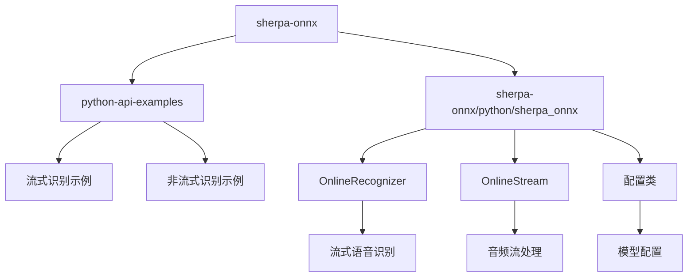
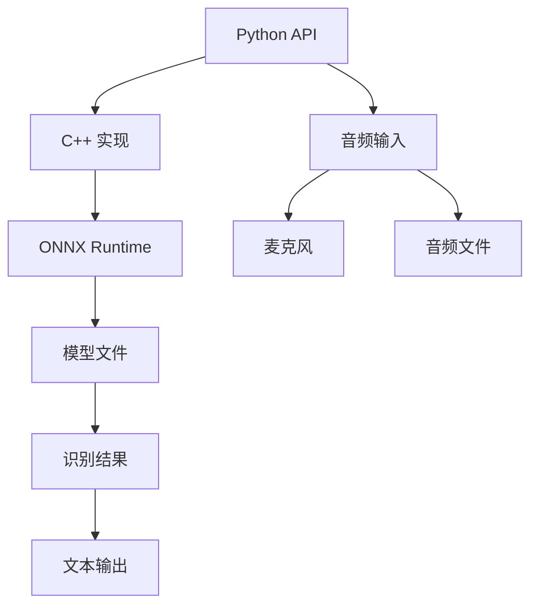
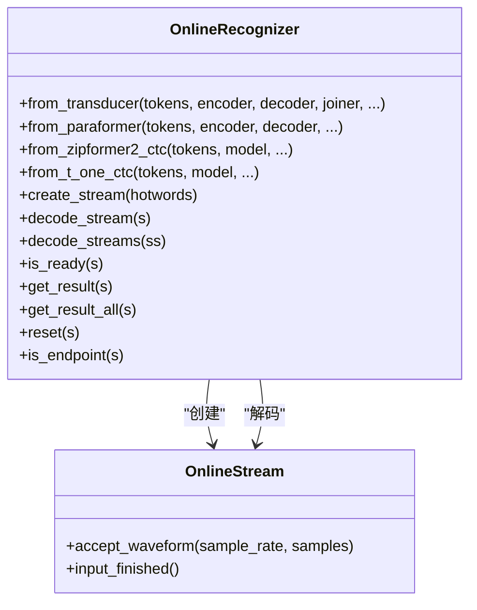
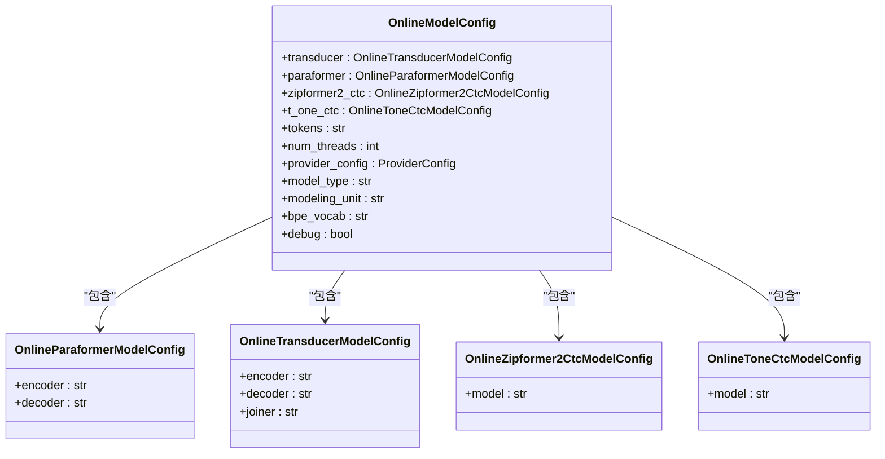
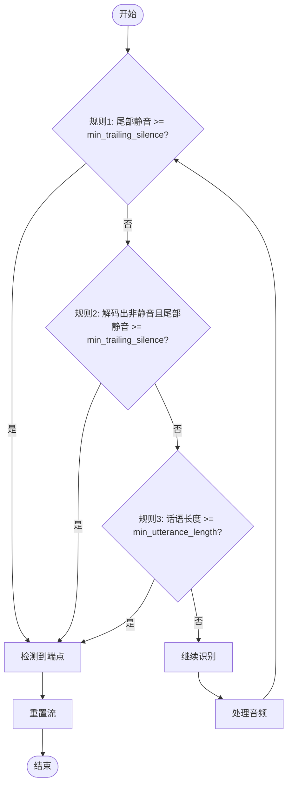
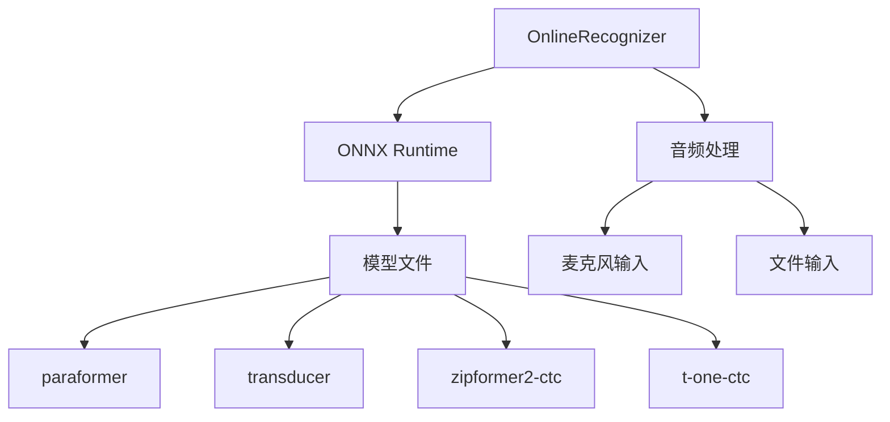

# 流式语音识别

<cite>
**本文档中引用的文件**  
- [online_recognizer.py](file://sherpa-onnx/python/sherpa_onnx/online_recognizer.py)
- [online-nemo-ctc-decode-files.py](file://python-api-examples/online-nemo-ctc-decode-files.py)
- [online-t-one-ctc-decode-files.py](file://python-api-examples/online-t-one-ctc-decode-files.py)
- [speech-recognition-from-microphone-with-endpoint-detection.py](file://python-api-examples/speech-recognition-from-microphone-with-endpoint-detection.py)
- [speech-recognition-from-microphone.py](file://python-api-examples/speech-recognition-from-microphone.py)
- [online-paraformer-model-config.h](file://sherpa-onnx/csrc/online-paraformer-model-config.h)
- [online-paraformer-model-config.cc](file://sherpa-onnx/csrc/online-paraformer-model-config.cc)
- [endpoint.cc](file://sherpa-onnx/csrc/endpoint.cc)
</cite>

## 目录
1. [介绍](#介绍)
2. [项目结构](#项目结构)
3. [核心组件](#核心组件)
4. [架构概述](#架构概述)
5. [详细组件分析](#详细组件分析)
6. [依赖分析](#依赖分析)
7. [性能考虑](#性能考虑)
8. [故障排除指南](#故障排除指南)
9. [结论](#结论)

## 介绍
本文档全面解释了sherpa-onnx Python API中的流式语音识别功能，重点介绍`OnlineRecognizer`类的工作原理和实时识别流程。文档详细说明了`OnlineModelConfig`、`OnlineParaformerModelConfig`等配置对象的参数设置，提供了从文件流式解码和麦克风实时识别的代码示例。同时，文档深入解释了端点检测（endpoint）机制的工作原理和配置方法，并包含低延迟优化技巧和处理音频流中断的异常处理策略。

## 项目结构
sherpa-onnx项目的Python API主要位于`python-api-examples/`目录下，提供了丰富的流式语音识别示例。核心的Python绑定实现在`sherpa-onnx/python/sherpa_onnx/`目录中，其中`online_recognizer.py`文件包含了流式识别的核心类`OnlineRecognizer`。项目支持多种模型类型，包括transducer、paraformer、zipformer2-ctc和t-one-ctc等，每种模型都有相应的配置类和识别器实现。

**图源**
- [online_recognizer.py](file://sherpa-onnx/python/sherpa_onnx/online_recognizer.py)
- [python-api-examples](file://python-api-examples)

**章节源**
- [online_recognizer.py](file://sherpa-onnx/python/sherpa_onnx/online_recognizer.py)
- [python-api-examples](file://python-api-examples)

## 核心组件
流式语音识别的核心组件包括`OnlineRecognizer`类、`OnlineStream`类和各种配置类。`OnlineRecognizer`是流式识别的主控制器，负责管理识别过程和模型推理。`OnlineStream`代表一个音频流，用于分块输入音频数据。配置类如`OnlineModelConfig`和`OnlineParaformerModelConfig`用于设置模型参数和识别选项。

**章节源**
- [online_recognizer.py](file://sherpa-onnx/python/sherpa_onnx/online_recognizer.py)

## 架构概述
sherpa-onnx的流式语音识别架构采用分层设计，上层是Python API，中层是C++实现，底层是ONNX Runtime。Python API提供易用的接口，C++实现处理核心的语音识别逻辑，ONNX Runtime负责模型推理。这种设计既保证了性能，又提供了良好的可扩展性。

**图源**
- [online_recognizer.py](file://sherpa-onnx/python/sherpa_onnx/online_recognizer.py)
- [csrc](file://sherpa-onnx/csrc)

## 详细组件分析

### OnlineRecognizer类分析
`OnlineRecognizer`类是流式语音识别的核心，提供了创建流、解码流和获取结果等方法。该类支持多种模型类型，包括transducer、paraformer、zipformer2-ctc和t-one-ctc等。

**图源**
- [online_recognizer.py](file://sherpa-onnx/python/sherpa_onnx/online_recognizer.py)

**章节源**
- [online_recognizer.py](file://sherpa-onnx/python/sherpa_onnx/online_recognizer.py)

### 配置类分析
配置类用于设置模型参数和识别选项。`OnlineModelConfig`是基础配置类，`OnlineParaformerModelConfig`等是具体模型的配置类。

**图源**
- [online_recognizer.py](file://sherpa-onnx/python/sherpa_onnx/online_recognizer.py)
- [online-paraformer-model-config.h](file://sherpa-onnx/csrc/online-paraformer-model-config.h)
- [online-paraformer-model-config.cc](file://sherpa-onnx/csrc/online-paraformer-model-config.cc)

**章节源**
- [online_recognizer.py](file://sherpa-onnx/python/sherpa_onnx/online_recognizer.py)
- [online-paraformer-model-config.h](file://sherpa-onnx/csrc/online-paraformer-model-config.h)
- [online-paraformer-model-config.cc](file://sherpa-onnx/csrc/online-paraformer-model-config.cc)

### 端点检测机制分析
端点检测（Endpoint Detection）机制用于判断语音片段的开始和结束。`EndpointConfig`类定义了三个规则，通过配置最小尾部静音时间、最小话语长度等参数来控制端点检测行为。

**图源**
- [endpoint.cc](file://sherpa-onnx/csrc/endpoint.cc)

**章节源**
- [endpoint.cc](file://sherpa-onnx/csrc/endpoint.cc)

## 依赖分析
流式语音识别功能依赖于多个组件，包括ONNX Runtime、音频处理库和模型文件。Python API依赖于C++实现，C++实现依赖于ONNX Runtime进行模型推理。

**图源**
- [online_recognizer.py](file://sherpa-onnx/python/sherpa_onnx/online_recognizer.py)
- [csrc](file://sherpa-onnx/csrc)

**章节源**
- [online_recognizer.py](file://sherpa-onnx/python/sherpa_onnx/online_recognizer.py)
- [csrc](file://sherpa-onnx/csrc)

## 性能考虑
为了实现低延迟的流式语音识别，建议使用GPU加速（通过CUDA或TensorRT执行提供程序），并合理设置线程数。对于实时麦克风输入，建议使用较小的音频块大小（如100ms）以减少延迟。同时，可以启用FP16精度以提高性能。

## 故障排除指南
常见问题包括模型文件路径错误、音频格式不匹配和端点检测不灵敏。确保模型文件路径正确，音频采样率与模型训练时的采样率匹配，并根据实际场景调整端点检测参数。对于麦克风输入，确保音频设备正常工作并具有适当的权限。

**章节源**
- [online-nemo-ctc-decode-files.py](file://python-api-examples/online-nemo-ctc-decode-files.py)
- [online-t-one-ctc-decode-files.py](file://python-api-examples/online-t-one-ctc-decode-files.py)
- [speech-recognition-from-microphone-with-endpoint-detection.py](file://python-api-examples/speech-recognition-from-microphone-with-endpoint-detection.py)

## 结论
sherpa-onnx的Python API提供了强大而灵活的流式语音识别功能，支持多种模型类型和配置选项。通过合理配置和优化，可以实现低延迟、高准确率的实时语音识别应用。文档中提供的代码示例和配置说明可以帮助开发者快速上手并构建自己的语音识别系统。