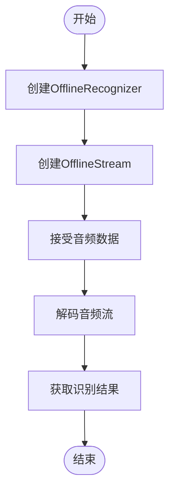
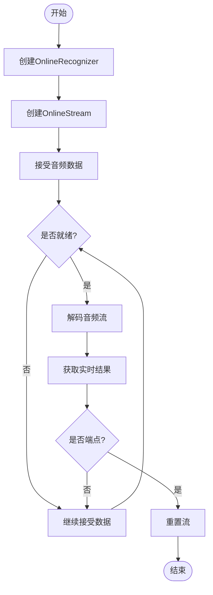
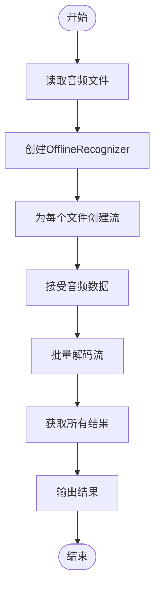
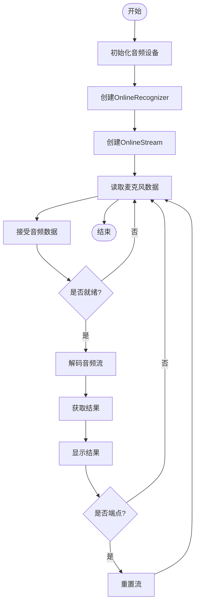

# 语音识别示例

<cite>
**本文档引用的文件**   
- [offline_recognizer.py](file://sherpa-onnx/python/sherpa_onnx/offline_recognizer.py)
- [online_recognizer.py](file://sherpa-onnx/python/sherpa_onnx/online_recognizer.py)
- [offline-decode-files.py](file://python-api-examples/offline-decode-files.py)
- [online-decode-files.py](file://python-api-examples/online-decode-files.py)
- [speech-recognition-from-microphone.py](file://python-api-examples/speech-recognition-from-microphone.py)
- [streaming-paraformer-asr-microphone.py](file://python-api-examples/streaming-paraformer-asr-microphone.py)
- [simulate-streaming-paraformer-microphone.py](file://python-api-examples/simulate-streaming-paraformer-microphone.py)
- [__init__.py](file://sherpa-onnx/python/sherpa_onnx/__init__.py)
</cite>

## 目录
1. [简介](#简介)
2. [非流式语音识别](#非流式语音识别)
3. [流式语音识别](#流式语音识别)
4. [配置参数详解](#配置参数详解)
5. [从文件解码](#从文件解码)
6. [麦克风实时识别](#麦克风实时识别)
7. [性能优化建议](#性能优化建议)
8. [常见问题解决方案](#常见问题解决方案)

## 简介
sherpa-onnx 是一个用于语音识别的Python API，支持非流式和流式两种识别模式。该API提供了OfflineRecognizer和OnlineRecognizer两个核心类，分别用于处理完整的音频文件和实时音频流。本文档将详细介绍这两种模式的实现方式、配置参数、模型加载和识别流程，并提供代码示例展示如何设置OfflineModelConfig、FeatureConfig等配置对象。

**Section sources**
- [offline_recognizer.py](file://sherpa-onnx/python/sherpa_onnx/offline_recognizer.py)
- [online_recognizer.py](file://sherpa-onnx/python/sherpa_onnx/online_recognizer.py)

## 非流式语音识别
非流式语音识别适用于处理完整的音频文件，通过OfflineRecognizer类实现。该类提供了多种工厂方法来创建不同模型类型的识别器，包括from_transducer、from_paraformer、from_nemo_ctc等。

非流式识别的流程包括：创建识别器、创建音频流、接受音频数据、解码音频流和获取识别结果。识别器在处理完整音频文件时，可以利用整个音频上下文信息，从而获得更高的识别准确率。

**Diagram sources**
- [offline_recognizer.py](file://sherpa-onnx/python/sherpa_onnx/offline_recognizer.py)

**Section sources**
- [offline_recognizer.py](file://sherpa-onnx/python/sherpa_onnx/offline_recognizer.py)
- [offline-decode-files.py](file://python-api-examples/offline-decode-files.py)

## 流式语音识别
流式语音识别适用于实时音频流处理，通过OnlineRecognizer类实现。该类支持多种流式模型，包括from_transducer、from_paraformer、from_zipformer2_ctc等。

流式识别的关键特点是能够实时处理音频数据，支持端点检测（endpoint detection），可以在说话人停顿后自动检测到语音结束。识别流程包括：创建识别器、创建音频流、接受音频数据、检查是否就绪、解码就绪的流和获取实时结果。

**Diagram sources**
- [online_recognizer.py](file://sherpa-onnx/python/sherpa_onnx/online_recognizer.py)

**Section sources**
- [online_recognizer.py](file://sherpa-onnx/python/sherpa_onnx/online_recognizer.py)
- [online-decode-files.py](file://python-api-examples/online-decode-files.py)

## 配置参数详解
### OfflineModelConfig配置
OfflineModelConfig用于配置非流式识别器的模型参数，包括：

- **transducer**: 包含encoder、decoder和joiner模型文件路径
- **paraformer**: Paraformer模型文件路径
- **nemo_ctc**: NeMo CTC模型文件路径
- **tokens**: 词元文件路径
- **num_threads**: 神经网络计算线程数
- **provider**: ONNX运行时执行提供者（cpu、cuda、coreml）

### FeatureConfig配置
FeatureConfig用于配置特征提取参数：

- **sampling_rate**: 采样率
- **feature_dim**: 特征维度
- **dither**: 抖动常数
- **normalize_samples**: 是否归一化样本

### OnlineModelConfig配置
OnlineModelConfig用于配置流式识别器的模型参数，包括：

- **transducer**: 流式转换器模型配置
- **paraformer**: 流式Paraformer模型配置
- **zipformer2_ctc**: Zipformer2 CTC模型配置
- **tokens**: 词元文件路径
- **num_threads**: 线程数
- **provider**: 执行提供者

### EndpointConfig配置
EndpointConfig用于配置端点检测参数：

- **rule1_min_trailing_silence**: 规则1的最小尾随静音时间
- **rule2_min_trailing_silence**: 规则2的最小尾随静音时间
- **rule3_min_utterance_length**: 规则3的最小话语长度

**Section sources**
- [offline_recognizer.py](file://sherpa-onnx/python/sherpa_onnx/offline_recognizer.py)
- [online_recognizer.py](file://sherpa-onnx/python/sherpa_onnx/online_recognizer.py)

## 从文件解码
从文件解码是语音识别的常见应用场景，通过读取WAVE格式的音频文件进行识别。以下是使用OfflineRecognizer从文件解码的示例流程：

1. 读取音频文件，获取音频样本和采样率
2. 创建OfflineRecognizer实例
3. 为每个音频文件创建OfflineStream
4. 将音频数据传递给流
5. 批量解码所有流
6. 获取并输出识别结果

**Diagram sources**
- [offline-decode-files.py](file://python-api-examples/offline-decode-files.py)

**Section sources**
- [offline-decode-files.py](file://python-api-examples/offline-decode-files.py)
- [offline_recognizer.py](file://sherpa-onnx/python/sherpa_onnx/offline_recognizer.py)

## 麦克风实时识别
麦克风实时识别通过OnlineRecognizer类实现，支持实时音频流处理和端点检测。以下是使用麦克风进行实时识别的流程：

1. 初始化音频输入设备
2. 创建OnlineRecognizer实例
3. 创建OnlineStream
4. 循环读取麦克风音频数据
5. 将音频数据传递给流
6. 检查流是否就绪
7. 解码就绪的流
8. 获取实时识别结果
9. 检测端点并重置流

**Diagram sources**
- [speech-recognition-from-microphone.py](file://python-api-examples/speech-recognition-from-microphone.py)

**Section sources**
- [speech-recognition-from-microphone.py](file://python-api-examples/speech-recognition-from-microphone.py)
- [streaming-paraformer-asr-microphone.py](file://python-api-examples/streaming-paraformer-asr-microphone.py)
- [simulate-streaming-paraformer-microphone.py](file://python-api-examples/simulate-streaming-paraformer-microphone.py)

## 性能优化建议
为了获得最佳的语音识别性能，建议采取以下优化措施：

1. **线程配置**: 根据CPU核心数合理设置num_threads参数，通常设置为CPU核心数的50-80%
2. **执行提供者**: 在支持CUDA的设备上使用cuda提供者，可以显著提升计算速度
3. **模型选择**: 根据应用场景选择合适的模型，Paraformer模型通常具有较好的速度和准确率平衡
4. **音频预处理**: 对输入音频进行适当的降噪和增益处理，可以提高识别准确率
5. **批量处理**: 对于非流式识别，尽量使用decode_streams方法批量处理多个音频文件
6. **内存管理**: 及时释放不再使用的流对象，避免内存泄漏

**Section sources**
- [offline_recognizer.py](file://sherpa-onnx/python/sherpa_onnx/offline_recognizer.py)
- [online_recognizer.py](file://sherpa-onnx/python/sherpa_onnx/online_recognizer.py)

## 常见问题解决方案
### 模型加载失败
**问题**: 模型文件路径错误或文件不存在
**解决方案**: 
- 检查模型文件路径是否正确
- 确认文件是否存在
- 使用绝对路径而不是相对路径

### 识别准确率低
**问题**: 识别结果不准确
**解决方案**:
- 检查音频质量，确保录音清晰
- 确认采样率和特征维度与模型训练时一致
- 尝试使用不同的解码方法（如modified_beam_search）
- 添加领域特定的热词（hotwords）

### 实时识别延迟高
**问题**: 流式识别响应延迟
**解决方案**:
- 减少音频块大小（samples_per_read）
- 使用更快的模型（如int8量化模型）
- 在支持的设备上使用GPU加速
- 优化端点检测参数

### 内存占用过高
**问题**: 识别过程中内存使用过多
**解决方案**:
- 及时释放已处理的流对象
- 减少同时处理的流数量
- 使用更小的模型
- 优化音频缓冲区大小

**Section sources**
- [offline_recognizer.py](file://sherpa-onnx/python/sherpa_onnx/offline_recognizer.py)
- [online_recognizer.py](file://sherpa-onnx/python/sherpa_onnx/online_recognizer.py)
- [offline-decode-files.py](file://python-api-examples/offline-decode-files.py)
- [online-decode-files.py](file://python-api-examples/online-decode-files.py)