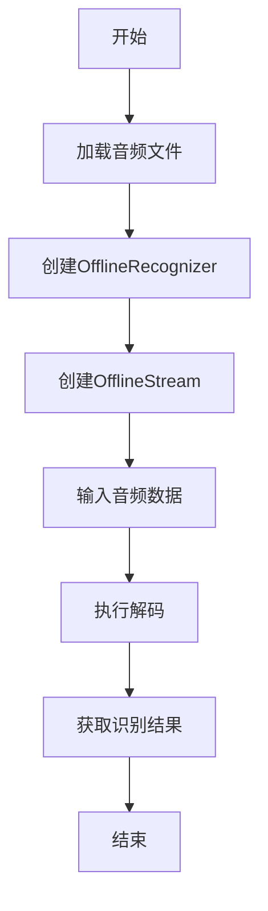

# 非流式语音识别

<cite>
**本文档引用的文件**   
- [offline_recognizer.py](file://sherpa-onnx/python/sherpa_onnx/offline_recognizer.py)
- [offline-whisper-decode-files.py](file://python-api-examples/offline-whisper-decode-files.py)
- [offline-dolphin-ctc-decode-files.py](file://python-api-examples/offline-dolphin-ctc-decode-files.py)
- [offline-decode-files.py](file://python-api-examples/offline-decode-files.py)
</cite>

## 目录
1. [简介](#简介)
2. [核心组件](#核心组件)
3. [模型配置详解](#模型配置详解)
4. [非流式识别流程](#非流式识别流程)
5. [不同模型配置差异](#不同模型配置差异)
6. [识别结果结构与后处理](#识别结果结构与后处理)
7. [性能优化建议](#性能优化建议)
8. [常见问题解决方案](#常见问题解决方案)

## 简介
sherpa-onnx 是一个高性能的语音识别工具包，提供了Python API用于非流式语音识别。非流式语音识别适用于对完整音频文件进行离线转录的场景，能够充分利用整个音频上下文信息，通常比流式识别具有更高的准确率。本文档详细解释OfflineRecognizer类的实现机制和使用方法，包括模型配置、特征提取配置和语言模型配置的设置，以及从音频文件解码的完整流程。

## 核心组件

OfflineRecognizer类是sherpa-onnx Python API中用于非流式语音识别的核心类。它提供了多种工厂方法来创建针对不同模型架构的识别器实例，如from_dolphin_ctc、from_whisper、from_paraformer等。这些方法封装了底层复杂的配置过程，使用户能够方便地使用各种预训练模型。

OfflineRecognizer的实现基于一组配置类，包括OfflineModelConfig（模型配置）、FeatureExtractorConfig（特征提取配置）和OfflineLMConfig（语言模型配置）。这些配置类共同定义了识别器的行为和参数。识别过程通过创建OfflineStream对象来实现，该对象用于承载音频数据并最终产生识别结果。

**Section sources**
- [offline_recognizer.py](file://sherpa-onnx/python/sherpa_onnx/offline_recognizer.py#L37-L1289)

## 模型配置详解

### OfflineModelConfig
OfflineModelConfig是模型配置的核心类，它包含了所有与特定语音识别模型相关的配置参数。根据使用的模型类型，配置的具体内容有所不同。例如，对于Dolphin CTC模型，需要指定模型文件路径；对于Whisper模型，则需要分别指定编码器和解码器的模型文件。

### FeatureConfig
特征提取配置（FeatureExtractorConfig）定义了音频特征的提取参数，主要包括采样率（sampling_rate）和特征维度（feature_dim）。这些参数必须与训练模型时使用的参数相匹配，以确保最佳识别效果。例如，大多数模型使用16kHz的采样率和80维的特征。

### OfflineLMConfig
语言模型配置（OfflineLMConfig）用于指定外部语言模型的相关参数，包括模型路径、缩放因子（scale）、线程数等。语言模型可以显著提高识别准确率，特别是在处理专业术语或特定领域词汇时。LODR（Lattice-based Online Decoding Rescoring）是一种高级语言模型重打分技术，可以通过指定LODR FST文件来启用。

**Section sources**
- [offline_recognizer.py](file://sherpa-onnx/python/sherpa_onnx/offline_recognizer.py#L14-L30)
- [offline_recognizer.py](file://sherpa-onnx/python/sherpa_onnx/offline_recognizer.py#L178-L185)

## 非流式识别流程

非流式语音识别的完整流程包括以下几个步骤：

1. **音频加载**：使用如soundfile等库加载音频文件，获取音频数据和采样率。音频数据通常是一个归一化到[-1, 1]范围的浮点数数组。

2. **识别器初始化**：根据所使用的模型类型，调用相应的工厂方法（如from_dolphin_ctc或from_whisper）来创建OfflineRecognizer实例。这一步需要提供模型文件路径、tokens文件路径等必要参数。

3. **流创建与数据输入**：调用识别器的create_stream方法创建一个OfflineStream对象，然后使用accept_waveform方法将音频数据输入到流中。

4. **解码与结果获取**：调用decode_stream方法对流中的音频数据进行解码，然后通过访问流的result属性来获取识别结果。



**Diagram sources **
- [offline-whisper-decode-files.py](file://python-api-examples/offline-whisper-decode-files.py#L49-L73)
- [offline-dolphin-ctc-decode-files.py](file://python-api-examples/offline-dolphin-ctc-decode-files.py#L42-L53)

**Section sources**
- [offline-whisper-decode-files.py](file://python-api-examples/offline-whisper-decode-files.py#L1-L78)
- [offline-dolphin-ctc-decode-files.py](file://python-api-examples/offline-dolphin-ctc-decode-files.py#L1-L70)

## 不同模型配置差异

### Dolphin CTC模型
Dolphin CTC模型是一种基于连接主义时序分类（CTC）的模型，配置相对简单，主要需要指定模型文件和tokens文件。示例代码如下：
```python
recognizer = sherpa_onnx.OfflineRecognizer.from_dolphin_ctc(
    model="model.int8.onnx",
    tokens="tokens.txt",
    debug=True,
)
```

### Whisper模型
Whisper模型采用编码器-解码器架构，因此需要分别指定编码器和解码器的模型文件。此外，还可以指定语言和任务类型（转录或翻译）。示例代码如下：
```python
recognizer = sherpa_onnx.OfflineRecognizer.from_whisper(
    encoder="encoder.int8.onnx",
    decoder="decoder.int8.onnx",
    tokens="tokens.txt",
    language="en",
    task="transcribe",
    debug=True,
)
```

### Paraformer模型
Paraformer模型是一种高效的非自回归模型，配置时需要指定模型文件和tokens文件。与其他模型相比，Paraformer在保持高准确率的同时具有更快的推理速度。

**Section sources**
- [offline_recognizer.py](file://sherpa-onnx/python/sherpa_onnx/offline_recognizer.py#L460-L537)
- [offline_recognizer.py](file://sherpa-onnx/python/sherpa_onnx/offline_recognizer.py#L848-L944)

## 识别结果结构与后处理

识别结果通常包含文本、时间戳、词元（tokens）等信息。对于支持多语言识别的模型，结果还可能包含语言信息。后处理步骤可能包括文本规范化、标点恢复等。例如，可以使用逆文本归一化（ITN）技术将数字、日期等特殊序列转换为自然语言形式。

**Section sources**
- [offline_recognizer.py](file://sherpa-onnx/python/sherpa_onnx/offline_recognizer.py#L1278-L1289)

## 性能优化建议

1. **线程数设置**：根据CPU核心数合理设置num_threads参数，通常设置为CPU核心数可以获得最佳性能。
2. **执行提供程序**：在支持的硬件上使用CUDA或Core ML等加速执行提供程序，可以显著提高推理速度。
3. **模型量化**：使用int8量化的模型文件可以在保持较高准确率的同时大幅减少模型大小和提高推理速度。
4. **批处理**：对于多个音频文件的识别，可以使用decode_streams方法进行批处理，以提高整体处理效率。

## 常见问题解决方案

### 模型加载失败
- **检查文件路径**：确保模型文件和tokens文件的路径正确无误。
- **文件完整性**：确认下载的模型文件完整且未损坏。
- **权限问题**：确保程序有读取模型文件的权限。

### 识别准确率低
- **模型选择**：选择更适合目标语言和领域的预训练模型。
- **音频质量**：确保输入音频质量良好，避免背景噪声过大。
- **参数调整**：尝试调整解码方法和相关参数，如使用modified_beam_search代替greedy_search。

**Section sources**
- [offline-decode-files.py](file://python-api-examples/offline-decode-files.py#L116-L200)