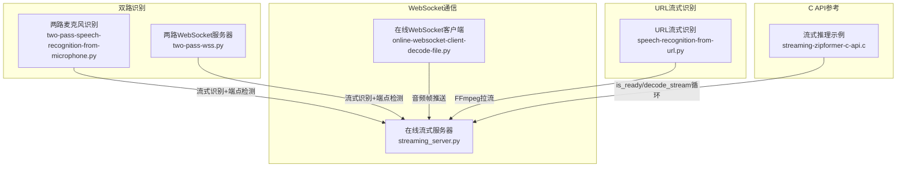
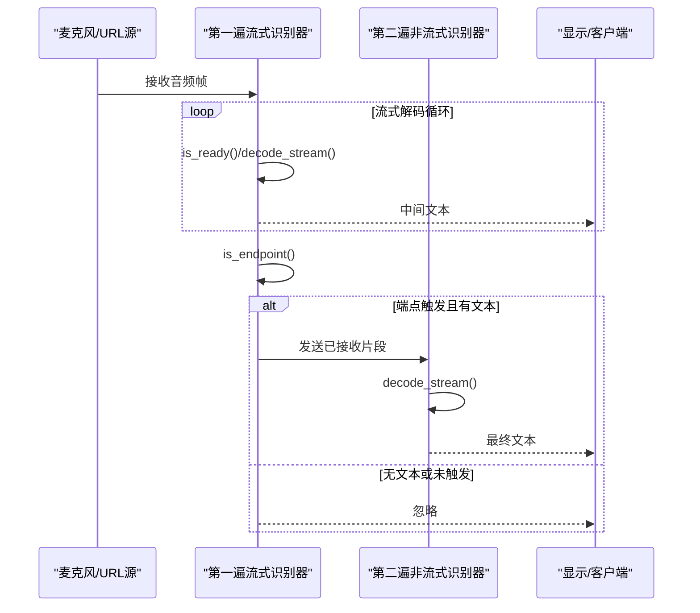
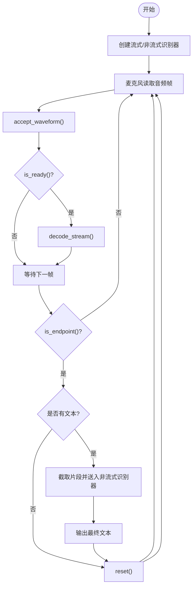
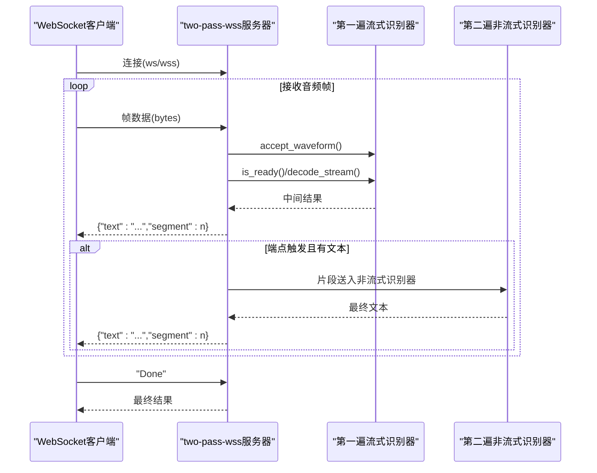
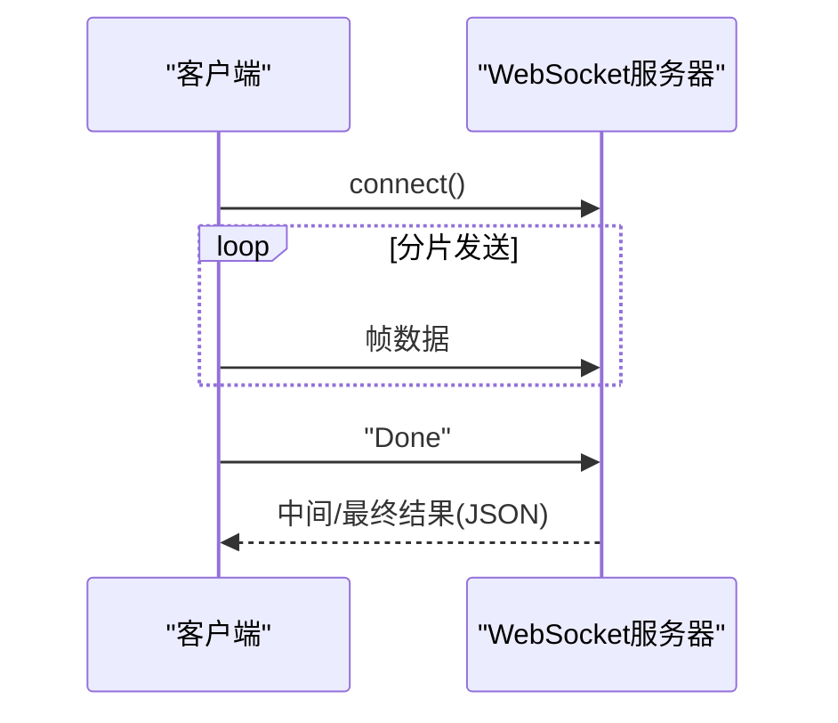
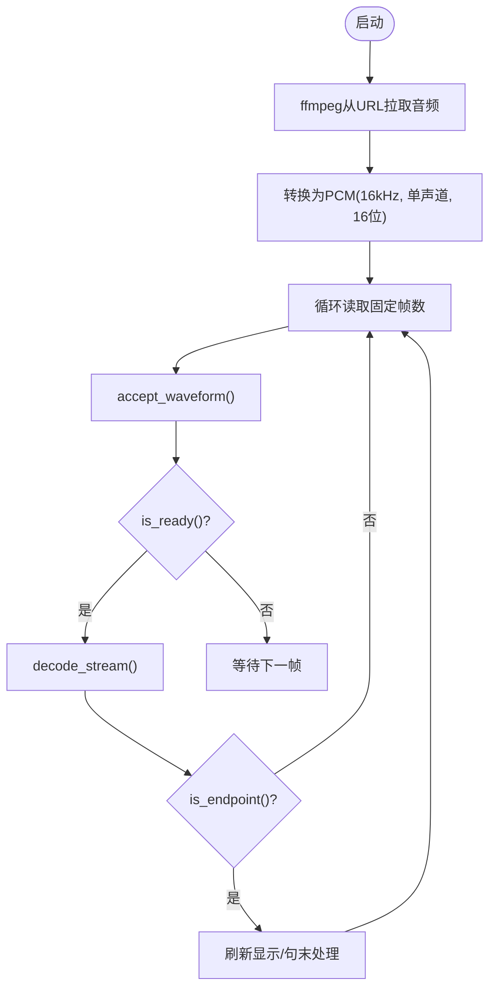
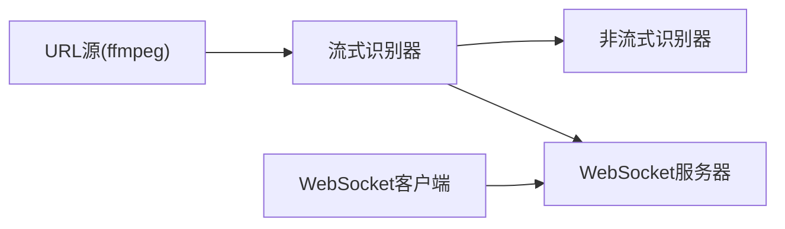

# 高级语音识别功能

<cite>
**本文引用的文件列表**
- [two-pass-speech-recognition-from-microphone.py](file://python-api-examples/two-pass-speech-recognition-from-microphone.py)
- [two-pass-wss.py](file://python-api-examples/two-pass-wss.py)
- [speech-recognition-from-url.py](file://python-api-examples/speech-recognition-from-url.py)
- [online-websocket-client-decode-file.py](file://python-api-examples/online-websocket-client-decode-file.py)
- [streaming_server.py](file://python-api-examples/streaming_server.py)
- [non_streaming_server.py](file://python-api-examples/non_streaming_server.py)
- [streaming-zipformer-c-api.c](file://c-api-examples/streaming-zipformer-c-api.c)
</cite>

## 目录
1. [简介](#简介)
2. [项目结构与入口](#项目结构与入口)
3. [核心组件](#核心组件)
4. [架构总览](#架构总览)
5. [详细组件分析](#详细组件分析)
6. [依赖关系分析](#依赖关系分析)
7. [性能考量与优化建议](#性能考量与优化建议)
8. [故障排查指南](#故障排查指南)
9. [结论](#结论)

## 简介
本文件面向sherpa-onnx Python API的高级语音识别能力，系统性阐述“双路语音识别（two-pass）”的实现机制，覆盖非流式与流式识别器的协同工作流程；详解从网络URL流式拉取音频进行识别的方法与注意事项；介绍基于WebSocket的实时语音识别方案，包括连接管理、消息协议与错误重连策略；并提供在高并发、长音频与网络不稳定等复杂场景下的性能优化建议。

## 项目结构与入口
- 双路麦克风识别示例：使用流式模型进行端点检测与临时结果展示，并在端点触发后以非流式模型进行二次精修。
- WebSocket服务器与客户端：支持多客户端并发接入，按帧发送音频数据，服务端实时返回中间或最终结果。
- URL流式识别：通过ffmpeg从RTMP/HTTP/本地文件等URL拉取音频，边解码边送入流式识别器。
- C API示例：展示流式推理的典型循环模式，便于理解is_ready/decode_stream/reset等关键流程。

图表来源
- [two-pass-speech-recognition-from-microphone.py](file://python-api-examples/two-pass-speech-recognition-from-microphone.py#L1-L428)
- [two-pass-wss.py](file://python-api-examples/two-pass-wss.py#L1-L830)
- [streaming_server.py](file://python-api-examples/streaming_server.py#L1-L200)
- [online-websocket-client-decode-file.py](file://python-api-examples/online-websocket-client-decode-file.py#L1-L182)
- [speech-recognition-from-url.py](file://python-api-examples/speech-recognition-from-url.py#L1-L222)
- [streaming-zipformer-c-api.c](file://c-api-examples/streaming-zipformer-c-api.c#L81-L123)

章节来源
- [two-pass-speech-recognition-from-microphone.py](file://python-api-examples/two-pass-speech-recognition-from-microphone.py#L1-L428)
- [two-pass-wss.py](file://python-api-examples/two-pass-wss.py#L1-L830)
- [streaming_server.py](file://python-api-examples/streaming_server.py#L1-L200)
- [online-websocket-client-decode-file.py](file://python-api-examples/online-websocket-client-decode-file.py#L1-L182)
- [speech-recognition-from-url.py](file://python-api-examples/speech-recognition-from-url.py#L1-L222)
- [streaming-zipformer-c-api.c](file://c-api-examples/streaming-zipformer-c-api.c#L81-L123)

## 核心组件
- 流式识别器（OnlineRecognizer）
  - 负责实时接收音频帧，进行增量解码与端点检测，输出中间文本。
  - 支持多种模型（如Transducer、Paraformer、WeNet CTC等），可通过参数配置采样率、特征维度、解码方法与端点规则。
- 非流式识别器（OfflineRecognizer）
  - 接收完整音频，一次性解码，通常准确度更高，用于双路策略中的“第二遍”精修。
- WebSocket服务器
  - 多线程/异步处理，支持并发连接、消息队列、批处理与超时控制。
- WebSocket客户端
  - 将本地或远端音频按帧发送至服务器，接收实时中间结果与最终结果。
- URL流式识别
  - 使用ffmpeg从URL拉取音频，转换为PCM后逐帧送入流式识别器。

章节来源
- [two-pass-speech-recognition-from-microphone.py](file://python-api-examples/two-pass-speech-recognition-from-microphone.py#L265-L333)
- [two-pass-wss.py](file://python-api-examples/two-pass-wss.py#L415-L443)
- [streaming_server.py](file://python-api-examples/streaming_server.py#L121-L200)
- [online-websocket-client-decode-file.py](file://python-api-examples/online-websocket-client-decode-file.py#L122-L156)
- [speech-recognition-from-url.py](file://python-api-examples/speech-recognition-from-url.py#L155-L217)

## 架构总览
下图展示了双路识别在本地与WebSocket两种场景下的整体交互：第一遍使用流式识别器进行快速端点检测与中间文本输出；当端点触发时，将已接收片段送入第二遍非流式识别器进行精修，并回传最终文本。

图表来源
- [two-pass-speech-recognition-from-microphone.py](file://python-api-examples/two-pass-speech-recognition-from-microphone.py#L373-L422)
- [two-pass-wss.py](file://python-api-examples/two-pass-wss.py#L679-L738)

## 详细组件分析

### 组件A：双路麦克风识别（two-pass from microphone）
- 第一遍（流式）：使用OnlineRecognizer，开启端点检测，持续输出中间文本，用于即时反馈与端点判断。
- 第二遍（非流式）：当端点触发且存在文本时，截取已接收片段（去除内部特征提取缓冲区影响），交由OfflineRecognizer进行精修，输出最终文本。
- 关键流程要点：
  - 使用accept_waveform持续喂入音频帧；
  - 循环调用is_ready/decode_stream直至不可继续；
  - 通过is_endpoint判断是否触发端点；
  - reset重置流状态，准备下一轮识别。

图表来源
- [two-pass-speech-recognition-from-microphone.py](file://python-api-examples/two-pass-speech-recognition-from-microphone.py#L335-L422)

章节来源
- [two-pass-speech-recognition-from-microphone.py](file://python-api-examples/two-pass-speech-recognition-from-microphone.py#L265-L422)

### 组件B：双路WebSocket服务器（two-pass-wss）
- 服务器职责：
  - 接收来自客户端的音频帧，使用流式识别器进行实时解码；
  - 当端点触发且存在文本时，将片段送入非流式识别器进行精修；
  - 通过WebSocket向客户端发送中间文本与最终文本；
  - 支持证书（wss）、最大并发连接数限制、消息大小与队列长度限制、批处理与线程池。
- 连接管理与消息协议：
  - 每个连接维护一个OnlineStream；
  - 客户端发送音频帧（浮点数组），结束时发送“Done”；
  - 服务端返回JSON格式文本，包含text与segment字段；
  - 超过最大并发时拒绝新连接，返回503。
- 错误与重连：
  - 捕获连接关闭异常，记录断开信息；
  - 通过队列与批处理避免阻塞，提升吞吐。

图表来源
- [two-pass-wss.py](file://python-api-examples/two-pass-wss.py#L648-L738)
- [two-pass-wss.py](file://python-api-examples/two-pass-wss.py#L599-L614)

章节来源
- [two-pass-wss.py](file://python-api-examples/two-pass-wss.py#L450-L830)

### 组件C：WebSocket客户端（online-websocket-client-decode-file）
- 功能：将本地WAV文件按固定样本数切片，模拟实时流式发送至服务器，接收中间与最终结果。
- 注意事项：
  - 服务器地址与端口需与服务端一致；
  - 发送完成后发送“Done”以通知服务端结束；
  - 客户端异步接收消息，直到收到“Done!”为止。

图表来源
- [online-websocket-client-decode-file.py](file://python-api-examples/online-websocket-client-decode-file.py#L122-L156)

章节来源
- [online-websocket-client-decode-file.py](file://python-api-examples/online-websocket-client-decode-file.py#L1-L182)

### 组件D：URL流式识别（speech-recognition-from-url）
- 功能：通过ffmpeg从URL（RTMP/HTTP/本地文件）拉取音频，转换为PCM后逐帧送入流式识别器，边播边识别。
- 关键点：
  - ffmpeg命令行参数确保输出单声道、16kHz、16位PCM；
  - 以固定帧数读取并送入accept_waveform；
  - 端点触发时可进行句末处理与显示刷新；
  - 依赖ffmpeg安装，否则直接退出提示。

图表来源
- [speech-recognition-from-url.py](file://python-api-examples/speech-recognition-from-url.py#L164-L217)

章节来源
- [speech-recognition-from-url.py](file://python-api-examples/speech-recognition-from-url.py#L1-L222)

### 组件E：C API流式推理参考（streaming-zipformer-c-api.c）
- 展示了典型的流式推理循环：分块送入音频，循环调用is_ready/decode_stream，必要时添加尾部填充，最后input_finished并完成收尾。
- 对应Python侧的is_ready/decode_stream/reset等语义，便于理解底层执行逻辑。

章节来源
- [streaming-zipformer-c-api.c](file://c-api-examples/streaming-zipformer-c-api.c#L81-L123)

## 依赖关系分析
- 双路识别依赖：
  - 流式识别器（OnlineRecognizer）负责实时解码与端点检测；
  - 非流式识别器（OfflineRecognizer）负责高精度二次精修；
  - WebSocket服务器/客户端负责网络传输与协议编解码。
- 并发与批处理：
  - 服务器通过线程池与队列实现批处理与异步解码，避免阻塞；
  - 客户端通过异步任务接收消息，保证UI流畅。

图表来源
- [two-pass-speech-recognition-from-microphone.py](file://python-api-examples/two-pass-speech-recognition-from-microphone.py#L265-L333)
- [two-pass-wss.py](file://python-api-examples/two-pass-wss.py#L415-L443)
- [streaming_server.py](file://python-api-examples/streaming_server.py#L121-L200)
- [online-websocket-client-decode-file.py](file://python-api-examples/online-websocket-client-decode-file.py#L122-L156)
- [speech-recognition-from-url.py](file://python-api-examples/speech-recognition-from-url.py#L164-L217)

章节来源
- [two-pass-speech-recognition-from-microphone.py](file://python-api-examples/two-pass-speech-recognition-from-microphone.py#L265-L333)
- [two-pass-wss.py](file://python-api-examples/two-pass-wss.py#L415-L443)
- [streaming_server.py](file://python-api-examples/streaming_server.py#L121-L200)
- [online-websocket-client-decode-file.py](file://python-api-examples/online-websocket-client-decode-file.py#L122-L156)
- [speech-recognition-from-url.py](file://python-api-examples/speech-recognition-from-url.py#L164-L217)

## 性能考量与优化建议
- 高并发识别
  - 合理设置nn_pool_size与max_batch_size，平衡延迟与吞吐；
  - 控制max_message_size与max_queue_size，避免内存压力；
  - 通过process_request限制最大活跃连接数，防止过载。
- 长音频处理
  - 在端点触发前尽量减少内部缓冲区影响，仅保留必要的历史片段参与第二遍；
  - 适当增加尾部填充，确保模型充分处理尾音。
- 网络不稳定环境
  - 客户端侧采用指数退避重试与心跳保活；
  - 服务端对超时连接及时清理，避免资源泄露；
  - 优先使用wss加密通道，降低中间人攻击风险。
- 线程与批处理
  - 使用ThreadPoolExecutor隔离神经网络计算与解码，避免阻塞事件循环；
  - 批量处理多个流时，注意内存占用与GPU/CPU资源上限。
- 解码策略
  - 对于流式模型，合理选择解码方法（greedy_search/modified_beam_search）与max_active_paths；
  - 端点规则（最小静音时长、最小语句长度）需结合实际场景调整。

章节来源
- [two-pass-wss.py](file://python-api-examples/two-pass-wss.py#L302-L401)
- [streaming_server.py](file://python-api-examples/streaming_server.py#L693-L728)
- [online-websocket-client-decode-file.py](file://python-api-examples/online-websocket-client-decode-file.py#L122-L156)

## 故障排查指南
- 无法连接WebSocket
  - 检查服务器地址与端口是否正确；
  - 若使用wss，确认证书路径有效；
  - 观察服务端日志中“连接建立/断开”信息。
- 识别结果为空或不完整
  - 确认端点规则是否过于严格导致提前结束；
  - 检查音频采样率与通道数是否符合要求；
  - 对URL流式识别，确认ffmpeg输出格式与采样率一致。
- 服务器过载
  - 查看当前活跃连接数与最大连接限制；
  - 适当降低nn_pool_size或max_batch_size；
  - 优化客户端发送节奏，避免突发大流量。
- 断线与重连
  - 客户端捕获连接关闭异常并记录；
  - 服务端在finally中释放连接计数，避免计数不一致；
  - 建议实现自动重连与断线恢复逻辑。

章节来源
- [two-pass-wss.py](file://python-api-examples/two-pass-wss.py#L646-L671)
- [streaming_server.py](file://python-api-examples/streaming_server.py#L693-L728)
- [online-websocket-client-decode-file.py](file://python-api-examples/online-websocket-client-decode-file.py#L122-L156)
- [speech-recognition-from-url.py](file://python-api-examples/speech-recognition-from-url.py#L218-L222)

## 结论
sherpa-onnx提供了完善的双路语音识别能力：第一遍流式识别器提供低延迟与端点检测，第二遍非流式识别器提供高精度最终文本。配合WebSocket实现多客户端并发接入与实时结果回传；通过ffmpeg支持从URL拉取音频，满足直播与远程场景需求。在高并发、长音频与网络不稳定等复杂场景下，建议通过批处理、线程池、端点规则与连接限流等手段进行系统化优化，确保稳定性与性能的平衡。