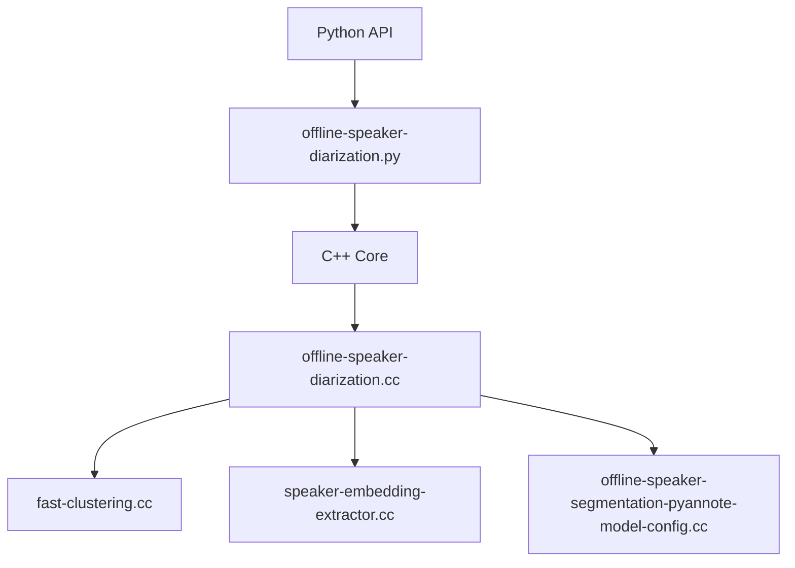
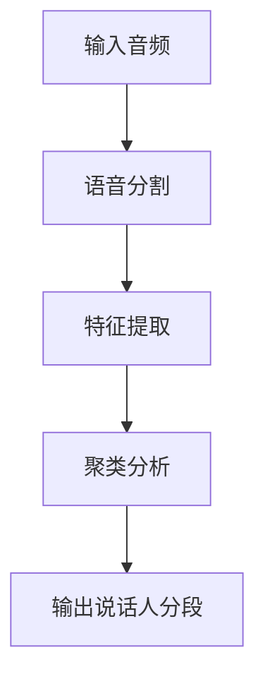
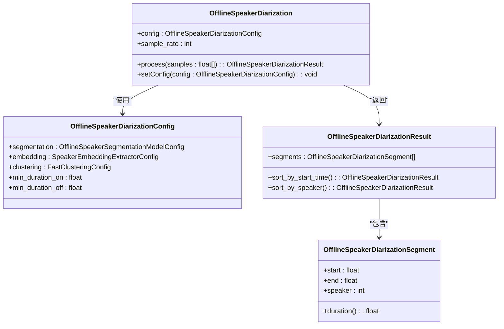
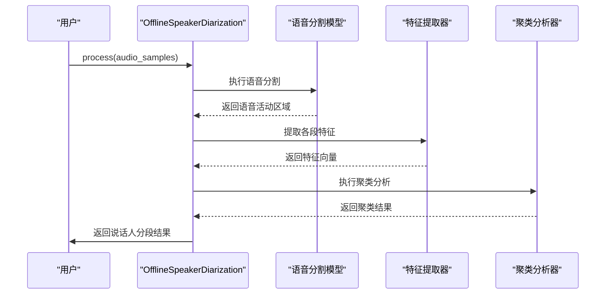
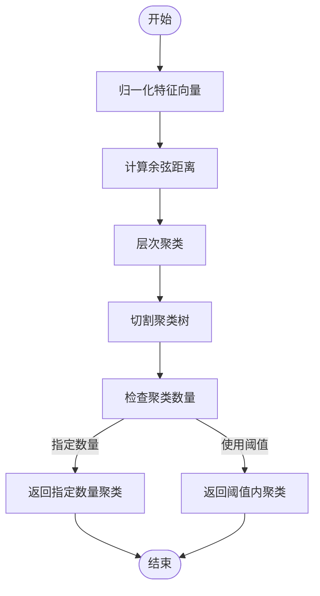
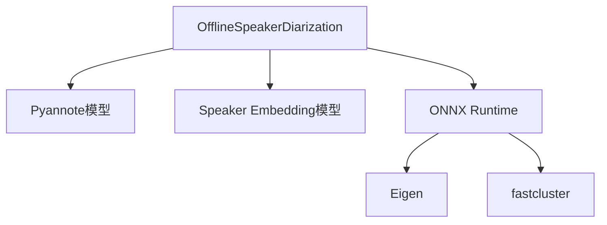
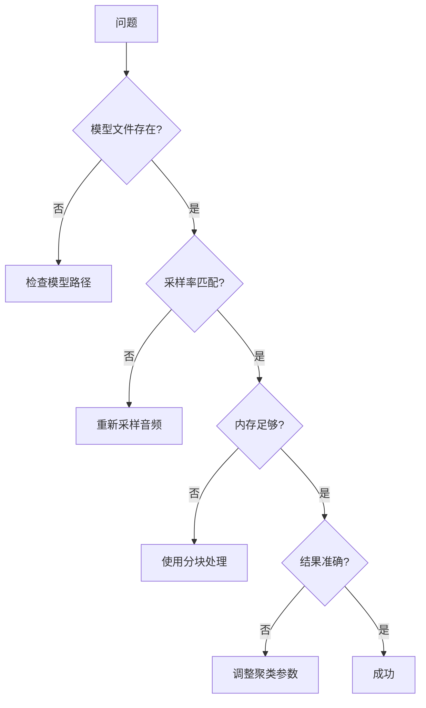

# 说话人分离示例

<cite>
**本文档中引用的文件**   
- [offline-speaker-diarization.py](file://python-api-examples/offline-speaker-diarization.py)
- [offline-speaker-diarization.cc](file://sherpa-onnx/csrc/offline-speaker-diarization.cc)
- [fast-clustering.cc](file://sherpa-onnx/csrc/fast-clustering.cc)
- [offline-speaker-diarization-result.cc](file://sherpa-onnx/csrc/offline-speaker-diarization-result.cc)
- [offline-speaker-segmentation-pyannote-model-config.cc](file://sherpa-onnx/csrc/offline-speaker-segmentation-pyannote-model-config.cc)
- [speaker-embedding-extractor.cc](file://sherpa-onnx/csrc/speaker-embedding-extractor.cc)
</cite>

## 目录
1. [简介](#简介)
2. [项目结构](#项目结构)
3. [核心组件](#核心组件)
4. [架构概述](#架构概述)
5. [详细组件分析](#详细组件分析)
6. [依赖分析](#依赖分析)
7. [性能考虑](#性能考虑)
8. [故障排除指南](#故障排除指南)
9. [结论](#结论)

## 简介
本文档详细介绍了sherpa-onnx Python API中的说话人分离功能，重点分析了OfflineSpeakerDiarization类的实现原理和使用方法。文档涵盖了Pyannote模型参数的配置方法，包括embedding模型、segmentation模型和聚类配置。同时，文档还展示了如何加载音频文件并执行说话人分离，解析返回的说话人分段结果，包括开始时间、结束时间和说话人标签。此外，文档提供了不同场景下的参数调优建议，如多人会议、电话对话等，并包含处理长音频的分块策略和结果合并方法。

## 项目结构
sherpa-onnx项目是一个多语言支持的语音处理库，提供了丰富的API接口。项目结构清晰，主要包含以下几个部分：
- `python-api-examples/`：Python API示例代码
- `c-api-examples/`：C API示例代码
- `java-api-examples/`：Java API示例代码
- `sherpa-onnx/`：核心C++实现
- `scripts/`：各种脚本工具

说话人分离功能主要在`python-api-examples/offline-speaker-diarization.py`中实现，其核心逻辑由C++代码在`sherpa-onnx/csrc/`目录下实现。

**图表来源**
- [offline-speaker-diarization.py](file://python-api-examples/offline-speaker-diarization.py)
- [offline-speaker-diarization.cc](file://sherpa-onnx/csrc/offline-speaker-diarization.cc)
- [fast-clustering.cc](file://sherpa-onnx/csrc/fast-clustering.cc)
- [speaker-embedding-extractor.cc](file://sherpa-onnx/csrc/speaker-embedding-extractor.cc)
- [offline-speaker-segmentation-pyannote-model-config.cc](file://sherpa-onnx/csrc/offline-speaker-segmentation-pyannote-model-config.cc)

**章节来源**
- [offline-speaker-diarization.py](file://python-api-examples/offline-speaker-diarization.py)
- [offline-speaker-diarization.cc](file://sherpa-onnx/csrc/offline-speaker-diarization.cc)

## 核心组件
说话人分离功能的核心组件包括OfflineSpeakerDiarization类、FastClustering类、SpeakerEmbeddingExtractor类和OfflineSpeakerSegmentationModelConfig类。这些组件协同工作，实现了从音频输入到说话人分段输出的完整流程。

**章节来源**
- [offline-speaker-diarization.py](file://python-api-examples/offline-speaker-diarization.py)
- [offline-speaker-diarization.cc](file://sherpa-onnx/csrc/offline-speaker-diarization.cc)

## 架构概述
说话人分离的整体架构分为三个主要阶段：语音分割、特征提取和聚类分析。首先，使用Pyannote模型对音频进行语音分割，识别出语音活动区域。然后，使用speaker embedding extractor模型提取每个语音段的特征向量。最后，通过快速聚类算法将相似的特征向量分组，从而识别出不同的说话人。

**图表来源**
- [offline-speaker-diarization.py](file://python-api-examples/offline-speaker-diarization.py)
- [offline-speaker-diarization.cc](file://sherpa-onnx/csrc/offline-speaker-diarization.cc)

## 详细组件分析

### OfflineSpeakerDiarization类分析
OfflineSpeakerDiarization类是说话人分离功能的核心，负责协调各个组件的工作流程。该类的主要功能包括初始化配置、处理音频数据和返回分段结果。

#### 类图

**图表来源**
- [offline-speaker-diarization.py](file://python-api-examples/offline-speaker-diarization.py)
- [offline-speaker-diarization.cc](file://sherpa-onnx/csrc/offline-speaker-diarization.cc)
- [offline-speaker-diarization-result.cc](file://sherpa-onnx/csrc/offline-speaker-diarization-result.cc)

#### 处理流程序列图

**图表来源**
- [offline-speaker-diarization.py](file://python-api-examples/offline-speaker-diarization.py)
- [offline-speaker-diarization.cc](file://sherpa-onnx/csrc/offline-speaker-diarization.cc)

**章节来源**
- [offline-speaker-diarization.py](file://python-api-examples/offline-speaker-diarization.py)
- [offline-speaker-diarization.cc](file://sherpa-onnx/csrc/offline-speaker-diarization.cc)

### FastClustering类分析
FastClustering类负责将提取的特征向量进行聚类，从而识别出不同的说话人。该类使用了快速聚类算法，能够高效地处理大量特征数据。

#### 算法流程图

**图表来源**
- [fast-clustering.cc](file://sherpa-onnx/csrc/fast-clustering.cc)

**章节来源**
- [fast-clustering.cc](file://sherpa-onnx/csrc/fast-clustering.cc)

## 依赖分析
说话人分离功能依赖于多个外部模型和库，主要包括：
- Pyannote语音分割模型
- Speaker embedding extractor模型
- ONNX运行时库
- Eigen线性代数库
- fastcluster聚类库

这些依赖关系确保了说话人分离功能的准确性和效率。

**图表来源**
- [offline-speaker-diarization.py](file://python-api-examples/offline-speaker-diarization.py)
- [offline-speaker-diarization.cc](file://sherpa-onnx/csrc/offline-speaker-diarization.cc)

**章节来源**
- [offline-speaker-diarization.py](file://python-api-examples/offline-speaker-diarization.py)
- [offline-speaker-diarization.cc](file://sherpa-onnx/csrc/offline-speaker-diarization.cc)

## 性能考虑
说话人分离功能在设计时考虑了多个性能因素：
1. **内存效率**：通过分块处理长音频，避免内存溢出
2. **计算效率**：使用优化的聚类算法，减少计算时间
3. **模型大小**：采用轻量级模型，降低资源消耗
4. **并行处理**：支持多线程处理，提高处理速度

对于长音频处理，建议使用分块策略，将音频分割成较小的片段分别处理，然后合并结果。这种方法既能保证处理效率，又能避免内存问题。

## 故障排除指南
在使用说话人分离功能时，可能会遇到以下常见问题：

1. **模型文件缺失**：确保所有模型文件路径正确且文件存在
2. **采样率不匹配**：确保输入音频的采样率与模型期望的采样率一致
3. **内存不足**：对于长音频，使用分块处理策略
4. **聚类结果不准确**：调整聚类阈值或指定说话人数量

**章节来源**
- [offline-speaker-diarization.py](file://python-api-examples/offline-speaker-diarization.py)
- [offline-speaker-diarization.cc](file://sherpa-onnx/csrc/offline-speaker-diarization.cc)

## 结论
sherpa-onnx的说话人分离功能提供了一个完整、高效的解决方案，能够准确地识别音频中的不同说话人。通过合理配置Pyannote模型参数，可以适应不同的应用场景。对于长音频处理，建议采用分块策略以提高处理效率和稳定性。未来可以进一步优化聚类算法，提高识别准确率，并支持更多类型的输入音频格式。