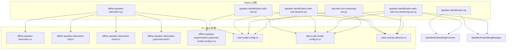
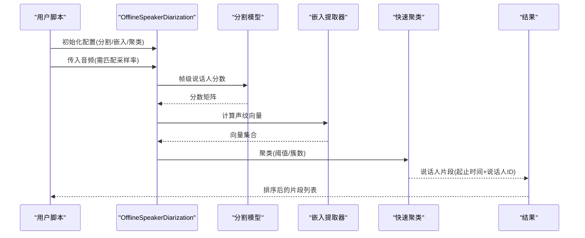
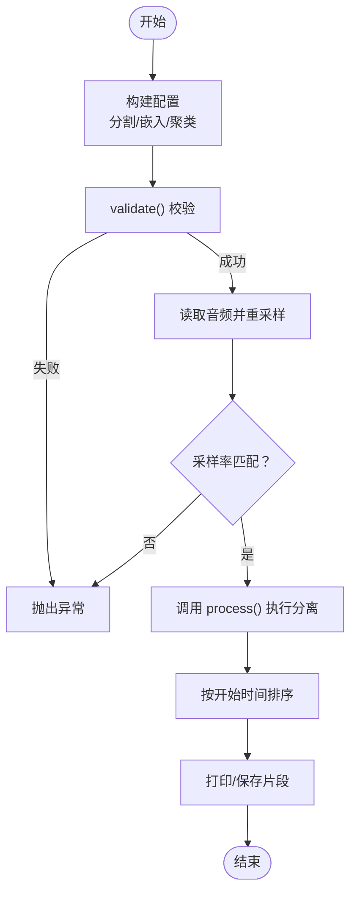
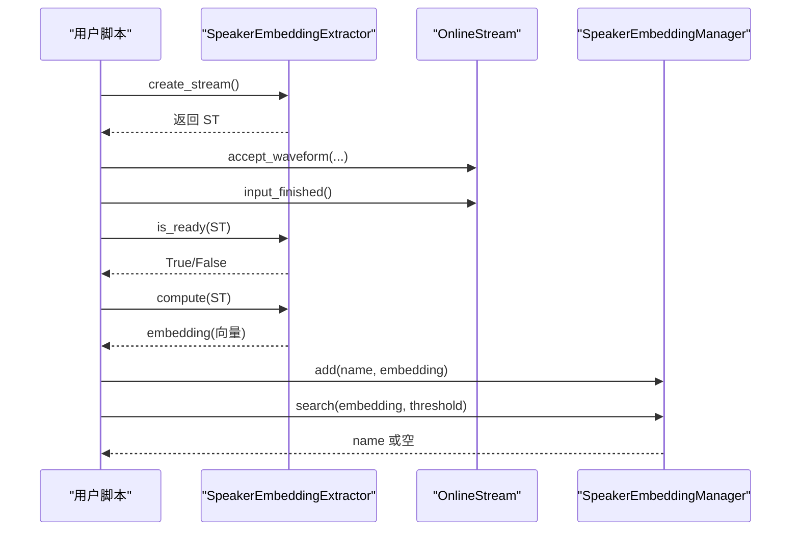
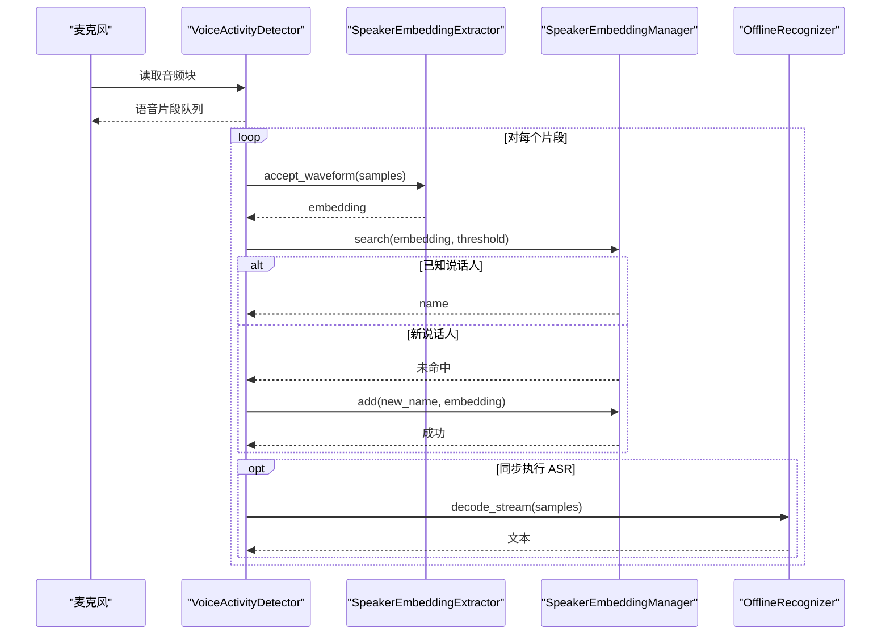
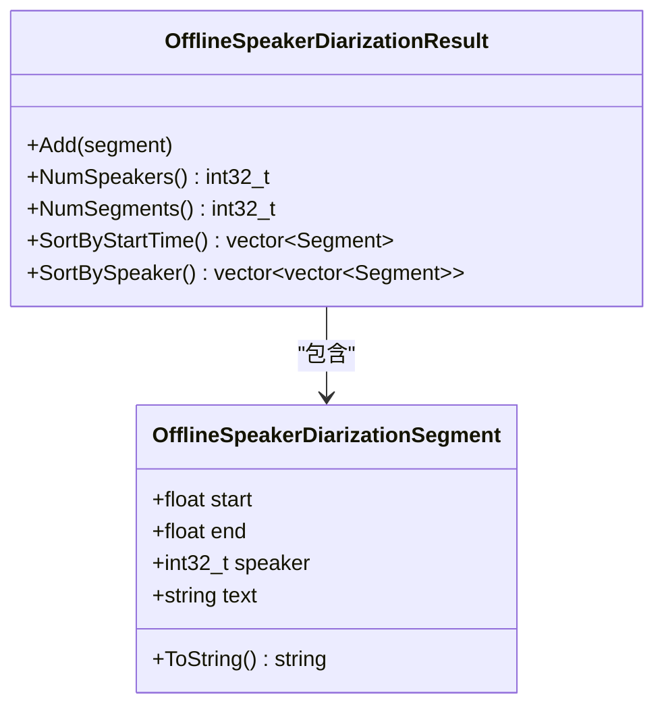
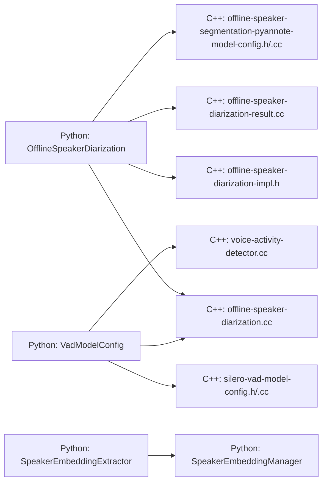

# 说话人相关功能示例

<cite>
**本文引用的文件列表**
- [offline-speaker-diarization.py](file://python-api-examples/offline-speaker-diarization.py)
- [speaker-identification.py](file://python-api-examples/speaker-identification.py)
- [speaker-identification-with-vad.py](file://python-api-examples/speaker-identification-with-vad.py)
- [speaker-identification-with-vad-dynamic.py](file://python-api-examples/speaker-identification-with-vad-dynamic.py)
- [speaker-identification-with-vad-non-streaming-asr.py](file://python-api-examples/speaker-identification-with-vad-non-streaming-asr.py)
- [vad-with-non-streaming-asr.py](file://python-api-examples/vad-with-non-streaming-asr.py)
- [offline-speaker-diarization.cc](file://sherpa-onnx/csrc/offline-speaker-diarization.cc)
- [offline-speaker-diarization-result.cc](file://sherpa-onnx/csrc/offline-speaker-diarization-result.cc)
- [offline-speaker-diarization-impl.h](file://sherpa-onnx/csrc/offline-speaker-diarization-impl.h)
- [offline-speaker-diarization-pyannote-impl.h](file://sherpa-onnx/csrc/offline-speaker-diarization-pyannote-impl.h)
- [offline-speaker-diarization.h](file://sherpa-onnx/python/csrc/offline-speaker-diarization.h)
- [offline-speaker-diarization-pyannote-impl.h](file://sherpa-onnx/csrc/offline-speaker-diarization-pyannote-impl.h)
- [offline-speaker-segmentation-pyannote-model-config.cc](file://sherpa-onnx/csrc/offline-speaker-segmentation-pyannote-model-config.cc)
- [offline-speaker-segmentation-pyannote-model-config.h](file://sherpa-onnx/csrc/offline-speaker-segmentation-pyannote-model-config.h)
- [vad-model-config.cc](file://sherpa-onnx/csrc/vad-model-config.cc)
- [silero-vad-model-config.h](file://sherpa-onnx/csrc/silero-vad-model-config.h)
- [silero-vad-model-config.cc](file://sherpa-onnx/csrc/silero-vad-model-config.cc)
- [voice-activity-detector.cc](file://sherpa-onnx/csrc/voice-activity-detector.cc)
- [test_fast_clustering.py](file://sherpa-onnx/python/tests/test_fast_clustering.py)
</cite>

## 目录
1. [简介](#简介)
2. [项目结构](#项目结构)
3. [核心组件](#核心组件)
4. [架构总览](#架构总览)
5. [详细组件分析](#详细组件分析)
6. [依赖关系分析](#依赖关系分析)
7. [性能考量](#性能考量)
8. [故障排查指南](#故障排查指南)
9. [结论](#结论)
10. [附录](#附录)

## 简介
本文件面向使用 sherpa-onnx Python API 的开发者，系统性讲解“说话人相关功能”的典型用法与最佳实践，覆盖以下主题：
- 说话人分离（离线非流式）：使用 OfflineSpeakerDiarization 类完成语音分段、聚类与说话人标签输出。
- 说话人识别（离线/在线）：使用 SpeakerEmbeddingExtractor 提取声纹特征，配合 SpeakerEmbeddingManager 进行注册、查询与验证。
- 复杂场景：将 VAD 与说话人识别/ASR 结合，实现实时语音活动检测驱动的说话人识别或带语音转写的结果标注。
- 模型选择建议与准确率优化技巧：基于仓库提供的示例脚本与配置项，给出可操作的调参建议。

## 项目结构
围绕说话人相关功能，Python 示例主要位于 python-api-examples 目录；底层 C++ 实现位于 sherpa-onnx/csrc 与 sherpa-onnx/python/csrc。下图展示了与本文相关的文件与模块关系。

图表来源
- [offline-speaker-diarization.py](file://python-api-examples/offline-speaker-diarization.py#L1-L137)
- [speaker-identification.py](file://python-api-examples/speaker-identification.py#L1-L261)
- [speaker-identification-with-vad.py](file://python-api-examples/speaker-identification-with-vad.py#L1-L277)
- [speaker-identification-with-vad-dynamic.py](file://python-api-examples/speaker-identification-with-vad-dynamic.py#L1-L222)
- [speaker-identification-with-vad-non-streaming-asr.py](file://python-api-examples/speaker-identification-with-vad-non-streaming-asr.py#L1-L500)
- [vad-with-non-streaming-asr.py](file://python-api-examples/vad-with-non-streaming-asr.py#L1-L496)
- [offline-speaker-diarization.cc](file://sherpa-onnx/csrc/offline-speaker-diarization.cc#L44-L95)
- [offline-speaker-diarization-impl.h](file://sherpa-onnx/csrc/offline-speaker-diarization-impl.h#L1-L39)
- [offline-speaker-diarization-result.cc](file://sherpa-onnx/csrc/offline-speaker-diarization-result.cc#L53-L115)
- [offline-speaker-diarization-pyannote-impl.h](file://sherpa-onnx/csrc/offline-speaker-diarization-pyannote-impl.h#L198-L233)
- [offline-speaker-segmentation-pyannote-model-config.h](file://sherpa-onnx/csrc/offline-speaker-segmentation-pyannote-model-config.h#L1-L30)
- [offline-speaker-segmentation-pyannote-model-config.cc](file://sherpa-onnx/csrc/offline-speaker-segmentation-pyannote-model-config.cc#L1-L38)
- [vad-model-config.cc](file://sherpa-onnx/csrc/vad-model-config.cc#L52-L79)
- [silero-vad-model-config.h](file://sherpa-onnx/csrc/silero-vad-model-config.h#L1-L51)
- [silero-vad-model-config.cc](file://sherpa-onnx/csrc/silero-vad-model-config.cc#L33-L71)
- [voice-activity-detector.cc](file://sherpa-onnx/csrc/voice-activity-detector.cc#L185-L231)

章节来源
- [offline-speaker-diarization.py](file://python-api-examples/offline-speaker-diarization.py#L1-L137)
- [speaker-identification.py](file://python-api-examples/speaker-identification.py#L1-L261)
- [speaker-identification-with-vad.py](file://python-api-examples/speaker-identification-with-vad.py#L1-L277)
- [speaker-identification-with-vad-dynamic.py](file://python-api-examples/speaker-identification-with-vad-dynamic.py#L1-L222)
- [speaker-identification-with-vad-non-streaming-asr.py](file://python-api-examples/speaker-identification-with-vad-non-streaming-asr.py#L1-L500)
- [vad-with-non-streaming-asr.py](file://python-api-examples/vad-with-non-streaming-asr.py#L1-L496)

## 核心组件
- OfflineSpeakerDiarization：离线说话人分离主入口，负责分割、嵌入提取与聚类，输出按时间排序的说话人片段。
- SpeakerEmbeddingExtractor：声纹特征提取器，支持创建流并计算固定维度向量。
- SpeakerEmbeddingManager：声纹管理器，支持注册、查询、验证与阈值控制。
- VoiceActivityDetector（VAD）：语音活动检测器，支持 Silero 和 Ten VAD 模型，用于过滤有效语音片段。
- OfflineSpeakerSegmentationModelConfig / OfflineSpeakerSegmentationPyannoteModelConfig：说话人分割模型配置，当前示例使用 Pyannote 分割模型。
- VadModelConfig / SileroVadModelConfig：VAD 配置，含阈值、静音/语音最短持续时间、窗口大小等关键参数。

章节来源
- [offline-speaker-diarization.cc](file://sherpa-onnx/csrc/offline-speaker-diarization.cc#L44-L95)
- [offline-speaker-diarization-impl.h](file://sherpa-onnx/csrc/offline-speaker-diarization-impl.h#L1-L39)
- [offline-speaker-diarization-result.cc](file://sherpa-onnx/csrc/offline-speaker-diarization-result.cc#L53-L115)
- [offline-speaker-segmentation-pyannote-model-config.h](file://sherpa-onnx/csrc/offline-speaker-segmentation-pyannote-model-config.h#L1-L30)
- [offline-speaker-segmentation-pyannote-model-config.cc](file://sherpa-onnx/csrc/offline-speaker-segmentation-pyannote-model-config.cc#L1-L38)
- [vad-model-config.cc](file://sherpa-onnx/csrc/vad-model-config.cc#L52-L79)
- [silero-vad-model-config.h](file://sherpa-onnx/csrc/silero-vad-model-config.h#L1-L51)
- [silero-vad-model-config.cc](file://sherpa-onnx/csrc/silero-vad-model-config.cc#L33-L71)
- [voice-activity-detector.cc](file://sherpa-onnx/csrc/voice-activity-detector.cc#L185-L231)

## 架构总览
下图展示了“离线说话人分离”的端到端流程：音频输入经采样率匹配后，进入分割模型得到帧级说话人分数，随后通过嵌入提取器生成声纹向量，最后以聚类策略合并为最终的说话人片段。

图表来源
- [offline-speaker-diarization.cc](file://sherpa-onnx/csrc/offline-speaker-diarization.cc#L44-L95)
- [offline-speaker-diarization-pyannote-impl.h](file://sherpa-onnx/csrc/offline-speaker-diarization-pyannote-impl.h#L198-L233)
- [offline-speaker-diarization-result.cc](file://sherpa-onnx/csrc/offline-speaker-diarization-result.cc#L53-L115)

## 详细组件分析

### OfflineSpeakerDiarization 使用指南
- 配置要点
  - 分割模型：使用 Pyannote 分割模型，需提供模型路径。
  - 嵌入提取器：指定声纹模型路径。
  - 聚类：可指定 num_clusters 或 threshold；前者优先。
  - 最小持续时间：min_duration_on/min_duration_off 控制片段合并与裁剪。
- 输入要求
  - 音频采样率需与 sd.sample_rate 匹配；不一致会触发错误。
  - 支持回调进度显示，便于长音频处理。
- 输出解析
  - 返回结果包含每段起止时间与说话人ID；可按开始时间或按说话人ID排序。

图表来源
- [offline-speaker-diarization.py](file://python-api-examples/offline-speaker-diarization.py#L57-L134)
- [offline-speaker-diarization.cc](file://sherpa-onnx/csrc/offline-speaker-diarization.cc#L44-L95)
- [offline-speaker-diarization-result.cc](file://sherpa-onnx/csrc/offline-speaker-diarization-result.cc#L53-L115)

章节来源
- [offline-speaker-diarization.py](file://python-api-examples/offline-speaker-diarization.py#L57-L134)
- [offline-speaker-diarization.cc](file://sherpa-onnx/csrc/offline-speaker-diarization.cc#L44-L95)
- [offline-speaker-diarization-result.cc](file://sherpa-onnx/csrc/offline-speaker-diarization-result.cc#L53-L115)

### SpeakerEmbeddingExtractor 在说话人识别中的应用
- 流式接口
  - 创建流：extractor.create_stream()
  - 写入波形：stream.accept_waveform(sample_rate, waveform)
  - 结束输入：stream.input_finished()
  - 检查就绪：extractor.is_ready(stream)
  - 计算嵌入：embedding = extractor.compute(stream)
- 管理器接口
  - 注册：manager.add(name, embedding)
  - 查询：name = manager.search(embedding, threshold)
  - 验证：verify(obj={name, v, threshold}) 可用于二次确认
  - 维度：extractor.dim 表示嵌入维度，用于初始化管理器

图表来源
- [speaker-identification.py](file://python-api-examples/speaker-identification.py#L158-L210)
- [speaker-identification-with-vad.py](file://python-api-examples/speaker-identification-with-vad.py#L173-L216)
- [speaker-identification-with-vad-dynamic.py](file://python-api-examples/speaker-identification-with-vad-dynamic.py#L111-L135)

章节来源
- [speaker-identification.py](file://python-api-examples/speaker-identification.py#L158-L210)
- [speaker-identification-with-vad.py](file://python-api-examples/speaker-identification-with-vad.py#L173-L216)
- [speaker-identification-with-vad-dynamic.py](file://python-api-examples/speaker-identification-with-vad-dynamic.py#L111-L135)

### VAD 与说话人识别/ASR 的复杂场景
- 场景一：VAD + 说话人识别（静态注册）
  - 使用 VAD 将麦克风输入切分为语音片段，过滤过短片段，对每个片段提取声纹并查询注册表，输出说话人标签。
- 场景二：VAD + 动态注册
  - 若查询不到匹配说话人，则动态注册新说话人并分配唯一名称。
- 场景三：VAD + 说话人识别 + 非流式 ASR
  - 在识别到说话人后，对同一片段再运行非流式 ASR，得到文本结果，形成“说话人-文本”标注。

图表来源
- [speaker-identification-with-vad.py](file://python-api-examples/speaker-identification-with-vad.py#L201-L271)
- [speaker-identification-with-vad-dynamic.py](file://python-api-examples/speaker-identification-with-vad-dynamic.py#L173-L215)
- [speaker-identification-with-vad-non-streaming-asr.py](file://python-api-examples/speaker-identification-with-vad-non-streaming-asr.py#L411-L493)
- [vad-with-non-streaming-asr.py](file://python-api-examples/vad-with-non-streaming-asr.py#L424-L490)

章节来源
- [speaker-identification-with-vad.py](file://python-api-examples/speaker-identification-with-vad.py#L201-L271)
- [speaker-identification-with-vad-dynamic.py](file://python-api-examples/speaker-identification-with-vad-dynamic.py#L173-L215)
- [speaker-identification-with-vad-non-streaming-asr.py](file://python-api-examples/speaker-identification-with-vad-non-streaming-asr.py#L411-L493)
- [vad-with-non-streaming-asr.py](file://python-api-examples/vad-with-non-streaming-asr.py#L424-L490)

### 说话人分离内部流程与数据结构
- 分割阶段
  - 通过 Pyannote 分割模型获取帧级分数矩阵，内部根据模型元数据的窗口大小与步长进行滑动窗口处理。
- 聚类阶段
  - 使用 Fast Clustering 对向量进行聚类，支持 num_clusters 或 threshold 两种方式。
- 结果结构
  - OfflineSpeakerDiarizationSegment 包含 start/end/speaker/text 字段；
  - OfflineSpeakerDiarizationResult 提供按开始时间排序与按说话人分组的方法。

图表来源
- [offline-speaker-diarization-result.cc](file://sherpa-onnx/csrc/offline-speaker-diarization-result.cc#L53-L115)

章节来源
- [offline-speaker-diarization-result.cc](file://sherpa-onnx/csrc/offline-speaker-diarization-result.cc#L53-L115)
- [offline-speaker-diarization-pyannote-impl.h](file://sherpa-onnx/csrc/offline-speaker-diarization-pyannote-impl.h#L198-L233)
- [test_fast_clustering.py](file://sherpa-onnx/python/tests/test_fast_clustering.py#L133-L162)

## 依赖关系分析
- Python 示例与 C++ 实现的绑定
  - Python 层通过 pybind11 暴露 OfflineSpeakerDiarizationConfig、SpeakerEmbeddingExtractorConfig、VadModelConfig 等配置类。
  - C++ 层提供具体实现，如 Pyannote 分割模型、VAD 模型、聚类器等。
- 关键耦合点
  - OfflineSpeakerDiarization 依赖分割模型与嵌入提取器；聚类仅使用聚类配置。
  - VAD 与识别/说话人识别之间通过音频片段共享，避免重复加载模型。

图表来源
- [offline-speaker-diarization.cc](file://sherpa-onnx/csrc/offline-speaker-diarization.cc#L44-L95)
- [offline-speaker-diarization-impl.h](file://sherpa-onnx/csrc/offline-speaker-diarization-impl.h#L1-L39)
- [offline-speaker-diarization-result.cc](file://sherpa-onnx/csrc/offline-speaker-diarization-result.cc#L53-L115)
- [offline-speaker-segmentation-pyannote-model-config.h](file://sherpa-onnx/csrc/offline-speaker-segmentation-pyannote-model-config.h#L1-L30)
- [offline-speaker-segmentation-pyannote-model-config.cc](file://sherpa-onnx/csrc/offline-speaker-segmentation-pyannote-model-config.cc#L1-L38)
- [vad-model-config.cc](file://sherpa-onnx/csrc/vad-model-config.cc#L52-L79)
- [silero-vad-model-config.h](file://sherpa-onnx/csrc/silero-vad-model-config.h#L1-L51)
- [silero-vad-model-config.cc](file://sherpa-onnx/csrc/silero-vad-model-config.cc#L33-L71)
- [voice-activity-detector.cc](file://sherpa-onnx/csrc/voice-activity-detector.cc#L185-L231)

章节来源
- [offline-speaker-diarization.cc](file://sherpa-onnx/csrc/offline-speaker-diarization.cc#L44-L95)
- [offline-speaker-diarization-impl.h](file://sherpa-onnx/csrc/offline-speaker-diarization-impl.h#L1-L39)
- [offline-speaker-diarization-result.cc](file://sherpa-onnx/csrc/offline-speaker-diarization-result.cc#L53-L115)
- [offline-speaker-segmentation-pyannote-model-config.h](file://sherpa-onnx/csrc/offline-speaker-segmentation-pyannote-model-config.h#L1-L30)
- [offline-speaker-segmentation-pyannote-model-config.cc](file://sherpa-onnx/csrc/offline-speaker-segmentation-pyannote-model-config.cc#L1-L38)
- [vad-model-config.cc](file://sherpa-onnx/csrc/vad-model-config.cc#L52-L79)
- [silero-vad-model-config.h](file://sherpa-onnx/csrc/silero-vad-model-config.h#L1-L51)
- [silero-vad-model-config.cc](file://sherpa-onnx/csrc/silero-vad-model-config.cc#L33-L71)
- [voice-activity-detector.cc](file://sherpa-onnx/csrc/voice-activity-detector.cc#L185-L231)

## 性能考量
- 模型与硬件
  - 通过 provider 参数选择 CPU/CUDA/CoreML，合理设置 num_threads 提升推理吞吐。
- VAD 参数
  - window_size 与 min_silence_duration/min_speech_duration 影响实时性与误检率；示例脚本已给出默认值，可根据场景微调。
- 嵌入与聚类
  - 增加训练样本数量并做平均嵌入可提升稳定性；阈值 threshold 与 num_clusters 需结合数据集分布调优。
- I/O 与缓冲
  - 使用较大的 buffer_size_in_seconds 可减少模型调用次数，但会增加延迟；需在延迟与资源占用间权衡。

[本节为通用指导，不直接分析具体文件]

## 故障排查指南
- OfflineSpeakerDiarization 配置校验失败
  - 检查分割模型路径、嵌入模型路径是否存在；min_duration_on/min_duration_off 必须非负。
- 采样率不匹配
  - sd.sample_rate 与输入音频采样率必须一致；否则会抛出错误。
- VAD 配置错误
  - 必须提供至少一个 VAD 模型；Silero/Ten VAD 的阈值与持续时间需在有效范围内。
- 嵌入计算未就绪
  - 确保在调用 compute 之前已调用 input_finished 并满足 is_ready 条件。
- 说话人识别阈值过高导致无法匹配
  - 适当降低 threshold，或增加注册样本数量以提高平均嵌入质量。

章节来源
- [offline-speaker-diarization.cc](file://sherpa-onnx/csrc/offline-speaker-diarization.cc#L44-L67)
- [vad-model-config.cc](file://sherpa-onnx/csrc/vad-model-config.cc#L52-L79)
- [silero-vad-model-config.cc](file://sherpa-onnx/csrc/silero-vad-model-config.cc#L54-L71)
- [speaker-identification.py](file://python-api-examples/speaker-identification.py#L198-L210)

## 结论
本文基于 sherpa-onnx 的 Python API，系统梳理了说话人分离与识别的关键流程与配置要点，并提供了 VAD 驱动的复杂场景示例。通过合理选择模型、调整 VAD 与聚类参数、规范嵌入提取与查询流程，可在多说话人场景中获得稳定且高准确率的结果。

[本节为总结性内容，不直接分析具体文件]

## 附录
- 模型下载与准备
  - 分割模型：Pyannote 分割模型
  - 声纹模型：多种开源模型可选（示例脚本中包含下载链接）
  - VAD 模型：Silero VAD
  - 非流式 ASR 模型：可参考 vad-with-non-streaming-asr.py 中的参数组织方式
- 常用命令与参数
  - OfflineSpeakerDiarization：配置分割/嵌入/聚类与最小持续时间
  - SpeakerEmbeddingExtractor：指定 provider、num_threads、debug
  - VadModelConfig：选择 Silero/Ten VAD，设置阈值与持续时间
  - SpeakerEmbeddingManager：注册、查询、验证与阈值控制

[本节为补充说明，不直接分析具体文件]