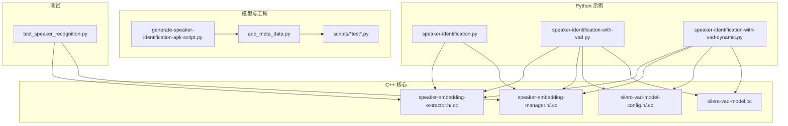
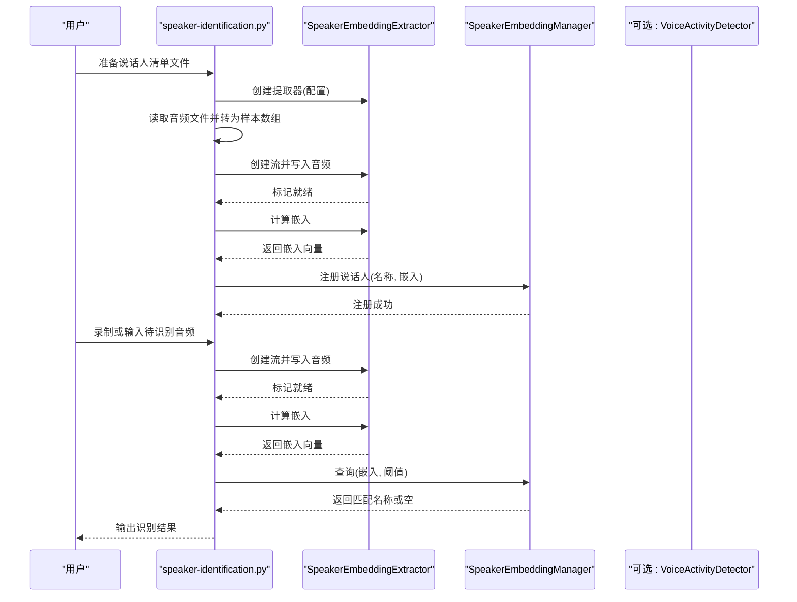
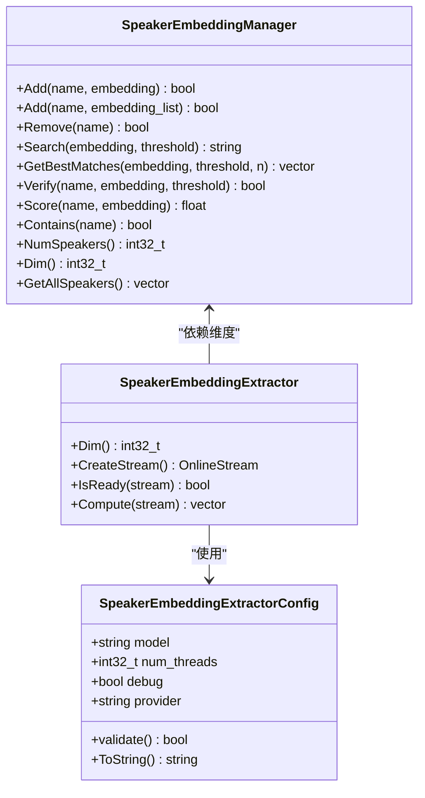
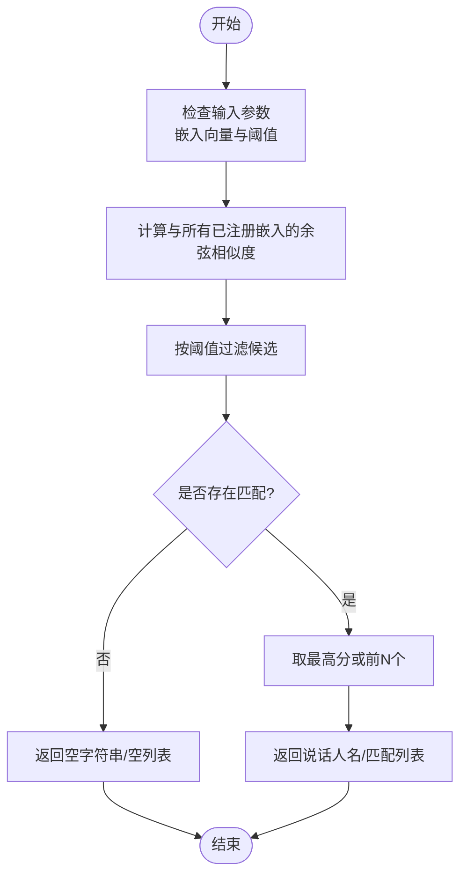
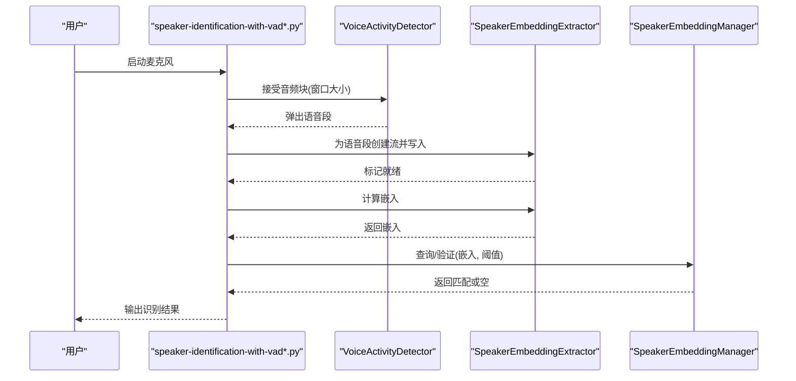
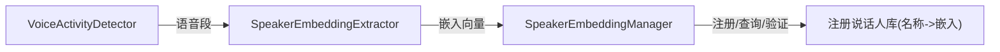

# 说话人识别示例

<cite>
**本文引用的文件**
- [python-api-examples/speaker-identification.py](file://python-api-examples/speaker-identification.py)
- [python-api-examples/speaker-identification-with-vad.py](file://python-api-examples/speaker-identification-with-vad.py)
- [python-api-examples/speaker-identification-with-vad-dynamic.py](file://python-api-examples/speaker-identification-with-vad-dynamic.py)
- [sherpa-onnx/python/csrc/speaker-embedding-extractor.h](file://sherpa-onnx/python/csrc/speaker-embedding-extractor.h)
- [sherpa-onnx/python/csrc/speaker-embedding-extractor.cc](file://sherpa-onnx/python/csrc/speaker-embedding-extractor.cc)
- [sherpa-onnx/csrc/speaker-embedding-manager.h](file://sherpa-onnx/csrc/speaker-embedding-manager.h)
- [sherpa-onnx/python/csrc/speaker-embedding-manager.cc](file://sherpa-onnx/python/csrc/speaker-embedding-manager.cc)
- [sherpa-onnx/csrc/speaker-embedding-manager.cc](file://sherpa-onnx/csrc/speaker-embedding-manager.cc)
- [sherpa-onnx/csrc/silero-vad-model-config.h](file://sherpa-onnx/csrc/silero-vad-model-config.h)
- [sherpa-onnx/csrc/silero-vad-model-config.cc](file://sherpa-onnx/csrc/silero-vad-model-config.cc)
- [sherpa-onnx/csrc/silero-vad-model.cc](file://sherpa-onnx/csrc/silero-vad-model.cc)
- [scripts/apk/generate-speaker-identification-apk-script.py](file://scripts/apk/generate-speaker-identification-apk-script.py)
- [scripts/wespeaker/add_meta_data.py](file://scripts/wespeaker/add_meta_data.py)
- [scripts/wespeaker/test.py](file://scripts/wespeaker/test.py)
- [scripts/3dspeaker/test-onnx.py](file://scripts/3dspeaker/test-onnx.py)
- [sherpa-onnx/python/tests/test_speaker_recognition.py](file://sherpa-onnx/python/tests/test_speaker_recognition.py)
</cite>

## 目录
1. [简介](#简介)
2. [项目结构](#项目结构)
3. [核心组件](#核心组件)
4. [架构总览](#架构总览)
5. [详细组件分析](#详细组件分析)
6. [依赖关系分析](#依赖关系分析)
7. [性能考虑](#性能考虑)
8. [故障排查指南](#故障排查指南)
9. [结论](#结论)
10. [附录](#附录)

## 简介
本文件围绕 sherpa-onnx 的 Python API 说话人识别能力，系统性讲解 SpeakerEmbeddingExtractor 类的实现原理与使用方法，涵盖以下主题：
- 如何从音频片段提取声纹特征向量（嵌入）
- 如何基于余弦相似度进行说话人比对（识别与验证）
- 注册说话人声纹库与验证未知说话人的完整流程
- 结合 VAD 的高级用法：自动语音段检测与实时说话人识别
- 模型选择建议、特征提取优化与准确率提升技巧

## 项目结构
与说话人识别直接相关的核心文件与示例如下：
- Python 示例脚本
  - 非流式离线注册与识别：speaker-identification.py
  - 基于 VAD 的离线识别：speaker-identification-with-vad.py
  - 动态说话人注册（在线/动态）：speaker-identification-with-vad-dynamic.py
- C++ 核心实现（Python 绑定）
  - 嵌入提取器接口与绑定：speaker-embedding-extractor.h, speaker-embedding-extractor.cc
  - 声纹管理器（注册/查找/验证）：speaker-embedding-manager.h, 对应 Python 绑定 speaker-embedding-manager.cc
  - VAD 配置与实现：silero-vad-model-config.h/.cc, silero-vad-model.cc
- 模型与工具脚本
  - 生成可用的说话人识别模型列表：generate-speaker-identification-apk-script.py
  - 模型元数据添加：add_meta_data.py
  - 余弦相似度示例：test.py（wespeaker）、test-onnx.py（3dspeaker）
- 测试用例
  - Python 单测：test_speaker_recognition.py

图表来源
- [python-api-examples/speaker-identification.py](file://python-api-examples/speaker-identification.py#L1-L261)
- [python-api-examples/speaker-identification-with-vad.py](file://python-api-examples/speaker-identification-with-vad.py#L1-L277)
- [python-api-examples/speaker-identification-with-vad-dynamic.py](file://python-api-examples/speaker-identification-with-vad-dynamic.py#L1-L222)
- [sherpa-onnx/python/csrc/speaker-embedding-extractor.h](file://sherpa-onnx/python/csrc/speaker-embedding-extractor.h#L1-L72)
- [sherpa-onnx/python/csrc/speaker-embedding-extractor.cc](file://sherpa-onnx/python/csrc/speaker-embedding-extractor.cc#L1-L44)
- [sherpa-onnx/csrc/speaker-embedding-manager.h](file://sherpa-onnx/csrc/speaker-embedding-manager.h#L1-L121)
- [sherpa-onnx/python/csrc/speaker-embedding-manager.cc](file://sherpa-onnx/python/csrc/speaker-embedding-manager.cc#L44-L74)
- [sherpa-onnx/csrc/silero-vad-model-config.h](file://sherpa-onnx/csrc/silero-vad-model-config.h#L1-L51)
- [sherpa-onnx/csrc/silero-vad-model-config.cc](file://sherpa-onnx/csrc/silero-vad-model-config.cc#L1-L125)
- [sherpa-onnx/csrc/silero-vad-model.cc](file://sherpa-onnx/csrc/silero-vad-model.cc#L49-L105)
- [scripts/apk/generate-speaker-identification-apk-script.py](file://scripts/apk/generate-speaker-identification-apk-script.py#L74-L104)
- [scripts/wespeaker/add_meta_data.py](file://scripts/wespeaker/add_meta_data.py#L120-L143)
- [scripts/wespeaker/test.py](file://scripts/wespeaker/test.py#L139-L167)
- [scripts/3dspeaker/test-onnx.py](file://scripts/3dspeaker/test-onnx.py#L130-L173)
- [sherpa-onnx/python/tests/test_speaker_recognition.py](file://sherpa-onnx/python/tests/test_speaker_recognition.py#L1-L218)

章节来源
- [python-api-examples/speaker-identification.py](file://python-api-examples/speaker-identification.py#L1-L261)
- [python-api-examples/speaker-identification-with-vad.py](file://python-api-examples/speaker-identification-with-vad.py#L1-L277)
- [python-api-examples/speaker-identification-with-vad-dynamic.py](file://python-api-examples/speaker-identification-with-vad-dynamic.py#L1-L222)

## 核心组件
- SpeakerEmbeddingExtractor
  - 负责从音频中提取说话人嵌入（特征向量）。提供创建流、判断就绪、计算嵌入等接口。
  - Python 绑定暴露 Config、创建流、计算、就绪检查等方法。
- SpeakerEmbeddingManager
  - 负责说话人注册、查询、验证与评分。支持余弦相似度匹配、阈值过滤、返回最佳匹配等。
- VAD（Voice Activity Detection）
  - 提供静音/语音段检测，常与说话人识别配合，仅对有效语音段提取嵌入，提高准确率与效率。

章节来源
- [sherpa-onnx/python/csrc/speaker-embedding-extractor.h](file://sherpa-onnx/python/csrc/speaker-embedding-extractor.h#L1-L72)
- [sherpa-onnx/python/csrc/speaker-embedding-extractor.cc](file://sherpa-onnx/python/csrc/speaker-embedding-extractor.cc#L1-L44)
- [sherpa-onnx/csrc/speaker-embedding-manager.h](file://sherpa-onnx/csrc/speaker-embedding-manager.h#L1-L121)
- [sherpa-onnx/python/csrc/speaker-embedding-manager.cc](file://sherpa-onnx/python/csrc/speaker-embedding-manager.cc#L44-L74)

## 架构总览
下面以“非流式离线注册与识别”的典型流程为例，展示从音频到说话人识别的整体调用链路。

图表来源
- [python-api-examples/speaker-identification.py](file://python-api-examples/speaker-identification.py#L127-L213)
- [sherpa-onnx/python/csrc/speaker-embedding-extractor.h](file://sherpa-onnx/python/csrc/speaker-embedding-extractor.h#L38-L67)
- [sherpa-onnx/csrc/speaker-embedding-manager.h](file://sherpa-onnx/csrc/speaker-embedding-manager.h#L25-L111)

## 详细组件分析

### SpeakerEmbeddingExtractor 类与 Python 绑定
- 关键职责
  - 接收音频流（采样率、样本），在内部完成特征提取与嵌入计算
  - 提供 IsReady 判断是否可计算嵌入；Compute 执行计算；Dim 获取嵌入维度
- Python 绑定要点
  - Config 支持 model、num_threads、debug、provider 等参数
  - 绑定后可在 Python 中直接构造、创建流、计算嵌入
- 使用流程
  - 创建 Config 并校验
  - 构造提取器
  - 为每个音频创建流，写入样本，标记输入结束
  - 检查就绪后计算嵌入

图表来源
- [sherpa-onnx/python/csrc/speaker-embedding-extractor.h](file://sherpa-onnx/python/csrc/speaker-embedding-extractor.h#L17-L67)
- [sherpa-onnx/python/csrc/speaker-embedding-extractor.cc](file://sherpa-onnx/python/csrc/speaker-embedding-extractor.cc#L13-L42)
- [sherpa-onnx/csrc/speaker-embedding-manager.h](file://sherpa-onnx/csrc/speaker-embedding-manager.h#L19-L116)
- [sherpa-onnx/python/csrc/speaker-embedding-manager.cc](file://sherpa-onnx/python/csrc/speaker-embedding-manager.cc#L44-L74)

章节来源
- [sherpa-onnx/python/csrc/speaker-embedding-extractor.h](file://sherpa-onnx/python/csrc/speaker-embedding-extractor.h#L1-L72)
- [sherpa-onnx/python/csrc/speaker-embedding-extractor.cc](file://sherpa-onnx/python/csrc/speaker-embedding-extractor.cc#L1-L44)
- [sherpa-onnx/python/csrc/speaker-embedding-manager.cc](file://sherpa-onnx/python/csrc/speaker-embedding-manager.cc#L44-L74)

### 声纹管理器：注册、查找与验证
- 注册
  - Add(name, embedding)：注册单个嵌入
  - Add(name, embedding_list)：对多个片段的嵌入求平均后注册
- 查找
  - Search(embedding, threshold)：返回最高分且不低于阈值的说话人名，否则为空
  - GetBestMatches(embedding, threshold, n)：返回前 n 个匹配及其分数
- 验证
  - Verify(name, embedding, threshold)：对指定说话人进行一对一验证
  - Score(name, embedding)：返回与目标说话人的余弦相似度分数
- 其他
  - Contains(name)、NumSpeakers()、Dim()、GetAllSpeakers()

图表来源
- [sherpa-onnx/csrc/speaker-embedding-manager.h](file://sherpa-onnx/csrc/speaker-embedding-manager.h#L56-L111)
- [sherpa-onnx/csrc/speaker-embedding-manager.cc](file://sherpa-onnx/csrc/speaker-embedding-manager.cc#L158-L214)

章节来源
- [sherpa-onnx/csrc/speaker-embedding-manager.h](file://sherpa-onnx/csrc/speaker-embedding-manager.h#L1-L121)
- [sherpa-onnx/csrc/speaker-embedding-manager.cc](file://sherpa-onnx/csrc/speaker-embedding-manager.cc#L158-L214)

### VAD 与说话人识别结合（高级示例）
- 思路
  - 使用 VAD 将连续音频切分为语音段
  - 对每个语音段提取嵌入并进行识别/验证
  - 可选：对新出现的人声动态注册为新说话人
- 示例脚本
  - speaker-identification-with-vad.py：离线注册后，实时检测语音段并识别
  - speaker-identification-with-vad-dynamic.py：动态识别并自动注册新说话人

图表来源
- [python-api-examples/speaker-identification-with-vad.py](file://python-api-examples/speaker-identification-with-vad.py#L201-L271)
- [python-api-examples/speaker-identification-with-vad-dynamic.py](file://python-api-examples/speaker-identification-with-vad-dynamic.py#L137-L216)
- [sherpa-onnx/csrc/silero-vad-model-config.h](file://sherpa-onnx/csrc/silero-vad-model-config.h#L1-L51)
- [sherpa-onnx/csrc/silero-vad-model-config.cc](file://sherpa-onnx/csrc/silero-vad-model-config.cc#L1-L125)
- [sherpa-onnx/csrc/silero-vad-model.cc](file://sherpa-onnx/csrc/silero-vad-model.cc#L49-L105)

章节来源
- [python-api-examples/speaker-identification-with-vad.py](file://python-api-examples/speaker-identification-with-vad.py#L1-L277)
- [python-api-examples/speaker-identification-with-vad-dynamic.py](file://python-api-examples/speaker-identification-with-vad-dynamic.py#L1-L222)
- [sherpa-onnx/csrc/silero-vad-model-config.h](file://sherpa-onnx/csrc/silero-vad-model-config.h#L1-L51)
- [sherpa-onnx/csrc/silero-vad-model-config.cc](file://sherpa-onnx/csrc/silero-vad-model-config.cc#L1-L125)
- [sherpa-onnx/csrc/silero-vad-model.cc](file://sherpa-onnx/csrc/silero-vad-model.cc#L49-L105)

### 余弦相似度与阈值策略
- 余弦相似度
  - 管理器内部对输入向量与注册向量均做归一化后再点积，得到余弦相似度
  - Verify/Score/Search/GetBestMatches 均基于该相似度
- 阈值选择
  - 不同模型与场景差异较大，示例脚本默认阈值在 0.4~0.6 区间
  - 可参考测试用例与工具脚本中的相似度输出，结合业务需求微调

章节来源
- [sherpa-onnx/csrc/speaker-embedding-manager.cc](file://sherpa-onnx/csrc/speaker-embedding-manager.cc#L171-L206)
- [scripts/wespeaker/test.py](file://scripts/wespeaker/test.py#L139-L167)
- [scripts/3dspeaker/test-onnx.py](file://scripts/3dspeaker/test-onnx.py#L130-L173)
- [sherpa-onnx/python/tests/test_speaker_recognition.py](file://sherpa-onnx/python/tests/test_speaker_recognition.py#L93-L115)

### 注册说话人与验证未知说话人的完整流程
- 离线注册
  - 读取同一说话人的多个音频文件，分别提取嵌入并求平均
  - 使用 SpeakerEmbeddingManager.add 注册说话人名称与嵌入
- 在线识别
  - 对输入音频逐段提取嵌入
  - 使用 Search 或 GetBestMatches 进行识别
- 在线验证
  - 使用 Verify 对特定说话人进行一对一验证
  - 使用 Score 获取相似度分数用于阈值调整

章节来源
- [python-api-examples/speaker-identification.py](file://python-api-examples/speaker-identification.py#L127-L213)
- [sherpa-onnx/python/tests/test_speaker_recognition.py](file://sherpa-onnx/python/tests/test_speaker_recognition.py#L59-L115)

## 依赖关系分析
- 组件耦合
  - SpeakerEmbeddingExtractor 与 SpeakerEmbeddingManager 通过嵌入维度与向量接口耦合
  - VAD 作为外部模块，通过窗口化音频输入到提取器
- 数据结构
  - 管理器内部使用矩阵存储注册说话人的嵌入，字典映射名称与行索引
  - GetBestMatches 返回包含名称与分数的结构体列表

图表来源
- [sherpa-onnx/csrc/speaker-embedding-manager.h](file://sherpa-onnx/csrc/speaker-embedding-manager.h#L19-L116)
- [sherpa-onnx/csrc/silero-vad-model-config.h](file://sherpa-onnx/csrc/silero-vad-model-config.h#L1-L51)

章节来源
- [sherpa-onnx/csrc/speaker-embedding-manager.h](file://sherpa-onnx/csrc/speaker-embedding-manager.h#L1-L121)
- [sherpa-onnx/csrc/silero-vad-model-config.h](file://sherpa-onnx/csrc/silero-vad-model-config.h#L1-L51)

## 性能考虑
- 嵌入维度与内存
  - 管理器构造时需传入嵌入维度，后续所有注册向量必须一致
- 线程与设备
  - 提取器 Config 支持 num_threads 与 provider（如 cpu/cuda/coreml），可根据硬件选择
- VAD 参数
  - window_size、min_speech_duration、min_silence_duration、max_speech_duration 等直接影响实时性与准确性
- 片段长度
  - 动态脚本示例中对短语音段进行跳过，避免无效嵌入
- 模型选择
  - 不同框架（wespeaker/3dspeaker/nemo）与语言（zh/en）的模型在准确率与速度上存在差异，可参考 APK 生成脚本列出的模型集合

章节来源
- [sherpa-onnx/python/csrc/speaker-embedding-extractor.h](file://sherpa-onnx/python/csrc/speaker-embedding-extractor.h#L17-L34)
- [sherpa-onnx/csrc/silero-vad-model-config.h](file://sherpa-onnx/csrc/silero-vad-model-config.h#L1-L51)
- [scripts/apk/generate-speaker-identification-apk-script.py](file://scripts/apk/generate-speaker-identification-apk-script.py#L74-L104)
- [python-api-examples/speaker-identification-with-vad-dynamic.py](file://python-api-examples/speaker-identification-with-vad-dynamic.py#L171-L216)

## 故障排查指南
- 常见问题
  - 嵌入未就绪：确保在调用 Compute 前，IsReady 返回真
  - 阈值设置不当：导致误识别或无法识别，可参考测试脚本的相似度输出微调
  - VAD 参数不匹配：window_size 与模型训练要求不符会导致性能下降
  - 注册失败：名称重复或嵌入维度不一致
- 定位手段
  - 使用测试脚本验证模型与相似度计算逻辑
  - 在示例中打印中间状态（如“Computing”提示）辅助定位
  - 检查 Config.validate 与 VAD 配置 Validate 的返回值

章节来源
- [sherpa-onnx/python/tests/test_speaker_recognition.py](file://sherpa-onnx/python/tests/test_speaker_recognition.py#L1-L218)
- [sherpa-onnx/csrc/silero-vad-model-config.cc](file://sherpa-onnx/csrc/silero-vad-model-config.cc#L54-L108)
- [python-api-examples/speaker-identification-with-vad.py](file://python-api-examples/speaker-identification-with-vad.py#L237-L271)

## 结论
- SpeakerEmbeddingExtractor 与 SpeakerEmbeddingManager 提供了完整的说话人识别闭环：从特征提取到注册、识别与验证
- 结合 VAD 可显著提升实时场景下的鲁棒性与效率
- 通过合理选择模型、调整阈值与 VAD 参数，可在准确率与性能之间取得平衡

## 附录

### 模型选择建议
- 框架与语言
  - wespeaker：支持 zh/en，提供多种 resnet 系列模型
  - 3dspeaker：支持 zh-cn/en，提供 large 等模型
  - nemo：英文为主
- 参考资源
  - APK 生成脚本列出的模型集合，便于快速筛选
  - 模型元数据脚本可查看输出维度、采样率等关键信息

章节来源
- [scripts/apk/generate-speaker-identification-apk-script.py](file://scripts/apk/generate-speaker-identification-apk-script.py#L74-L104)
- [scripts/wespeaker/add_meta_data.py](file://scripts/wespeaker/add_meta_data.py#L120-L143)

### 特征提取优化与准确率提升技巧
- 多片段平均
  - 对同一说话人的多个音频片段提取嵌入并求平均，可降低噪声影响
- 阈值微调
  - 使用工具脚本输出相似度范围，结合业务场景设定阈值
- VAD 参数调优
  - 根据环境噪声与说话速率调整 min_speech_duration、min_silence_duration、window_size
- 设备与线程
  - 在支持的平台上选择合适的 provider 与 num_threads

章节来源
- [python-api-examples/speaker-identification.py](file://python-api-examples/speaker-identification.py#L158-L213)
- [scripts/wespeaker/test.py](file://scripts/wespeaker/test.py#L139-L167)
- [scripts/3dspeaker/test-onnx.py](file://scripts/3dspeaker/test-onnx.py#L130-L173)
- [sherpa-onnx/csrc/silero-vad-model-config.cc](file://sherpa-onnx/csrc/silero-vad-model-config.cc#L1-L125)