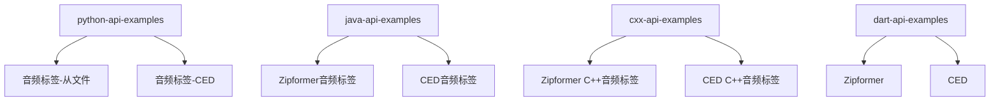
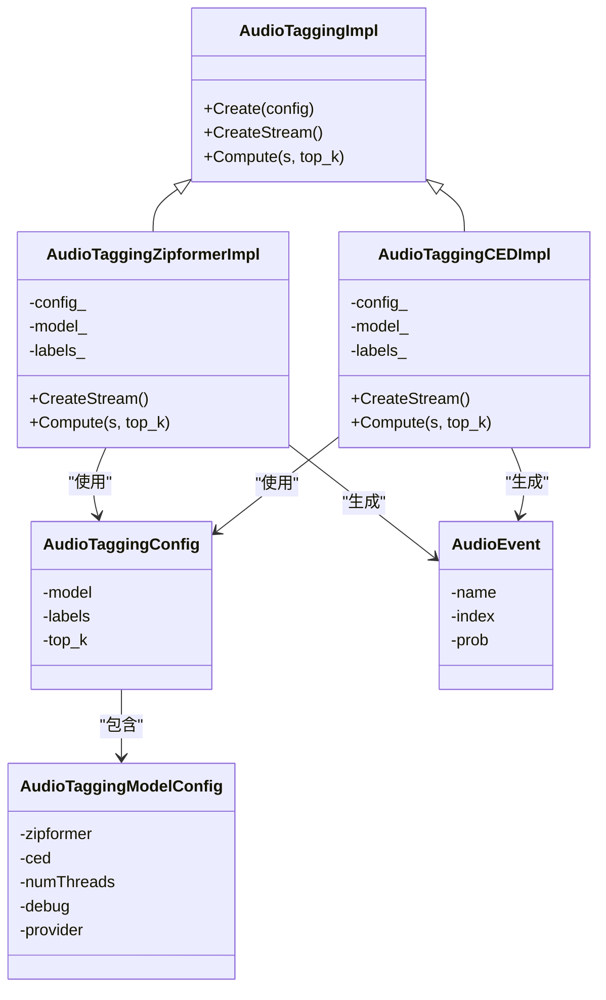
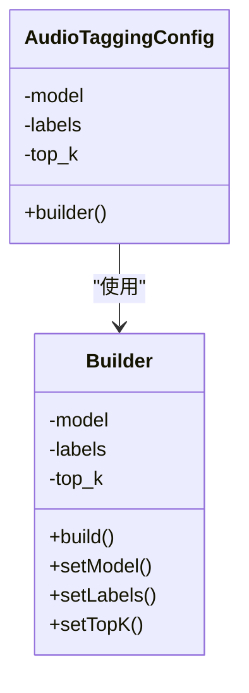
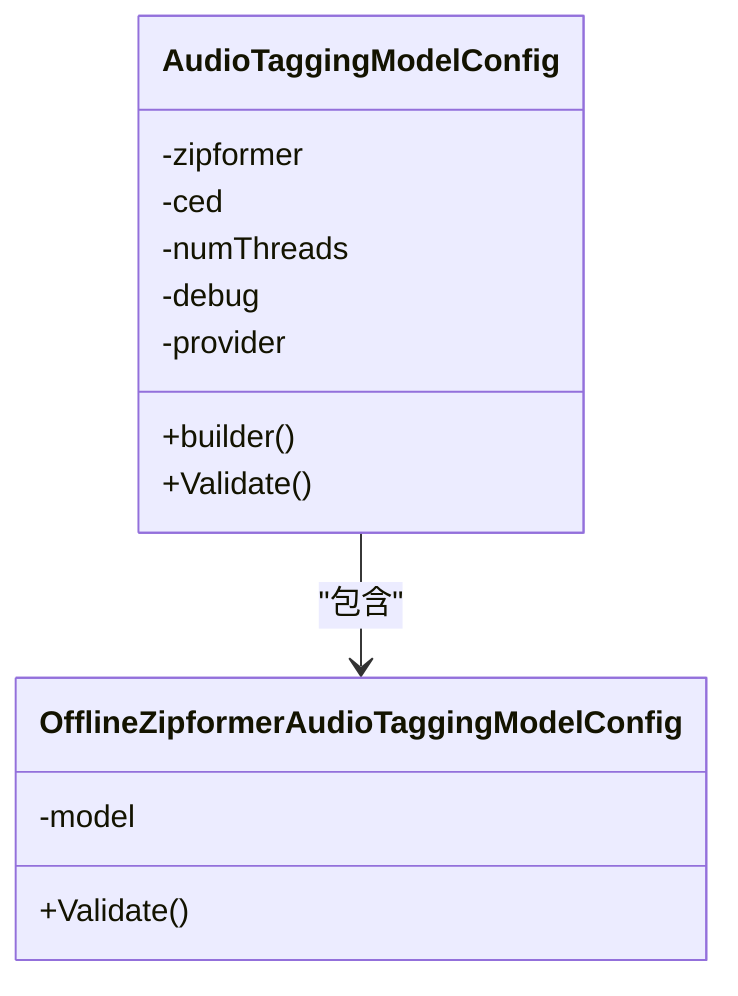
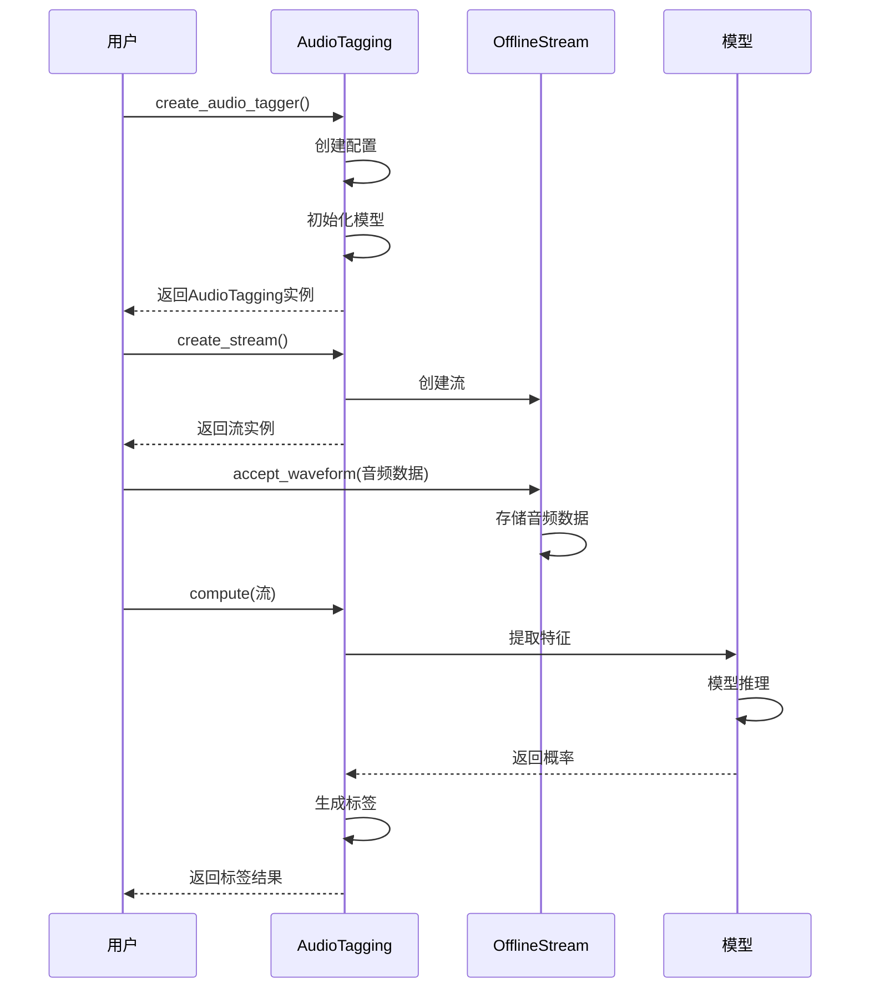
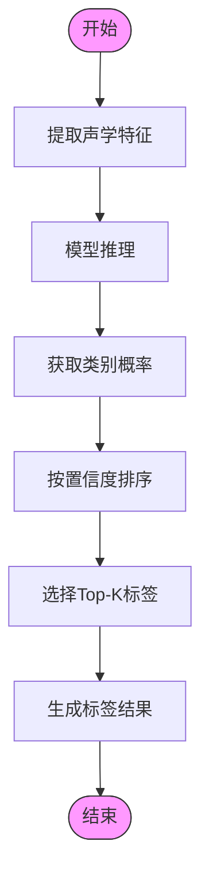
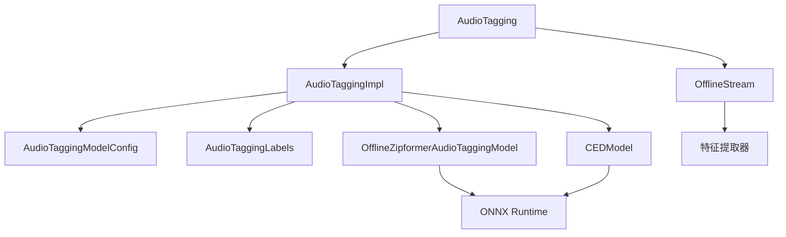

# 音频标签示例

<cite>
**本文档中引用的文件**   
- [audio-tagging-from-a-file.py](file://python-api-examples/audio-tagging-from-a-file.py)
- [audio-tagging-from-a-file-ced.py](file://python-api-examples/audio-tagging-from-a-file-ced.py)
- [AudioTaggingConfig.java](file://sherpa-onnx/java-api/src/main/java/com/k2fsa/sherpa/onnx/AudioTaggingConfig.java)
- [AudioTaggingModelConfig.java](file://sherpa-onnx/java-api/src/main/java/com/k2fsa/sherpa/onnx/AudioTaggingModelConfig.java)
- [audio-tagging-impl.cc](file://sherpa-onnx/csrc/audio-tagging-impl.cc)
- [audio-tagging-zipformer-impl.h](file://sherpa-onnx/csrc/audio-tagging-zipformer-impl.h)
- [audio-tagging-ced-impl.h](file://sherpa-onnx/csrc/audio-tagging-ced-impl.h)
- [audio-tagging-label-file.h](file://sherpa-onnx/csrc/audio-tagging-label-file.h)
- [offline-zipformer-audio-tagging-model-config.h](file://sherpa-onnx/csrc/offline-zipformer-audio-tagging-model-config.h)
- [audio-tagging.cc](file://sherpa-onnx/python/csrc/audio-tagging.cc)
</cite>

## 目录
1. [引言](#引言)
2. [项目结构](#项目结构)
3. [核心组件](#核心组件)
4. [架构概述](#架构概述)
5. [详细组件分析](#详细组件分析)
6. [依赖分析](#依赖分析)
7. [性能考虑](#性能考虑)
8. [故障排除指南](#故障排除指南)
9. [结论](#结论)

## 引言
本文档详细介绍了sherpa-onnx项目中音频标签示例的实现，重点分析了AudioTagging功能的实现机制。文档全面解释了如何使用不同模型（如Zipformer和CED）进行音频分类，以及如何配置AudioTaggingModelConfig和处理标签输出结果。同时，文档还展示了从音频文件提取声学特征并进行分类的完整流程，解释了标签置信度分数的计算方法和多标签处理策略，并提供了模型选择建议和准确率评估方法。

## 项目结构
sherpa-onnx项目包含多个API示例，其中音频标签示例主要分布在python-api-examples目录中。项目支持多种编程语言的API，包括Python、Java、C++等，为音频标签功能提供了丰富的使用示例。

**Diagram sources**
- [python-api-examples](file://python-api-examples)
- [java-api-examples](file://java-api-examples)
- [cxx-api-examples](file://cxx-api-examples)
- [dart-api-examples](file://dart-api-examples)

**Section sources**
- [project_structure](file://project_structure)

## 核心组件
音频标签示例的核心组件包括AudioTaggingConfig、AudioTaggingModelConfig和AudioEvent等类。这些组件共同实现了音频分类功能，支持使用Zipformer和CED两种不同的模型进行音频标签预测。

**Section sources**
- [AudioTaggingConfig.java](file://sherpa-onnx/java-api/src/main/java/com/k2fsa/sherpa/onnx/AudioTaggingConfig.java)
- [AudioTaggingModelConfig.java](file://sherpa-onnx/java-api/src/main/java/com/k2fsa/sherpa/onnx/AudioTaggingModelConfig.java)
- [audio-tagging.cc](file://sherpa-onnx/python/csrc/audio-tagging.cc)

## 架构概述
音频标签功能的架构基于工厂模式和策略模式，通过AudioTaggingImpl的派生类实现不同模型的具体功能。系统根据配置选择合适的模型实现，统一的接口使得不同模型的切换变得简单。

**Diagram sources**
- [audio-tagging-impl.cc](file://sherpa-onnx/csrc/audio-tagging-impl.cc)
- [audio-tagging-zipformer-impl.h](file://sherpa-onnx/csrc/audio-tagging-zipformer-impl.h)
- [audio-tagging-ced-impl.h](file://sherpa-onnx/csrc/audio-tagging-ced-impl.h)

## 详细组件分析

### AudioTagging配置分析
AudioTaggingConfig类负责管理音频标签功能的配置，包括模型配置、标签文件路径和top-k参数。该类采用构建器模式，提供了灵活的配置方式。

**Diagram sources**
- [AudioTaggingConfig.java](file://sherpa-onnx/java-api/src/main/java/com/k2fsa/sherpa/onnx/AudioTaggingConfig.java)

**Section sources**
- [AudioTaggingConfig.java](file://sherpa-onnx/java-api/src/main/java/com/k2fsa/sherpa/onnx/AudioTaggingConfig.java)

### AudioTagging模型配置分析
AudioTaggingModelConfig类管理音频标签模型的具体配置，支持Zipformer和CED两种模型。该类通过互斥的方式选择模型，确保每次只能使用一种模型。

**Diagram sources**
- [AudioTaggingModelConfig.java](file://sherpa-onnx/java-api/src/main/java/com/k2fsa/sherpa/onnx/AudioTaggingModelConfig.java)
- [offline-zipformer-audio-tagging-model-config.h](file://sherpa-onnx/csrc/offline-zipformer-audio-tagging-model-config.h)

**Section sources**
- [AudioTaggingModelConfig.java](file://sherpa-onnx/java-api/src/main/java/com/k2fsa/sherpa/onnx/AudioTaggingModelConfig.java)

### 音频标签处理流程分析
音频标签处理流程从音频文件读取开始，经过特征提取、模型推理到结果生成的完整过程。系统首先读取音频文件，然后创建流对象，将音频数据送入模型进行推理，最后获取标签结果。

**Diagram sources**
- [audio-tagging-from-a-file.py](file://python-api-examples/audio-tagging-from-a-file.py)
- [audio-tagging-from-a-file-ced.py](file://python-api-examples/audio-tagging-from-a-file-ced.py)

**Section sources**
- [audio-tagging-from-a-file.py](file://python-api-examples/audio-tagging-from-a-file.py)
- [audio-tagging-from-a-file-ced.py](file://python-api-examples/audio-tagging-from-a-file-ced.py)

### 标签结果生成分析
标签结果生成过程涉及特征提取、模型推理和结果排序。系统首先从音频流中提取声学特征，然后使用模型进行推理得到各类别的概率，最后根据置信度排序生成top-k标签结果。

**Diagram sources**
- [audio-tagging-zipformer-impl.h](file://sherpa-onnx/csrc/audio-tagging-zipformer-impl.h)
- [audio-tagging-ced-impl.h](file://sherpa-onnx/csrc/audio-tagging-ced-impl.h)

**Section sources**
- [audio-tagging-zipformer-impl.h](file://sherpa-onnx/csrc/audio-tagging-zipformer-impl.h)
- [audio-tagging-ced-impl.h](file://sherpa-onnx/csrc/audio-tagging-ced-impl.h)

## 依赖分析
音频标签功能依赖于多个核心组件，包括模型加载、特征提取、ONNX运行时和标签文件处理等。这些组件通过清晰的接口进行交互，形成了一个松耦合的系统架构。

**Diagram sources**
- [audio-tagging-impl.cc](file://sherpa-onnx/csrc/audio-tagging-impl.cc)
- [audio-tagging-label-file.h](file://sherpa-onnx/csrc/audio-tagging-label-file.h)

**Section sources**
- [audio-tagging-impl.cc](file://sherpa-onnx/csrc/audio-tagging-impl.cc)
- [audio-tagging-label-file.h](file://sherpa-onnx/csrc/audio-tagging-label-file.h)

## 性能考虑
音频标签功能在性能方面进行了多项优化，包括多线程支持、CPU/GPU选择和模型量化等。用户可以通过配置参数优化性能表现。

**Section sources**
- [AudioTaggingModelConfig.java](file://sherpa-onnx/java-api/src/main/java/com/k2fsa/sherpa/onnx/AudioTaggingModelConfig.java)

## 故障排除指南
当音频标签功能出现问题时，可以从以下几个方面进行排查：模型文件路径是否正确、标签文件是否存在、音频格式是否支持、配置参数是否合理等。

**Section sources**
- [audio-tagging-impl.cc](file://sherpa-onnx/csrc/audio-tagging-impl.cc)
- [audio-tagging-zipformer-impl.h](file://sherpa-onnx/csrc/audio-tagging-zipformer-impl.h)

## 结论
sherpa-onnx的音频标签示例提供了一个完整且灵活的音频分类解决方案。通过支持Zipformer和CED两种模型，系统能够在不同场景下提供最佳的性能和准确率。配置系统的灵活性使得用户可以根据具体需求调整参数，而统一的API接口简化了不同模型之间的切换。整体架构设计合理，组件间耦合度低，便于维护和扩展。