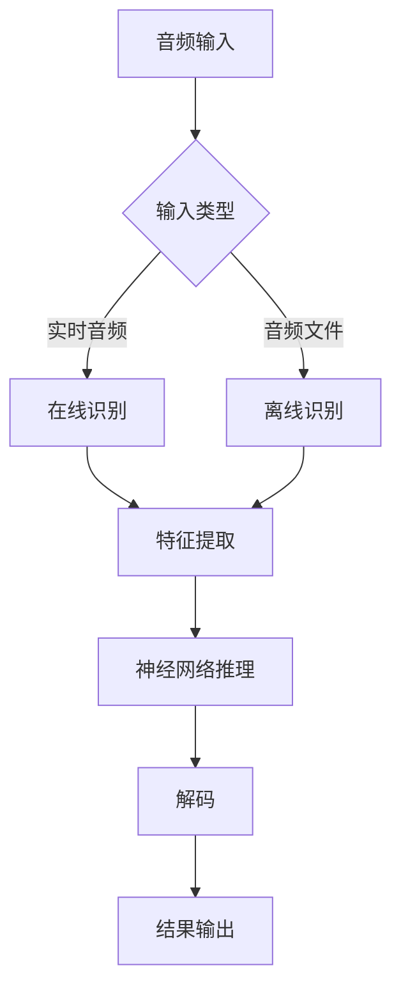
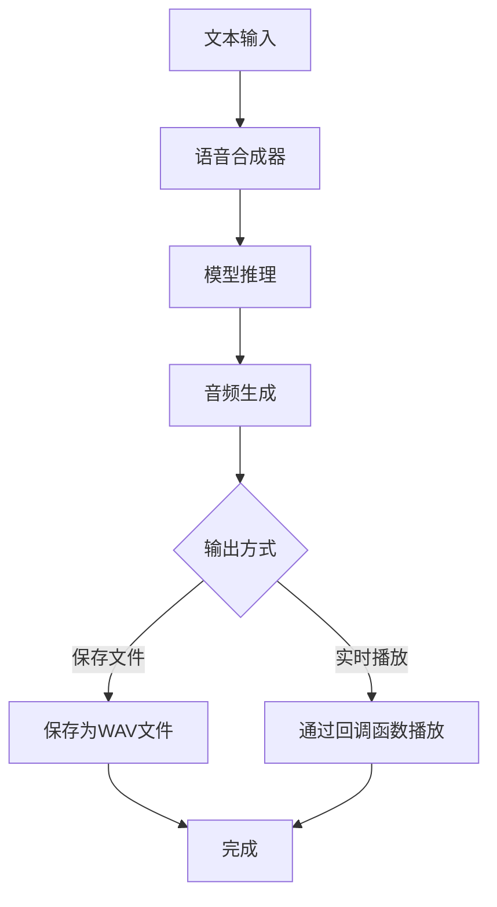
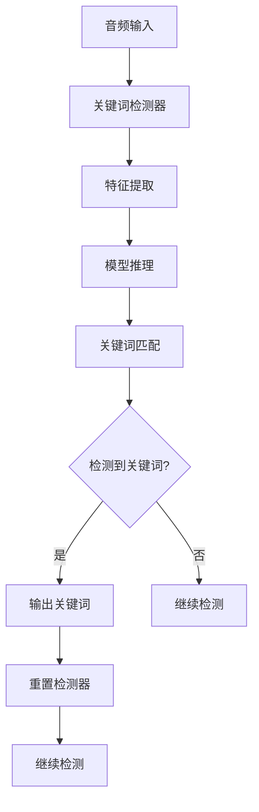
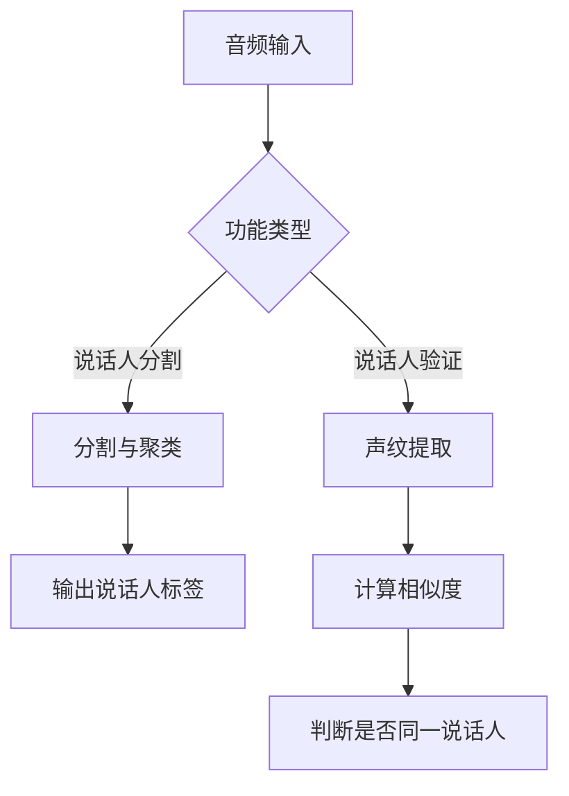
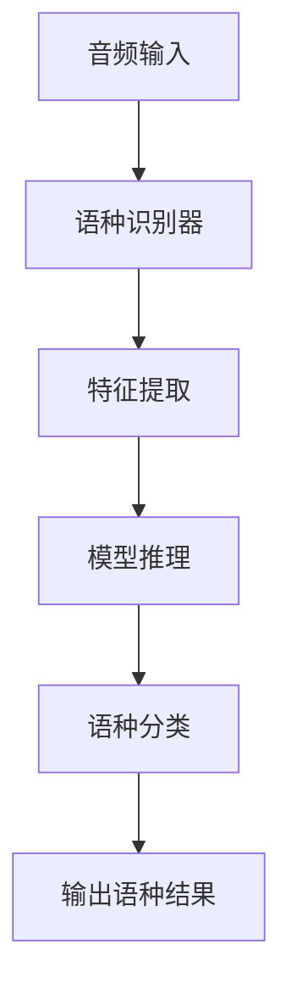
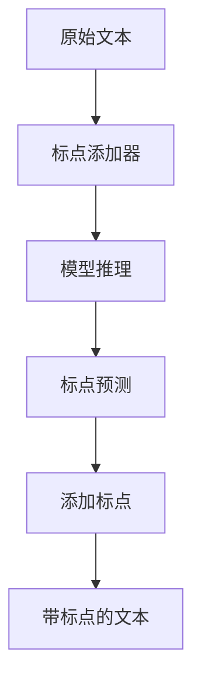
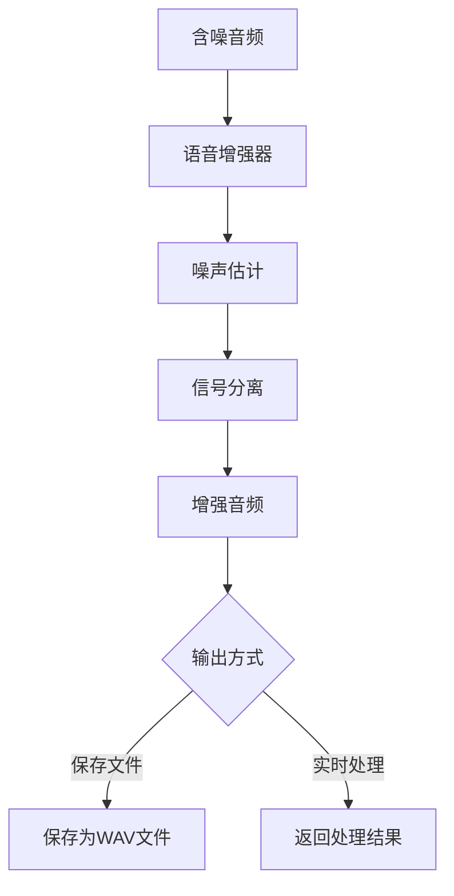
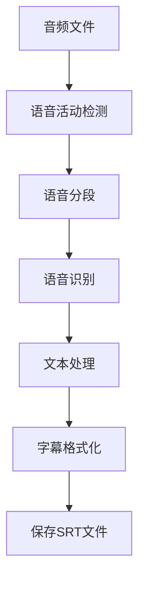
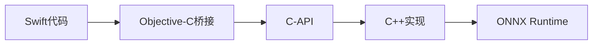

# Swift API 示例

<cite>
**本文档中引用的文件**  
- [SherpaOnnx-Bridging-Header.h](file://swift-api-examples/SherpaOnnx-Bridging-Header.h)
- [SherpaOnnx.swift](file://swift-api-examples/SherpaOnnx.swift)
- [decode-file.swift](file://swift-api-examples/decode-file.swift)
- [tts-kitten-en.swift](file://swift-api-examples/tts-kitten-en.swift)
- [keyword-spotting-from-file.swift](file://swift-api-examples/keyword-spotting-from-file.swift)
- [speaker-diarization.swift](file://swift-api-examples/speaker-diarization.swift)
- [spoken-language-identification.swift](file://swift-api-examples/spoken-language-identification.swift)
- [compute-speaker-embeddings.swift](file://swift-api-examples/compute-speaker-embeddings.swift)
- [generate-subtitles.swift](file://swift-api-examples/generate-subtitles.swift)
- [speech-enhancement-gtcrn.swift](file://swift-api-examples/speech-enhancement-gtcrn.swift)
- [add-punctuations.swift](file://swift-api-examples/add-punctuations.swift)
- [ViewController.swift](file://ios-swift/SherpaOnnx/SherpaOnnx/ViewController.swift)
- [Model.swift](file://ios-swift/SherpaOnnx/SherpaOnnx/Model.swift)
</cite>

## 目录
1. [简介](#简介)
2. [Swift API 概述](#swift-api-概述)
3. [语音识别示例](#语音识别示例)
4. [语音合成示例](#语音合成示例)
5. [关键词检测示例](#关键词检测示例)
6. [说话人识别示例](#说话人识别示例)
7. [语种识别示例](#语种识别示例)
8. [标点添加示例](#标点添加示例)
9. [语音增强示例](#语音增强示例)
10. [字幕生成示例](#字幕生成示例)
11. [iOS项目集成](#ios项目集成)
12. [Objective-C桥接机制](#objective-c桥接机制)
13. [平台优化建议](#平台优化建议)

## 简介
sherpa-onnx 是一个跨平台的语音识别和语音合成工具包，提供了丰富的Swift API示例，涵盖了语音识别、语音合成、关键词检测、说话人识别等多种语音处理功能。本文档详细解析了这些Swift API示例，包括代码实现、Swift语言特性应用、API调用方式以及在Xcode项目中的集成方法。

## Swift API 概述

Swift API通过C-API桥接层与底层C++实现进行交互，提供了面向对象的封装，使开发者能够以更符合Swift语言习惯的方式使用语音处理功能。API设计遵循Swift的命名规范和内存管理机制，同时保持了与底层C-API的兼容性。

**Swift API核心组件**
- **语音识别器**(SherpaOnnxRecognizer): 用于在线和离线语音识别
- **语音合成器**(SherpaOnnxOfflineTtsWrapper): 用于文本到语音合成
- **关键词检测器**(SherpaOnnxKeywordSpotterWrapper): 用于关键词检测
- **说话人识别器**(SherpaOnnxSpeakerEmbeddingExtractorWrapper): 用于说话人识别和声纹提取
- **语种识别器**(SherpaOnnxSpokenLanguageIdentificationWrapper): 用于识别语音的语种
- **标点添加器**(SherpaOnnxOfflinePunctuationWrapper): 用于为文本添加标点符号
- **语音增强器**(SherpaOnnxOfflineSpeechDenoiserWrapper): 用于语音降噪和增强

**Swift语言特性应用**
- 使用`extension`扩展AVFoundation框架中的音频缓冲区类，提供便捷的数组转换方法
- 使用`lazy var`实现延迟属性初始化，优化性能
- 使用`deinit`确保资源的正确释放，避免内存泄漏
- 使用`@main`属性包装器定义应用程序入口点
- 使用`UnsafePointer`和`OpaquePointer`与C-API进行互操作

**Section sources**
- [SherpaOnnx.swift](file://swift-api-examples/SherpaOnnx.swift#L1-L800)
- [SherpaOnnx-Bridging-Header.h](file://swift-api-examples/SherpaOnnx-Bridging-Header.h#L1-L10)

## 语音识别示例

语音识别是sherpa-onnx的核心功能之一，提供了在线和离线两种识别模式。在线识别适用于实时语音输入，而离线识别适用于预先录制的音频文件。



**在线语音识别流程**
1. 创建`AVAudioEngine`实例并配置音频输入
2. 安装音频输入tap，实时获取音频数据
3. 使用`AVAudioConverter`将音频数据转换为16kHz单声道格式
4. 将转换后的音频数据传递给`SherpaOnnxRecognizer`
5. 调用`acceptWaveform`方法接收音频数据
6. 调用`decode`方法进行解码
7. 调用`getResult`方法获取识别结果
8. 根据端点检测结果重置识别器

**离线语音识别流程**
1. 使用`AVAudioFile`读取音频文件
2. 验证音频格式（采样率、声道数、数据格式）
3. 将音频数据转换为`[Float]`数组
4. 创建`SherpaOnnxOfflineRecognizer`实例
5. 调用`decode`方法进行识别
6. 获取并处理识别结果

**Section sources**
- [decode-file.swift](file://swift-api-examples/decode-file.swift#L1-L103)
- [ViewController.swift](file://ios-swift/SherpaOnnx/SherpaOnnx/ViewController.swift#L1-L203)

## 语音合成示例

语音合成功能允许将文本转换为自然流畅的语音。sherpa-onnx提供了基于Kitten、Kokoro等模型的语音合成能力。



**语音合成关键特性**
- 支持多种语音模型（Kitten、Kokoro、Matcha等）
- 支持不同语言（中文、英文、中英混合）
- 支持语音速度调节
- 支持通过回调函数实时处理生成的音频样本
- 支持保存为WAV格式文件

**回调函数实现**
语音合成器支持通过回调函数实时处理生成的音频样本，这在需要实时播放或进一步处理音频时非常有用。回调函数使用`Unmanaged`来处理Swift对象的内存管理，确保在C回调中正确引用Swift对象。

```swift
let arg = Unmanaged<MyClass>.passUnretained(myClass).toOpaque()
let callback: TtsCallbackWithArg = { samples, n, arg in
    let o = Unmanaged<MyClass>.fromOpaque(arg!).takeUnretainedValue()
    var savedSamples: [Float] = []
    for index in 0..<n {
        savedSamples.append(samples![Int(index)])
    }
    o.playSamples(samples: savedSamples)
    return 1
}
```

**Section sources**
- [tts-kitten-en.swift](file://swift-api-examples/tts-kitten-en.swift#L1-L66)

## 关键词检测示例

关键词检测功能允许在连续语音流中检测预定义的关键词。这对于语音唤醒、命令识别等应用场景非常有用。



**关键词检测流程**
1. 准备关键词文件，每行包含一个关键词
2. 配置`SherpaOnnxKeywordSpotterConfig`，指定模型和关键词文件
3. 创建`SherpaOnnxKeywordSpotterWrapper`实例
4. 通过`acceptWaveform`方法输入音频数据
5. 调用`decode`方法进行解码
6. 调用`getResult`方法获取检测结果
7. 如果检测到关键词，调用`reset`方法重置检测器

**注意事项**
- 检测到关键词后必须调用`reset`方法，否则检测器会继续返回相同的关键词
- 关键词文件中的关键词应为模型词汇表中的词或词序列
- 可以通过`hotwordsScore`参数调整关键词的检测灵敏度

**Section sources**
- [keyword-spotting-from-file.swift](file://swift-api-examples/keyword-spotting-from-file.swift#L1-L87)

## 说话人识别示例

说话人识别功能包括说话人分割（Speaker Diarization）和说话人验证（Speaker Verification）。说话人分割用于确定音频中不同说话人的时段，而说话人验证用于比较两个语音样本是否来自同一说话人。



**说话人分割实现**
1. 配置`SherpaOnnxOfflineSpeakerDiarizationConfig`，指定分割模型和声纹提取模型
2. 创建`SherpaOnnxOfflineSpeakerDiarizationWrapper`实例
3. 读取音频文件并转换为`[Float]`数组
4. 调用`process`方法进行说话人分割
5. 处理返回的说话人分段结果

**说话人验证实现**
1. 使用`SherpaOnnxSpeakerEmbeddingExtractorWrapper`提取语音样本的声纹特征
2. 对两个语音样本分别提取声纹特征
3. 计算两个声纹特征的余弦相似度
4. 根据相似度阈值判断是否为同一说话人

**余弦相似度计算**
```swift
func cosineSimilarity(_ a: [Float], _ b: [Float]) -> Float {
    precondition(a.count == b.count, "向量必须具有相同长度")
    var dot: Float = 0
    var sumA: Float = 0
    var sumB: Float = 0
    
    for i in 0..<a.count {
        let x = a[i]
        let y = b[i]
        dot += x * y
        sumA += x * x
        sumB += y * y
    }
    
    let magA = sqrt(sumA)
    let magB = sqrt(sumB)
    
    guard magA > 0 && magB > 0 else { return 0 }
    return dot / (magA * magB)
}
```

**Section sources**
- [speaker-diarization.swift](file://swift-api-examples/speaker-diarization.swift#L1-L57)
- [compute-speaker-embeddings.swift](file://swift-api-examples/compute-speaker-embeddings.swift#L1-L65)

## 语种识别示例

语种识别功能用于自动识别语音所属的语言。这对于多语言环境下的语音处理非常有用。



**语种识别流程**
1. 配置`SherpaOnnxSpokenLanguageIdentificationConfig`，指定模型和参数
2. 创建`SherpaOnnxSpokenLanguageIdentificationWrapper`实例
3. 读取音频文件并转换为`[Float]`数组
4. 调用`decode`方法进行语种识别
5. 获取并处理识别结果

**支持的语种**
根据使用的模型不同，支持的语种也有所不同。Whisper模型通常支持多种语言，包括但不限于：
- 中文 (zh)
- 英文 (en)
- 日语 (ja)
- 法语 (fr)
- 西班牙语 (es)
- 德语 (de)

**Section sources**
- [spoken-language-identification.swift](file://swift-api-examples/spoken-language-identification.swift#L1-L58)

## 标点添加示例

标点添加功能用于为连续的文本添加适当的标点符号，提高文本的可读性。



**标点添加流程**
1. 配置`SherpaOnnxOfflinePunctuationConfig`，指定标点模型
2. 创建`SherpaOnnxOfflinePunctuationWrapper`实例
3. 调用`addPunct`方法为文本添加标点
4. 获取并处理添加标点后的文本

**应用场景**
- 语音识别结果后处理
- 文本编辑辅助
- 自动字幕生成

**Section sources**
- [add-punctuations.swift](file://swift-api-examples/add-punctuations.swift#L1-L32)

## 语音增强示例

语音增强功能用于改善音频质量，去除噪声和干扰。



**语音增强流程**
1. 配置`SherpaOnnxOfflineSpeechDenoiserConfig`，指定增强模型
2. 创建`SherpaOnnxOfflineSpeechDenoiserWrapper`实例
3. 读取音频文件并转换为`[Float]`数组
4. 调用`run`方法进行语音增强
5. 保存或处理增强后的音频

**技术特点**
- 基于深度学习的语音增强模型
- 支持实时和离线处理
- 可有效去除背景噪声、回声等干扰

**Section sources**
- [speech-enhancement-gtcrn.swift](file://swift-api-examples/speech-enhancement-gtcrn.swift#L1-L56)

## 字幕生成示例

字幕生成功能结合了语音活动检测（VAD）和语音识别技术，用于为视频或音频文件自动生成字幕。



**字幕生成流程**
1. 使用`AVAudioFile`读取音频文件
2. 配置并创建`SherpaOnnxVoiceActivityDetectorWrapper`实例
3. 将音频数据分块输入到VAD检测器
4. 调用`flush`方法完成所有音频的处理
5. 从VAD检测器获取语音分段
6. 对每个语音分段进行语音识别
7. 将识别结果格式化为SRT字幕格式
8. 保存为.srt文件

**SRT格式特点**
- 包含序号、时间码和文本三部分
- 时间码格式为"小时:分钟:秒,毫秒"
- 支持多语言字幕
- 广泛支持各种视频播放器

**Section sources**
- [generate-subtitles.swift](file://swift-api-examples/generate-subtitles.swift#L1-L239)

## iOS项目集成

在Xcode项目中集成sherpa-onnx Swift API需要以下步骤：

**项目配置**
1. 将sherpa-onnx的静态库或框架添加到项目中
2. 配置`Build Phases -> Link Binary With Libraries`，添加必要的依赖库
3. 配置`Build Settings -> Search Paths`，添加头文件和库文件的搜索路径
4. 在`Build Phases -> Copy Bundle Resources`中添加模型文件

**模型文件管理**
模型文件通常较大，不应直接包含在应用包中。建议通过以下方式管理：
- 在应用首次启动时从服务器下载模型
- 将模型存储在`Documents`目录中
- 实现模型版本管理和更新机制

**权限配置**
在`Info.plist`中添加必要的权限声明：
- `NSMicrophoneUsageDescription`: 使用麦克风的说明
- `NSPhotoLibraryUsageDescription`: 访问相册的说明（如果需要从相册导入音频）

**性能优化**
- 在后台线程执行语音识别等耗时操作
- 合理管理音频会话（AVAudioSession）
- 及时释放不再使用的资源
- 使用适当的音频缓冲区大小

**Section sources**
- [ViewController.swift](file://ios-swift/SherpaOnnx/SherpaOnnx/ViewController.swift#L1-L203)
- [Model.swift](file://ios-swift/SherpaOnnx/SherpaOnnx/Model.swift#L1-L106)

## Objective-C桥接机制

Swift API通过Objective-C桥接头文件与底层C-API进行交互，实现了Swift与C的互操作。



**桥接头文件**
`SherpaOnnx-Bridging-Header.h`是Objective-C桥接头文件，它包含了对C-API头文件的引用：
```c
#import "sherpa-onnx/c-api/c-api.h"
```

**字符串转换**
Swift中的`String`类型需要转换为C语言的`const char*`类型：
```swift
func toCPointer(_ s: String) -> UnsafePointer<Int8>! {
    let cs = (s as NSString).utf8String
    return UnsafePointer<Int8>(cs)
}
```

**内存管理**
桥接层需要正确处理内存管理：
- Swift对象通过`Unmanaged`包装，避免在C回调中发生内存管理问题
- C语言分配的内存需要在Swift中正确释放
- 使用`deinit`确保资源的正确清理

**函数指针与闭包**
Swift闭包可以转换为C函数指针，用于回调机制：
```swift
let callback: TtsCallbackWithArg = { samples, n, arg in
    // 处理生成的音频样本
    return 1
}
```

**Section sources**
- [SherpaOnnx-Bridging-Header.h](file://swift-api-examples/SherpaOnnx-Bridging-Header.h#L1-L10)
- [SherpaOnnx.swift](file://swift-api-examples/SherpaOnnx.swift#L1-L800)

## 平台优化建议

为了在iOS/macOS平台上获得最佳性能和用户体验，建议遵循以下优化策略：

**模型选择**
- 根据设备性能选择合适的模型大小
- 优先选择量化模型（如int8）以减少内存占用和提高推理速度
- 考虑使用专门为移动设备优化的模型

**线程管理**
- 将语音处理操作放在后台队列中执行
- 使用`DispatchQueue`管理并发操作
- 避免在主线程执行耗时的语音处理任务

```swift
let audioQueue = DispatchQueue(label: "com.sherpa.audio", qos: .userInitiated)
audioQueue.async {
    // 执行语音识别等操作
}
```

**内存优化**
- 及时释放不再使用的识别器和模型实例
- 使用对象池模式重用资源
- 监控内存使用情况，避免内存泄漏

**电池优化**
- 在不需要时暂停音频采集
- 调整音频采样率以平衡质量和功耗
- 实现自适应的语音活动检测，减少不必要的处理

**用户体验**
- 提供清晰的用户反馈（如录音指示、识别进度）
- 实现平滑的界面过渡和动画
- 支持离线模式，减少对网络的依赖
- 提供错误处理和恢复机制

**Section sources**
- [ViewController.swift](file://ios-swift/SherpaOnnx/SherpaOnnx/ViewController.swift#L1-L203)
- [SherpaOnnx.swift](file://swift-api-examples/SherpaOnnx.swift#L1-L800)