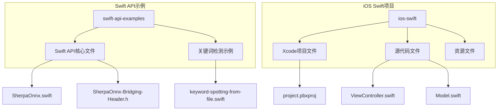
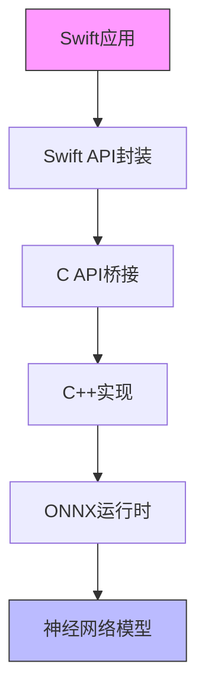
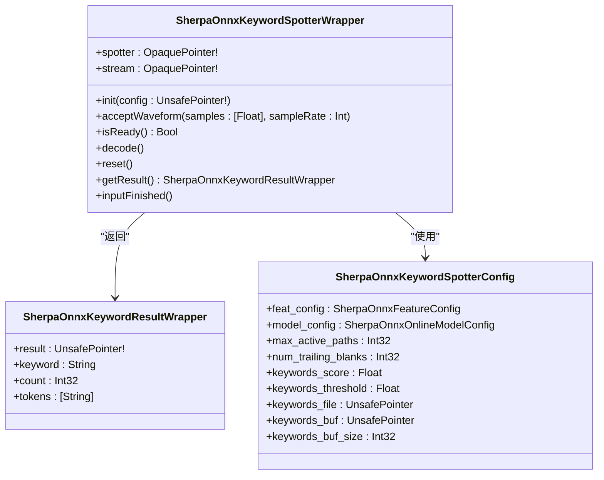
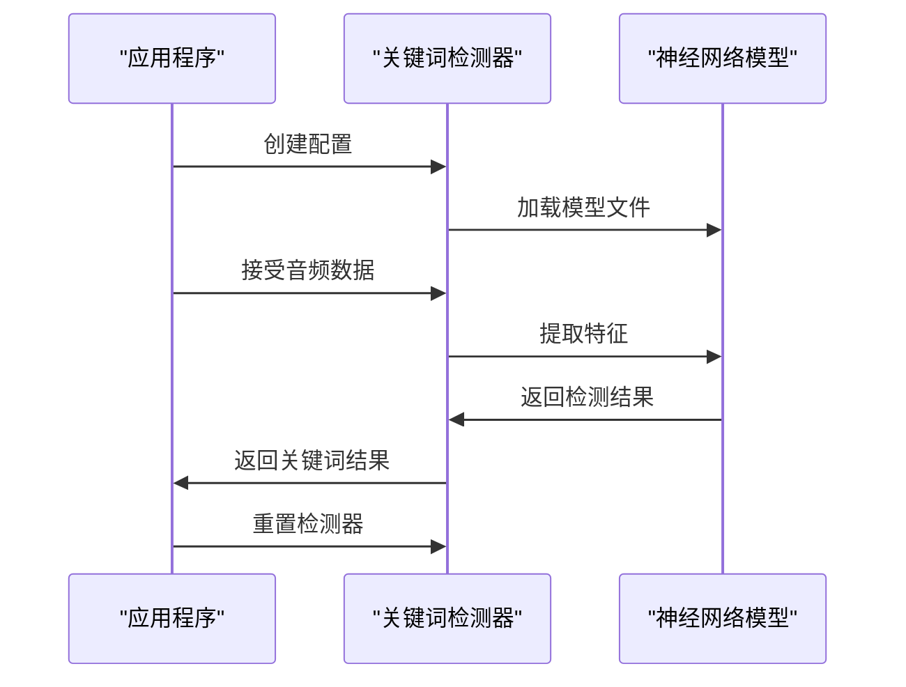
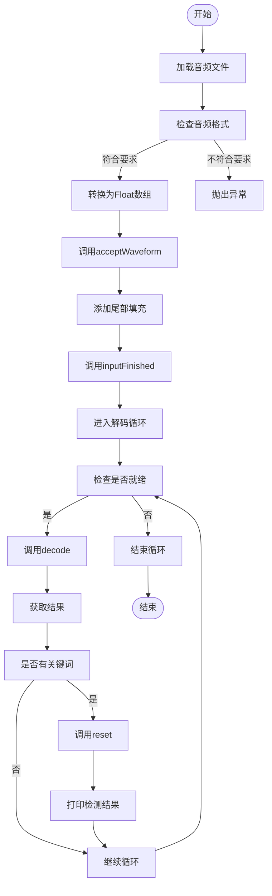
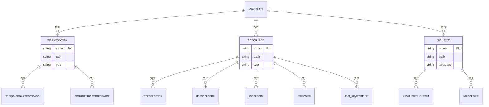
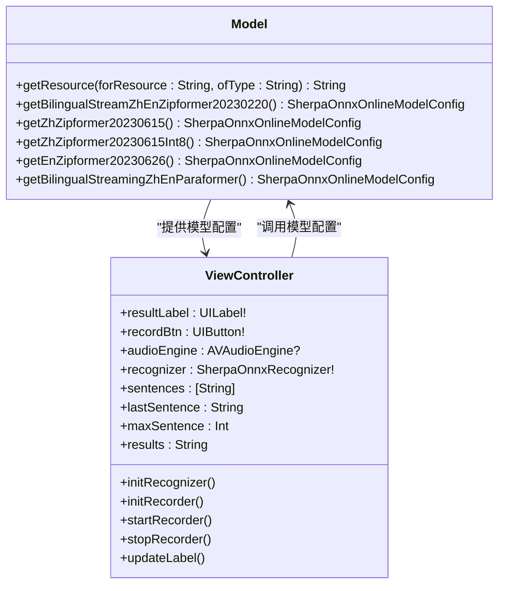
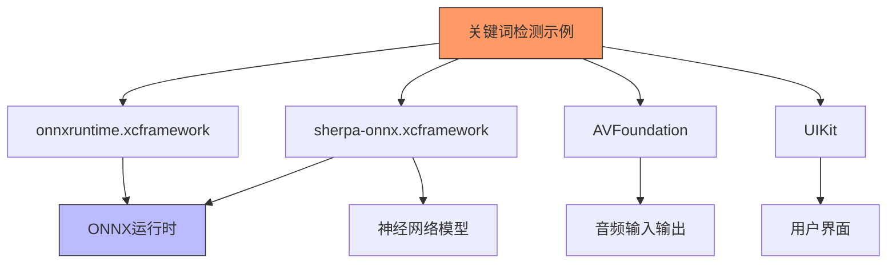

# 关键词检测示例

<cite>
**本文档引用的文件**   
- [keyword-spotting-from-file.swift](file://swift-api-examples/keyword-spotting-from-file.swift)
- [SherpaOnnx.swift](file://swift-api-examples/SherpaOnnx.swift)
- [SherpaOnnx-Bridging-Header.h](file://swift-api-examples/SherpaOnnx-Bridging-Header.h)
- [ViewController.swift](file://ios-swift/SherpaOnnx/SherpaOnnx/ViewController.swift)
- [Model.swift](file://ios-swift/SherpaOnnx/SherpaOnnx/Model.swift)
- [project.pbxproj](file://ios-swift/SherpaOnnx/SherpaOnnx.xcodeproj/project.pbxproj)
</cite>

## 目录
1. [简介](#简介)
2. [项目结构](#项目结构)
3. [核心组件](#核心组件)
4. [架构概述](#架构概述)
5. [详细组件分析](#详细组件分析)
6. [依赖分析](#依赖分析)
7. [性能考虑](#性能考虑)
8. [故障排除指南](#故障排除指南)
9. [结论](#结论)

## 简介
本示例文档详细介绍了如何使用sherpa-onnx Swift API在iOS/macOS平台上实现关键词检测功能。文档涵盖了从音频文件进行关键词检测的实现方式、API调用方法、Swift语言特性的应用以及在Xcode项目中的集成方法。关键词检测模型基于zipformer架构，能够高效地识别预定义的关键词，适用于语音助手、语音控制等应用场景。

## 项目结构
sherpa-onnx项目包含多个平台的示例代码，其中Swift API示例位于swift-api-examples目录下。iOS Swift示例项目位于ios-swift目录下，采用标准的Xcode项目结构。

**Diagram sources**
- [project.pbxproj](file://ios-swift/SherpaOnnx/SherpaOnnx.xcodeproj/project.pbxproj#L1-L632)
- [keyword-spotting-from-file.swift](file://swift-api-examples/keyword-spotting-from-file.swift#L1-L87)

**Section sources**
- [keyword-spotting-from-file.swift](file://swift-api-examples/keyword-spotting-from-file.swift#L1-L87)
- [project.pbxproj](file://ios-swift/SherpaOnnx/SherpaOnnx.xcodeproj/project.pbxproj#L1-L632)

## 核心组件
关键词检测示例的核心组件包括Swift API封装、C API桥接、模型配置和音频处理。Swift API通过桥接头文件调用底层C API，实现了对关键词检测功能的封装。

**Section sources**
- [SherpaOnnx.swift](file://swift-api-examples/SherpaOnnx.swift#L1-L1695)
- [SherpaOnnx-Bridging-Header.h](file://swift-api-examples/SherpaOnnx-Bridging-Header.h#L1-L10)

## 架构概述
sherpa-onnx Swift API采用分层架构，上层为Swift封装，中层为C API桥接，底层为C++实现。这种架构使得Swift代码能够高效地调用底层的神经网络模型进行关键词检测。

**Diagram sources**
- [SherpaOnnx-Bridging-Header.h](file://swift-api-examples/SherpaOnnx-Bridging-Header.h#L7)
- [SherpaOnnx.swift](file://swift-api-examples/SherpaOnnx.swift#L13-L1695)

## 详细组件分析

### 关键词检测实现分析
关键词检测实现主要包括模型配置、音频处理和检测流程三个部分。模型配置定义了关键词检测所需的模型文件和参数，音频处理负责将音频数据转换为模型可接受的格式，检测流程则实现了关键词检测的核心逻辑。

#### Swift API封装

**Diagram sources**
- [SherpaOnnx.swift](file://swift-api-examples/SherpaOnnx.swift#L1191-L1305)
- [SherpaOnnx.swift](file://swift-api-examples/SherpaOnnx.swift#L1232-L1253)

#### 关键词检测流程

**Diagram sources**
- [keyword-spotting-from-file.swift](file://swift-api-examples/keyword-spotting-from-file.swift#L15-L87)
- [SherpaOnnx.swift](file://swift-api-examples/SherpaOnnx.swift#L1256-L1305)

#### 音频处理流程

**Diagram sources**
- [keyword-spotting-from-file.swift](file://swift-api-examples/keyword-spotting-from-file.swift#L50-L87)
- [SherpaOnnx.swift](file://swift-api-examples/SherpaOnnx.swift#L1278-L1304)

**Section sources**
- [keyword-spotting-from-file.swift](file://swift-api-examples/keyword-spotting-from-file.swift#L15-L87)
- [SherpaOnnx.swift](file://swift-api-examples/SherpaOnnx.swift#L1191-L1305)

### iOS项目集成分析
iOS项目集成主要包括Xcode项目配置、模型文件管理和用户界面设计。Xcode项目需要正确配置框架依赖，模型文件需要作为资源文件添加到项目中，用户界面则通过Storyboard进行设计。

#### Xcode项目配置

**Diagram sources**
- [project.pbxproj](file://ios-swift/SherpaOnnx/SherpaOnnx.xcodeproj/project.pbxproj#L1-L632)
- [Model.swift](file://ios-swift/SherpaOnnx/SherpaOnnx/Model.swift#L1-L106)

#### 模型配置管理

**Diagram sources**
- [Model.swift](file://ios-swift/SherpaOnnx/SherpaOnnx/Model.swift#L1-L106)
- [ViewController.swift](file://ios-swift/SherpaOnnx/SherpaOnnx/ViewController.swift#L23-L203)

**Section sources**
- [Model.swift](file://ios-swift/SherpaOnnx/SherpaOnnx/Model.swift#L1-L106)
- [ViewController.swift](file://ios-swift/SherpaOnnx/SherpaOnnx/ViewController.swift#L23-L203)

## 依赖分析
关键词检测示例依赖于多个组件，包括ONNX运行时、音频处理框架和Swift语言特性。这些依赖关系确保了关键词检测功能的正常运行。

**Diagram sources**
- [project.pbxproj](file://ios-swift/SherpaOnnx/SherpaOnnx.xcodeproj/project.pbxproj#L63-L87)
- [ViewController.swift](file://ios-swift/SherpaOnnx/SherpaOnnx/ViewController.swift#L8-L9)

## 性能考虑
在iOS/macOS平台上使用关键词检测功能时，需要考虑以下几个性能优化建议：

1. **模型加载策略**：将模型文件作为应用资源打包，避免运行时下载，提高启动速度。
2. **内存管理**：及时释放不再使用的音频缓冲区和模型实例，避免内存泄漏。
3. **线程优化**：将计算密集型的模型推理操作放在后台线程执行，避免阻塞主线程。
4. **模型选择**：根据设备性能选择合适的模型大小，平衡准确率和性能。
5. **音频采样率**：使用16kHz采样率，这是大多数语音模型的标准输入。

## 故障排除指南
在使用关键词检测功能时，可能会遇到以下常见问题：

1. **模型文件找不到**：确保模型文件已正确添加到Xcode项目的"Copy Bundle Resources"构建阶段。
2. **音频格式不匹配**：确保输入音频的采样率为16kHz，单声道，PCM浮点格式。
3. **性能问题**：如果检测速度过慢，尝试使用量化版本的模型或减少模型复杂度。
4. **关键词检测不准确**：检查关键词文件格式是否正确，关键词之间用换行符分隔。
5. **内存不足**：对于大型模型，考虑使用流式处理而不是一次性加载整个音频文件。

**Section sources**
- [Model.swift](file://ios-swift/SherpaOnnx/SherpaOnnx/Model.swift#L5-L10)
- [ViewController.swift](file://ios-swift/SherpaOnnx/SherpaOnnx/ViewController.swift#L115-L119)

## 结论
sherpa-onnx Swift API提供了强大而灵活的关键词检测功能，适用于各种iOS/macOS应用场景。通过合理的项目配置和性能优化，开发者可以轻松地将关键词检测功能集成到自己的应用中。示例代码展示了从音频文件进行关键词检测的完整流程，为开发者提供了清晰的实现参考。