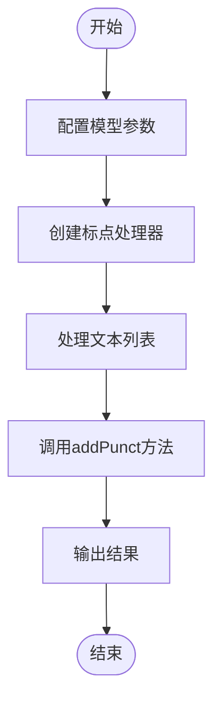
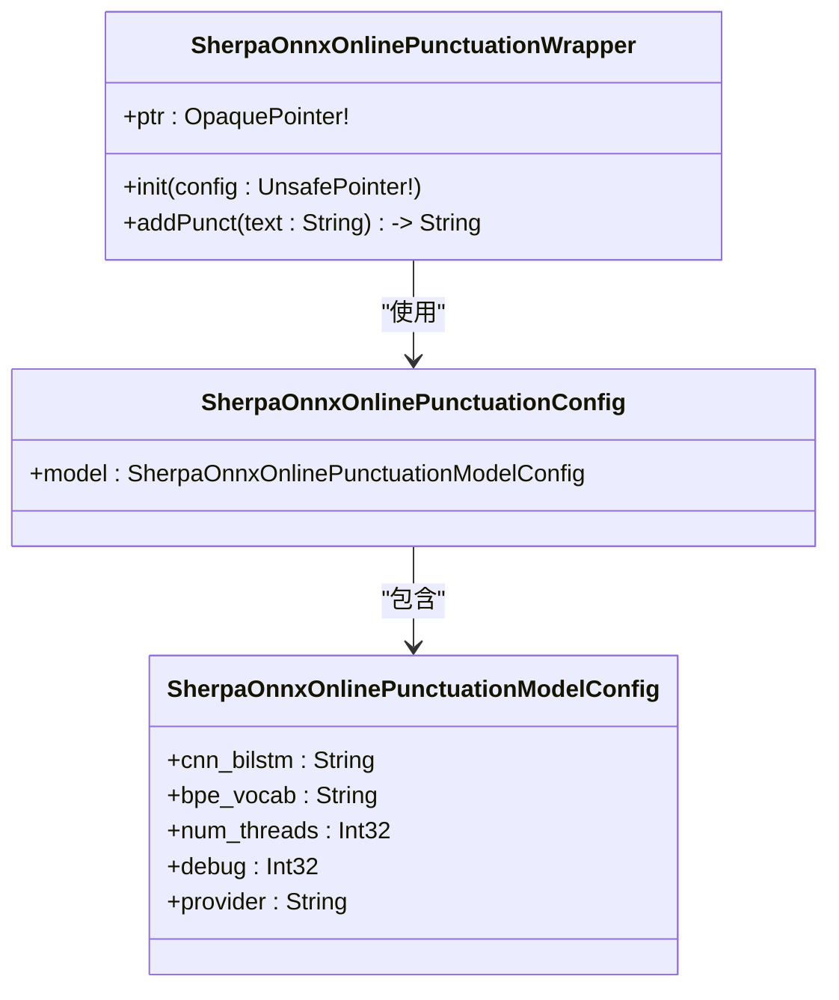
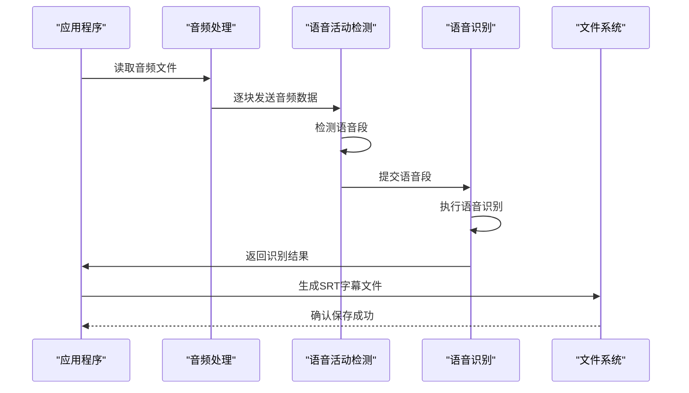
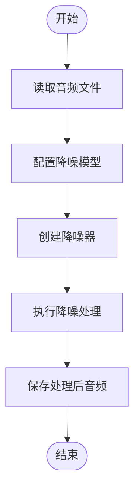
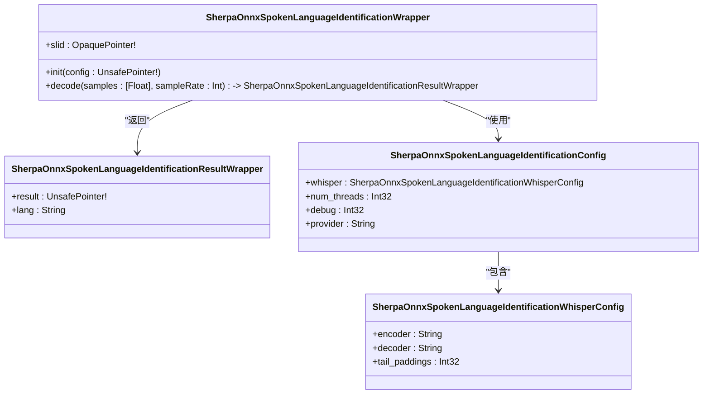
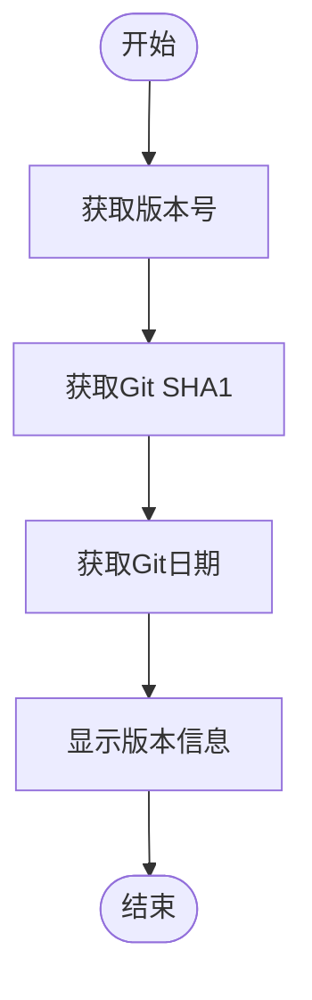

# 其他功能示例

<cite>
**本文档中引用的文件**   
- [add-punctuations.swift](file://swift-api-examples/add-punctuations.swift)
- [generate-subtitles.swift](file://swift-api-examples/generate-subtitles.swift)
- [speech-enhancement-gtcrn.swift](file://swift-api-examples/speech-enhancement-gtcrn.swift)
- [spoken-language-identification.swift](file://swift-api-examples/spoken-language-identification.swift)
- [test-version.swift](file://swift-api-examples/test-version.swift)
- [SherpaOnnx.swift](file://swift-api-examples/SherpaOnnx.swift)
- [SherpaOnnx-Bridging-Header.h](file://swift-api-examples/SherpaOnnx-Bridging-Header.h)
</cite>

## 目录
1. [简介](#简介)
2. [文本加标点功能](#文本加标点功能)
3. [字幕生成功能](#字幕生成功能)
4. [语音增强功能](#语音增强功能)
5. [语种识别功能](#语种识别功能)
6. [版本测试功能](#版本测试功能)
7. [iOS/macOS平台集成与优化](#iosmacos平台集成与优化)
8. [结论](#结论)

## 简介
sherpa-onnx 是一个功能强大的语音处理框架，提供了丰富的Swift API，支持多种语音处理功能。本文档详细介绍了文本加标点、字幕生成、语音增强、语种识别和版本测试等功能的实现方式和API调用方法。通过Swift语言特性，这些功能可以轻松集成到Xcode项目中，适用于iOS和macOS平台。文档还解释了各项功能的工作原理、配置参数和应用场景，并提供了平台特有的优化建议。

**Section sources**
- [SherpaOnnx.swift](file://swift-api-examples/SherpaOnnx.swift#L1-L1695)
- [SherpaOnnx-Bridging-Header.h](file://swift-api-examples/SherpaOnnx-Bridging-Header.h#L1-L10)

## 文本加标点功能
文本加标点功能通过使用预训练的Transformer模型，为输入的文本自动添加适当的标点符号。该功能支持离线和在线两种模式，适用于不同场景。

### 离线加标点实现
离线加标点功能使用`sherpaOnnxOfflinePunctuationModelConfig`配置模型参数，包括模型路径、线程数和调试级别。通过`SherpaOnnxOfflinePunctuationWrapper`类创建标点处理器，并调用`addPunct`方法为文本添加标点。

**Diagram sources**
- [add-punctuations.swift](file://swift-api-examples/add-punctuations.swift#L1-L32)

### 在线加标点实现
在线加标点功能使用`sherpaOnnxOnlinePunctuationModelConfig`配置模型参数，支持实时文本处理。与离线模式相比，在线模式更适合流式处理场景。

**Diagram sources**
- [add-punctuation-online.swift](file://swift-api-examples/add-punctuation-online.swift#L1-L36)
- [SherpaOnnx.swift](file://swift-api-examples/SherpaOnnx.swift#L1356-L1400)

**Section sources**
- [add-punctuations.swift](file://swift-api-examples/add-punctuations.swift#L1-L32)
- [add-punctuation-online.swift](file://swift-api-examples/add-punctuation-online.swift#L1-L36)
- [SherpaOnnx.swift](file://swift-api-examples/SherpaOnnx.swift#L1307-L1400)

## 字幕生成功能
字幕生成功能结合语音活动检测（VAD）和语音识别技术，为音频文件生成SRT格式的字幕文件。该功能首先使用VAD检测语音段，然后对每个语音段进行语音识别，最后将结果格式化为字幕文件。

### 字幕生成流程
字幕生成流程包括音频文件读取、语音段检测、语音识别和字幕文件生成四个主要步骤。通过`AVAudioFile`读取音频数据，使用`SherpaOnnxVoiceActivityDetectorWrapper`检测语音段，调用`SherpaOnnxOfflineRecognizer`进行语音识别，最后将结果写入SRT文件。

**Diagram sources**
- [generate-subtitles.swift](file://swift-api-examples/generate-subtitles.swift#L1-L239)

### 配置参数说明
字幕生成功能支持多种配置参数，包括模型类型（Whisper或Paraformer）、采样率、特征维度等。用户可以根据具体需求选择合适的模型和参数。

**Section sources**
- [generate-subtitles.swift](file://swift-api-examples/generate-subtitles.swift#L1-L239)

## 语音增强功能
语音增强功能使用GT-CRN（Gated Temporal Convolutional Recurrent Network）模型对音频进行降噪处理，提高语音质量。该功能特别适用于嘈杂环境下的语音处理。

### 语音增强实现
语音增强功能通过`sherpaOnnxOfflineSpeechDenoiserConfig`配置模型参数，使用`SherpaOnnxOfflineSpeechDenoiserWrapper`类执行降噪处理。处理后的音频可以保存为WAV文件。

**Diagram sources**
- [speech-enhancement-gtcrn.swift](file://swift-api-examples/speech-enhancement-gtcrn.swift#L1-L56)

### 性能优化建议
在iOS/macOS平台上使用语音增强功能时，建议使用`AVAudioPCMBuffer`进行音频数据处理，以提高内存效率。同时，合理设置线程数可以平衡处理速度和系统资源占用。

**Section sources**
- [speech-enhancement-gtcrn.swift](file://swift-api-examples/speech-enhancement-gtcrn.swift#L1-L56)
- [SherpaOnnx.swift](file://swift-api-examples/SherpaOnnx.swift#L1586-L1682)

## 语种识别功能
语种识别功能使用Whisper模型识别音频中的语言类型，支持多种语言的检测。该功能对于多语言环境下的语音处理非常有用。

### 语种识别实现
语种识别功能通过`sherpaOnnxSpokenLanguageIdentificationConfig`配置模型参数，使用`SherpaOnnxSpokenLanguageIdentificationWrapper`类执行语言识别。识别结果包含检测到的语言代码。

**Diagram sources**
- [spoken-language-identification.swift](file://swift-api-examples/spoken-language-identification.swift#L1-L58)
- [SherpaOnnx.swift](file://swift-api-examples/SherpaOnnx.swift#L1108-L1157)

### 应用场景
语种识别功能可以用于自动语言选择、多语言语音助手和跨语言通信等场景。通过准确识别语音语言，系统可以提供更个性化的服务。

**Section sources**
- [spoken-language-identification.swift](file://swift-api-examples/spoken-language-identification.swift#L1-L58)
- [SherpaOnnx.swift](file://swift-api-examples/SherpaOnnx.swift#L1108-L1157)

## 版本测试功能
版本测试功能提供了获取sherpa-onnx库版本信息的API，包括版本号、Git SHA1和提交日期。这对于调试和版本管理非常有用。

### 版本信息获取
通过调用`getSherpaOnnxVersion()`、`getSherpaOnnxGitSha1()`和`getSherpaOnnxGitDate()`函数，可以获取库的版本信息。

**Diagram sources**
- [test-version.swift](file://swift-api-examples/test-version.swift#L1-L16)

**Section sources**
- [test-version.swift](file://swift-api-examples/test-version.swift#L1-L16)
- [SherpaOnnx.swift](file://swift-api-examples/SherpaOnnx.swift#L1684-L1694)

## iOS/macOS平台集成与优化
在iOS和macOS平台上集成sherpa-onnx功能时，需要考虑资源管理和性能调优。

### Xcode项目集成
将sherpa-onnx Swift API集成到Xcode项目中，需要添加必要的桥接头文件和库依赖。通过`SherpaOnnx-Bridging-Header.h`文件，可以将C API桥接到Swift代码中。

### 资源管理建议
- 使用`AVAudioFile`和`AVAudioPCMBuffer`进行高效的音频数据处理
- 合理管理模型加载和卸载，避免内存泄漏
- 使用适当的线程数平衡性能和资源占用

### 性能调优策略
- 预加载常用模型以减少延迟
- 使用后台线程执行计算密集型任务
- 优化音频数据处理流程，减少内存拷贝

**Section sources**
- [SherpaOnnx-Bridging-Header.h](file://swift-api-examples/SherpaOnnx-Bridging-Header.h#L1-L10)
- [SherpaOnnx.swift](file://swift-api-examples/SherpaOnnx.swift#L1-L1695)

## 结论
sherpa-onnx Swift API提供了丰富的语音处理功能，包括文本加标点、字幕生成、语音增强、语种识别和版本测试等。通过详细的API文档和示例代码，开发者可以轻松地将这些功能集成到iOS和macOS应用中。合理的资源管理和性能调优策略可以确保应用在各种设备上都能提供流畅的用户体验。