# 语音合成示例

<cite>
**本文档引用的文件**   
- [tts-kitten-en.swift](file://swift-api-examples/tts-kitten-en.swift)
- [tts-kokoro-en.swift](file://swift-api-examples/tts-kokoro-en.swift)
- [tts-kokoro-zh-en.swift](file://swift-api-examples/tts-kokoro-zh-en.swift)
- [tts-matcha-en.swift](file://swift-api-examples/tts-matcha-en.swift)
- [tts-matcha-zh.swift](file://swift-api-examples/tts-matcha-zh.swift)
- [tts-vits.swift](file://swift-api-examples/tts-vits.swift)
- [SherpaOnnx.swift](file://swift-api-examples/SherpaOnnx.swift)
- [SherpaOnnx-Bridging-Header.h](file://swift-api-examples/SherpaOnnx-Bridging-Header.h)
- [ContentView.swift](file://ios-swiftui/SherpaOnnxTts/SherpaOnnxTts/ContentView.swift)
- [project.pbxproj](file://ios-swiftui/SherpaOnnxTts/SherpaOnnxTts.xcodeproj/project.pbxproj)
</cite>

## 目录
1. [简介](#简介)
2. [项目结构](#项目结构)
3. [核心组件](#核心组件)
4. [TTS模型实现详解](#tts模型实现详解)
5. [Swift语言特性应用](#swift语言特性应用)
6. [Xcode项目集成](#xcode项目集成)
7. [音频输出配置与优化](#音频输出配置与优化)
8. [结论](#结论)

## 简介
本文档详细介绍了sherpa-onnx Swift API语音合成示例的实现方式和调用方法。文档全面解释了Kitten、Kokoro、Matcha和VITS等多种TTS模型的实现原理和调用方法，提供了详细的代码解析，说明了Swift语言特性的应用和API调用方式。同时，文档展示了如何在Xcode项目中集成和使用这些语音合成示例，解释了不同TTS模型的音色特点、语言支持和性能差异，并提供了iOS/macOS平台特有的音频输出配置和优化建议。

## 项目结构
sherpa-onnx项目包含多个平台的示例代码，其中Swift API示例位于`swift-api-examples`目录下。iOS SwiftUI示例位于`ios-swiftui/SherpaOnnxTts`目录下。项目结构清晰，便于开发者快速找到所需的示例代码和配置文件。

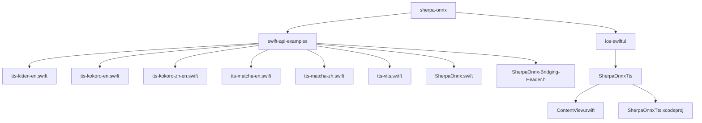

**图源**
- [tts-kitten-en.swift](file://swift-api-examples/tts-kitten-en.swift)
- [tts-kokoro-en.swift](file://swift-api-examples/tts-kokoro-en.swift)
- [tts-kokoro-zh-en.swift](file://swift-api-examples/tts-kokoro-zh-en.swift)
- [tts-matcha-en.swift](file://swift-api-examples/tts-matcha-en.swift)
- [tts-matcha-zh.swift](file://swift-api-examples/tts-matcha-zh.swift)
- [tts-vits.swift](file://swift-api-examples/tts-vits.swift)
- [SherpaOnnx.swift](file://swift-api-examples/SherpaOnnx.swift)
- [SherpaOnnx-Bridging-Header.h](file://swift-api-examples/SherpaOnnx-Bridging-Header.h)
- [ContentView.swift](file://ios-swiftui/SherpaOnnxTts/SherpaOnnxTts/ContentView.swift)
- [project.pbxproj](file://ios-swiftui/SherpaOnnxTts/SherpaOnnxTts.xcodeproj/project.pbxproj)

**节源**
- [tts-kitten-en.swift](file://swift-api-examples/tts-kitten-en.swift)
- [tts-kokoro-en.swift](file://swift-api-examples/tts-kokoro-en.swift)
- [tts-kokoro-zh-en.swift](file://swift-api-examples/tts-kokoro-zh-en.swift)
- [tts-matcha-en.swift](file://swift-api-examples/tts-matcha-en.swift)
- [tts-matcha-zh.swift](file://swift-api-examples/tts-matcha-zh.swift)
- [tts-vits.swift](file://swift-api-examples/tts-vits.swift)
- [SherpaOnnx.swift](file://swift-api-examples/SherpaOnnx.swift)
- [SherpaOnnx-Bridging-Header.h](file://swift-api-examples/SherpaOnnx-Bridging-Header.h)
- [ContentView.swift](file://ios-swiftui/SherpaOnnxTts/SherpaOnnxTts/ContentView.swift)
- [project.pbxproj](file://ios-swiftui/SherpaOnnxTts/SherpaOnnxTts.xcodeproj/project.pbxproj)

## 核心组件
sherpa-onnx Swift API的核心组件包括`SherpaOnnxOfflineTtsWrapper`类，该类封装了C API的调用，提供了简洁的Swift接口。`SherpaOnnxGeneratedAudioWrapper`类用于封装生成的音频数据，提供了保存音频文件的方法。`TtsCallbackWithArg`类型别名定义了回调函数的签名，用于在生成音频时进行实时处理。

**节源**
- [SherpaOnnx.swift](file://swift-api-examples/SherpaOnnx.swift)

## TTS模型实现详解
### Kitten模型
Kitten模型是一种轻量级的TTS模型，适用于资源受限的设备。在Swift中，通过`sherpaOnnxOfflineTtsKittenModelConfig`函数配置模型参数，包括模型文件、声音文件、标记文件和espeak-ng数据目录。

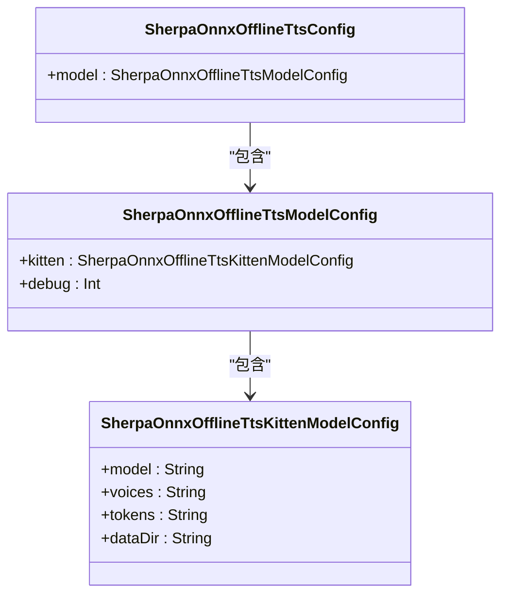

**图源**
- [tts-kitten-en.swift](file://swift-api-examples/tts-kitten-en.swift)

**节源**
- [tts-kitten-en.swift](file://swift-api-examples/tts-kitten-en.swift)

### Kokoro模型
Kokoro模型支持多语言语音合成，包括英语和中文。通过`sherpaOnnxOfflineTtsKokoroModelConfig`函数配置模型参数，包括模型文件、声音文件、标记文件、espeak-ng数据目录和词典文件。

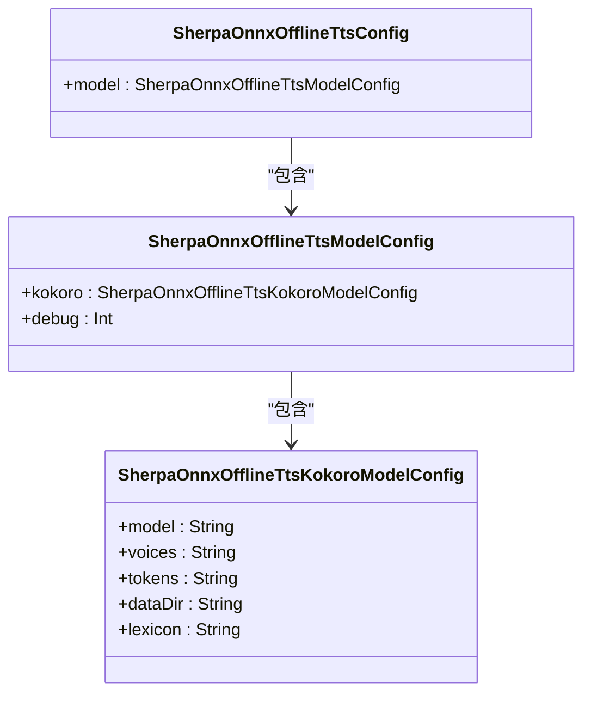

**图源**
- [tts-kokoro-en.swift](file://swift-api-examples/tts-kokoro-en.swift)
- [tts-kokoro-zh-en.swift](file://swift-api-examples/tts-kokoro-zh-en.swift)

**节源**
- [tts-kokoro-en.swift](file://swift-api-examples/tts-kokoro-en.swift)
- [tts-kokoro-zh-en.swift](file://swift-api-examples/tts-kokoro-zh-en.swift)

### Matcha模型
Matcha模型采用声学模型和声码器分离的架构，提供了高质量的语音合成。通过`sherpaOnnxOfflineTtsMatchaModelConfig`函数配置模型参数，包括声学模型文件、声码器文件、标记文件和espeak-ng数据目录。

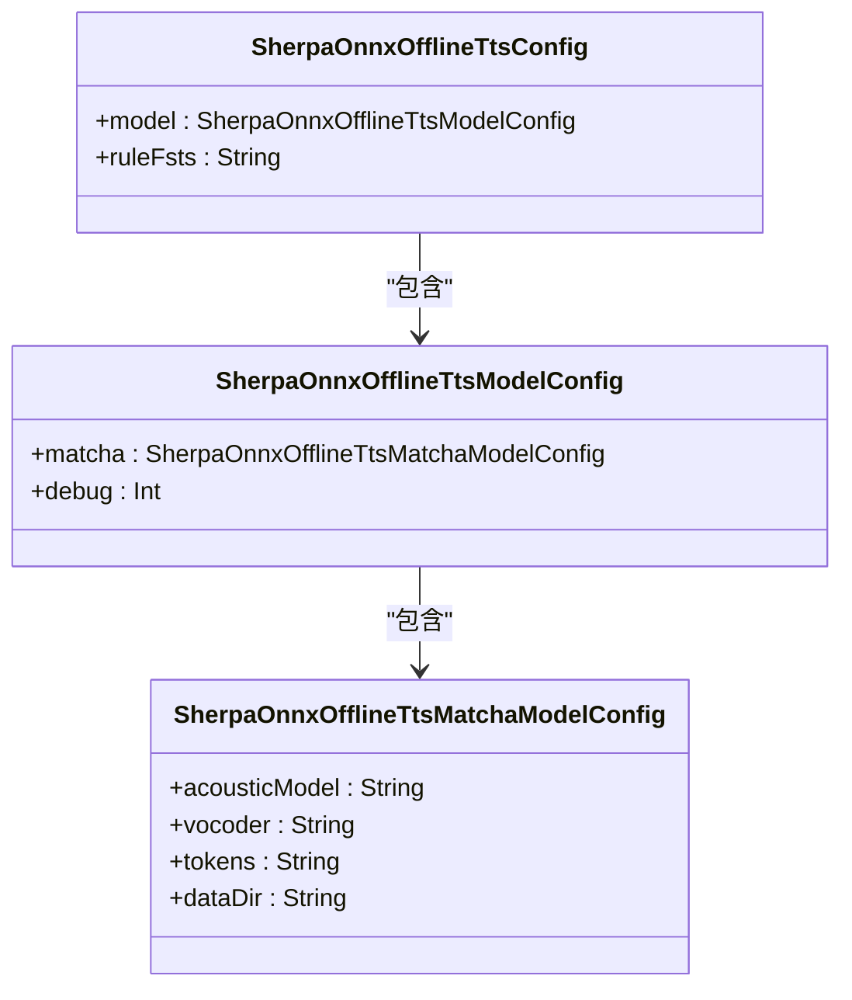

**图源**
- [tts-matcha-en.swift](file://swift-api-examples/tts-matcha-en.swift)
- [tts-matcha-zh.swift](file://swift-api-examples/tts-matcha-zh.swift)

**节源**
- [tts-matcha-en.swift](file://swift-api-examples/tts-matcha-en.swift)
- [tts-matcha-zh.swift](file://swift-api-examples/tts-matcha-zh.swift)

### VITS模型
VITS模型是一种端到端的语音合成模型，通过`sherpaOnnxOfflineTtsVitsModelConfig`函数配置模型参数，包括模型文件、标记文件和espeak-ng数据目录。

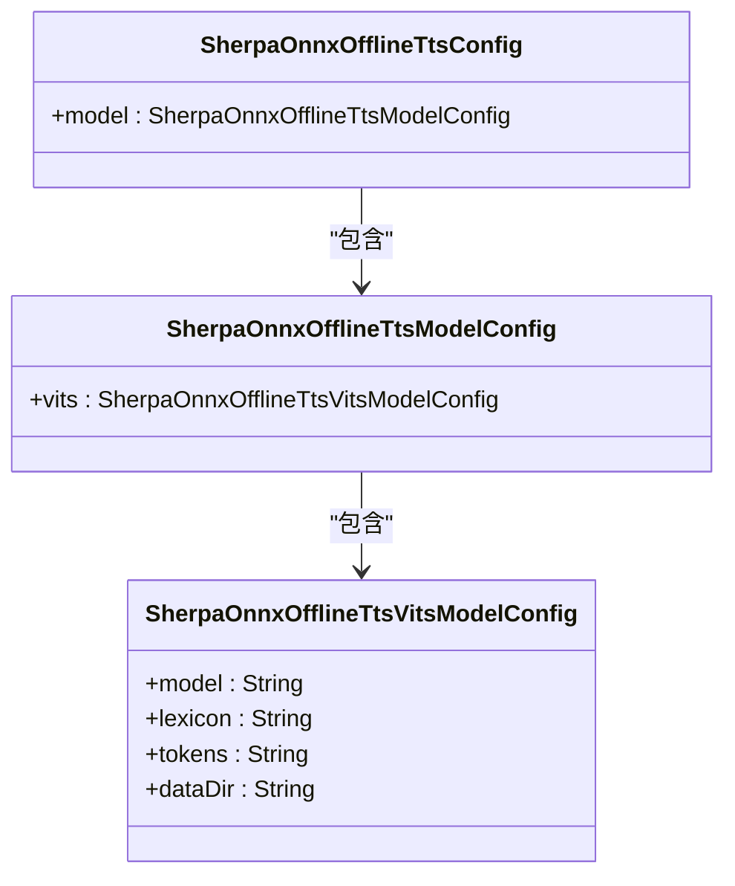

**图源**
- [tts-vits.swift](file://swift-api-examples/tts-vits.swift)

**节源**
- [tts-vits.swift](file://swift-api-examples/tts-vits.swift)

## Swift语言特性应用
### C API桥接
Swift通过`@_cdecl`属性和`UnsafePointer`类型与C API进行桥接。`SherpaOnnx-Bridging-Header.h`文件导入了C API头文件，使得Swift代码可以直接调用C函数。

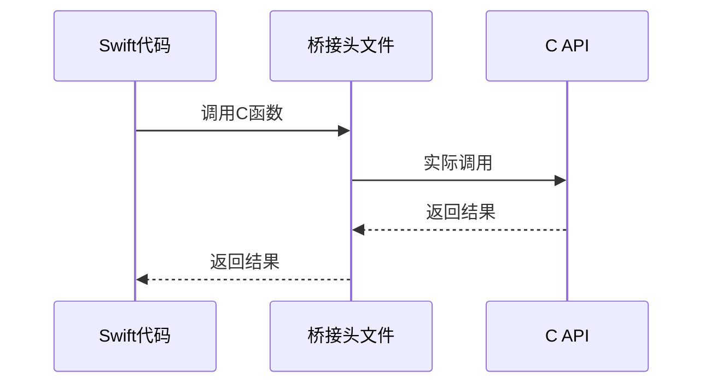

**图源**
- [SherpaOnnx-Bridging-Header.h](file://swift-api-examples/SherpaOnnx-Bridging-Header.h)
- [SherpaOnnx.swift](file://swift-api-examples/SherpaOnnx.swift)

**节源**
- [SherpaOnnx-Bridging-Header.h](file://swift-api-examples/SherpaOnnx-Bridging-Header.h)
- [SherpaOnnx.swift](file://swift-api-examples/SherpaOnnx.swift)

### 回调函数处理
Swift使用`Unmanaged`类来处理C回调函数中的对象生命周期。通过`Unmanaged.passUnretained`方法将Swift对象传递给C代码，确保在回调执行期间对象不会被释放。

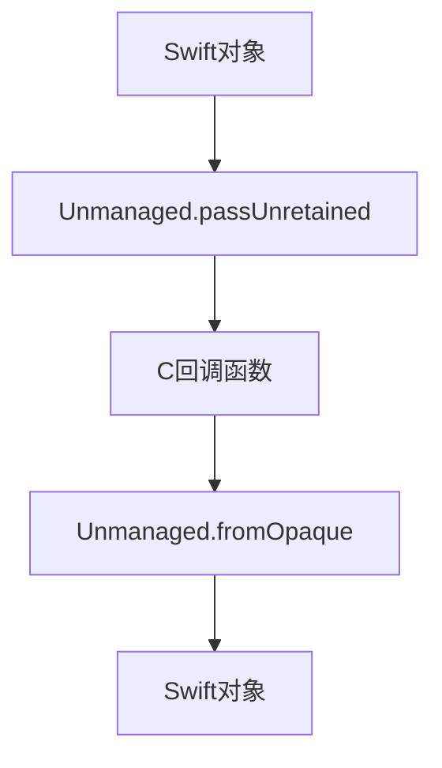

**图源**
- [tts-kitten-en.swift](file://swift-api-examples/tts-kitten-en.swift)
- [tts-kokoro-en.swift](file://swift-api-examples/tts-kokoro-en.swift)
- [tts-kokoro-zh-en.swift](file://swift-api-examples/tts-kokoro-zh-en.swift)
- [tts-matcha-en.swift](file://swift-api-examples/tts-matcha-en.swift)
- [tts-matcha-zh.swift](file://swift-api-examples/tts-matcha-zh.swift)
- [tts-vits.swift](file://swift-api-examples/tts-vits.swift)

**节源**
- [tts-kitten-en.swift](file://swift-api-examples/tts-kitten-en.swift)
- [tts-kokoro-en.swift](file://swift-api-examples/tts-kokoro-en.swift)
- [tts-kokoro-zh-en.swift](file://swift-api-examples/tts-kokoro-zh-en.swift)
- [tts-matcha-en.swift](file://swift-api-examples/tts-matcha-en.swift)
- [tts-matcha-zh.swift](file://swift-api-examples/tts-matcha-zh.swift)
- [tts-vits.swift](file://swift-api-examples/tts-vits.swift)

## Xcode项目集成
### 项目配置
在Xcode项目中，需要将`sherpa-onnx.xcframework`和`onnxruntime.xcframework`添加到项目中，并在`Build Phases`中将它们添加到`Frameworks, Libraries, and Embedded Content`。

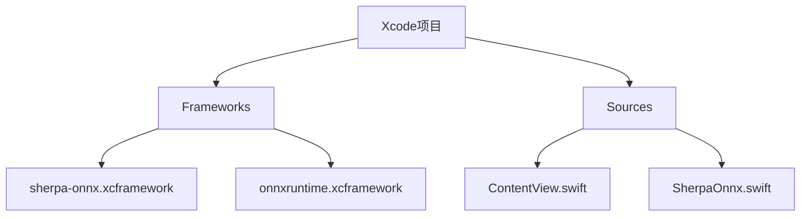

**图源**
- [project.pbxproj](file://ios-swiftui/SherpaOnnxTts/SherpaOnnxTts.xcodeproj/project.pbxproj)

**节源**
- [project.pbxproj](file://ios-swiftui/SherpaOnnxTts/SherpaOnnxTts.xcodeproj/project.pbxproj)

### SwiftUI界面
使用SwiftUI构建用户界面，通过`@State`属性管理用户输入和状态。`ContentView.swift`文件定义了主要的用户界面，包括文本输入、速度调节和生成按钮。

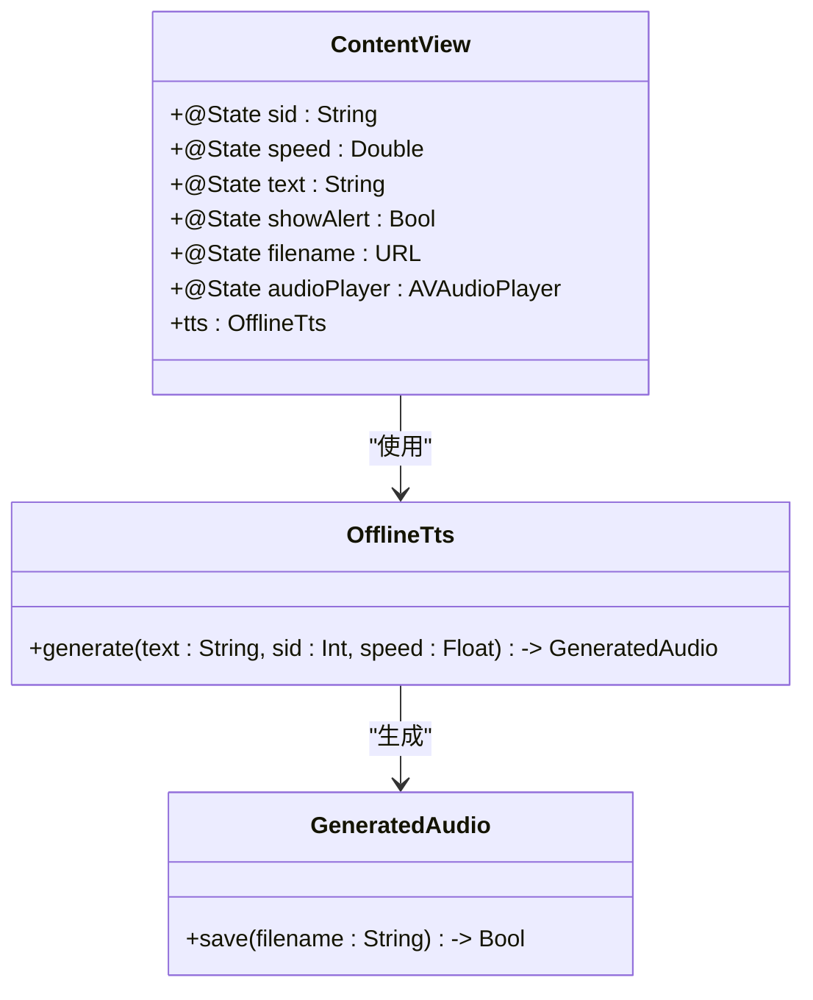

**图源**
- [ContentView.swift](file://ios-swiftui/SherpaOnnxTts/SherpaOnnxTts/ContentView.swift)

**节源**
- [ContentView.swift](file://ios-swiftui/SherpaOnnxTts/SherpaOnnxTts/ContentView.swift)

## 音频输出配置与优化
### 音频播放
使用`AVFoundation`框架进行音频播放。通过`AVAudioPlayer`类加载和播放生成的音频文件，提供播放控制功能。

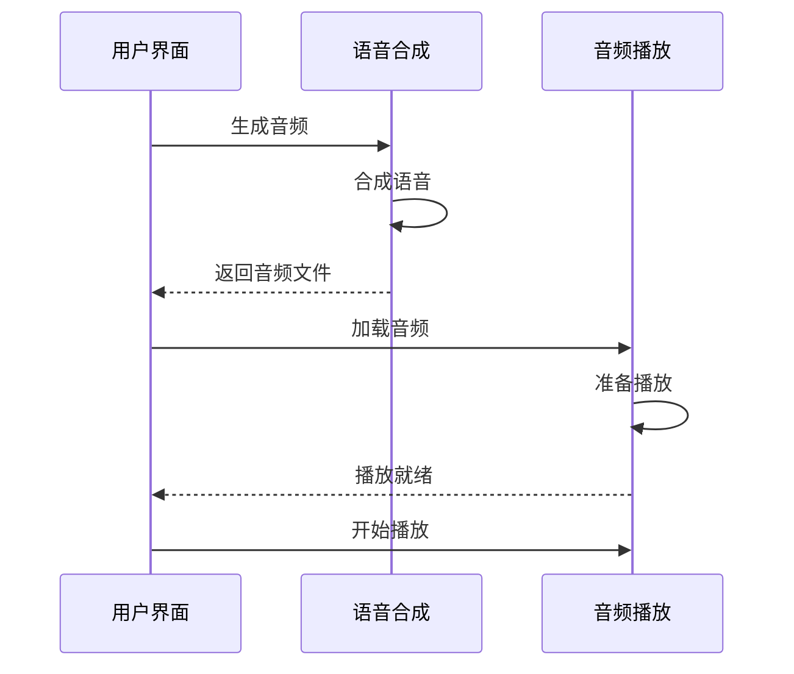

**图源**
- [ContentView.swift](file://ios-swiftui/SherpaOnnxTts/SherpaOnnxTts/ContentView.swift)

**节源**
- [ContentView.swift](file://ios-swiftui/SherpaOnnxTts/SherpaOnnxTts/ContentView.swift)

### 性能优化
为了优化实时合成性能，可以调整模型的线程数和提供者。在`SherpaOnnxOfflineTtsModelConfig`中设置`numThreads`和`provider`参数，以平衡性能和资源消耗。

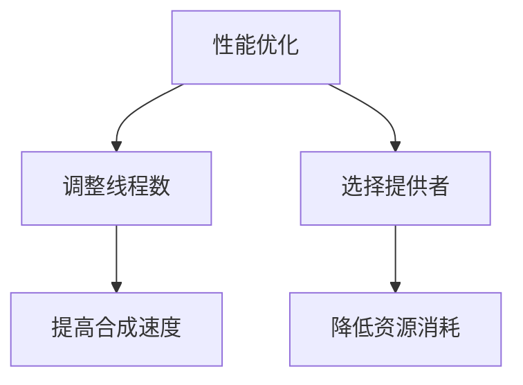

**图源**
- [SherpaOnnx.swift](file://swift-api-examples/SherpaOnnx.swift)

**节源**
- [SherpaOnnx.swift](file://swift-api-examples/SherpaOnnx.swift)

## 结论
sherpa-onnx Swift API提供了强大而灵活的语音合成功能，支持多种TTS模型和多语言合成。通过合理的项目配置和性能优化，可以在iOS/macOS平台上实现高质量的离线语音合成。文档详细介绍了各种TTS模型的实现方式和调用方法，以及Swift语言特性的应用和Xcode项目集成，为开发者提供了全面的指导。