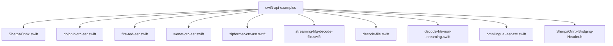
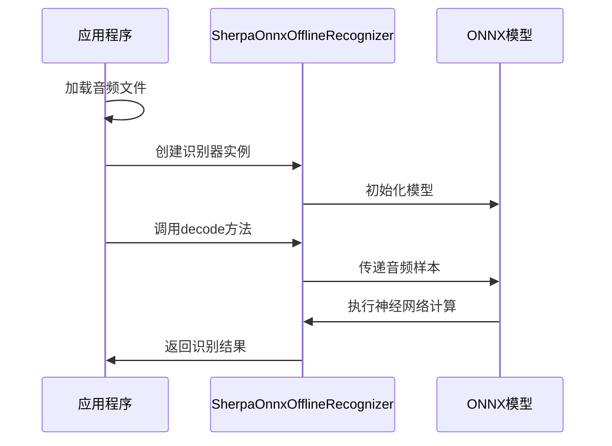
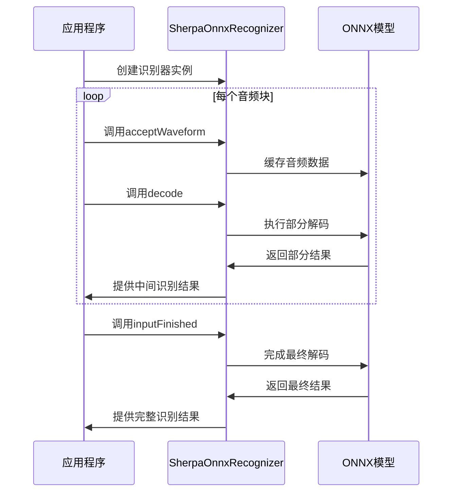
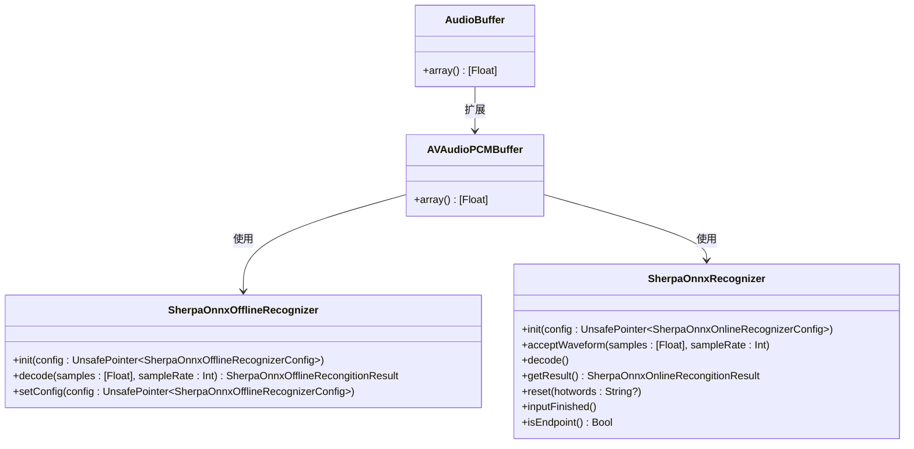
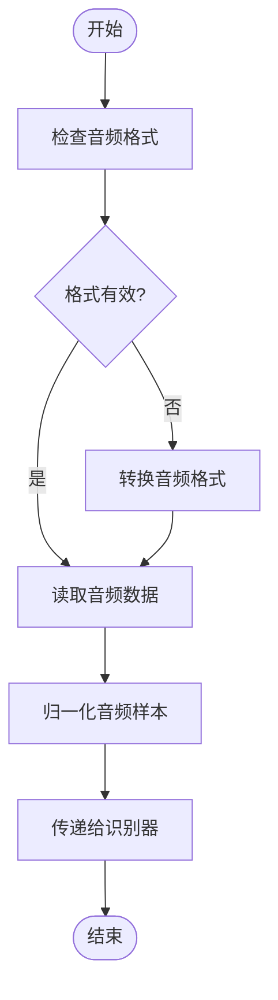

# 语音识别示例

<cite>
**本文档中引用的文件**  
- [SherpaOnnx.swift](file://swift-api-examples/SherpaOnnx.swift)
- [dolphin-ctc-asr.swift](file://swift-api-examples/dolphin-ctc-asr.swift)
- [fire-red-asr.swift](file://swift-api-examples/fire-red-asr.swift)
- [wenet-ctc-asr.swift](file://swift-api-examples/wenet-ctc-asr.swift)
- [zipformer-ctc-asr.swift](file://swift-api-examples/zipformer-ctc-asr.swift)
- [streaming-hlg-decode-file.swift](file://swift-api-examples/streaming-hlg-decode-file.swift)
- [decode-file.swift](file://swift-api-examples/decode-file.swift)
- [decode-file-non-streaming.swift](file://swift-api-examples/decode-file-non-streaming.swift)
- [omnilingual-asr-ctc.swift](file://swift-api-examples/omnilingual-asr-ctc.swift)
- [SherpaOnnx-Bridging-Header.h](file://swift-api-examples/SherpaOnnx-Bridging-Header.h)
</cite>

## 目录
1. [简介](#简介)
2. [项目结构](#项目结构)
3. [核心组件](#核心组件)
4. [非流式语音识别实现](#非流式语音识别实现)
5. [流式语音识别实现](#流式语音识别实现)
6. [ASR模型应用详解](#asr模型应用详解)
7. [Swift语言特性应用](#swift语言特性应用)
8. [Xcode项目集成指南](#xcode项目集成指南)
9. [不同ASR模型适用场景](#不同asr模型适用场景)
10. [iOS/macOS音频输入配置](#iosmacos音频输入配置)

## 简介

sherpa-onnx 是一个支持在多种平台上本地运行语音识别功能的开源项目，提供了对Swift编程语言的完整支持。该项目支持流式和非流式语音识别，能够在iOS和macOS设备上实现高性能的语音转文本功能。Swift API示例展示了如何使用Dolphin CTC、Fire-Red ASR、SenseVoice、T-One CTC、Wenet CTC和Zipformer CTC等多种先进的ASR模型。这些模型基于ONNX格式，可以在CPU上高效运行，无需网络连接即可完成语音识别任务。

## 项目结构

sherpa-onnx项目的Swift API示例位于`swift-api-examples`目录中，包含了一系列独立的Swift脚本文件，每个文件演示了不同语音识别功能的实现方式。项目结构清晰地分离了不同功能模块，便于开发者理解和集成。

**图源**  
- [SherpaOnnx.swift](file://swift-api-examples/SherpaOnnx.swift)
- [dolphin-ctc-asr.swift](file://swift-api-examples/dolphin-ctc-asr.swift)
- [fire-red-asr.swift](file://swift-api-examples/fire-red-asr.swift)

## 核心组件

sherpa-onnx Swift API的核心组件包括语音识别器类、模型配置结构体和音频处理工具。`SherpaOnnxOfflineRecognizer`和`SherpaOnnxRecognizer`是两个主要的识别器类，分别用于非流式和流式语音识别。这些类通过C API与底层的ONNX模型进行交互，实现了高效的语音识别功能。

**节源**  
- [SherpaOnnx.swift](file://swift-api-examples/SherpaOnnx.swift#L627-L671)
- [SherpaOnnx-Bridging-Header.h](file://swift-api-examples/SherpaOnnx-Bridging-Header.h#L7)

## 非流式语音识别实现

非流式语音识别适用于已知完整音频文件的场景，可以对整个音频进行一次性处理。在Swift实现中，`SherpaOnnxOfflineRecognizer`类提供了`decode`方法，接受完整的音频样本数组并返回识别结果。实现过程包括加载音频文件、创建识别器实例和执行解码三个主要步骤。

**图源**  
- [decode-file-non-streaming.swift](file://swift-api-examples/decode-file-non-streaming.swift#L15-L131)
- [SherpaOnnx.swift](file://swift-api-examples/SherpaOnnx.swift#L627-L671)

## 流式语音识别实现

流式语音识别适用于实时音频输入场景，如麦克风录音。`SherpaOnnxRecognizer`类提供了流式处理能力，通过`acceptWaveform`方法逐步接收音频数据，`decode`方法进行增量解码。这种实现方式能够提供低延迟的实时语音识别体验。

**图源**  
- [streaming-hlg-decode-file.swift](file://swift-api-examples/streaming-hlg-decode-file.swift#L15-L80)
- [decode-file.swift](file://swift-api-examples/decode-file.swift#L15-L103)

## ASR模型应用详解

### Dolphin CTC模型

Dolphin CTC模型是一种多语言CTC模型，支持1600多种语言的语音识别。在Swift中通过`sherpaOnnxOfflineDolphinModelConfig`函数配置，适用于需要支持多种语言的国际化应用。

**节源**  
- [dolphin-ctc-asr.swift](file://swift-api-examples/dolphin-ctc-asr.swift#L15-L67)
- [SherpaOnnx.swift](file://swift-api-examples/SherpaOnnx.swift#L387-L393)

### Fire-Red ASR模型

Fire-Red ASR模型是专为中文和英文优化的大规模ASR模型，通过`sherpaOnnxOfflineFireRedAsrModelConfig`函数配置。该模型在中文语音识别方面表现出色，适合需要高精度中文识别的应用场景。

**节源**  
- [fire-red-asr.swift](file://swift-api-examples/fire-red-asr.swift#L15-L69)
- [SherpaOnnx.swift](file://swift-api-examples/SherpaOnnx.swift#L427-L435)

### Wenet CTC模型

Wenet CTC模型基于WenetSpeech数据集训练，特别适合粤语和普通话混合识别。通过`sherpaOnnxOfflineWenetCtcModelConfig`函数配置，支持中文和粤语的语音识别。

**节源**  
- [wenet-ctc-asr.swift](file://swift-api-examples/wenet-ctc-asr.swift#L15-L69)
- [SherpaOnnx.swift](file://swift-api-examples/SherpaOnnx.swift#L363-L369)

### Zipformer CTC模型

Zipformer CTC模型是一种高效的中文语音识别模型，通过`sherpaOnnxOfflineZipformerCtcModelConfig`函数配置。该模型在保持高识别精度的同时，具有较低的计算资源消耗。

**节源**  
- [zipformer-ctc-asr.swift](file://swift-api-examples/zipformer-ctc-asr.swift#L15-L67)
- [SherpaOnnx.swift](file://swift-api-examples/SherpaOnnx.swift#L355-L361)

### SenseVoice模型

SenseVoice模型支持多语言语音识别，包括中文、英文、日语、韩语和粤语。通过`sherpaOnnxOfflineSenseVoiceModelConfig`函数配置，支持逆文本归一化功能。

**节源**  
- [decode-file-non-streaming.swift](file://swift-api-examples/decode-file-non-streaming.swift#L52-L65)
- [SherpaOnnx.swift](file://swift-api-examples/SherpaOnnx.swift#L459-L469)

## Swift语言特性应用

Swift API示例充分利用了Swift语言的现代特性，如类型安全、内存管理和扩展功能。通过`extension`关键字为`AudioBuffer`和`AVAudioPCMBuffer`添加了`array()`方法，简化了音频数据的处理。使用`@main`属性包装器定义应用程序入口点，符合Swift 5.3+的现代语法。

**图源**  
- [SherpaOnnx.swift](file://swift-api-examples/SherpaOnnx.swift)
- [dolphin-ctc-asr.swift](file://swift-api-examples/dolphin-ctc-asr.swift#L3-L13)

## Xcode项目集成指南

要将sherpa-onnx Swift API集成到Xcode项目中，需要执行以下步骤：首先在项目中添加`SherpaOnnx-Bridging-Header.h`桥接头文件，然后导入`sherpa-onnx/c-api/c-api.h`头文件。在Swift文件中导入`AVFoundation`框架以处理音频输入，最后将所需的ONNX模型文件添加到项目资源中。

**节源**  
- [SherpaOnnx-Bridging-Header.h](file://swift-api-examples/SherpaOnnx-Bridging-Header.h#L7)
- [dolphin-ctc-asr.swift](file://swift-api-examples/dolphin-ctc-asr.swift#L1)
- [fire-red-asr.swift](file://swift-api-examples/fire-red-asr.swift#L1)

## 不同ASR模型适用场景

| 模型名称 | 适用场景 | 性能特点 |
|---------|---------|---------|
| **Dolphin CTC** | 多语言支持应用 | 支持1600+语言，适合国际化产品 |
| **Fire-Red ASR** | 中文为主的应用 | 中文识别精度高，支持中英混合 |
| **SenseVoice** | 多语种会议记录 | 支持中、英、日、韩、粤语识别 |
| **T-One CTC** | 实时语音转写 | 低延迟，适合实时字幕生成 |
| **Wenet CTC** | 粤语普通话混合 | 专门优化粤语识别性能 |
| **Zipformer CTC** | 移动端应用 | 模型小，资源消耗低，适合移动设备 |

**节源**  
- [omnilingual-asr-ctc.swift](file://swift-api-examples/omnilingual-asr-ctc.swift#L7-L15)
- [decode-file-non-streaming.swift](file://swift-api-examples/decode-file-non-streaming.swift#L23-L86)

## iOS/macOS音频输入配置

在iOS和macOS平台上，音频输入配置需要特别注意采样率和音频格式的匹配。建议使用16kHz采样率和80维特征，这与大多数ASR模型的训练条件相匹配。使用`AVAudioFile`类读取音频文件时，需要确保音频格式为单声道、Float32格式。

**图源**  
- [dolphin-ctc-asr.swift](file://swift-api-examples/dolphin-ctc-asr.swift#L44-L52)
- [fire-red-asr.swift](file://swift-api-examples/fire-red-asr.swift#L46-L48)