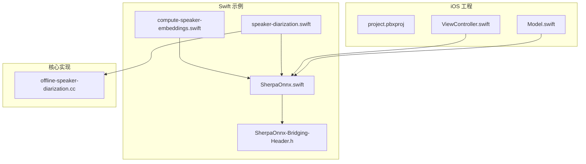
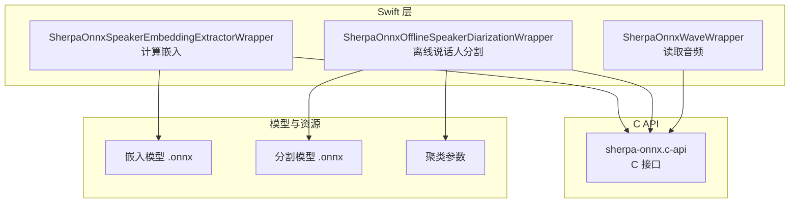
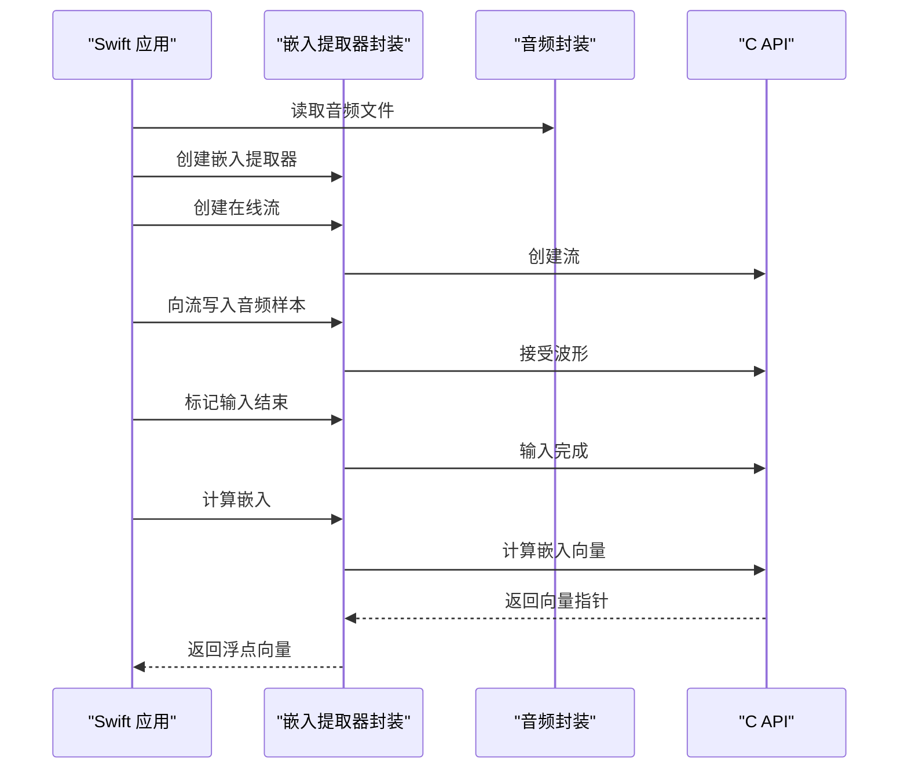
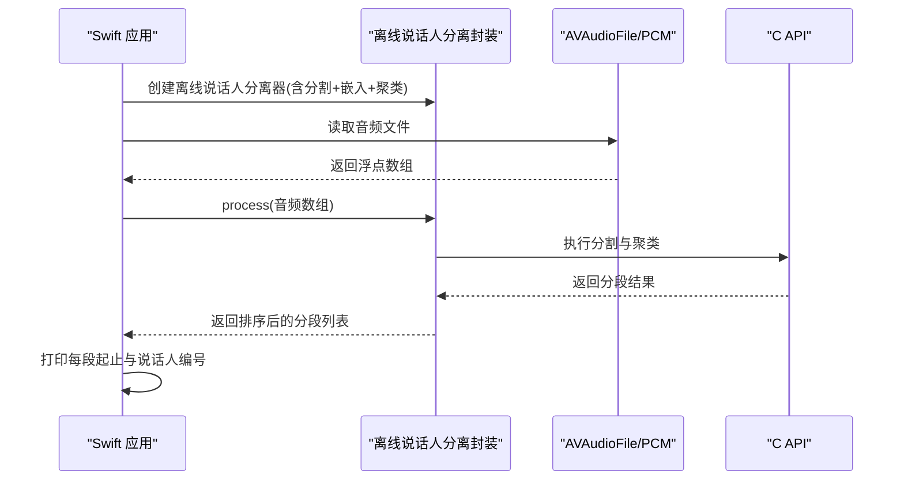
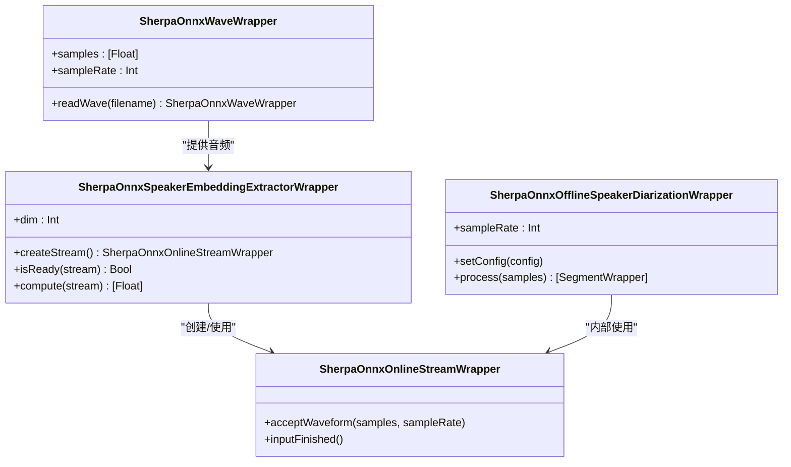
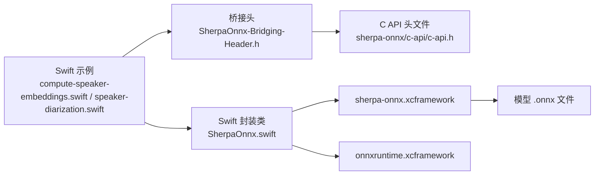

# 说话人相关功能示例

<cite>
**本文引用的文件列表**
- [compute-speaker-embeddings.swift](file://swift-api-examples/compute-speaker-embeddings.swift)
- [speaker-diarization.swift](file://swift-api-examples/speaker-diarization.swift)
- [SherpaOnnx.swift](file://swift-api-examples/SherpaOnnx.swift)
- [SherpaOnnx-Bridging-Header.h](file://swift-api-examples/SherpaOnnx-Bridging-Header.h)
- [project.pbxproj](file://ios-swift/SherpaOnnx/SherpaOnnx.xcodeproj/project.pbxproj)
- [ViewController.swift](file://ios-swift/SherpaOnnx/SherpaOnnx/ViewController.swift)
- [Model.swift](file://ios-swift/SherpaOnnx/SherpaOnnx/Model.swift)
- [offline-speaker-diarization.cc](file://sherpa-onnx/csrc/offline-speaker-diarization.cc)
- [OfflineSpeakerDiarizationConfig.java](file://sherpa-onnx/java-api/src/main/java/com/k2fsa/sherpa/onnx/OfflineSpeakerDiarizationConfig.java)
- [offline-speaker-diarization.py](file://python-api-examples/offline-speaker-diarization.py)
- [README.md](file://README.md)
</cite>

## 目录
1. [简介](#简介)
2. [项目结构](#项目结构)
3. [核心组件](#核心组件)
4. [架构总览](#架构总览)
5. [详细组件分析](#详细组件分析)
6. [依赖关系分析](#依赖关系分析)
7. [性能与内存优化](#性能与内存优化)
8. [故障排查指南](#故障排查指南)
9. [结论](#结论)
10. [附录：Xcode 集成与使用步骤](#附录xcode-集成与使用步骤)

## 简介
本文件面向 iOS/macOS 平台 Swift 开发者，系统性讲解 sherpa-onnx 的“说话人嵌入计算”和“说话人分离（离线说话人分割）”两大功能的 Swift API 使用方法与实现原理。内容涵盖：
- 说话人嵌入向量的生成流程与相似度计算
- 说话人分离（离线说话人分割）的端到端处理流程
- Swift 语言特性在桥接层、类型封装与内存管理中的应用
- 在 Xcode 工程中集成 sherpa-onnx xcframework 的步骤与注意事项
- iOS/macOS 平台的性能与内存优化建议

## 项目结构
围绕 Swift 示例与 iOS 工程的关键文件如下：
- Swift 示例脚本：用于演示嵌入计算与说话人分离
- Swift 桥接头：将 C API 暴露给 Swift
- iOS 工程：包含 xcframework 引用、资源文件与示例控制器
- 核心 C++ 实现：离线说话人分离的配置校验与运行时行为

图表来源
- [compute-speaker-embeddings.swift](file://swift-api-examples/compute-speaker-embeddings.swift#L1-L65)
- [speaker-diarization.swift](file://swift-api-examples/speaker-diarization.swift#L1-L57)
- [SherpaOnnx.swift](file://swift-api-examples/SherpaOnnx.swift#L1428-L1584)
- [SherpaOnnx-Bridging-Header.h](file://swift-api-examples/SherpaOnnx-Bridging-Header.h#L1-L10)
- [project.pbxproj](file://ios-swift/SherpaOnnx/SherpaOnnx.xcodeproj/project.pbxproj#L1-L200)
- [ViewController.swift](file://ios-swift/SherpaOnnx/SherpaOnnx/ViewController.swift#L1-L203)
- [Model.swift](file://ios-swift/SherpaOnnx/SherpaOnnx/Model.swift#L1-L106)
- [offline-speaker-diarization.cc](file://sherpa-onnx/csrc/offline-speaker-diarization.cc#L44-L95)

章节来源
- [compute-speaker-embeddings.swift](file://swift-api-examples/compute-speaker-embeddings.swift#L1-L65)
- [speaker-diarization.swift](file://swift-api-examples/speaker-diarization.swift#L1-L57)
- [SherpaOnnx.swift](file://swift-api-examples/SherpaOnnx.swift#L1428-L1584)
- [SherpaOnnx-Bridging-Header.h](file://swift-api-examples/SherpaOnnx-Bridging-Header.h#L1-L10)
- [project.pbxproj](file://ios-swift/SherpaOnnx/SherpaOnnx.xcodeproj/project.pbxproj#L1-L200)
- [ViewController.swift](file://ios-swift/SherpaOnnx/SherpaOnnx/ViewController.swift#L1-L203)
- [Model.swift](file://ios-swift/SherpaOnnx/SherpaOnnx/Model.swift#L1-L106)
- [offline-speaker-diarization.cc](file://sherpa-onnx/csrc/offline-speaker-diarization.cc#L44-L95)

## 核心组件
- 说话人嵌入提取器（Swift 封装）
  - 提供创建流、接受音频、计算嵌入等接口
  - 返回固定维度的浮点向量，用于后续相似度比较
- 说话人分离（离线说话人分割，Swift 封装）
  - 组合“说话人分割模型 + 嵌入提取器 + 聚类器”
  - 输入整段音频，输出按时间切分的说话人标签序列
- Swift 桥接与类型封装
  - 通过桥接头暴露 C API
  - 以类封装 C 指针生命周期，自动释放资源
- iOS 工程集成
  - 引入 sherpa-onnx.xcframework 与 onnxruntime.xcframework
  - 将模型与资源文件加入工程

章节来源
- [SherpaOnnx.swift](file://swift-api-examples/SherpaOnnx.swift#L1428-L1584)
- [SherpaOnnx.swift](file://swift-api-examples/SherpaOnnx.swift#L1586-L1682)
- [SherpaOnnx-Bridging-Header.h](file://swift-api-examples/SherpaOnnx-Bridging-Header.h#L1-L10)
- [project.pbxproj](file://ios-swift/SherpaOnnx/SherpaOnnx.xcodeproj/project.pbxproj#L1-L200)

## 架构总览
下图展示了 Swift 层对 C API 的封装、模型配置与数据流的关系。

图表来源
- [SherpaOnnx.swift](file://swift-api-examples/SherpaOnnx.swift#L1428-L1584)
- [SherpaOnnx.swift](file://swift-api-examples/SherpaOnnx.swift#L1586-L1682)
- [SherpaOnnx-Bridging-Header.h](file://swift-api-examples/SherpaOnnx-Bridging-Header.h#L1-L10)

## 详细组件分析

### 说话人嵌入计算（Speaker Embedding Extraction）
- 功能概述
  - 从单声道浮点音频中提取固定维度的说话人嵌入向量
  - 支持批量对比，计算余弦相似度衡量说话人相似性
- Swift API 流程
  - 读取音频文件为浮点数组
  - 创建嵌入提取器与在线流
  - 向流输入音频帧，标记结束
  - 计算嵌入向量并返回
- Swift 语言特性
  - 使用扩展函数进行向量相似度计算（预条件断言、向量化累加）
  - 使用类封装 C 指针，自动释放资源
  - 使用泛型与数组操作简化数据转换

图表来源
- [compute-speaker-embeddings.swift](file://swift-api-examples/compute-speaker-embeddings.swift#L1-L65)
- [SherpaOnnx.swift](file://swift-api-examples/SherpaOnnx.swift#L1428-L1584)

章节来源
- [compute-speaker-embeddings.swift](file://swift-api-examples/compute-speaker-embeddings.swift#L1-L65)
- [SherpaOnnx.swift](file://swift-api-examples/SherpaOnnx.swift#L1428-L1584)

### 说话人分离（离线说话人分割，Speaker Diarization）
- 功能概述
  - 对整段音频进行说话人分割，输出每段起止时间与说话人编号
  - 由三部分组成：说话人分割模型、嵌入提取器、快速聚类器
- Swift API 流程
  - 组装分割模型配置、嵌入提取器配置、聚类配置
  - 创建离线说话人分离器实例
  - 读取音频为浮点数组，检查采样率与通道数
  - 调用处理接口，排序并打印结果

图表来源
- [speaker-diarization.swift](file://swift-api-examples/speaker-diarization.swift#L1-L57)
- [SherpaOnnx.swift](file://swift-api-examples/SherpaOnnx.swift#L1442-L1518)
- [offline-speaker-diarization.cc](file://sherpa-onnx/csrc/offline-speaker-diarization.cc#L44-L95)

章节来源
- [speaker-diarization.swift](file://swift-api-examples/speaker-diarization.swift#L1-L57)
- [SherpaOnnx.swift](file://swift-api-examples/SherpaOnnx.swift#L1442-L1518)
- [offline-speaker-diarization.cc](file://sherpa-onnx/csrc/offline-speaker-diarization.cc#L44-L95)

### Swift 类封装与内存管理
- 类封装要点
  - 以类持有 C 指针，构造时创建对象，析构时销毁对象
  - 对外暴露只读属性与方法，避免直接访问底层指针
  - 对于需要释放的返回值（如向量指针），在封装内负责释放
- 内存与生命周期
  - 使用 Swift 的 deinit 自动释放 C 对象
  - 对于 C 分配的数据，确保在 Swift 侧释放，防止泄漏
- 与 AVFoundation 的结合
  - 通过扩展将 AVAudioPCMBuffer 转换为 [Float] 数组
  - 保证采样率、通道数与模型期望一致

图表来源
- [SherpaOnnx.swift](file://swift-api-examples/SherpaOnnx.swift#L1428-L1584)
- [SherpaOnnx.swift](file://swift-api-examples/SherpaOnnx.swift#L1586-L1682)

章节来源
- [SherpaOnnx.swift](file://swift-api-examples/SherpaOnnx.swift#L1428-L1584)
- [SherpaOnnx.swift](file://swift-api-examples/SherpaOnnx.swift#L1586-L1682)

### 说话人嵌入向量生成原理与相似度计算
- 嵌入向量生成
  - 通过嵌入提取器对音频片段进行特征提取，得到固定维度的浮点向量
  - 向量维度由模型决定，可通过封装提供的 dim 属性查询
- 相似度计算
  - 使用余弦相似度衡量两个向量之间的角度距离
  - 先计算点积与模长，再归一化得到相似度值
- 应用场景
  - 说话人比对、聚类、检索等任务的基础

章节来源
- [compute-speaker-embeddings.swift](file://swift-api-examples/compute-speaker-embeddings.swift#L1-L65)
- [SherpaOnnx.swift](file://swift-api-examples/SherpaOnnx.swift#L1428-L1584)

### 说话人分离算法工作机制
- 数据流
  - 输入：整段单声道浮点音频
  - 输出：按时间顺序排列的分段，每段包含起始时间、结束时间与说话人编号
- 关键模块
  - 说话人分割模型：检测语音活动边界与说话人切换点
  - 嵌入提取器：为每个短片段提取嵌入向量
  - 快速聚类器：基于嵌入向量对片段进行聚类，分配说话人标签
- 参数与约束
  - 最小静音/最小语音持续时间等阈值影响分割质量
  - 聚类器的簇数量或阈值影响说话人数目

章节来源
- [speaker-diarization.swift](file://swift-api-examples/speaker-diarization.swift#L1-L57)
- [offline-speaker-diarization.cc](file://sherpa-onnx/csrc/offline-speaker-diarization.cc#L44-L95)
- [OfflineSpeakerDiarizationConfig.java](file://sherpa-onnx/java-api/src/main/java/com/k2fsa/sherpa/onnx/OfflineSpeakerDiarizationConfig.java#L1-L79)
- [offline-speaker-diarization.py](file://python-api-examples/offline-speaker-diarization.py#L107-L136)

## 依赖关系分析
- Swift 与 C API
  - 通过桥接头引入 C API，Swift 侧以函数与类封装 C 接口
- iOS 工程依赖
  - 引入 sherpa-onnx.xcframework 与 onnxruntime.xcframework
  - 将模型与资源文件加入“Copy Bundle Resources”
- 平台支持
  - README 明确支持 iOS 平台；Flutter 与 Android 示例表明模型可跨平台使用

图表来源
- [SherpaOnnx-Bridging-Header.h](file://swift-api-examples/SherpaOnnx-Bridging-Header.h#L1-L10)
- [project.pbxproj](file://ios-swift/SherpaOnnx/SherpaOnnx.xcodeproj/project.pbxproj#L1-L200)
- [README.md](file://README.md#L1-L200)

章节来源
- [SherpaOnnx-Bridging-Header.h](file://swift-api-examples/SherpaOnnx-Bridging-Header.h#L1-L10)
- [project.pbxproj](file://ios-swift/SherpaOnnx/SherpaOnnx.xcodeproj/project.pbxproj#L1-L200)
- [README.md](file://README.md#L1-L200)

## 性能与内存优化
- 嵌入计算
  - 控制输入音频长度，避免过长导致计算开销增大
  - 使用合适的线程数与执行提供程序（provider），平衡精度与速度
- 说话人分离
  - 合理设置最小静音/最小语音持续时间，减少误分割
  - 聚类阈值影响分割粒度，需根据场景调整
- iOS/macOS 平台优化
  - 使用单声道、16kHz 浮点格式，减少转换成本
  - 在主线程之外进行音频采集与解码，避免阻塞 UI
  - 合理缓存模型与资源，避免重复加载
  - 注意内存峰值，及时释放不再使用的对象与中间缓冲区

[本节为通用指导，不直接分析具体文件]

## 故障排查指南
- 常见问题
  - 音频格式不匹配：确认采样率、通道数与模型期望一致
  - 资源未添加：模型与资源文件未加入“Copy Bundle Resources”
  - xcframework 未正确链接：检查工程设置中是否包含 sherpa-onnx.xcframework 与 onnxruntime.xcframework
- Swift 层定位
  - 若嵌入向量为空，检查 isReady 与 compute 的调用时机
  - 若离线分割无结果，检查输入数组长度与采样率
- 平台差异
  - iOS 与 macOS 的音频引擎与权限不同，注意麦克风授权与后台播放设置

章节来源
- [speaker-diarization.swift](file://swift-api-examples/speaker-diarization.swift#L1-L57)
- [project.pbxproj](file://ios-swift/SherpaOnnx/SherpaOnnx.xcodeproj/project.pbxproj#L1-L200)
- [ViewController.swift](file://ios-swift/SherpaOnnx/SherpaOnnx/ViewController.swift#L1-L203)

## 结论
- sherpa-onnx 的 Swift API 为 iOS/macOS 平台提供了完整的说话人相关能力：嵌入计算与说话人分离
- Swift 封装通过类与桥接头将 C API 易用化，同时保障内存安全
- 在 Xcode 中集成 xcframework 与资源文件后，即可快速运行示例
- 实际部署中应关注音频格式、采样率、线程与聚类参数的调优，以获得最佳性能与效果

[本节为总结性内容，不直接分析具体文件]

## 附录：Xcode 集成与使用步骤
- 准备工作
  - 下载并构建 sherpa-onnx.xcframework 与 onnxruntime.xcframework
  - 准备模型文件（嵌入模型、分割模型等）
- 导入工程
  - 在 Xcode 中将 sherpa-onnx.xcframework 与 onnxruntime.xcframework 添加到工程
  - 将模型与资源文件加入“Copy Bundle Resources”
- 运行示例
  - 使用 compute-speaker-embeddings.swift 或 speaker-diarization.swift 作为入口
  - 在 ViewController 中参考在线识别示例，将音频采集与解码逻辑接入
- 调试与验证
  - 检查音频格式与采样率
  - 观察控制台输出，确认分段结果与相似度评分

章节来源
- [project.pbxproj](file://ios-swift/SherpaOnnx/SherpaOnnx.xcodeproj/project.pbxproj#L1-L200)
- [ViewController.swift](file://ios-swift/SherpaOnnx/SherpaOnnx/ViewController.swift#L1-L203)
- [Model.swift](file://ios-swift/SherpaOnnx/SherpaOnnx/Model.swift#L1-L106)
- [compute-speaker-embeddings.swift](file://swift-api-examples/compute-speaker-embeddings.swift#L1-L65)
- [speaker-diarization.swift](file://swift-api-examples/speaker-diarization.swift#L1-L57)