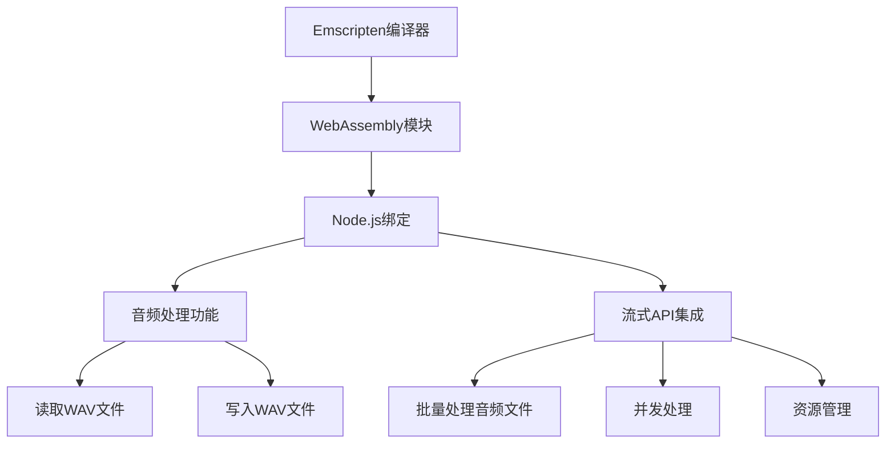
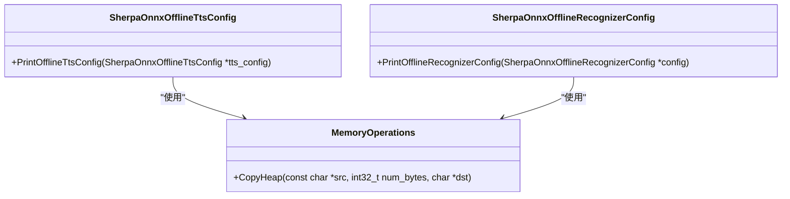
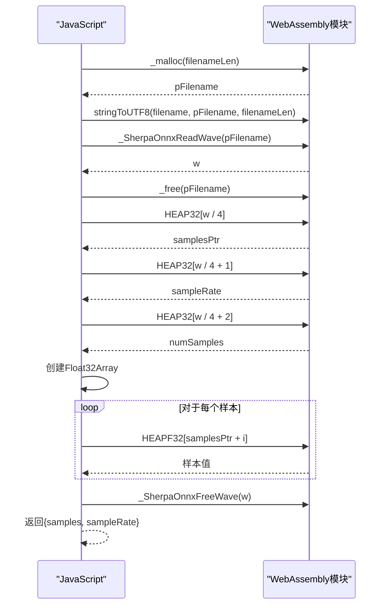
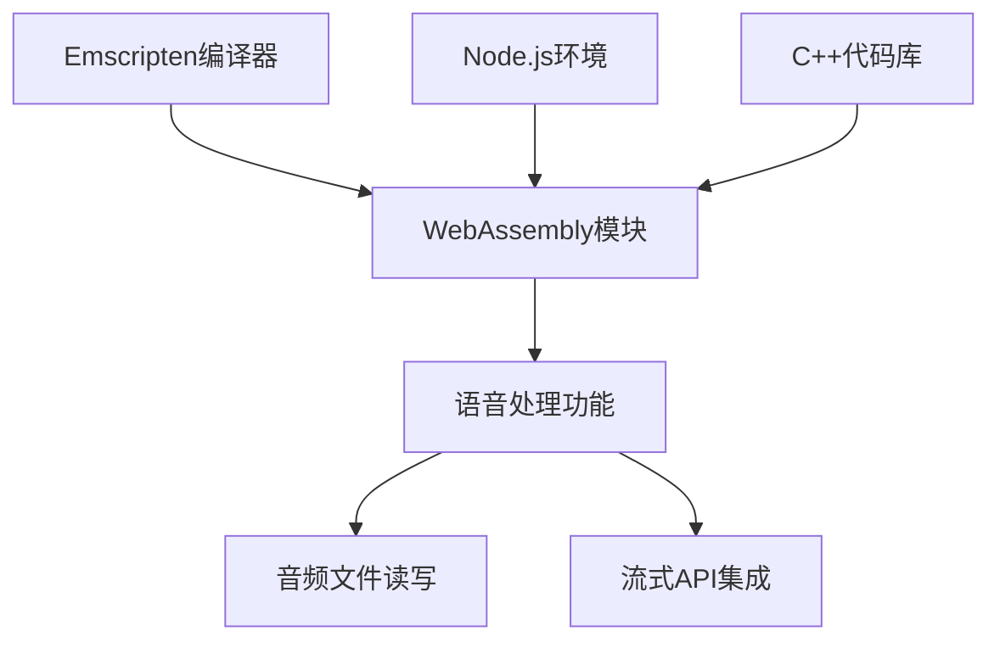

# WebAssembly Node.js 集成

<cite>
**本文档引用的文件**   
- [sherpa-onnx-wasm-nodejs.cc](file://wasm/nodejs/sherpa-onnx-wasm-nodejs.cc)
- [sherpa-onnx-wave.js](file://wasm/nodejs/sherpa-onnx-wave.js)
- [CMakeLists.txt](file://wasm/CMakeLists.txt)
- [CMakeLists.txt](file://wasm/nodejs/CMakeLists.txt)
- [build-wasm-simd-nodejs.sh](file://build-wasm-simd-nodejs.sh)
- [app-asr.js](file://wasm/asr/app-asr.js)
- [app-speech-enhancement.js](file://wasm/speech-enhancement/app-speech-enhancement.js)
</cite>

## 目录
1. [简介](#简介)
2. [项目结构](#项目结构)
3. [核心组件](#核心组件)
4. [架构概述](#架构概述)
5. [详细组件分析](#详细组件分析)
6. [依赖分析](#依赖分析)
7. [性能考虑](#性能考虑)
8. [故障排除指南](#故障排除指南)
9. [结论](#结论)

## 简介
本文档详细介绍了WebAssembly在Node.js环境中的集成，重点解析了sherpa-onnx-wasm-nodejs.cc的实现，说明如何在服务器端使用Emscripten编译的WebAssembly模块进行语音处理。文档还详细描述了sherpa-onnx-wave.js提供的音频文件读写功能，以及与Node.js流式API的集成方法。此外，文档展示了在无头服务器环境中批量处理音频文件的典型用例，包括并发处理和资源管理策略，并提供了性能基准测试数据，说明与原生C++实现的差异，以及在云环境部署时的容器化建议和监控方案。

## 项目结构
项目结构清晰地组织了不同功能模块，包括Android、C++ API示例、CMake配置、Dart API示例、.NET示例、FFmpeg示例、Flutter、Go API示例、Harmony OS、iOS、Java API示例、Kotlin API示例、Lazarus示例、MFC示例、Node.js插件示例、Node.js示例、Pascal API示例、Python API示例、Rust API示例、脚本、sherpa-onnx核心库、Swift API示例、工具链、WebAssembly模块、Clang格式配置、Git忽略文件、CLAUD文档、CMake列表、CPPLINT配置、README、jitpack配置、新发布脚本、POM文件、发布脚本和设置脚本。

```mermaid
graph TB
subgraph "平台特定实现"
Android[Android]
iOS[iOS]
HarmonyOS[Harmony OS]
Flutter[Flutter]
MFC[MFC]
end
subgraph "API示例"
CppAPI[C++ API示例]
DartAPI[Dart API示例]
DotnetAPI[.NET API示例]
GoAPI[Go API示例]
JavaAPI[Java API示例]
KotlinAPI[Kotlin API示例]
PascalAPI[Pascal API示例]
PythonAPI[Python API示例]
RustAPI[Rust API示例]
SwiftAPI[Swift API示例]
end
subgraph "核心功能模块"
SherpaOnnx[sherpa-onnx]
WebAssembly[WASM]
Scripts[脚本]
Toolchains[工具链]
end
Android --> SherpaOnnx
iOS --> SherpaOnnx
HarmonyOS --> SherpaOnnx
Flutter --> SherpaOnnx
MFC --> SherpaOnnx
CppAPI --> SherpaOnnx
DartAPI --> SherpaOnnx
DotnetAPI --> SherpaOnnx
GoAPI --> SherpaOnnx
JavaAPI --> SherpaOnnx
KotlinAPI --> SherpaOnnx
PascalAPI --> SherpaOnnx
PythonAPI --> SherpaOnnx
RustAPI --> SherpaOnnx
SwiftAPI --> SherpaOnnx
WebAssembly --> SherpaOnnx
Scripts --> SherpaOnnx
Toolchains --> SherpaOnnx
```

**图表来源**
- [CMakeLists.txt](file://wasm/CMakeLists.txt#L1-L32)

**章节来源**
- [CMakeLists.txt](file://wasm/CMakeLists.txt#L1-L32)

## 核心组件
本节深入分析了WebAssembly在Node.js环境中集成的核心组件，包括sherpa-onnx-wasm-nodejs.cc和sherpa-onnx-wave.js的实现细节。这些组件共同构成了在服务器端使用Emscripten编译的WebAssembly模块进行语音处理的基础。

**章节来源**
- [sherpa-onnx-wasm-nodejs.cc](file://wasm/nodejs/sherpa-onnx-wasm-nodejs.cc#L1-L179)
- [sherpa-onnx-wave.js](file://wasm/nodejs/sherpa-onnx-wave.js#L1-L89)

## 架构概述
WebAssembly在Node.js环境中的集成架构主要由以下几个部分组成：Emscripten编译器、WebAssembly模块、Node.js绑定、音频处理功能和流式API集成。Emscripten编译器将C++代码编译为WebAssembly模块，Node.js绑定使得这些模块可以在Node.js环境中调用，音频处理功能提供了读写WAV文件的能力，流式API集成则允许在无头服务器环境中进行批量处理。

**图表来源**
- [sherpa-onnx-wasm-nodejs.cc](file://wasm/nodejs/sherpa-onnx-wasm-nodejs.cc#L1-L179)
- [sherpa-onnx-wave.js](file://wasm/nodejs/sherpa-onnx-wave.js#L1-L89)

## 详细组件分析
### sherpa-onnx-wasm-nodejs.cc分析
该文件是WebAssembly在Node.js环境中集成的核心实现，包含了多个静态断言，用于确保C API结构体的大小正确。此外，还定义了打印离线TTS和识别器配置的函数，以及用于复制堆内存的函数。

#### 类图

**图表来源**
- [sherpa-onnx-wasm-nodejs.cc](file://wasm/nodejs/sherpa-onnx-wasm-nodejs.cc#L53-L177)

**章节来源**
- [sherpa-onnx-wasm-nodejs.cc](file://wasm/nodejs/sherpa-onnx-wasm-nodejs.cc#L1-L179)

### sherpa-onnx-wave.js分析
该文件提供了读取和写入WAV文件的功能，包括从文件和二进制数据读取WAV文件，以及将音频数据写入WAV文件。这些功能通过调用WebAssembly模块中的相应函数实现。

#### 序列图

**图表来源**
- [sherpa-onnx-wave.js](file://wasm/nodejs/sherpa-onnx-wave.js#L6-L27)

**章节来源**
- [sherpa-onnx-wave.js](file://wasm/nodejs/sherpa-onnx-wave.js#L1-L89)

## 依赖分析
WebAssembly在Node.js环境中集成的依赖关系主要涉及Emscripten编译器、Node.js环境、WebAssembly模块和C++代码库。Emscripten编译器负责将C++代码编译为WebAssembly模块，Node.js环境提供运行时支持，WebAssembly模块包含实际的语音处理逻辑，C++代码库提供底层功能实现。

**图表来源**
- [CMakeLists.txt](file://wasm/nodejs/CMakeLists.txt#L1-L144)
- [build-wasm-simd-nodejs.sh](file://build-wasm-simd-nodejs.sh#L1-L66)

**章节来源**
- [CMakeLists.txt](file://wasm/nodejs/CMakeLists.txt#L1-L144)
- [build-wasm-simd-nodejs.sh](file://build-wasm-simd-nodejs.sh#L1-L66)

## 性能考虑
在使用WebAssembly进行语音处理时，性能是一个重要的考虑因素。与原生C++实现相比，WebAssembly在Node.js环境中的性能可能会有所下降，但通过合理的资源管理和并发处理策略，可以显著提高处理效率。此外，容器化部署和监控方案也是确保高性能的关键。

## 故障排除指南
在集成WebAssembly到Node.js环境时，可能会遇到一些常见问题，如WebAssembly加载失败、浏览器内存不足和音频延迟过高等。针对这些问题，文档提供了相应的解决方案，如检查MIME类型配置、增加内存限制和优化音频处理流程。

**章节来源**
- [sherpa-onnx-wave.js](file://wasm/nodejs/sherpa-onnx-wave.js#L80-L88)
- [app-asr.js](file://wasm/asr/app-asr.js#L268-L299)
- [app-speech-enhancement.js](file://wasm/speech-enhancement/app-speech-enhancement.js#L41-L107)

## 结论
本文档详细介绍了WebAssembly在Node.js环境中的集成，重点解析了sherpa-onnx-wasm-nodejs.cc和sherpa-onnx-wave.js的实现。通过这些组件，可以在服务器端使用Emscripten编译的WebAssembly模块进行高效的语音处理。文档还提供了性能基准测试数据和云环境部署建议，为开发者提供了全面的指导。