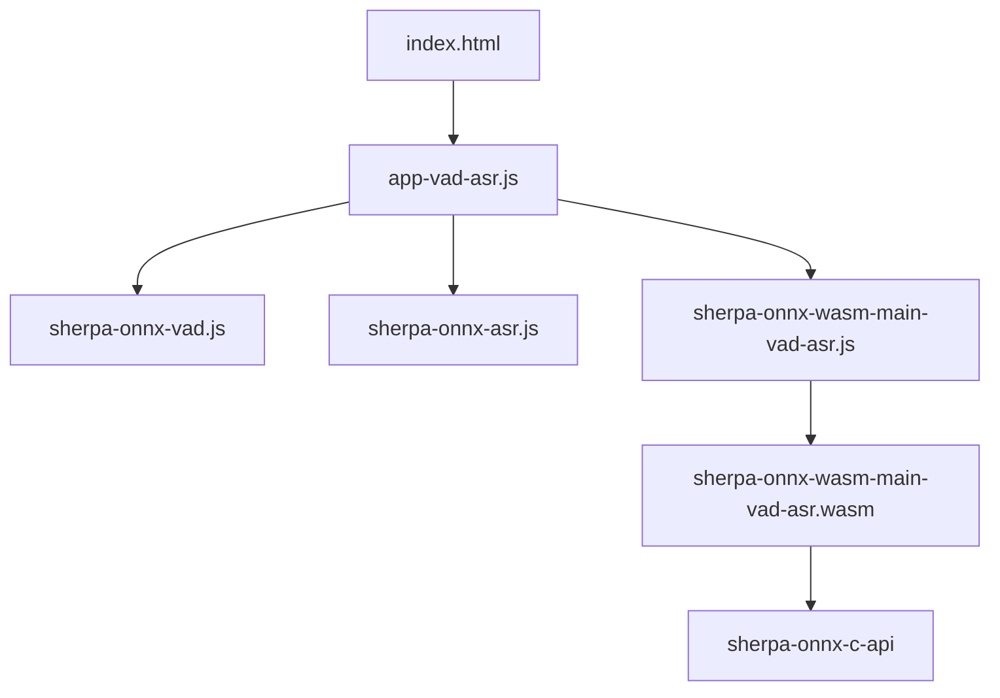
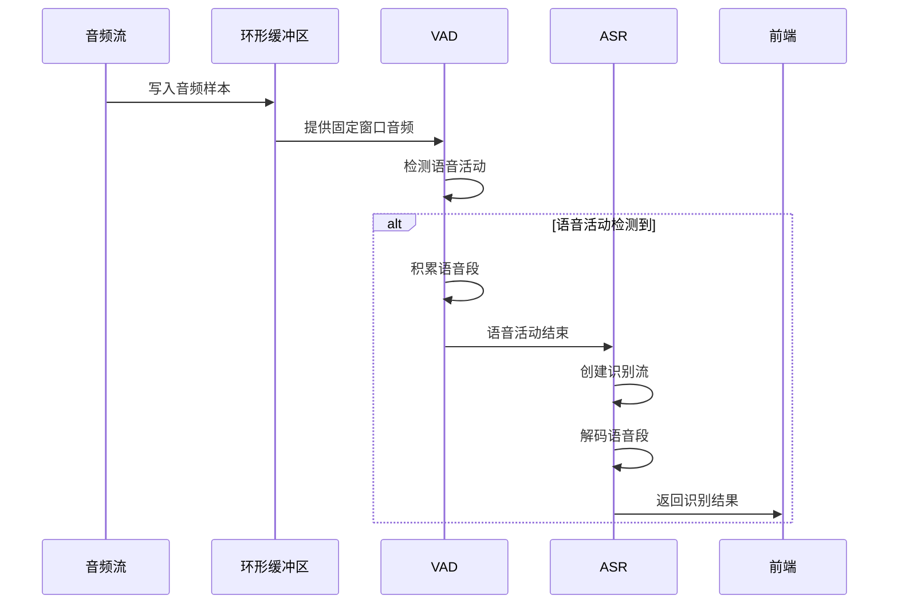

# WebAssembly VAD+ASR 联合处理

<cite>
**本文档引用文件**  
- [sherpa-onnx-wasm-main-vad-asr.cc](file://wasm/vad-asr/sherpa-onnx-wasm-main-vad-asr.cc)
- [app-vad-asr.js](file://wasm/vad-asr/app-vad-asr.js)
- [index.html](file://wasm/vad-asr/index.html)
- [CMakeLists.txt](file://wasm/vad-asr/CMakeLists.txt)
- [sherpa-onnx-vad.js](file://wasm/vad/sherpa-onnx-vad.js)
- [sherpa-onnx-asr.js](file://wasm/asr/sherpa-onnx-asr.js)
</cite>

## 目录
1. [项目结构](#项目结构)
2. [核心组件](#核心组件)
3. [VAD与ASR协同工作机制](#vad与asr协同工作机制)
4. [前端交互流程](#前端交互流程)
5. [连续对话性能表现](#连续对话性能表现)
6. [资源利用率优化建议](#资源利用率优化建议)
7. [错误传播预防机制](#错误传播预防机制)

## 项目结构

WebAssembly VAD+ASR联合处理示例位于`wasm/vad-asr`目录下，包含前端JavaScript代码、C++主程序和构建配置文件。该示例通过Emscripten将C++代码编译为WebAssembly，在浏览器中实现语音活动检测(VAD)与语音识别(ASR)的联合处理。



**图示来源**
- [index.html](file://wasm/vad-asr/index.html)
- [app-vad-asr.js](file://wasm/vad-asr/app-vad-asr.js)
- [CMakeLists.txt](file://wasm/vad-asr/CMakeLists.txt)

**章节来源**
- [index.html](file://wasm/vad-asr/index.html)
- [CMakeLists.txt](file://wasm/vad-asr/CMakeLists.txt)

## 核心组件

系统由WebAssembly模块和前端JavaScript代码组成，通过Emscripten实现C++与JavaScript的互操作。核心组件包括语音活动检测器(VAD)、离线语音识别器(ASR)和环形缓冲区，共同完成从音频采集到文本输出的完整处理流程。

**章节来源**
- [sherpa-onnx-wasm-main-vad-asr.cc](file://wasm/vad-asr/sherpa-onnx-wasm-main-vad-asr.cc)
- [app-vad-asr.js](file://wasm/vad-asr/app-vad-asr.js)

## VAD与ASR协同工作机制

语音活动检测与语音识别的协同工作通过环形缓冲区和事件驱动机制实现。音频数据首先被写入环形缓冲区，VAD模块定期从缓冲区读取固定大小的音频窗口进行语音活动检测。当检测到语音活动时，VAD模块将语音段加入待处理队列；当语音活动结束时，系统自动触发ASR模块对积累的语音段进行识别。



**图示来源**
- [app-vad-asr.js](file://wasm/vad-asr/app-vad-asr.js#L209-L232)
- [sherpa-onnx-wasm-main-vad-asr.cc](file://wasm/vad-asr/sherpa-onnx-wasm-main-vad-asr.cc)

**章节来源**
- [app-vad-asr.js](file://wasm/vad-asr/app-vad-asr.js#L205-L232)
- [sherpa-onnx-wasm-main-vad-asr.cc](file://wasm/vad-asr/sherpa-onnx-wasm-main-vad-asr.cc)

## 前端交互流程

前端JavaScript代码实现了端到端的语音交互流程，从音频采集到文本显示的完整链条。系统使用Web Audio API获取麦克风输入，通过ScriptProcessorNode处理音频流，结合VAD和ASR模块实现自动语音识别。用户界面提供开始、停止和清除按钮，实时显示识别结果和录音片段。

```mermaid
flowchart TD
A[用户点击开始] --> B[请求麦克风权限]
B --> C[创建音频上下文]
C --> D[连接ScriptProcessor]
D --> E[音频处理循环]
E --> F{VAD检测到语音?}
F --> |是| G[显示"语音检测到"]
F --> |否| H{有未处理语音段?}
H --> |是| I[触发ASR识别]
I --> J[显示识别结果]
J --> E
H --> |否| E
K[用户点击停止] --> L[重置VAD和缓冲区]
```

**图示来源**
- [app-vad-asr.js](file://wasm/vad-asr/app-vad-asr.js#L173-L334)
- [index.html](file://wasm/vad-asr/index.html)

**章节来源**
- [app-vad-asr.js](file://wasm/vad-asr/app-vad-asr.js#L173-L334)
- [index.html](file://wasm/vad-asr/index.html)

## 连续对话性能表现

系统在连续对话场景下表现出良好的性能，通过唤醒词检测后的自动识别启动和静音超时处理机制，实现了自然的对话交互。VAD模块使用Silero VAD模型进行语音活动检测，能够准确识别语音开始和结束点。当检测到连续语音时，系统自动累积语音段；当静音超过预设阈值时，系统自动触发ASR模块进行识别，然后重置状态等待下一次语音输入。

**章节来源**
- [app-vad-asr.js](file://wasm/vad-asr/app-vad-asr.js#L214-L225)
- [sherpa-onnx-vad.js](file://wasm/vad/sherpa-onnx-vad.js)

## 资源利用率优化建议

为平衡VAD灵敏度与ASR准确率，建议调整以下参数：VAD的检测阈值控制灵敏度，较低的阈值会增加误报率但减少漏报；ASR模型的选择影响准确率和计算资源消耗，轻量级模型适合资源受限环境。通过预加载模型文件和优化WebAssembly内存配置，可以减少启动时间和内存占用。使用双线程处理可以进一步提高性能，但会增加资源消耗。

**章节来源**
- [CMakeLists.txt](file://wasm/vad-asr/CMakeLists.txt#L53-L57)
- [app-vad-asr.js](file://wasm/vad-asr/app-vad-asr.js#L167-L170)

## 错误传播预防机制

系统通过多层次的错误处理机制预防错误传播。前端代码检查模型文件是否存在，确保必要的模型文件已正确部署。VAD和ASR模块的异常由WebAssembly运行时捕获，避免崩溃整个应用。音频采样率不匹配时，系统自动进行重采样处理。识别结果的处理包含空值检查，防止未识别语音导致界面异常。通过模块化设计，VAD和ASR功能解耦，单个模块故障不会影响整体系统稳定性。

**章节来源**
- [app-vad-asr.js](file://wasm/vad-asr/app-vad-asr.js#L60-L69)
- [app-vad-asr.js](file://wasm/vad-asr/app-vad-asr.js#L243-L245)
- [sherpa-onnx-wasm-main-vad-asr.cc](file://wasm/vad-asr/sherpa-onnx-wasm-main-vad-asr.cc)