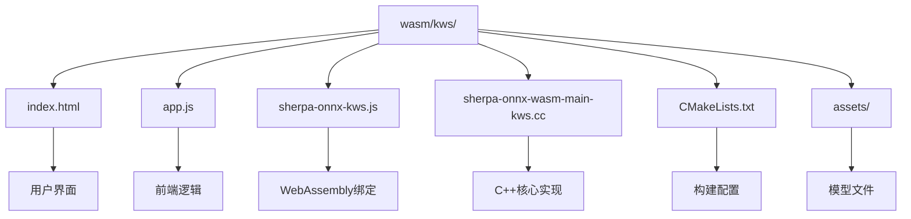
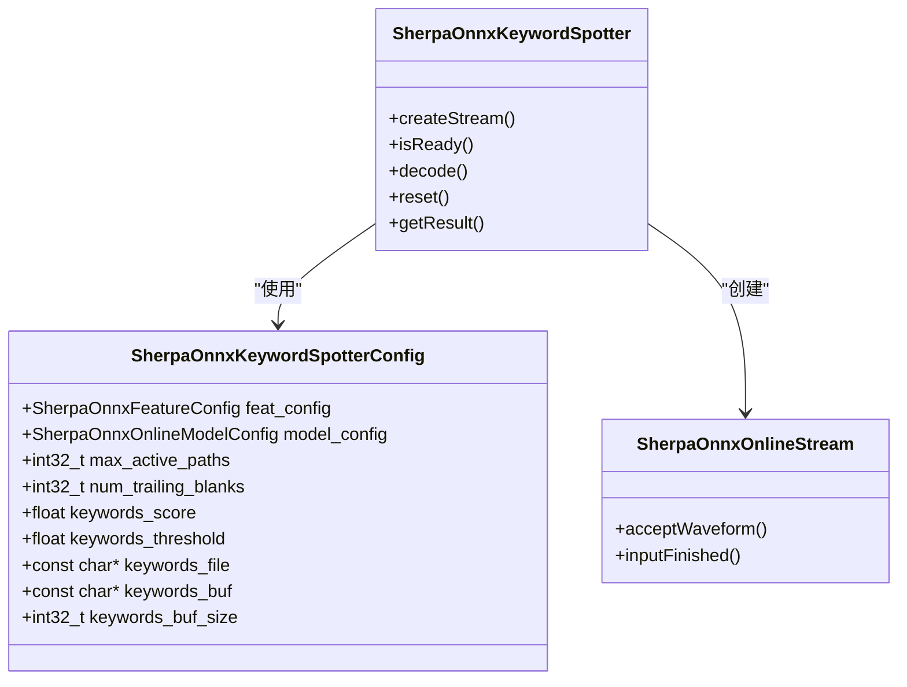
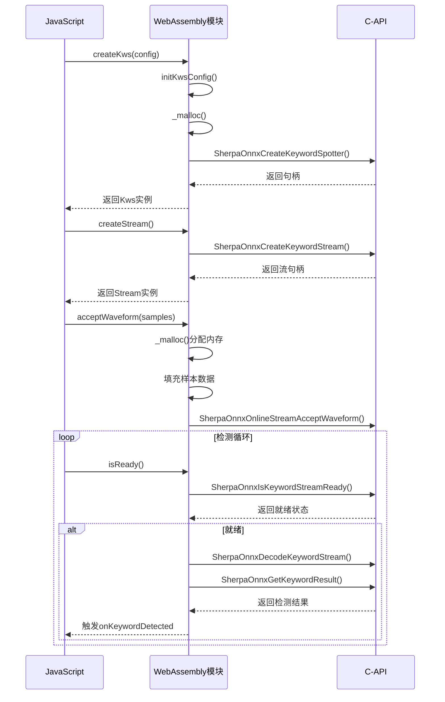

# WebAssembly 关键词检测 (KWS)

<cite>
**本文档引用的文件**  
- [sherpa-onnx-wasm-main-kws.cc](file://wasm/kws/sherpa-onnx-wasm-main-kws.cc)
- [sherpa-onnx-kws.js](file://wasm/kws/sherpa-onnx-kws.js)
- [app.js](file://wasm/kws/app.js)
- [c-api.h](file://sherpa-onnx/c-api/c-api.h)
- [CMakeLists.txt](file://wasm/kws/CMakeLists.txt)
</cite>

## 目录
1. [项目结构](#项目结构)
2. [关键词检测算法实现](#关键词检测算法实现)
3. [JavaScript接口分析](#javascript接口分析)
4. [前端集成与功能实现](#前端集成与功能实现)
5. [性能调优建议](#性能调优建议)
6. [错误处理与资源管理](#错误处理与资源管理)

## 项目结构

WebAssembly关键词检测示例位于`wasm/kws/`目录下，包含前端和后端组件的完整实现。该示例展示了如何在浏览器环境中使用WebAssembly技术实现实时关键词检测功能。



**图示来源**
- [index.html](file://wasm/kws/index.html)
- [app.js](file://wasm/kws/app.js)
- [sherpa-onnx-kws.js](file://wasm/kws/sherpa-onnx-kws.js)
- [sherpa-onnx-wasm-main-kws.cc](file://wasm/kws/sherpa-onnx-wasm-main-kws.cc)
- [CMakeLists.txt](file://wasm/kws/CMakeLists.txt)

**本节来源**
- [wasm/kws/](file://wasm/kws/)

## 关键词检测算法实现

关键词检测算法的核心实现在`sherpa-onnx-wasm-main-kws.cc`文件中，通过WebAssembly技术将C++代码编译为可在浏览器中运行的二进制格式。该实现基于Sherpa-ONNX的C-API，提供了关键词检测所需的所有底层功能。

算法实现的关键组件包括：

1. **内存管理**：通过`CopyHeap`函数实现WebAssembly堆内存的复制操作，确保数据在JavaScript和WebAssembly之间的正确传递。
2. **类型断言**：使用`static_assert`确保C++结构体的大小与JavaScript期望的大小一致，保证跨语言调用的兼容性。
3. **接口导出**：通过`extern "C"`声明导出C风格的函数接口，供JavaScript调用。

关键词检测配置结构`SherpaOnnxKeywordSpotterConfig`包含了热词列表、检测阈值等关键参数，这些参数通过C-API传递给底层模型进行实时匹配。



**图示来源**
- [sherpa-onnx-wasm-main-kws.cc](file://wasm/kws/sherpa-onnx-wasm-main-kws.cc)
- [c-api.h](file://sherpa-onnx/c-api/c-api.h)

**本节来源**
- [sherpa-onnx-wasm-main-kws.cc](file://wasm/kws/sherpa-onnx-wasm-main-kws.cc)
- [c-api.h](file://sherpa-onnx/c-api/c-api.h)

## JavaScript接口分析

`sherpa-onnx-kws.js`文件提供了JavaScript与WebAssembly模块之间的桥梁，封装了底层C-API的复杂性，为前端开发者提供了简洁易用的接口。

### 核心API

#### Kws类
```javascript
class Kws {
  constructor(configObj, Module)
  free()
  createStream()
  isReady(stream)
  decode(stream)
  reset(stream)
  getResult(stream)
}
```

#### Stream类
```javascript
class Stream {
  constructor(handle, Module)
  free()
  acceptWaveform(sampleRate, samples)
  inputFinished()
}
```

### API功能说明

1. **startRecognition**：通过`createStream()`方法创建新的音频流处理实例，开始接收音频数据。
2. **stopRecognition**：通过释放Stream实例停止音频处理，实现识别停止功能。
3. **onKeywordDetected事件回调**：在`app.js`的音频处理循环中，通过轮询`getResult()`方法检测关键词，并在检测到关键词时触发相应的处理逻辑。

JavaScript接口通过Emscripten的内存管理机制处理WebAssembly模块的内存分配和释放，确保资源的正确管理。`initKwsConfig`函数负责将JavaScript对象转换为C结构体，通过`_malloc`分配内存并填充数据。



**图示来源**
- [sherpa-onnx-kws.js](file://wasm/kws/sherpa-onnx-kws.js)
- [c-api.h](file://sherpa-onnx/c-api/c-api.h)

**本节来源**
- [sherpa-onnx-kws.js](file://wasm/kws/sherpa-onnx-kws.js)

## 前端集成与功能实现

`app.js`文件实现了前端用户界面与关键词检测功能的集成，展示了如何在实际应用中使用关键词检测API。

### 热词动态更新

虽然示例中热词列表在配置中静态定义，但通过`SherpaOnnxCreateKeywordStreamWithKeywords` API可以实现热词的动态更新。开发者可以在运行时修改热词列表，重新创建流实例以应用新的热词配置。

### 灵敏度调节

灵敏度通过`keywords_threshold`参数调节，该参数在`SherpaOnnxKeywordSpotterConfig`结构体中定义。较低的阈值会提高检测灵敏度，但可能增加误报率；较高的阈值则会降低灵敏度，减少误报。

```javascript
let configObj = {
  featConfig: featConfig,
  modelConfig: modelConfig,
  maxActivePaths: 4,
  numTrailingBlanks: 1,
  keywordsScore: 1.0,
  keywordsThreshold: 0.25, // 灵敏度阈值
  keywords: 'x iǎo ài t óng x ué @小爱同学\n' +
      'j ūn g ē n iú b ī @军哥牛逼'
};
```

### 音频处理流程

1. **音频采集**：使用`navigator.mediaDevices.getUserMedia`获取麦克风输入。
2. **采样率转换**：通过`downsampleBuffer`函数将麦克风采集的音频转换为模型期望的16kHz采样率。
3. **流式处理**：将音频数据分块送入关键词检测流，实现实时处理。
4. **结果展示**：在检测到关键词后，将结果添加到显示区域，并重置流实例准备下一次检测。

```mermaid
flowchart TD
A[开始按钮点击] --> B[请求麦克风权限]
B --> C[创建AudioContext]
C --> D[创建ScriptProcessor]
D --> E[设置onaudioprocess事件]
E --> F[获取音频样本]
F --> G[降采样到16kHz]
G --> H{是否有流实例}
H --> |否| I[创建关键词流]
H --> |是| J[使用现有流]
I --> K
J --> K
K[acceptWaveform送入样本]
K --> L{isReady()}
L --> |是| M[decode解码]
M --> N[getResult获取结果]
N --> O{有关键词?}
O --> |是| P[显示结果]
O --> |否| Q[继续处理]
P --> R[reset重置流]
R --> Q
Q --> F
S[停止按钮点击] --> T[断开音频连接]
T --> U[停止采集]
```

**图示来源**
- [app.js](file://wasm/kws/app.js)
- [sherpa-onnx-kws.js](file://wasm/kws/sherpa-onnx-kws.js)

**本节来源**
- [app.js](file://wasm/kws/app.js)

## 性能调优建议

在低延迟场景下，关键词检测的性能优化至关重要。以下是针对WebAssembly关键词检测的性能调优建议：

### 内存管理优化

1. **预分配缓冲区**：在`Stream`类的`acceptWaveform`方法中，通过缓存分配的内存指针避免频繁的内存分配和释放操作。
2. **批量处理**：适当增加`ScriptProcessor`的缓冲区大小（当前为4096），在延迟可接受的范围内提高处理效率。

### 模型配置优化

1. **线程数配置**：通过`numThreads`参数控制模型推理使用的线程数，在多核设备上可以提高处理速度。
2. **简化模型**：选择计算复杂度较低的模型架构，如Zipformer2-CTC模型，以降低推理延迟。

### WebAssembly构建优化

从`CMakeLists.txt`文件可以看出，构建配置中包含了多项性能优化选项：

- `INITIAL_MEMORY=512MB`：预分配足够的内存，减少运行时内存增长的开销。
- `ALLOW_MEMORY_GROWTH=1`：允许内存增长，适应不同大小的输入。
- `FORCE_FILESYSTEM=1`：强制启用文件系统支持，确保模型文件的正确加载。

### 音频处理优化

1. **减少重采样开销**：如果麦克风支持16kHz采样率，可以直接使用，避免重采样计算。
2. **优化降采样算法**：当前的降采样实现使用简单的平均法，可以考虑使用更高效的算法。

**本节来源**
- [CMakeLists.txt](file://wasm/kws/CMakeLists.txt)
- [app.js](file://wasm/kws/app.js)
- [sherpa-onnx-kws.js](file://wasm/kws/sherpa-onnx-kws.js)

## 错误处理与资源管理

### 错误边界处理

1. **麦克风权限处理**：在`app.js`中通过`navigator.mediaDevices.getUserMedia`的错误回调处理权限拒绝等异常情况。
2. **WebAssembly加载处理**：通过`Module.onRuntimeInitialized`回调确保WebAssembly模块完全加载后再进行操作。
3. **空流处理**：在`acceptWaveform`方法中检查流实例是否存在，避免空指针异常。

### 资源释放最佳实践

1. **显式释放**：所有通过`_malloc`分配的内存都必须通过`_free`显式释放，避免内存泄漏。
2. **对象销毁**：`Kws`和`Stream`类都提供了`free`方法，用于释放底层C++对象的资源。
3. **事件监听器清理**：在停止录音时，正确断开音频节点的连接，释放相关资源。

```javascript
free() {
  if (this.handle) {
    this.Module._SherpaOnnxDestroyKeywordSpotter(this.handle);
    this.handle = null;
    this.Module._free(this.pointer);
    this.pointer = null;
    this.n = 0;
  }
}
```

资源管理的关键是确保所有分配的资源都有对应的释放操作，特别是在异常情况下也要保证资源的正确清理。

**本节来源**
- [sherpa-onnx-kws.js](file://wasm/kws/sherpa-onnx-kws.js)
- [app.js](file://wasm/kws/app.js)