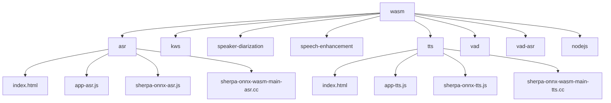
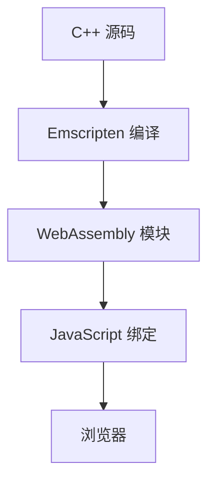
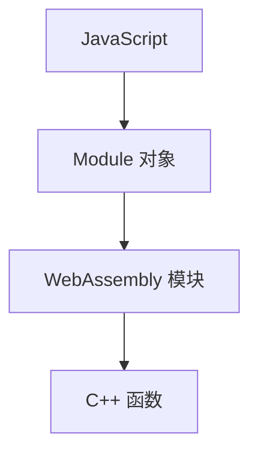
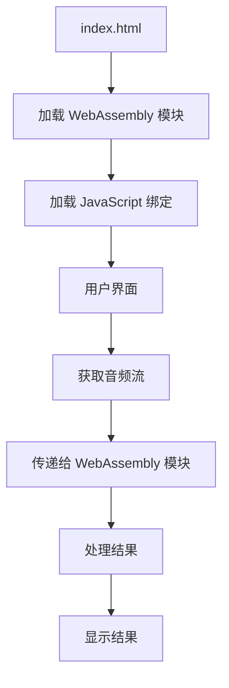
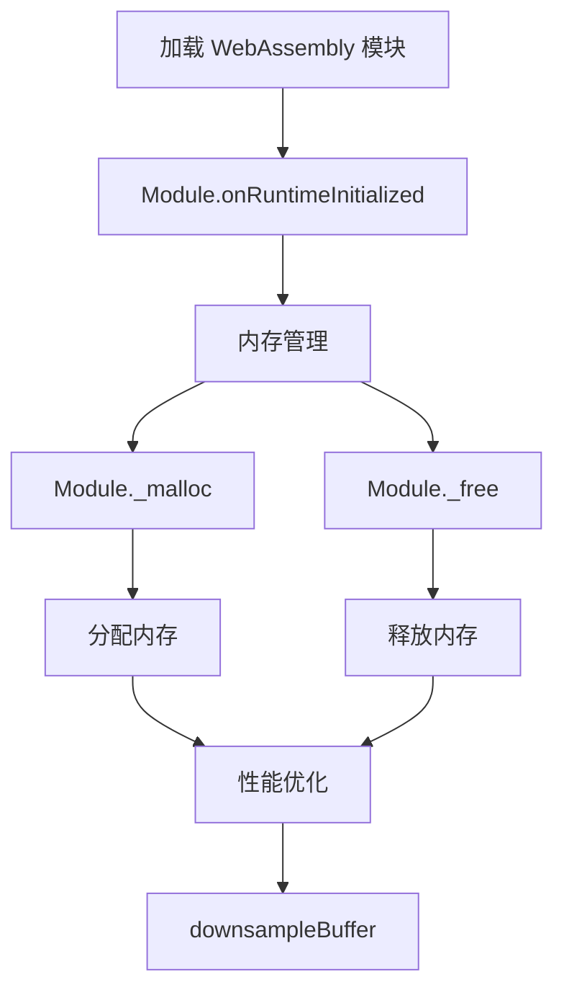
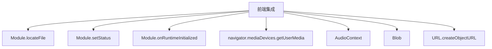

# WebAssembly 示例

<cite>
**本文档中引用的文件**   
- [wasm/CMakeLists.txt](file://wasm/CMakeLists.txt)
- [wasm/asr/index.html](file://wasm/asr/index.html)
- [wasm/asr/sherpa-onnx-asr.js](file://wasm/asr/sherpa-onnx-asr.js)
- [wasm/asr/sherpa-onnx-wasm-main-asr.cc](file://wasm/asr/sherpa-onnx-wasm-main-asr.cc)
- [wasm/asr/app-asr.js](file://wasm/asr/app-asr.js)
- [wasm/tts/index.html](file://wasm/tts/index.html)
- [wasm/tts/sherpa-onnx-tts.js](file://wasm/tts/sherpa-onnx-tts.js)
- [wasm/tts/sherpa-onnx-wasm-main-tts.cc](file://wasm/tts/sherpa-onnx-wasm-main-tts.cc)
- [wasm/kws/sherpa-onnx-kws.js](file://wasm/kws/sherpa-onnx-kws.js)
- [wasm/vad/sherpa-onnx-vad.js](file://wasm/vad/sherpa-onnx-vad.js)
- [wasm/speaker-diarization/sherpa-onnx-speaker-diarization.js](file://wasm/speaker-diarization/sherpa-onnx-speaker-diarization.js)
- [wasm/speech-enhancement/sherpa-onnx-speech-enhancement.js](file://wasm/speech-enhancement/sherpa-onnx-speech-enhancement.js)
</cite>

## 目录
1. [简介](#简介)
2. [项目结构](#项目结构)
3. [ASR 示例](#asr-示例)
4. [KWS 示例](#kws-示例)
5. [说话人分离示例](#说话人分离示例)
6. [语音增强示例](#语音增强示例)
7. [TTS 示例](#tts-示例)
8. [VAD 示例](#vad-示例)
9. [C++ 到 WebAssembly 的编译过程](#c-到-webassembly-的编译过程)
10. [JavaScript 绑定](#javascript-绑定)
11. [浏览器环境中的集成和使用](#浏览器环境中的集成和使用)
12. [WebAssembly 模块的加载、内存管理和性能优化](#webassembly-模块的加载内存管理和性能优化)
13. [前端集成的最佳实践和跨浏览器兼容性建议](#前端集成的最佳实践和跨浏览器兼容性建议)

## 简介
sherpa-onnx WebAssembly 示例代码提供了一系列在浏览器环境中运行的语音处理功能，包括自动语音识别（ASR）、关键词识别（KWS）、说话人分离、语音增强、文本到语音（TTS）和语音活动检测（VAD）。这些示例展示了如何将 C++ 代码编译为 WebAssembly，并通过 JavaScript 绑定在浏览器中使用。所有处理都在本地设备上完成，确保了隐私和安全性。

## 项目结构
sherpa-onnx 项目的 WebAssembly 示例位于 `wasm` 目录下，每个功能模块都有独立的子目录，如 `asr`、`kws`、`speaker-diarization`、`speech-enhancement`、`tts` 和 `vad`。每个子目录包含 HTML 页面、JavaScript 文件、C++ 源码和编译脚本。`wasm/CMakeLists.txt` 文件定义了如何根据编译选项启用不同的 WebAssembly 模块。

**Diagram sources**
- [wasm/CMakeLists.txt](file://wasm/CMakeLists.txt)

## ASR 示例
ASR 示例展示了如何在浏览器中实现实时语音识别。`wasm/asr/index.html` 提供了用户界面，`wasm/asr/app-asr.js` 处理用户交互和音频流，`wasm/asr/sherpa-onnx-asr.js` 提供了 JavaScript 绑定，`wasm/asr/sherpa-onnx-wasm-main-asr.cc` 是 C++ 主程序。

**Section sources**
- [wasm/asr/index.html](file://wasm/asr/index.html)
- [wasm/asr/app-asr.js](file://wasm/asr/app-asr.js)
- [wasm/asr/sherpa-onnx-asr.js](file://wasm/asr/sherpa-onnx-asr.js)
- [wasm/asr/sherpa-onnx-wasm-main-asr.cc](file://wasm/asr/sherpa-onnx-wasm-main-asr.cc)

## KWS 示例
KWS 示例展示了如何在浏览器中实现关键词识别。`wasm/kws/sherpa-onnx-kws.js` 提供了 JavaScript 绑定，允许用户配置关键词并进行实时检测。

**Section sources**
- [wasm/kws/sherpa-onnx-kws.js](file://wasm/kws/sherpa-onnx-kws.js)

## 说话人分离示例
说话人分离示例展示了如何在浏览器中分离不同说话人的语音。`wasm/speaker-diarization/sherpa-onnx-speaker-diarization.js` 提供了 JavaScript 绑定，允许用户处理音频并获取说话人分离结果。

**Section sources**
- [wasm/speaker-diarization/sherpa-onnx-speaker-diarization.js](file://wasm/speaker-diarization/sherpa-onnx-speaker-diarization.js)

## 语音增强示例
语音增强示例展示了如何在浏览器中增强语音质量。`wasm/speech-enhancement/sherpa-onnx-speech-enhancement.js` 提供了 JavaScript 绑定，允许用户处理音频并获取增强后的结果。

**Section sources**
- [wasm/speech-enhancement/sherpa-onnx-speech-enhancement.js](file://wasm/speech-enhancement/sherpa-onnx-speech-enhancement.js)

## TTS 示例
TTS 示例展示了如何在浏览器中实现文本到语音转换。`wasm/tts/index.html` 提供了用户界面，`wasm/tts/app-tts.js` 处理用户输入，`wasm/tts/sherpa-onnx-tts.js` 提供了 JavaScript 绑定，`wasm/tts/sherpa-onnx-wasm-main-tts.cc` 是 C++ 主程序。

**Section sources**
- [wasm/tts/index.html](file://wasm/tts/index.html)
- [wasm/tts/app-tts.js](file://wasm/tts/app-tts.js)
- [wasm/tts/sherpa-onnx-tts.js](file://wasm/tts/sherpa-onnx-tts.js)
- [wasm/tts/sherpa-onnx-wasm-main-tts.cc](file://wasm/tts/sherpa-onnx-wasm-main-tts.cc)

## VAD 示例
VAD 示例展示了如何在浏览器中检测语音活动。`wasm/vad/sherpa-onnx-vad.js` 提供了 JavaScript 绑定，允许用户实时检测语音活动。

**Section sources**
- [wasm/vad/sherpa-onnx-vad.js](file://wasm/vad/sherpa-onnx-vad.js)

## C++ 到 WebAssembly 的编译过程
C++ 代码通过 Emscripten 编译为 WebAssembly。`wasm/CMakeLists.txt` 文件定义了编译选项，如 `SHERPA_ONNX_ENABLE_WASM_ASR` 和 `SHERPA_ONNX_ENABLE_WASM_TTS`，用于启用不同的功能模块。C++ 源码中的 `extern "C"` 块定义了导出的函数，这些函数可以在 JavaScript 中调用。

**Diagram sources**
- [wasm/CMakeLists.txt](file://wasm/CMakeLists.txt)
- [wasm/asr/sherpa-onnx-wasm-main-asr.cc](file://wasm/asr/sherpa-onnx-wasm-main-asr.cc)
- [wasm/tts/sherpa-onnx-wasm-main-tts.cc](file://wasm/tts/sherpa-onnx-wasm-main-tts.cc)

## JavaScript 绑定
JavaScript 绑定通过 `Module` 对象与 WebAssembly 模块交互。`Module._malloc` 和 `Module._free` 用于内存管理，`Module.setValue` 和 `Module.getValue` 用于设置和获取值，`Module.HEAPF32` 和 `Module.HEAP32` 用于访问内存。

**Diagram sources**
- [wasm/asr/sherpa-onnx-asr.js](file://wasm/asr/sherpa-onnx-asr.js)
- [wasm/tts/sherpa-onnx-tts.js](file://wasm/tts/sherpa-onnx-tts.js)

## 浏览器环境中的集成和使用
在浏览器中，通过 `index.html` 加载 WebAssembly 模块和 JavaScript 绑定。用户界面通过 `app-asr.js` 和 `app-tts.js` 处理用户交互，音频流通过 `navigator.mediaDevices.getUserMedia` 获取，并传递给 WebAssembly 模块进行处理。

**Diagram sources**
- [wasm/asr/index.html](file://wasm/asr/index.html)
- [wasm/asr/app-asr.js](file://wasm/asr/app-asr.js)
- [wasm/tts/index.html](file://wasm/tts/index.html)
- [wasm/tts/app-tts.js](file://wasm/tts/app-tts.js)

## WebAssembly 模块的加载、内存管理和性能优化
WebAssembly 模块通过 `Module.onRuntimeInitialized` 回调加载。内存管理通过 `Module._malloc` 和 `Module._free` 实现，避免内存泄漏。性能优化包括使用 `downsampleBuffer` 函数降低采样率，减少计算量。

**Diagram sources**
- [wasm/asr/app-asr.js](file://wasm/asr/app-asr.js)
- [wasm/tts/app-tts.js](file://wasm/tts/app-tts.js)

## 前端集成的最佳实践和跨浏览器兼容性建议
前端集成的最佳实践包括使用 `Module.locateFile` 正确加载文件，使用 `Module.setStatus` 显示状态信息，使用 `Module.onRuntimeInitialized` 确保模块加载完成。跨浏览器兼容性建议包括使用 `navigator.mediaDevices.getUserMedia` 获取音频流，使用 `AudioContext` 处理音频，使用 `Blob` 和 `URL.createObjectURL` 生成音频文件。

**Diagram sources**
- [wasm/asr/app-asr.js](file://wasm/asr/app-asr.js)
- [wasm/tts/app-tts.js](file://wasm/tts/app-tts.js)