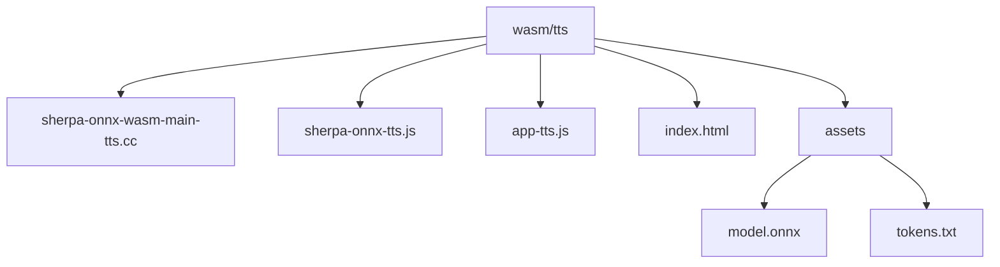
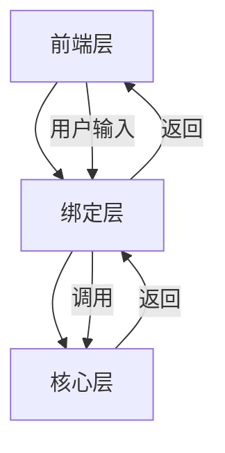
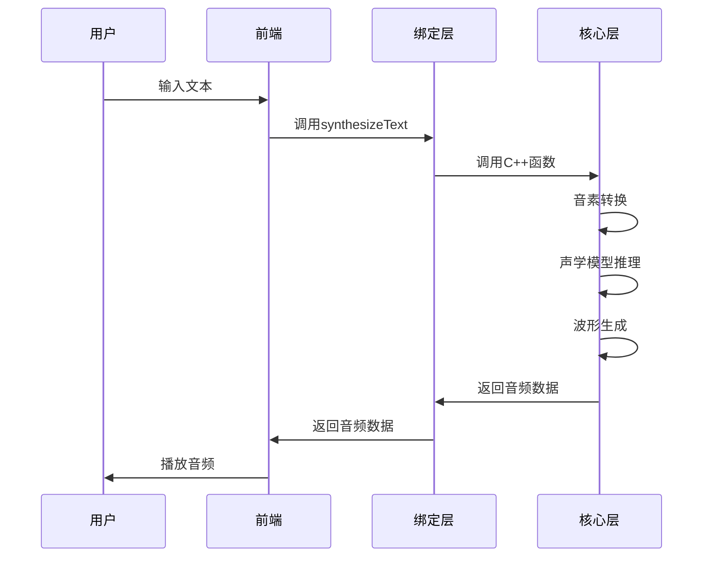
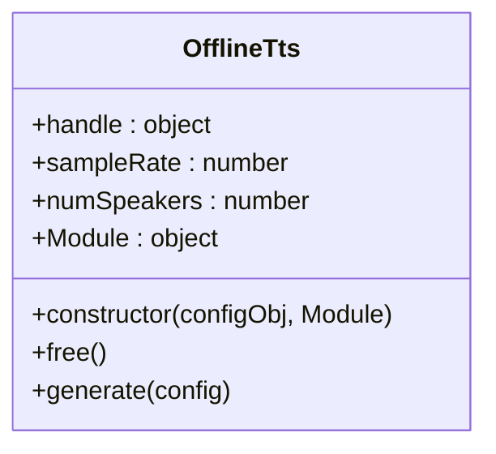
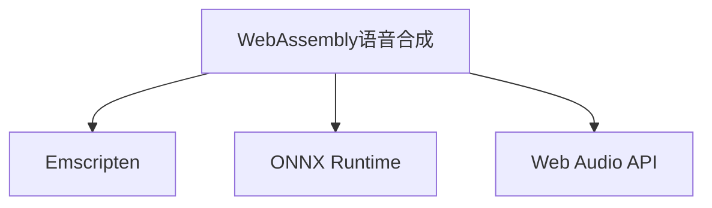

# WebAssembly 语音合成 (TTS)

<cite>
**本文档引用的文件**   
- [sherpa-onnx-wasm-main-tts.cc](file://wasm/tts/sherpa-onnx-wasm-main-tts.cc)
- [sherpa-onnx-tts.js](file://wasm/tts/sherpa-onnx-tts.js)
- [app-tts.js](file://wasm/tts/app-tts.js)
- [index.html](file://wasm/tts/index.html)
- [c-api.h](file://sherpa-onnx/c-api/c-api.h)
</cite>

## 目录
1. [简介](#简介)
2. [项目结构](#项目结构)
3. [核心组件](#核心组件)
4. [架构概述](#架构概述)
5. [详细组件分析](#详细组件分析)
6. [依赖分析](#依赖分析)
7. [性能考虑](#性能考虑)
8. [故障排除指南](#故障排除指南)
9. [结论](#结论)

## 简介
本文档详细分析了基于WebAssembly的语音合成功能，重点研究了C++主程序`sherpa-onnx-wasm-main-tts.cc`中的文本到语音转换流程，包括音素转换、声学模型推理和波形生成。文档还深入探讨了JavaScript绑定文件`sherpa-onnx-tts.js`的异步API设计，如`synthesizeText`方法和`onAudioReady`回调。此外，文档涵盖了前端集成方案，包括文本输入处理、语音参数配置（语速、音调）和音频播放控制。文档还提供了长文本合成时的分块处理策略和内存管理最佳实践，并通过实际代码演示了错误处理和合成质量监控的方法。

## 项目结构
WebAssembly语音合成功能位于`wasm/tts`目录下，包含C++主程序、JavaScript绑定文件、前端HTML页面和相关配置文件。该目录结构清晰，便于管理和维护。

**图表来源**
- [sherpa-onnx-wasm-main-tts.cc](file://wasm/tts/sherpa-onnx-wasm-main-tts.cc)
- [sherpa-onnx-tts.js](file://wasm/tts/sherpa-onnx-tts.js)
- [app-tts.js](file://wasm/tts/app-tts.js)
- [index.html](file://wasm/tts/index.html)

**章节来源**
- [sherpa-onnx-wasm-main-tts.cc](file://wasm/tts/sherpa-onnx-wasm-main-tts.cc)
- [sherpa-onnx-tts.js](file://wasm/tts/sherpa-onnx-tts.js)
- [app-tts.js](file://wasm/tts/app-tts.js)
- [index.html](file://wasm/tts/index.html)

## 核心组件
WebAssembly语音合成功能的核心组件包括C++主程序`sherpa-onnx-wasm-main-tts.cc`和JavaScript绑定文件`sherpa-onnx-tts.js`。C++主程序负责实现文本到语音的转换流程，包括音素转换、声学模型推理和波形生成。JavaScript绑定文件则提供了异步API，使得前端可以方便地调用语音合成功能。

**章节来源**
- [sherpa-onnx-wasm-main-tts.cc](file://wasm/tts/sherpa-onnx-wasm-main-tts.cc)
- [sherpa-onnx-tts.js](file://wasm/tts/sherpa-onnx-tts.js)

## 架构概述
WebAssembly语音合成功能的架构分为三层：前端层、绑定层和核心层。前端层负责用户界面和用户交互，绑定层负责JavaScript与C++之间的通信，核心层负责具体的语音合成算法。

**图表来源**
- [sherpa-onnx-wasm-main-tts.cc](file://wasm/tts/sherpa-onnx-wasm-main-tts.cc)
- [sherpa-onnx-tts.js](file://wasm/tts/sherpa-onnx-tts.js)
- [app-tts.js](file://wasm/tts/app-tts.js)

**章节来源**
- [sherpa-onnx-wasm-main-tts.cc](file://wasm/tts/sherpa-onnx-wasm-main-tts.cc)
- [sherpa-onnx-tts.js](file://wasm/tts/sherpa-onnx-tts.js)
- [app-tts.js](file://wasm/tts/app-tts.js)

## 详细组件分析

### C++主程序分析
C++主程序`sherpa-onnx-wasm-main-tts.cc`实现了文本到语音的转换流程。程序首先进行音素转换，将输入的文本转换为音素序列。然后，程序使用声学模型对音素序列进行推理，生成声学特征。最后，程序使用波形生成模型将声学特征转换为音频波形。

**图表来源**
- [sherpa-onnx-wasm-main-tts.cc](file://wasm/tts/sherpa-onnx-wasm-main-tts.cc)

**章节来源**
- [sherpa-onnx-wasm-main-tts.cc](file://wasm/tts/sherpa-onnx-wasm-main-tts.cc)

### JavaScript绑定文件分析
JavaScript绑定文件`sherpa-onnx-tts.js`提供了异步API，使得前端可以方便地调用语音合成功能。文件中的`OfflineTts`类封装了C++函数的调用，提供了`generate`方法用于生成音频。

**图表来源**
- [sherpa-onnx-tts.js](file://wasm/tts/sherpa-onnx-tts.js)

**章节来源**
- [sherpa-onnx-tts.js](file://wasm/tts/sherpa-onnx-tts.js)

## 依赖分析
WebAssembly语音合成功能依赖于多个外部库，包括Emscripten、ONNX Runtime和Web Audio API。这些库提供了必要的功能，使得语音合成功能在Web环境中能够正常运行。

**图表来源**
- [sherpa-onnx-wasm-main-tts.cc](file://wasm/tts/sherpa-onnx-wasm-main-tts.cc)
- [sherpa-onnx-tts.js](file://wasm/tts/sherpa-onnx-tts.js)

**章节来源**
- [sherpa-onnx-wasm-main-tts.cc](file://wasm/tts/sherpa-onnx-wasm-main-tts.cc)
- [sherpa-onnx-tts.js](file://wasm/tts/sherpa-onnx-tts.js)

## 性能考虑
在Web环境中运行语音合成功能时，性能是一个重要的考虑因素。为了提高性能，可以采取以下措施：
- 使用Web Workers将语音合成任务放在后台线程中执行，避免阻塞主线程。
- 优化模型大小和复杂度，减少计算量。
- 使用缓存机制，避免重复计算。

## 故障排除指南
在使用WebAssembly语音合成功能时，可能会遇到一些常见问题。以下是一些故障排除建议：
- 确保模型文件和配置文件正确加载。
- 检查浏览器是否支持WebAssembly和Web Audio API。
- 查看控制台日志，获取详细的错误信息。

**章节来源**
- [sherpa-onnx-wasm-main-tts.cc](file://wasm/tts/sherpa-onnx-wasm-main-tts.cc)
- [sherpa-onnx-tts.js](file://wasm/tts/sherpa-onnx-tts.js)
- [app-tts.js](file://wasm/tts/app-tts.js)

## 结论
WebAssembly语音合成功能提供了一种在Web环境中实现高质量语音合成的解决方案。通过C++主程序和JavaScript绑定文件的结合，该功能能够高效地处理文本到语音的转换，并提供灵活的API供前端调用。未来的工作可以进一步优化性能，支持更多的语音模型和语言。