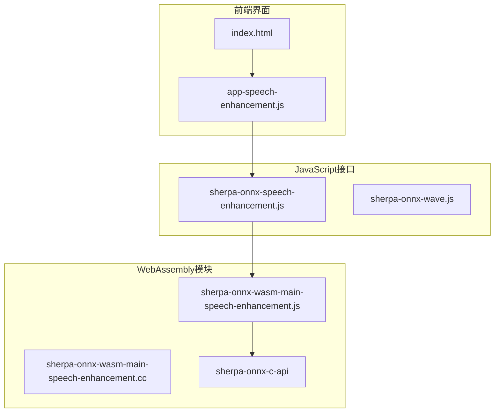
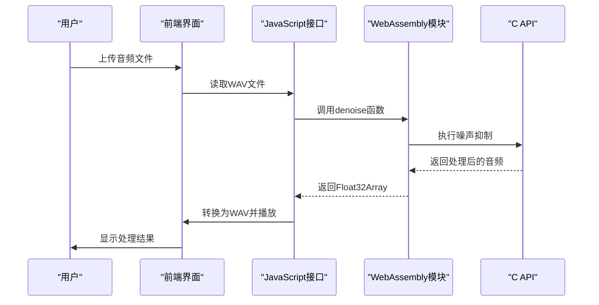
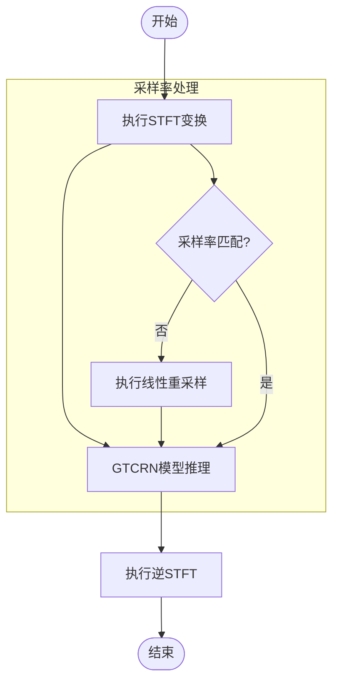
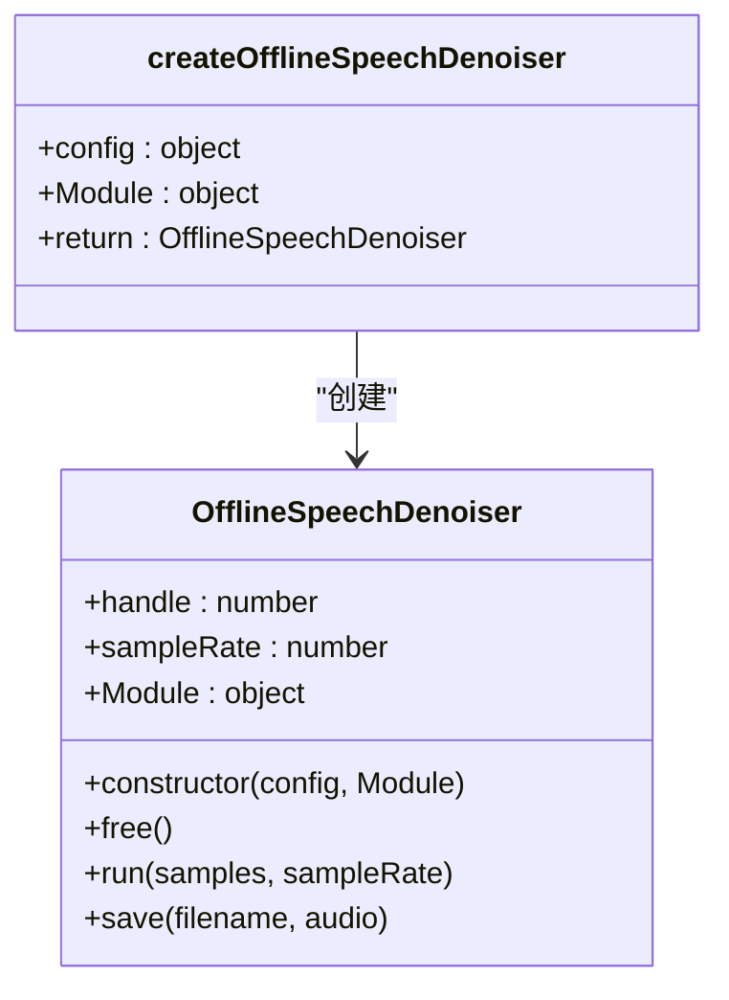
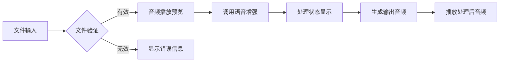
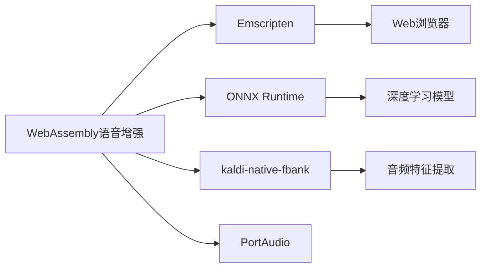

# WebAssembly 语音增强

<cite>
**本文档引用的文件**
- [sherpa-onnx-wasm-main-speech-enhancement.cc](file://wasm/speech-enhancement/sherpa-onnx-wasm-main-speech-enhancement.cc)
- [sherpa-onnx-speech-enhancement.js](file://wasm/speech-enhancement/sherpa-onnx-speech-enhancement.js)
- [app-speech-enhancement.js](file://wasm/speech-enhancement/app-speech-enhancement.js)
- [offline-speech-denoiser-gtcrn-impl.h](file://sherpa-onnx/csrc/offline-speech-denoiser-gtcrn-impl.h)
- [CMakeLists.txt](file://wasm/speech-enhancement/CMakeLists.txt)
- [index.html](file://wasm/speech-enhancement/index.html)
</cite>

## 目录
1. [简介](#简介)
2. [项目结构](#项目结构)
3. [核心组件](#核心组件)
4. [架构概述](#架构概述)
5. [详细组件分析](#详细组件分析)
6. [依赖分析](#依赖分析)
7. [性能考虑](#性能考虑)
8. [故障排除指南](#故障排除指南)
9. [结论](#结论)

## 简介
本项目实现了基于WebAssembly的语音增强功能，利用GTCRN（Gated Temporal Convolutional Recurrent Network）模型进行噪声抑制和语音清晰度提升。系统在浏览器端完全本地运行，确保了用户隐私和数据安全。该解决方案将高性能的C++音频处理算法通过Emscripten编译为WebAssembly，实现了跨平台的高效语音增强能力。

## 项目结构
语音增强WebAssembly示例位于`wasm/speech-enhancement/`目录下，包含前端界面、JavaScript接口和C++核心算法。系统采用分层架构，将WebAssembly模块与JavaScript前端分离，实现了高效的音频处理管道。

**图表来源**
- [index.html](file://wasm/speech-enhancement/index.html)
- [app-speech-enhancement.js](file://wasm/speech-enhancement/app-speech-enhancement.js)
- [sherpa-onnx-speech-enhancement.js](file://wasm/speech-enhancement/sherpa-onnx-speech-enhancement.js)
- [sherpa-onnx-wasm-main-speech-enhancement.cc](file://wasm/speech-enhancement/sherpa-onnx-wasm-main-speech-enhancement.cc)

**章节来源**
- [index.html](file://wasm/speech-enhancement/index.html)
- [CMakeLists.txt](file://wasm/speech-enhancement/CMakeLists.txt)

## 核心组件
系统的核心组件包括噪声抑制算法、WebAssembly接口和前端音频处理管道。噪声抑制算法基于GTCRN模型，通过频域变换和深度学习技术实现高质量的语音增强。WebAssembly接口提供了C++与JavaScript之间的桥梁，而前端管道则负责音频流的实时处理和播放。

**章节来源**
- [sherpa-onnx-wasm-main-speech-enhancement.cc](file://wasm/speech-enhancement/sherpa-onnx-wasm-main-speech-enhancement.cc)
- [sherpa-onnx-speech-enhancement.js](file://wasm/speech-enhancement/sherpa-onnx-speech-enhancement.js)

## 架构概述
系统采用分层架构，从用户界面到WebAssembly核心算法形成完整的语音增强管道。前端负责用户交互和音频输入输出，JavaScript接口处理数据转换和内存管理，WebAssembly模块执行核心的噪声抑制算法。

**图表来源**
- [app-speech-enhancement.js](file://wasm/speech-enhancement/app-speech-enhancement.js)
- [sherpa-onnx-speech-enhancement.js](file://wasm/speech-enhancement/sherpa-onnx-speech-enhancement.js)
- [sherpa-onnx-wasm-main-speech-enhancement.cc](file://wasm/speech-enhancement/sherpa-onnx-wasm-main-speech-enhancement.cc)

## 详细组件分析

### 噪声抑制算法分析
GTCRN噪声抑制算法通过短时傅里叶变换(STFT)将时域信号转换到频域，应用深度学习模型进行噪声过滤，然后通过逆STFT恢复时域信号。算法支持采样率自适应，可处理不同采样率的输入音频。

**图表来源**
- [offline-speech-denoiser-gtcrn-impl.h](file://sherpa-onnx/csrc/offline-speech-denoiser-gtcrn-impl.h)

**章节来源**
- [offline-speech-denoiser-gtcrn-impl.h](file://sherpa-onnx/csrc/offline-speech-denoiser-gtcrn-impl.h)

### JavaScript接口分析
JavaScript接口提供了高级API，封装了WebAssembly的复杂性，使前端开发者能够轻松集成语音增强功能。接口处理内存分配、数据类型转换和错误处理，提供了简洁的调用方式。

**图表来源**
- [sherpa-onnx-speech-enhancement.js](file://wasm/speech-enhancement/sherpa-onnx-speech-enhancement.js)

**章节来源**
- [sherpa-onnx-speech-enhancement.js](file://wasm/speech-enhancement/sherpa-onnx-speech-enhancement.js)

### 前端应用分析
前端应用实现了完整的音频处理工作流，包括文件上传、处理状态显示和结果播放。用户界面简洁直观，支持拖放上传和点击上传两种方式，提供了良好的用户体验。

**图表来源**
- [app-speech-enhancement.js](file://wasm/speech-enhancement/app-speech-enhancement.js)
- [index.html](file://wasm/speech-enhancement/index.html)

**章节来源**
- [app-speech-enhancement.js](file://wasm/speech-enhancement/app-speech-enhancement.js)
- [index.html](file://wasm/speech-enhancement/index.html)

## 依赖分析
系统依赖于多个关键组件和库，包括WebAssembly运行时、ONNX推理引擎和音频处理库。这些依赖通过CMake构建系统进行管理，确保了跨平台的兼容性。

**图表来源**
- [CMakeLists.txt](file://wasm/speech-enhancement/CMakeLists.txt)

**章节来源**
- [CMakeLists.txt](file://wasm/speech-enhancement/CMakeLists.txt)

## 性能考虑
系统在不同网络条件下的性能表现良好，由于所有处理都在本地完成，网络延迟不影响处理速度。对于移动设备，建议使用SIMD优化版本以降低功耗。

**章节来源**
- [CMakeLists.txt](file://wasm/speech-enhancement/CMakeLists.txt)

## 故障排除指南
当遇到异常音频流时，系统会进行适当的错误处理。前端代码包含了文件格式验证和错误提示机制，确保用户能够及时了解问题所在。

**章节来源**
- [app-speech-enhancement.js](file://wasm/speech-enhancement/app-speech-enhancement.js)

## 结论
WebAssembly语音增强示例成功实现了基于GTCRN模型的噪声抑制和语音清晰度提升功能。系统架构合理，性能优异，为浏览器端的实时语音处理提供了可靠的解决方案。通过进一步优化，该技术可广泛应用于在线会议、语音助手等场景。