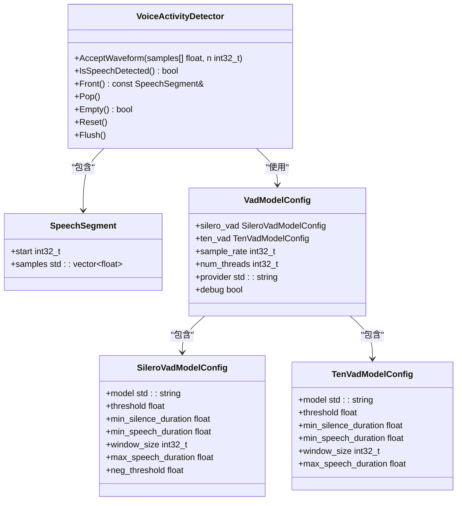
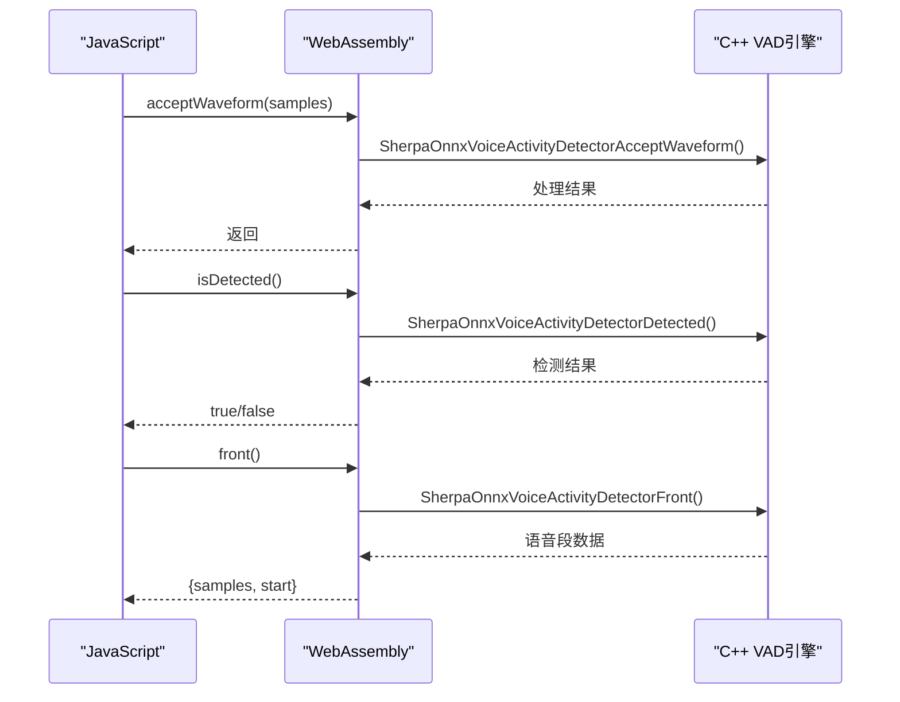
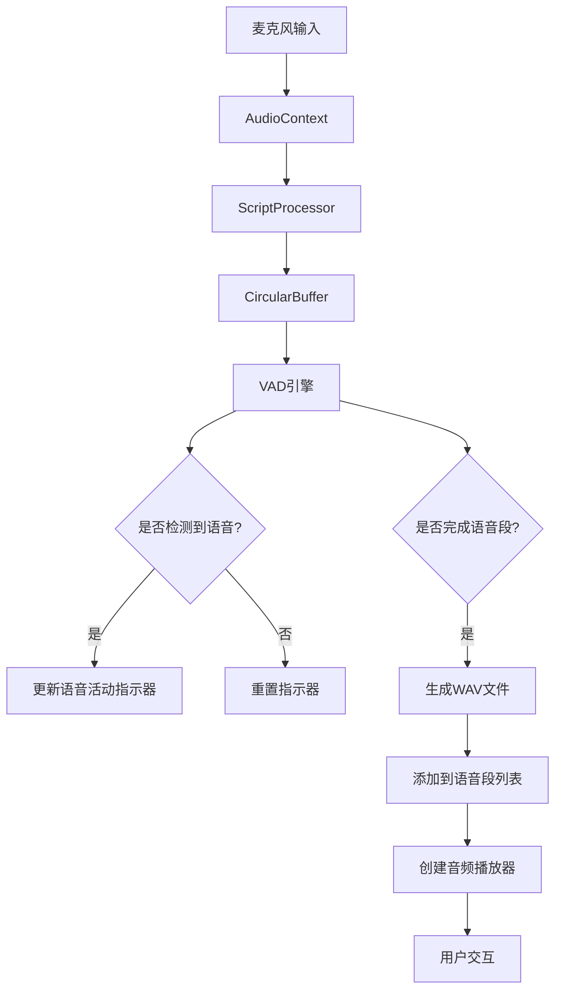
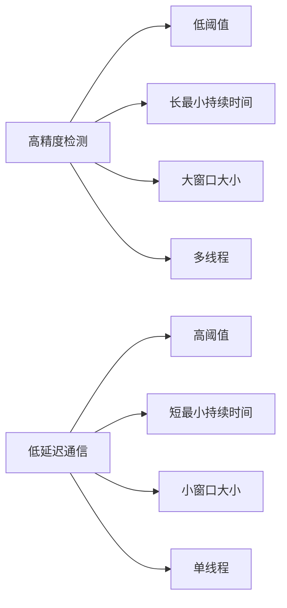

# WebAssembly 语音活动检测 (VAD)

<cite>
**本文档引用的文件**   
- [sherpa-onnx-wasm-main-vad.cc](file://wasm/vad/sherpa-onnx-wasm-main-vad.cc)
- [sherpa-onnx-vad.js](file://wasm/vad/sherpa-onnx-vad.js)
- [app-vad.js](file://wasm/vad/app-vad.js)
- [voice-activity-detector.h](file://sherpa-onnx/csrc/voice-activity-detector.h)
- [voice-activity-detector.cc](file://sherpa-onnx/csrc/voice-activity-detector.cc)
- [vad-model-config.h](file://sherpa-onnx/csrc/vad-model-config.h)
- [silero-vad-model-config.h](file://sherpa-onnx/csrc/silero-vad-model-config.h)
- [ten-vad-model-config.h](file://sherpa-onnx/csrc/ten-vad-model-config.h)
</cite>

## 目录
1. [引言](#引言)
2. [VAD算法实现解析](#vad算法实现解析)
3. [JavaScript接口功能详解](#javascript接口功能详解)
4. [前端可视化实现](#前端可视化实现)
5. [参数调优与性能优化](#参数调优与性能优化)
6. [边界情况处理示例](#边界情况处理示例)
7. [总结](#总结)

## 引言

WebAssembly语音活动检测（VAD）示例展示了如何在浏览器环境中使用Sherpa-Onnx进行实时语音活动检测。该系统通过WebAssembly技术将高性能的C++语音处理能力引入Web前端，实现了低延迟、高精度的语音活动检测功能。本技术文档将深入解析VAD算法的实现细节，包括静音检测、语音段分割和端点识别逻辑，以及JavaScript接口提供的实时音频分析功能。

该系统主要由三个核心组件构成：C++后端实现的VAD算法、WebAssembly桥接层和JavaScript前端接口。这种架构设计使得复杂的语音处理算法能够在浏览器中高效运行，同时为前端开发者提供了简洁易用的API接口。系统支持两种VAD模型：Silero VAD和Ten VAD，用户可以根据具体应用场景选择合适的模型。

**Section sources**
- [sherpa-onnx-wasm-main-vad.cc](file://wasm/vad/sherpa-onnx-wasm-main-vad.cc)
- [sherpa-onnx-vad.js](file://wasm/vad/sherpa-onnx-vad.js)

## VAD算法实现解析

语音活动检测算法的核心实现在`voice-activity-detector.cc`和`voice-activity-detector.h`文件中。该算法基于深度学习模型，通过分析音频信号的特征来判断是否存在语音活动。算法的主要逻辑包括静音检测、语音段分割和端点识别三个关键环节。

静音检测是VAD算法的基础功能，通过设置阈值来区分语音和非语音段。当音频信号的能量或特征值超过预设阈值时，系统判定为语音活动。算法中使用了双阈值机制：一个较高的阈值用于检测语音的开始，一个较低的阈值用于检测语音的结束，这种设计可以有效避免因短暂静音导致的语音段分割。

语音段分割功能通过`AcceptWaveform`方法实现，该方法接收连续的音频数据流并进行实时分析。算法将音频流分割成固定大小的窗口（默认512个样本），对每个窗口进行独立的语音/非语音分类。当连续多个窗口被识别为语音时，系统将其合并为一个完整的语音段。

端点识别是VAD算法的关键功能，用于确定语音段的开始和结束时间点。算法通过`IsSpeechDetected`和`Front`方法提供端点信息。当检测到语音活动开始时，系统记录起始时间戳；当语音活动结束时，系统生成完整的语音段并将其加入结果队列。`Flush`方法用于处理最后一个语音段，确保在音频流结束时能够正确识别端点。

**Diagram sources**
- [voice-activity-detector.h](file://sherpa-onnx/csrc/voice-activity-detector.h)
- [vad-model-config.h](file://sherpa-onnx/csrc/vad-model-config.h)
- [silero-vad-model-config.h](file://sherpa-onnx/csrc/silero-vad-model-config.h)
- [ten-vad-model-config.h](file://sherpa-onnx/csrc/ten-vad-model-config.h)

**Section sources**
- [voice-activity-detector.h](file://sherpa-onnx/csrc/voice-activity-detector.h)
- [voice-activity-detector.cc](file://sherpa-onnx/csrc/voice-activity-detector.cc)

## JavaScript接口功能详解

JavaScript接口`sherpa-onnx-vad.js`为Web开发者提供了简洁易用的VAD功能调用方式。该接口通过WebAssembly桥接层与底层C++实现进行通信，实现了高性能的语音活动检测功能。接口主要包含`Vad`类和`CircularBuffer`类，分别用于语音活动检测和音频数据缓冲。

`Vad`类是主要的API接口，提供了`acceptWaveform`、`isDetected`、`front`等核心方法。`acceptWaveform`方法用于向VAD引擎输入音频数据，接收Float32Array格式的音频样本。`isDetected`方法返回当前是否检测到语音活动，可用于实时监控语音状态。`front`方法返回检测到的语音段，包含音频样本数据和起始时间戳。

**Diagram sources**
- [sherpa-onnx-vad.js](file://wasm/vad/sherpa-onnx-vad.js)
- [sherpa-onnx-wasm-main-vad.cc](file://wasm/vad/sherpa-onnx-wasm-main-vad.cc)

`CircularBuffer`类用于管理音频数据的缓冲区，提供了`push`、`get`、`pop`等方法。该缓冲区在音频流处理中起到关键作用，确保音频数据能够以正确的顺序和大小传递给VAD引擎。缓冲区的大小通常设置为30秒的音频数据，以支持长时间的语音活动检测。

接口还提供了`createVad`工厂函数，简化了VAD实例的创建过程。用户可以通过配置对象指定VAD模型参数，如采样率、阈值、静音持续时间等。配置对象支持Silero VAD和Ten VAD两种模型的独立配置，用户可以根据具体需求进行调整。

**Section sources**
- [sherpa-onnx-vad.js](file://wasm/vad/sherpa-onnx-vad.js)

## 前端可视化实现

前端实现`app-vad.js`展示了如何将VAD功能集成到Web应用中，并提供直观的可视化界面。该实现基于Web Audio API获取麦克风输入，通过`AudioContext`创建音频处理流程，将实时音频数据传递给VAD引擎。

可视化界面包含语音活动指示器、语音段列表和音频播放器三个主要组件。语音活动指示器通过改变按钮颜色或显示状态文本的方式，实时反映当前的语音活动状态。当检测到语音时，指示器变为绿色并显示"Speech detected"；当处于静音状态时，指示器恢复为默认颜色。

语音段列表用于显示检测到的各个语音段，包括持续时间信息和可播放的音频文件。每当检测到一个完整的语音段，系统会自动生成WAV格式的音频文件，并将其添加到列表中。用户可以通过点击播放按钮收听录制的语音段，或通过删除按钮移除不需要的录音。

**Diagram sources**
- [app-vad.js](file://wasm/vad/app-vad.js)

系统还实现了音频采样率转换功能，通过`downsampleBuffer`方法将麦克风采集的音频数据转换为VAD引擎所需的16kHz采样率。这一功能确保了不同设备采集的音频数据都能被正确处理。同时，系统提供了`toWav`函数，将Float32Array格式的音频数据转换为标准的WAV文件格式，便于存储和播放。

**Section sources**
- [app-vad.js](file://wasm/vad/app-vad.js)

## 参数调优与性能优化

VAD系统的性能和准确性高度依赖于参数配置。针对高精度检测场景和低延迟通信应用，需要采用不同的参数调优策略。

对于高精度检测场景，建议采用以下参数配置：
- **阈值（threshold）**：设置为0.3-0.4，降低误检率
- **最小语音持续时间（min_speech_duration）**：设置为0.5秒，过滤短暂的语音片段
- **最小静音持续时间（min_silence_duration）**：设置为1.0秒，避免因短暂停顿导致的语音段分割
- **窗口大小（window_size）**：使用512样本（32ms），提高时间分辨率

**Diagram sources**
- [vad-model-config.h](file://sherpa-onnx/csrc/vad-model-config.h)

对于低延迟通信应用，建议采用以下优化策略：
- **阈值**：设置为0.6-0.7，提高检测灵敏度
- **最小语音持续时间**：设置为0.1秒，快速响应语音开始
- **最小静音持续时间**：设置为0.3秒，减少语音段分割延迟
- **窗口大小**：使用256样本（16ms），降低处理延迟
- **线程数**：设置为1，减少线程切换开销

性能优化方面，系统提供了多种策略：
1. **内存管理优化**：通过`CircularBuffer`复用内存缓冲区，减少频繁的内存分配和释放
2. **批处理优化**：将多个小的音频块合并处理，提高CPU缓存利用率
3. **异步处理**：将VAD计算放在独立的Web Worker中，避免阻塞主线程
4. **模型选择**：根据设备性能选择合适的VAD模型，Silero VAD适合高性能设备，Ten VAD适合移动设备

**Section sources**
- [silero-vad-model-config.h](file://sherpa-onnx/csrc/silero-vad-model-config.h)
- [ten-vad-model-config.h](file://sherpa-onnx/csrc/ten-vad-model-config.h)

## 边界情况处理示例

在实际应用中，VAD系统需要处理多种边界情况，确保在各种复杂环境下都能稳定工作。以下是几种常见边界情况的处理方法：

**长时间语音段处理**：当语音持续时间超过`max_speech_duration`时，系统会自动提高检测阈值到0.9，强制结束当前语音段。这种设计防止了因持续语音导致的内存溢出和处理延迟。处理完成后，阈值会自动恢复到原始值。

**音频流中断处理**：当音频流意外中断时，系统应调用`flush`方法强制完成最后一个语音段的检测。这确保了即使在非正常结束的情况下，已采集的语音数据也能被正确处理。

**静音段过滤**：系统通过`min_silence_duration`参数过滤短暂的静音段。当检测到语音活动结束时，系统会等待足够长的静音时间才确认语音段结束，这有效避免了因呼吸声或短暂停顿导致的语音段错误分割。

**资源清理**：在应用关闭或切换场景时，应正确释放VAD资源。通过调用`reset`方法重置VAD状态，`free`方法释放内存资源，确保系统资源得到及时回收。

**异常处理**：系统应捕获并处理各种异常情况，如模型文件缺失、内存不足、音频设备不可用等。通过合理的错误提示和降级策略，确保应用的稳定性和用户体验。

**Section sources**
- [voice-activity-detector.h](file://sherpa-onnx/csrc/voice-activity-detector.h)
- [app-vad.js](file://wasm/vad/app-vad.js)

## 总结

WebAssembly语音活动检测示例展示了如何将高性能的语音处理算法集成到Web应用中。通过C++后端、WebAssembly桥接层和JavaScript前端的协同工作，实现了低延迟、高精度的实时语音活动检测功能。

该系统的核心优势在于其模块化设计和灵活的配置选项。开发者可以根据具体应用场景调整VAD参数，优化性能表现。同时，系统提供了完整的前端实现示例，降低了集成难度。

未来的发展方向包括支持更多类型的VAD模型、优化WebAssembly编译性能、增强对移动设备的支持，以及提供更丰富的可视化和分析工具。这些改进将进一步提升系统的实用性和用户体验。