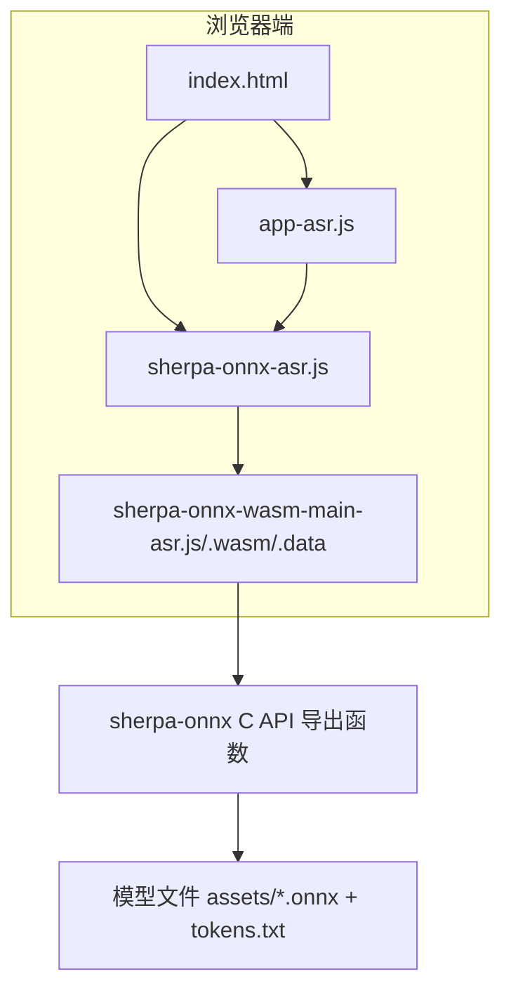
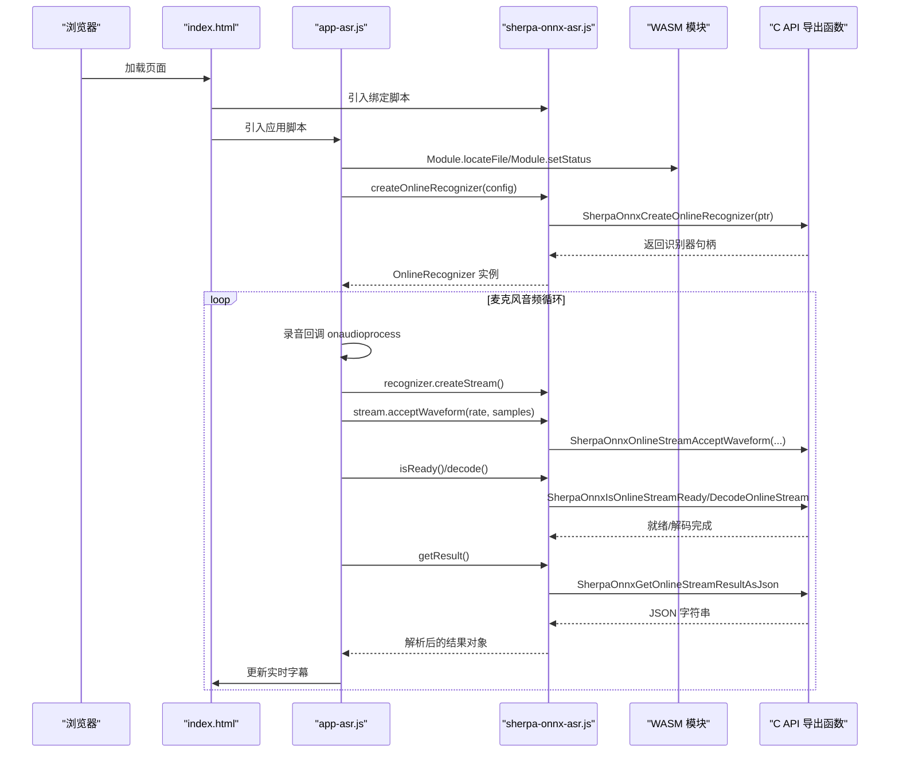
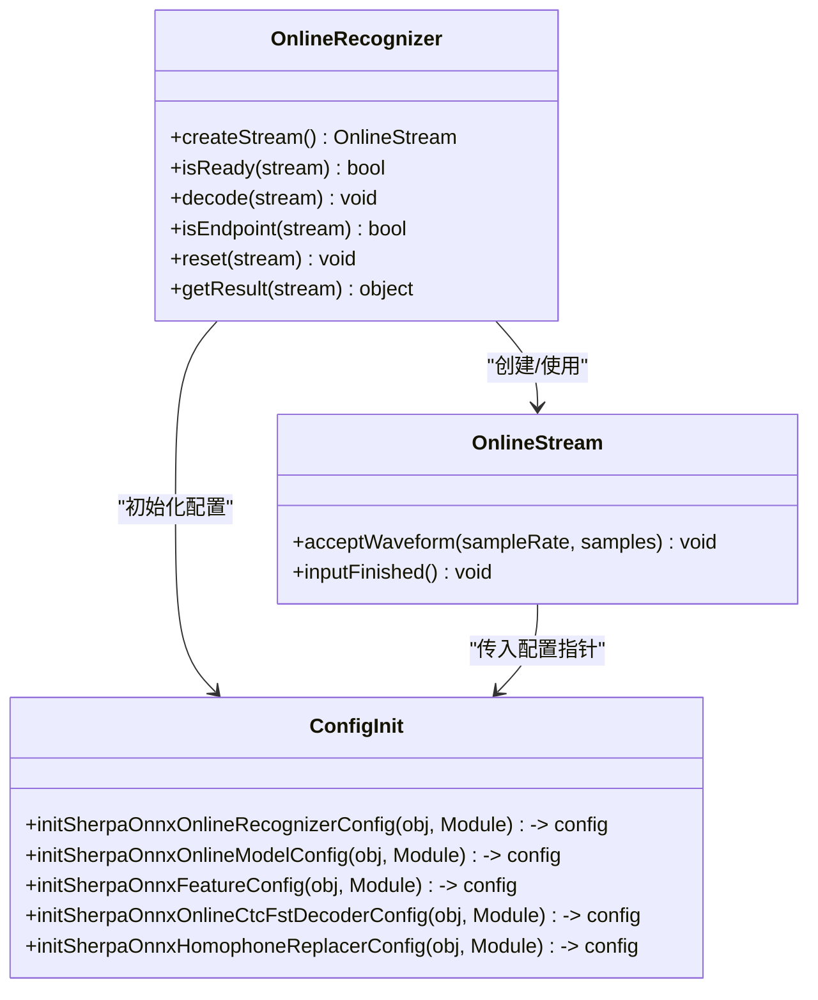
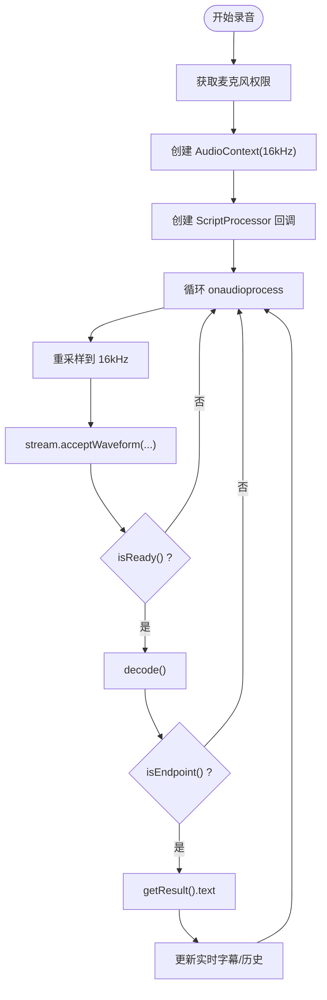
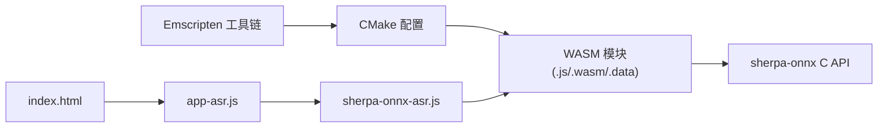

# WebAssembly 语音识别 (ASR)

<cite>
**本文引用的文件列表**
- [sherpa-onnx-wasm-main-asr.cc](file://wasm/asr/sherpa-onnx-wasm-main-asr.cc)
- [sherpa-onnx-asr.js](file://wasm/asr/sherpa-onnx-asr.js)
- [app-asr.js](file://wasm/asr/app-asr.js)
- [index.html](file://wasm/asr/index.html)
- [CMakeLists.txt](file://wasm/asr/CMakeLists.txt)
- [assets/README.md](file://wasm/asr/assets/README.md)
- [build-wasm-simd-asr.sh](file://build-wasm-simd-asr.sh)
</cite>

## 目录
1. [简介](#简介)
2. [项目结构](#项目结构)
3. [核心组件](#核心组件)
4. [架构总览](#架构总览)
5. [详细组件分析](#详细组件分析)
6. [依赖关系分析](#依赖关系分析)
7. [性能与内存优化](#性能与内存优化)
8. [故障排查指南](#故障排查指南)
9. [结论](#结论)
10. [附录：浏览器兼容性与部署建议](#附录浏览器兼容性与部署建议)

## 简介
本文件面向希望在浏览器中运行 sherpa-onnx 实时语音识别（ASR）的开发者，系统性解析以下内容：
- C++ 主程序如何通过 Emscripten 编译为 WebAssembly 模块并导出必要的 C 接口。
- JavaScript 绑定层如何封装 C API，提供在线识别器类与流对象，支持模型加载、音频流接入与实时识别结果获取。
- 前端页面如何集成麦克风输入、实时字幕显示与性能状态提示。
- 构建流程、内存管理、延迟优化、错误处理与调试技巧。

## 项目结构
该示例位于 wasm/asr 目录，包含：
- C++ 入口与导出函数：sherpa-onnx-wasm-main-asr.cc
- Emscripten 构建配置：CMakeLists.txt
- Web 端 JavaScript 绑定与前端应用：sherpa-onnx-asr.js、app-asr.js
- 前端页面：index.html
- 模型资产下载与准备说明：assets/README.md
- 构建脚本：build-wasm-simd-asr.sh

图表来源
- [index.html](file://wasm/asr/index.html#L1-L83)
- [sherpa-onnx-asr.js](file://wasm/asr/sherpa-onnx-asr.js#L1-L120)
- [app-asr.js](file://wasm/asr/app-asr.js#L1-L120)
- [CMakeLists.txt](file://wasm/asr/CMakeLists.txt#L35-L67)
- [assets/README.md](file://wasm/asr/assets/README.md#L1-L45)

章节来源
- [index.html](file://wasm/asr/index.html#L1-L83)
- [CMakeLists.txt](file://wasm/asr/CMakeLists.txt#L1-L67)
- [assets/README.md](file://wasm/asr/assets/README.md#L1-L45)

## 核心组件
- C++ 主程序与导出函数
  - 提供打印配置、内存复制等辅助函数，确保与 Emscripten 的 C API 交互顺畅。
  - 关键导出函数包括在线识别器生命周期与音频流处理接口，由 CMake 配置统一导出。
- JavaScript 绑定层
  - 封装在线识别器与在线流对象，负责将 JS 对象序列化为 C 结构体，调用 Emscripten 导出的 C 函数。
  - 提供 createOnlineRecognizer 工厂方法与配置初始化工具链。
- 前端应用
  - 使用 MediaDevices 获取麦克风，AudioContext 重采样，ScriptProcessor 回调中将音频帧送入识别流。
  - 实时更新结果文本框，支持断句与清空历史。
- 构建与资源
  - CMake 配置启用文件系统、初始内存、堆栈大小、内存增长、预加载模型资源。
  - 脚本自动化安装 Emscripten 并执行构建。

章节来源
- [sherpa-onnx-wasm-main-asr.cc](file://wasm/asr/sherpa-onnx-wasm-main-asr.cc#L1-L109)
- [sherpa-onnx-asr.js](file://wasm/asr/sherpa-onnx-asr.js#L544-L700)
- [app-asr.js](file://wasm/asr/app-asr.js#L70-L170)
- [CMakeLists.txt](file://wasm/asr/CMakeLists.txt#L35-L67)
- [build-wasm-simd-asr.sh](file://build-wasm-simd-asr.sh#L1-L65)

## 架构总览
下图展示了从浏览器到 WebAssembly 再到 C API 的调用路径，以及音频采集与识别的时序。

图表来源
- [index.html](file://wasm/asr/index.html#L70-L83)
- [app-asr.js](file://wasm/asr/app-asr.js#L70-L170)
- [sherpa-onnx-asr.js](file://wasm/asr/sherpa-onnx-asr.js#L1477-L1526)
- [CMakeLists.txt](file://wasm/asr/CMakeLists.txt#L35-L67)

## 详细组件分析

### C++ 主程序与 Emscripten 导出
- 功能要点
  - 提供 MyPrint 打印识别器配置信息，便于调试。
  - 提供 CopyHeap 用于将 C++ 内存块复制到 Emscripten 堆，配合 _CopyHeap 导出使用。
  - 通过静态断言确保 C 结构体布局与 Emscripten 侧一致，避免 ABI 不匹配。
- Emscripten 编译参数
  - 启用文件系统、初始内存、允许内存增长、堆栈大小、导出函数与运行时方法。
  - 预加载 assets 目录下的模型文件，确保运行时可访问。
- 安装与产物
  - 构建后安装生成的 sherpa-onnx-wasm-main-asr.js、.wasm、.data 与示例页面、绑定脚本。

章节来源
- [sherpa-onnx-wasm-main-asr.cc](file://wasm/asr/sherpa-onnx-wasm-main-asr.cc#L1-L109)
- [CMakeLists.txt](file://wasm/asr/CMakeLists.txt#L35-L67)

### JavaScript 绑定层（sherpa-onnx-asr.js）
- 配置初始化
  - 在线模型配置：transducer/paraformer/zipformer2Ctc/nemoCtc/toneCtc、tokens、provider、numThreads、debug、modelType、modelingUnit、bpeVocab、tokensBuf 等字段的序列化与指针布局。
  - 特征配置：sampleRate、featureDim。
  - CTC FST 解码器配置：graph、maxActive。
  - 同音替换器配置：lexicon、ruleFsts。
  - 在线识别器配置：featConfig、modelConfig、ctcFstDecoderConfig、hr、解码方法、最大活跃路径、端点检测规则、热词、空白惩罚等。
- 在线识别器与流
  - OnlineRecognizer：创建/销毁识别器、创建在线流、判断就绪、解码、端点检测、重置、获取结果。
  - OnlineStream：接受波形、标记输入结束。
  - OfflineRecognizer/OfflineStream：离线识别能力（扩展功能）。
- 辅助工具
  - freeConfig：递归释放 malloc 分配的缓冲区与指针。
  - createOnlineRecognizer：工厂方法，构造默认配置并创建识别器实例。

图表来源
- [sherpa-onnx-asr.js](file://wasm/asr/sherpa-onnx-asr.js#L410-L542)
- [sherpa-onnx-asr.js](file://wasm/asr/sherpa-onnx-asr.js#L1477-L1526)

章节来源
- [sherpa-onnx-asr.js](file://wasm/asr/sherpa-onnx-asr.js#L1-L200)
- [sherpa-onnx-asr.js](file://wasm/asr/sherpa-onnx-asr.js#L410-L542)
- [sherpa-onnx-asr.js](file://wasm/asr/sherpa-onnx-asr.js#L1477-L1526)

### 前端应用（app-asr.js）
- 页面状态与 UI
  - setStatus：根据 Emscripten 运行时状态切换“加载/运行中/可用”状态，控制 UI 显示。
  - onRuntimeInitialized：初始化完成后启用开始按钮并创建识别器。
- 麦克风与音频处理
  - getUserMedia 获取麦克风，AudioContext 创建 ScriptProcessor 回调。
  - onaudioprocess 中对每帧进行重采样至期望采样率，写入识别流，循环解码直到就绪，按端点检测输出最终结果。
  - 支持将录音片段转为 WAV 并保存。
- 实时字幕与历史记录
  - 实时更新 textarea，支持清空历史与滚动到底部。

图表来源
- [app-asr.js](file://wasm/asr/app-asr.js#L70-L170)
- [app-asr.js](file://wasm/asr/app-asr.js#L170-L247)

章节来源
- [app-asr.js](file://wasm/asr/app-asr.js#L1-L120)
- [app-asr.js](file://wasm/asr/app-asr.js#L120-L247)

### 前端页面（index.html）
- 页面结构
  - 标题、状态栏、控制按钮（开始/停止/清空）、结果文本框、录音片段展示区域。
- 资源引入
  - 引入 sherpa-onnx-asr.js、app-asr.js、sherpa-onnx-wasm-main-asr.js。
- 安全与隐私声明
  - 强调本地处理、单线程 CPU、无需网络即可离线使用。

章节来源
- [index.html](file://wasm/asr/index.html#L1-L83)

### 构建与资源准备
- 构建脚本
  - 自动检测/安装 Emscripten，设置 CMake 工具链，禁用 Python/测试/JNI/TTS/WS 等非必要组件，开启 WASM 与 ASR。
- CMake 配置
  - 导出函数清单、运行时方法、文件系统、初始内存、堆栈大小、内存增长、预加载 assets。
- 模型资源
  - 下载并放置 encoder.onnx、decoder.onnx、joiner.onnx、tokens.txt 到 assets 目录，或按 Paraformer 示例调整类型。

章节来源
- [build-wasm-simd-asr.sh](file://build-wasm-simd-asr.sh#L1-L65)
- [CMakeLists.txt](file://wasm/asr/CMakeLists.txt#L35-L67)
- [assets/README.md](file://wasm/asr/assets/README.md#L1-L45)

## 依赖关系分析
- 外部依赖
  - Emscripten 工具链与 CMake Platform 文件。
  - sherpa-onnx C API 库（链接目标）。
- 内部依赖
  - sherpa-onnx-asr.js 依赖 Emscripten 运行时方法（ccall/stringToUTF8/setValue/getValue/lengthBytesUTF8/UTF8ToString）。
  - app-asr.js 依赖 MediaDevices、AudioContext、ScriptProcessor/JavaScriptNode。
- 导出函数耦合
  - CMake 统一导出识别器与流相关函数，确保 JS 可直接调用。

图表来源
- [CMakeLists.txt](file://wasm/asr/CMakeLists.txt#L35-L67)
- [sherpa-onnx-asr.js](file://wasm/asr/sherpa-onnx-asr.js#L1-L120)
- [app-asr.js](file://wasm/asr/app-asr.js#L1-L120)
- [index.html](file://wasm/asr/index.html#L70-L83)

章节来源
- [CMakeLists.txt](file://wasm/asr/CMakeLists.txt#L35-L67)
- [sherpa-onnx-asr.js](file://wasm/asr/sherpa-onnx-asr.js#L1-L120)
- [app-asr.js](file://wasm/asr/app-asr.js#L1-L120)

## 性能与内存优化
- 内存管理
  - JS 侧通过 freeConfig 递归释放 malloc 的缓冲区；在线流内部也维护缓冲区并在释放时 free。
  - CMake 开启 ALLOW_MEMORY_GROWTH，避免内存不足导致崩溃；合理设置 INITIAL_MEMORY。
- 延迟优化
  - 使用较小的 ScriptProcessor 缓冲区（如 4096）平衡延迟与 CPU 占用。
  - 仅在 isReady() 为真时解码，减少无效调用。
  - 端点检测触发后及时 reset 流，避免重复解码。
- 采样率与数据格式
  - 录音回调中将浮点样本映射到 Int16 以便 WAV 保存；识别时使用 16kHz 与 80 维特征。
- 资源预加载
  - 通过 --preload-file 预加载模型文件，减少首次请求时间。

章节来源
- [sherpa-onnx-asr.js](file://wasm/asr/sherpa-onnx-asr.js#L1-L120)
- [sherpa-onnx-asr.js](file://wasm/asr/sherpa-onnx-asr.js#L1477-L1526)
- [app-asr.js](file://wasm/asr/app-asr.js#L120-L247)
- [CMakeLists.txt](file://wasm/asr/CMakeLists.txt#L35-L67)

## 故障排查指南
- 构建失败
  - 确认已安装 Emscripten 并正确激活版本；检查 CMake Platform 文件是否存在。
  - 确保 assets 目录存在模型文件与 tokens.txt。
- 运行时错误
  - 检查 Module.setStatus 输出的状态信息，确认模型下载与初始化完成。
  - 若识别器未创建成功，检查 createOnlineRecognizer 的配置项是否完整。
- 麦克风权限与采样率
  - 确认浏览器支持 getUserMedia；若采样率不匹配，检查 AudioContext 初始化与重采样逻辑。
- 识别结果为空
  - 确认 isReady() 为真后再 decode；检查端点检测规则与热词配置。
- 内存问题
  - 确保在线流释放时调用 free()；避免长时间持有大量临时缓冲区。

章节来源
- [build-wasm-simd-asr.sh](file://build-wasm-simd-asr.sh#L1-L65)
- [assets/README.md](file://wasm/asr/assets/README.md#L1-L45)
- [app-asr.js](file://wasm/asr/app-asr.js#L70-L170)
- [sherpa-onnx-asr.js](file://wasm/asr/sherpa-onnx-asr.js#L1477-L1526)

## 结论
该示例通过 Emscripten 将 sherpa-onnx 的 C API 暴露为浏览器可用的 WebAssembly 模块，并以 JavaScript 绑定层提供简洁易用的在线识别器与流对象。前端应用实现了从麦克风采集、重采样、实时解码到结果展示的完整闭环。借助合理的内存管理与延迟优化策略，可在浏览器中获得稳定、低延迟的本地语音识别体验。

## 附录：浏览器兼容性与部署建议
- 浏览器兼容性
  - 使用 MediaDevices、AudioContext、ScriptProcessor/JavaScriptNode；现代浏览器通常支持。
  - 如需更广泛的兼容，可考虑使用 MediaRecorder 或 Web Audio API 的现代替代方案。
- 部署建议
  - 将 .js/.wasm/.data 与页面资源部署在同一域名下，避免跨域问题。
  - 启用 HTTP/2 或 HTTP/3，提升资源传输效率。
  - 对 .wasm 使用合适的缓存策略，减少重复下载。
- 模型选择
  - 根据语言与场景选择合适模型；参见 assets/README.md 的下载与准备步骤。
- 调试技巧
  - 打开浏览器开发者工具的 Console 与 Network 面板，观察 setStatus 输出与资源加载情况。
  - 在 JS 层打印识别器配置与结果对象，定位配置或数据问题。